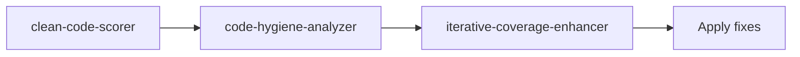
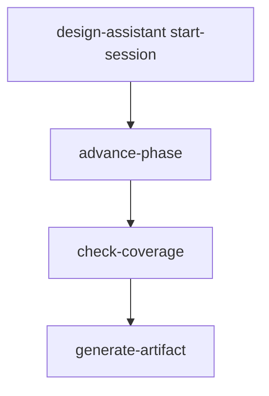
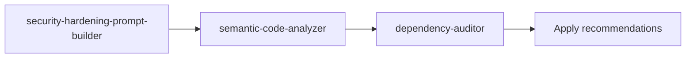

<!-- HEADER:START -->

<!-- HEADER:END -->

<!-- AUTO-GENERATED INTERACTIVE HEADER - DO NOT EDIT -->
<iframe
    src="https://raw.githubusercontent.com/Anselmoo/mcp-ai-agent-guidelines/main/docs/.frames-interactive/header-tools-README.html"
    style="width: 100%; height: 120px; border: none; display: block; margin: 0; padding: 0;"
    title="Interactive Header"
    loading="lazy"
    sandbox="allow-scripts allow-same-origin"
></iframe>
<!-- END AUTO-GENERATED INTERACTIVE HEADER -->

# Tools Documentation

> **Detailed guides** for each MCP tool and workflow patterns

This folder contains comprehensive documentation for all 27 MCP AI Agent Guidelines tools, including usage examples, workflow patterns, and integration guides.

---

## 📚 Tool Categories

### 🎨 Prompt Builders (9 tools)
Advanced prompt generation and structuring tools:

- `hierarchical-prompt-builder` - Multi-level specificity prompts
- `code-analysis-prompt-builder` - Code review and analysis prompts
- `architecture-design-prompt-builder` - System design prompts
- `digital-enterprise-architect-prompt-builder` - Enterprise architecture prompts
- `debugging-assistant-prompt-builder` - Systematic debugging prompts
- `l9-distinguished-engineer-prompt-builder` - High-level architecture prompts
- `documentation-generator-prompt-builder` - Documentation generation prompts
- `security-hardening-prompt-builder` - Security analysis prompts
- `spark-prompt-builder` - UI/UX design prompts

### 🔍 Code Analysis (7 tools)
Code quality, hygiene, and semantic analysis:

- `clean-code-scorer` - 0-100 code quality scoring
- `code-hygiene-analyzer` - Pattern and dependency analysis
- `dependency-auditor` - Outdated/insecure package detection
- `iterative-coverage-enhancer` - Test coverage improvement
- `semantic-code-analyzer` - Deep code structure analysis
- `guidelines-validator` - Best practices validation
- `domain-neutral-prompt-builder` - Generic workflow prompts

### 📊 Strategy & Planning (5 tools)
Strategic analysis and project planning:

- `strategy-frameworks-builder` - SWOT/BSC/VRIO analysis
- `gap-frameworks-analyzers` - Capability/performance gaps
- `sprint-timeline-calculator` - Agile sprint planning
- `model-compatibility-checker` - AI model recommendations
- `prompting-hierarchy-evaluator` - Prompt quality assessment

### 🎯 Design Workflow (1 tool)
Comprehensive design session management:

- `design-assistant` - Multi-phase design orchestration

### 🛠️ Utilities (5 tools)
Supporting tools for workflows:

- `mermaid-diagram-generator` - Visual diagram creation
- `memory-context-optimizer` - Context window management
- `project-onboarding` - Repository analysis
- `mode-switcher` - Agent mode management
- `hierarchy-level-selector` - Prompt level selection
- `prompt-chaining-builder` - Multi-step workflows
- `prompt-flow-builder` - Parallel execution workflows

---

## 🚀 Quick Start Workflows

### Workflow 1: Code Quality Improvement

### Workflow 2: Design Session

### Workflow 3: Security Hardening

---

## 📖 Detailed Tool Documentation

For complete parameter schemas, examples, and best practices:

**➡️ [Complete Tools Reference](../tips/TOOLS_REFERENCE.md)**

---

## 🔗 Related Resources

- **[AI Interaction Tips](../tips/)** - Best practices for using these tools
- **[Developer Documentation](../README.md#developer-documentation)** - Implementation details
- **[Main README](../../README.md)** - Project setup and overview

---

**Navigation**: [📁 Docs Home](../README.md) • [💡 Tips](../tips/) • [ℹ️ About](../about/)

<!-- AUTO-GENERATED INTERACTIVE FOOTER - DO NOT EDIT -->
<iframe
    src="https://raw.githubusercontent.com/Anselmoo/mcp-ai-agent-guidelines/main/docs/.frames-interactive/footer-tools-README.html"
    style="width: 100%; height: 80px; border: none; display: block; margin: 0; padding: 0;"
    title="Interactive Footer"
    loading="lazy"
    sandbox="allow-scripts allow-same-origin"
></iframe>
<!-- END AUTO-GENERATED INTERACTIVE FOOTER -->

<!-- FOOTER:START -->

<!-- FOOTER:END -->
