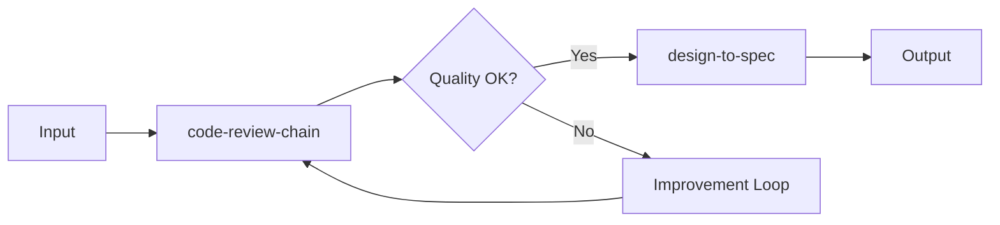
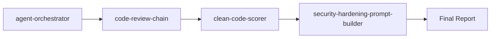

<!-- HEADER:START -->

<!-- HEADER:END -->

# Agent Orchestrator

> **Orchestrate multi-agent workflows**

[](../../README.md)
[](./README.md#utilities)
[](../README.md)

**Complexity**: ⭐⭐⭐ Advanced | **Category**: Utilities | **Time to Learn**: 30-45 minutes

---

## Overview

The `agent-orchestrator` tool coordinates agent-to-agent (A2A) handoffs and multi-step workflow execution. It enables complex tasks to be broken down into specialized agent operations with automatic context passing and error handling.

### Key Capabilities

- List available agents and their capabilities
- Discover pre-defined multi-agent workflows
- Execute agent handoffs with context propagation
- Run complete multi-step workflows with input/output mapping
- Automatic error handling and result aggregation

---

## When to Use

✅ **Good for:**

- Complex tasks requiring multiple specialized agents
- Code review pipelines (quality → security → documentation)
- Design workflows (discovery → requirements → specification)
- Chaining tool outputs as inputs to subsequent steps
- Reusable workflow patterns

❌ **Not ideal for:**

- Single-tool invocations (use tools directly instead)
- Simple sequential operations without context passing
- Real-time interactive sessions

---

## Basic Usage

### Example 1: List Available Agents

```typescript
// Discover what agents are available
await callTool('agent-orchestrator', {
  action: 'list-agents'
});
```

### Example 2: List Available Workflows

```typescript
// See pre-defined workflow patterns
await callTool('agent-orchestrator', {
  action: 'list-workflows'
});
```

### Example 3: Agent Handoff

```typescript
// Hand off to a specific agent with context
await callTool('agent-orchestrator', {
  action: 'handoff',
  targetAgent: 'code-scorer',
  context: {
    projectPath: '/path/to/project',
    coverageMetrics: { lines: 85, branches: 80 }
  },
  reason: 'Quality check required before merge',
});
```

### Example 4: Execute Workflow

```typescript
// Run a complete multi-step workflow
await callTool('agent-orchestrator', {
  action: 'workflow',
  workflowName: 'code-review-chain',
  workflowInput: {
    projectPath: '/path/to/project',
    coverageMetrics: { lines: 85, branches: 80, functions: 90, statements: 85 },
    codeContext: 'Authentication module implementation',
  },
});
```

---

## Parameters

The schema uses a discriminated union based on `action` type:

### Common Parameter

| Parameter | Type | Required | Default | Description |
|-----------|------|----------|---------|-------------|
| `action` | enum | ✅ Yes | - | Action to perform: `list-agents`, `list-workflows`, `handoff`, `workflow` |

### For `list-agents` Action

No additional parameters required.

### For `list-workflows` Action

No additional parameters required.

### For `handoff` Action

| Parameter | Type | Required | Default | Description |
|-----------|------|----------|---------|-------------|
| `targetAgent` | string | ✅ Yes | - | Name of the target agent (e.g., `'code-scorer'`, `'security-analyzer'`) |
| `context` | any | No | - | Context data to pass to target agent (JSON-serializable) |
| `reason` | string | No | - | Human-readable reason for the handoff |

### For `workflow` Action

| Parameter | Type | Required | Default | Description |
|-----------|------|----------|---------|-------------|
| `workflowName` | string | ✅ Yes | - | Name of workflow to execute (e.g., `'code-review-chain'`, `'design-to-spec'`) |
| `workflowInput` | any | No | - | Input data for the workflow (JSON-serializable) |

---

## Available Workflows

### code-review-chain

**Description**: Complete code review with quality scoring, security analysis, and documentation

**Flow**: code-scorer → security-analyzer → documentation-generator

**Input Parameters**:
```typescript
{
  projectPath: string;           // Path to project
  coverageMetrics?: {            // Optional test coverage
    lines: number;
    branches: number;
    functions: number;
    statements: number;
  };
  codeContent?: string;          // Code to analyze
  codeContext?: string;          // Context about the code
  language?: string;             // Programming language
  framework?: string;            // Framework name
}
```

**Use Case**: Complete code review with quality score, security check, and documentation suggestions.

---

### design-to-spec

**Description**: Complete design workflow from discovery to specification generation

**Flow**: design-assistant (start) → design-assistant (advance) → design-assistant (generate)

**Input Parameters**:
```typescript
{
  sessionId: string;             // Unique session identifier
  config: {                      // Design session configuration
    context: string;             // Project context
    goal: string;                // Design goal
    requirements: string[];      // Requirements list
    sessionId: string;           // Same as outer sessionId
    coverageThreshold?: number;  // Coverage threshold (default: 85)
    enablePivots?: boolean;      // Enable strategic pivots (default: true)
  };
  action?: string;               // Optional: 'start-session'
  advanceAction?: string;        // Optional: 'advance-phase'
  targetPhase?: string;          // Optional: phase to advance to
  generateAction?: string;       // Optional: 'generate-artifacts'
  artifactTypes?: string[];      // Optional: ['adr', 'specification', 'roadmap']
}
```

**Use Case**: Full design session from discovery to specification generation. Suitable for creating ADRs and specifications for new features or architectural changes.

---

## What You Get

### For `list-agents`

```markdown
# Available Agents

## code-scorer

Analyzes code quality and returns a 0-100 score

**Capabilities**: code-quality, scoring, analysis

## security-analyzer

Performs security analysis and OWASP compliance check

**Capabilities**: security, owasp, vulnerability-scanning

...
```

### For `list-workflows`

```markdown
# Available Workflows

## code-review-chain

Complete code review: quality scoring → security analysis → documentation

**Steps**: code-scorer → security-analyzer → documentation-generator

## design-to-spec

Complete design workflow from discovery to specification

**Steps**: design-assistant → design-assistant → design-assistant

...
```

### For `handoff`

```markdown
# Handoff Completed

**Target Agent**: code-scorer
**Execution Time**: 1250ms

## Output

{
  "overallScore": 87,
  "breakdown": {
    "hygiene": 25,
    "coverage": 22,
    ...
  },
  "recommendations": [...]
}
```

### For `workflow`

```markdown
# Workflow Execution: code-review-chain

**Status**: Success
**Total Steps**: 3
**Execution Time**: 3450ms

## Step Results

### Step 1: code-scorer
**Status**: Success
**Output**: {
  "overallScore": 87,
  ...
}

### Step 2: security-analyzer
**Status**: Success
**Output**: {
  "securityScore": "A",
  ...
}

### Step 3: documentation-generator
**Status**: Success
**Output**: {
  "documentationPrompt": "...",
  ...
}

## Final Output

[Aggregated workflow results]
```

---

## Real-World Examples

### Example 1: Code Review Pipeline

```typescript
// Run complete code review before merge
const result = await callTool('agent-orchestrator', {
  action: 'workflow',
  workflowName: 'code-review-chain',
  workflowInput: {
    projectPath: '/workspace/my-app',
    coverageMetrics: {
      lines: 85,
      branches: 78,
      functions: 90,
      statements: 84,
    },
    codeContext: 'New authentication middleware with JWT tokens',
    language: 'typescript',
    framework: 'express',
  },
});
```

**Output**: Complete quality score, security analysis, and documentation suggestions

---

### Example 2: Design Session Workflow

```typescript
// Execute complete design workflow
const result = await callTool('agent-orchestrator', {
  action: 'workflow',
  workflowName: 'design-to-spec',
  workflowInput: {
    sessionId: 'checkout-flow-design',
    config: {
      context: 'E-commerce platform',
      goal: 'Implement secure checkout flow',
      requirements: [
        'Payment processing with Stripe',
        'Cart validation and inventory check',
        'Order confirmation email',
        'Transaction logging for audit',
      ],
      sessionId: 'checkout-flow-design',
      coverageThreshold: 90,
      enablePivots: true,
    },
    action: 'start-session',
    advanceAction: 'advance-phase',
    targetPhase: 'requirements',
    generateAction: 'generate-artifacts',
    artifactTypes: ['adr', 'specification'],
  },
});
```

**Output**: ADRs and specifications for the checkout flow implementation

---

### Example 3: Custom Agent Handoff

```typescript
// Hand off to security analyzer after code changes
const result = await callTool('agent-orchestrator', {
  action: 'handoff',
  targetAgent: 'security-analyzer',
  context: {
    codeContent: `
      async function authenticateUser(username, password) {
        const user = await db.query('SELECT * FROM users WHERE username = ?', [username]);
        return bcrypt.compare(password, user.passwordHash);
      }
    `,
    language: 'javascript',
  },
  reason: 'Security review for authentication function',
});
```

**Output**: Security analysis prompt with OWASP compliance recommendations

---

## Tips & Tricks

### 💡 Best Practices

1. **Use Workflows for Common Patterns** - Define reusable workflows for repeated task sequences
2. **Provide Complete Context** - Pass all necessary data in context/workflowInput
3. **Check Available Agents** - Use `list-agents` to discover capabilities
4. **Validate Workflow Names** - Use `list-workflows` to see available options

### 🚫 Common Mistakes

- ❌ Forgetting to pass context → ✅ Include all necessary data for downstream agents
- ❌ Using handoff for single agent → ✅ Call agents directly for simple cases
- ❌ Hardcoding workflow names → ✅ List workflows first to confirm availability
- ❌ Ignoring execution errors → ✅ Check status and error messages in output

### ⚡ Pro Tips

- Chain workflows for complex multi-stage operations
- Use `reason` parameter to document handoff decisions (helps with debugging)
- Monitor execution time to identify slow agents in workflows
- Create custom workflows for project-specific patterns
- Pass results from one workflow as input to another for complex orchestration

---

## Workflow Composition

Workflows can be composed for complex orchestration:



---

## Related Tools

- **[mode-switcher](./mode-switcher.md)** - Switch agent operation modes for different tasks
- **[clean-code-scorer](./clean-code-scorer.md)** - Individual code quality analysis
- **[design-assistant](./design-assistant.md)** - Multi-phase design workflow management

---

## Workflow Integration

### With Other Tools



1. **agent-orchestrator** - Coordinate workflow execution
2. **code-review-chain** - Execute quality → security → docs pipeline
3. **clean-code-scorer** - Generate quality metrics
4. **security-hardening-prompt-builder** - Security analysis
5. Execute combined output with your AI model or apply changes

---

<details>
<summary><strong>📚 Related Documentation</strong></summary>

- [All Utilities Tools](./README.md#utilities)
- [A2A Orchestration Guide](../tips/a2a-orchestration-guide.md)
- [A2A Practical Examples](../tips/a2a-examples.md)
- [AI Interaction Tips](../tips/ai-interaction-tips.md)

</details>

<sub>**MCP AI Agent Guidelines** • Licensed under [MIT](../../LICENSE) • [Disclaimer](../../DISCLAIMER.md) • [Contributing](../../CONTRIBUTING.md)</sub>

---

## Related Documentation

- [All Utilities Tools](./README.md#utilities)
- [A2A Orchestration Guide](../tips/a2a-orchestration-guide.md)
- [A2A Practical Examples](../tips/a2a-examples.md)
- [AI Interaction Tips](../tips/ai-interaction-tips.md)

---

<!-- FOOTER:START -->

<!-- FOOTER:END -->
