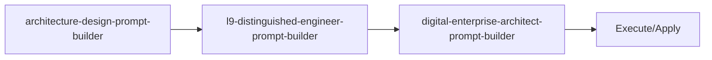

<!-- HEADER:START -->

<!-- HEADER:END -->

# Architecture Design Prompt Builder

> **System architecture design prompts**

[](../../README.md)
[](./README.md#prompt-builders)
[](../README.md)

**Complexity**: ⭐⭐⭐ Advanced | **Category**: Prompt Builders | **Time to Learn**: 1-2 hours

---

## Overview

The `architecture-design-prompt-builder` scale-appropriate guidance (small/medium/large).

### Key Capabilities

- Scale-based recommendations
- Technology stack considerations
- System requirements and constraints
- Architecture patterns and best practices

---

## When to Use

✅ **Good for:**

- Complex tasks requiring detailed instructions
- Multi-step workflows with dependencies
- Standardizing prompt patterns across teams
- Generating consistent AI interactions

❌ **Not ideal for:**

- Simple, single-line questions
- Quick clarifications without context
- Tasks with obvious, minimal requirements

---

## Basic Usage

### Example 1: Basic Prompt Builders Task

```json
{
  "tool": "architecture-design-prompt-builder",
  "systemRequirements": "your-system-requirements-here",
  "scale": "your-scale",
  "technologyStack": "your-technology-stack"
}
```

**Output**: Structured prompt builders output with:

- Scale-based recommendations
- Technology stack considerations
- System requirements and constraints

---

## Parameters

| Parameter | Type | Required | Default | Description |
|-----------|------|----------|---------|-------------|
| `systemRequirements` | array | ✅ Yes | - | System Requirements parameter |
| `scale` | string | No | - | Scale parameter |
| `technologyStack` | string | No | - | Technology Stack parameter |

---

## What You Get

The tool returns a structured prompt builders output with:

1. **Scale-based** - Scale-based recommendations
2. **Technology** - Technology stack considerations
3. **System** - System requirements and constraints
4. **Architecture** - Architecture patterns and best practices

### Output Structure

```markdown
## Architecture Design Prompt Builder Output

### Summary
[High-level summary of analysis/output]

### Details
[Detailed content based on your inputs]

### Recommendations
[Actionable next steps]

### References (if enabled)
[Links to external resources]
```

---

## Real-World Examples

### Example 1: Code Review Workflow

```json
{
  "tool": "architecture-design-prompt-builder",
  "systemRequirements": "Example systemRequirements value for code review workflow",
  "scale": "example-value",
  "technologyStack": "example-value"
}
```

**Generated Output Excerpt**:

```markdown
## Code Review Workflow Results

### Summary
Analysis complete with actionable insights...

### Key Findings
1. [Finding 1 based on prompt builders analysis]
2. [Finding 2 with specific recommendations]
3. [Finding 3 with priority indicators]

### Next Steps
- Implement recommended changes
- Review and validate results
- Integrate into workflow
```

---

## Tips & Tricks

### 💡 Best Practices

1. **Be Specific in Goals** - Vague goals lead to vague outputs
2. **Prioritize Requirements** - Use keywords like CRITICAL, HIGH, NICE-TO-HAVE
3. **Define Success Criteria** - How will you know when it's done?
4. **Match Style to Use Case** - XML for complex structures, Markdown for readability

### 🚫 Common Mistakes

- ❌ Vague context → ✅ Be specific about the domain and constraints
- ❌ Too many requirements → ✅ Focus on top 3-5 critical ones
- ❌ Mixing goals → ✅ One clear objective per prompt
- ❌ Ignoring audience → ✅ Tailor detail level to expertise

### ⚡ Pro Tips

- Combine with related tools for comprehensive workflows
- Use `autoSelectTechniques: true` for optimal technique selection
- Enable `includePitfalls: true` for complex tasks

---

## Related Tools

- **[l9-distinguished-engineer-prompt-builder](./l9-distinguished-engineer-prompt-builder.md)** - L9 Distinguished Engineer prompts
- **[digital-enterprise-architect-prompt-builder](./digital-enterprise-architect-prompt-builder.md)** - Enterprise architecture strategy

---

## Workflow Integration

### With Other Tools



1. **architecture-design-prompt-builder** - System architecture design prompts
2. **l9-distinguished-engineer-prompt-builder** - L9 Distinguished Engineer prompts
3. **digital-enterprise-architect-prompt-builder** - Enterprise architecture strategy
4. Execute combined output with your AI model or apply changes

---

<details>
<summary><strong>📚 Related Documentation</strong></summary>

- [All Prompt Builders Tools](./README.md#prompt-builders)
- [Prompting Hierarchy Guide](../tips/prompting-hierarchy.md)
- [Flow Prompting Examples](../tips/flow-prompting-examples.md)
- [AI Interaction Tips](../tips/ai-interaction-tips.md)

</details>

<sub>**MCP AI Agent Guidelines** • Licensed under [MIT](../../LICENSE) • [Disclaimer](../../DISCLAIMER.md) • [Contributing](../../CONTRIBUTING.md)</sub>

---

## Related Documentation

- [All Prompt Builders Tools](./README.md#prompt-builders)
- [Prompting Hierarchy Guide](../tips/prompting-hierarchy.md)
- [Flow Prompting Examples](../tips/flow-prompting-examples.md)
- [AI Interaction Tips](../tips/ai-interaction-tips.md)

---

<!-- FOOTER:START -->

<!-- FOOTER:END -->
