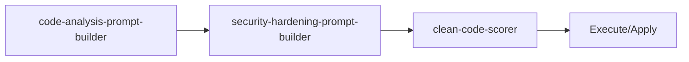

<!-- HEADER:START -->

<!-- HEADER:END -->

# Code Analysis Prompt Builder

> **Code analysis prompts**

[](../../README.md)
[](./README.md#prompt-builders)
[](../README.md)

**Complexity**: ⭐⭐ Moderate | **Category**: Prompt Builders | **Time to Learn**: 15-30 minutes

---

## Overview

The `code-analysis-prompt-builder` security, performance, maintainability focus.

### Key Capabilities

- Focus area selection (security, performance, maintainability)
- Language-specific analysis
- Codebase context awareness
- Structured analysis output

---

## When to Use

✅ **Good for:**

- Complex tasks requiring detailed instructions
- Multi-step workflows with dependencies
- Standardizing prompt patterns across teams
- Generating consistent AI interactions

❌ **Not ideal for:**

- Simple, single-line questions
- Quick clarifications without context
- Tasks with obvious, minimal requirements

---

## Basic Usage

### Example 1: Basic Prompt Builders Task

```json
{
  "tool": "code-analysis-prompt-builder",
  "codebase": "your-codebase-here",
  "focusArea": "your-focus-area",
  "language": "your-language"
}
```

**Output**: Structured prompt builders output with:

- Focus area selection (security, performance, maintainability)
- Language-specific analysis
- Codebase context awareness

---

## Parameters

| Parameter | Type | Required | Default | Description |
|-----------|------|----------|---------|-------------|
| `codebase` | string | ✅ Yes | - | Codebase parameter |
| `focusArea` | string | No | - | Focus Area parameter |
| `language` | string | No | - | Programming language (e.g., `typescript`, `python`, `java`) |

---

## What You Get

The tool returns a structured prompt builders output with:

1. **Focus** - Focus area selection (security, performance, maintainability)
2. **Language-specific** - Language-specific analysis
3. **Codebase** - Codebase context awareness
4. **Structured** - Structured analysis output

### Output Structure

```markdown
## Code Analysis Prompt Builder Output

### Summary
[High-level summary of analysis/output]

### Details
[Detailed content based on your inputs]

### Recommendations
[Actionable next steps]

### References (if enabled)
[Links to external resources]
```

---

## Real-World Examples

### Example 1: Code Review Workflow

```json
{
  "tool": "code-analysis-prompt-builder",
  "codebase": "Example codebase value for code review workflow",
  "focusArea": "example-value",
  "language": "example-value"
}
```

**Generated Output Excerpt**:

```markdown
## Code Review Workflow Results

### Summary
Analysis complete with actionable insights...

### Key Findings
1. [Finding 1 based on prompt builders analysis]
2. [Finding 2 with specific recommendations]
3. [Finding 3 with priority indicators]

### Next Steps
- Implement recommended changes
- Review and validate results
- Integrate into workflow
```

---

## Tips & Tricks

### 💡 Best Practices

1. **Be Specific in Goals** - Vague goals lead to vague outputs
2. **Prioritize Requirements** - Use keywords like CRITICAL, HIGH, NICE-TO-HAVE
3. **Define Success Criteria** - How will you know when it's done?
4. **Match Style to Use Case** - XML for complex structures, Markdown for readability

### 🚫 Common Mistakes

- ❌ Vague context → ✅ Be specific about the domain and constraints
- ❌ Too many requirements → ✅ Focus on top 3-5 critical ones
- ❌ Mixing goals → ✅ One clear objective per prompt
- ❌ Ignoring audience → ✅ Tailor detail level to expertise

### ⚡ Pro Tips

- Combine with related tools for comprehensive workflows
- Use `autoSelectTechniques: true` for optimal technique selection
- Enable `includePitfalls: true` for complex tasks

---

## Related Tools

- **[security-hardening-prompt-builder](./security-hardening-prompt-builder.md)** - Security analysis and hardening prompts
- **[clean-code-scorer](./clean-code-scorer.md)** - Calculate Clean Code score (0-100)

---

## Workflow Integration

### With Other Tools



1. **code-analysis-prompt-builder** - Code analysis prompts
2. **security-hardening-prompt-builder** - Security analysis and hardening prompts
3. **clean-code-scorer** - Calculate Clean Code score (0-100)
4. Execute combined output with your AI model or apply changes

---

<details>
<summary><strong>📚 Related Documentation</strong></summary>

- [All Prompt Builders Tools](./README.md#prompt-builders)
- [Prompting Hierarchy Guide](../tips/PROMPTING_HIERARCHY.md)
- [Flow Prompting Examples](../tips/FLOW_PROMPTING_EXAMPLES.md)
- [AI Interaction Tips](../tips/AI_INTERACTION_TIPS.md)

</details>

<sub>**MCP AI Agent Guidelines** • Licensed under [MIT](../../LICENSE) • [Disclaimer](../../DISCLAIMER.md) • [Contributing](../../CONTRIBUTING.md)</sub>

---

## Related Documentation

- [All Prompt Builders Tools](./README.md#prompt-builders)
- [Prompting Hierarchy Guide](../tips/PROMPTING_HIERARCHY.md)
- [Flow Prompting Examples](../tips/FLOW_PROMPTING_EXAMPLES.md)
- [AI Interaction Tips](../tips/AI_INTERACTION_TIPS.md)

---

<!-- FOOTER:START -->

<!-- FOOTER:END -->
