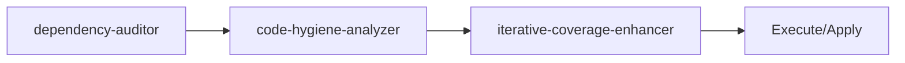

<!-- HEADER:START -->

<!-- HEADER:END -->

# Dependency Auditor

> **Analyze package.json for issues**

[](../../README.md)
[](./README.md#code-analysis)
[](../README.md)

**Complexity**: ⭐ Simple | **Category**: Code Analysis | **Time to Learn**: 5-10 minutes

---

## Overview

The `dependency-auditor` outdated, deprecated, or insecure packages with modern alternatives.

### Key Capabilities

- Outdated version detection
- Deprecated package identification
- Known vulnerability checks
- ESM-compatible alternatives
- Bundle size analysis

---

## When to Use

✅ **Good for:**

- Identifying code quality issues and technical debt
- Analyzing test coverage gaps
- Security vulnerability scanning
- Dependency health checks

❌ **Not ideal for:**

- Real-time code execution
- Replacing comprehensive security audits
- Performance benchmarking

---

## Basic Usage

### Example 1: Basic Code Analysis Task

```json
{
  "tool": "dependency-auditor",
  "packageJsonContent": "your-package-json-content-here",
  "checkOutdated": true,
  "checkDeprecated": true,
  "checkVulnerabilities": true
}
```

**Output**: Structured code analysis output with:

- Outdated version detection
- Deprecated package identification
- Known vulnerability checks

---

## Parameters

| Parameter | Type | Required | Default | Description |
|-----------|------|----------|---------|-------------|
| `packageJsonContent` | string | ✅ Yes | - | Content of package.json file for dependency analysis |
| `checkOutdated` | boolean | No | `false` | Check for outdated package versions |
| `checkDeprecated` | boolean | No | `false` | Check for deprecated packages |
| `checkVulnerabilities` | boolean | No | `false` | Check for known security vulnerabilities |
| `suggestAlternatives` | string | No | - | Suggest modern alternatives for outdated packages |
| `analyzeBundleSize` | boolean | No | `false` | Analyze bundle size impact |

---

## What You Get

The tool returns a structured code analysis output with:

1. **Outdated** - Outdated version detection
2. **Deprecated** - Deprecated package identification
3. **Known** - Known vulnerability checks
4. **ESM-compatible** - ESM-compatible alternatives
5. **Bundle** - Bundle size analysis

### Output Structure

```markdown
## Dependency Auditor Output

### Summary
[High-level summary of analysis/output]

### Details
[Detailed content based on your inputs]

### Recommendations
[Actionable next steps]

### References (if enabled)
[Links to external resources]
```

---

## Real-World Examples

### Example 1: Security Analysis

```json
{
  "tool": "dependency-auditor",
  "packageJsonContent": "Example packageJsonContent value for security analysis",
  "checkOutdated": true,
  "checkDeprecated": true
}
```

**Generated Output Excerpt**:

```markdown
## Security Analysis Results

### Summary
Analysis complete with actionable insights...

### Key Findings
1. [Finding 1 based on code analysis analysis]
2. [Finding 2 with specific recommendations]
3. [Finding 3 with priority indicators]

### Next Steps
- Implement recommended changes
- Review and validate results
- Integrate into workflow
```

---

## Tips & Tricks

### 💡 Best Practices

1. **Provide Complete Code** - Partial snippets may miss context
2. **Specify Language and Framework** - Enables targeted analysis
3. **Review All Severity Levels** - Not just critical issues
4. **Integrate with CI/CD** - Automate quality checks

### 🚫 Common Mistakes

- ❌ Ignoring low severity issues → ✅ They accumulate as tech debt
- ❌ Skipping context → ✅ Always specify framework and patterns
- ❌ One-time analysis → ✅ Regular monitoring catches regressions
- ❌ Trusting blindly → ✅ Validate recommendations with tests

### ⚡ Pro Tips

- Combine with security hardening for comprehensive reviews
- Use coverage metrics to prioritize testing efforts
- Export results to tracking systems for follow-up

---

## Related Tools

- **[code-hygiene-analyzer](./code-hygiene-analyzer.md)** - Outdated patterns and unused dependencies
- **[iterative-coverage-enhancer](./iterative-coverage-enhancer.md)** - Analyze coverage gaps and suggest tests

---

## Workflow Integration

### With Other Tools



1. **dependency-auditor** - Analyze package.json for issues
2. **code-hygiene-analyzer** - Outdated patterns and unused dependencies
3. **iterative-coverage-enhancer** - Analyze coverage gaps and suggest tests
4. Execute combined output with your AI model or apply changes

---

<details>
<summary><strong>📚 Related Documentation</strong></summary>

- [All Code Analysis Tools](./README.md#code-analysis)
- [Clean Code Initiative](../tips/CLEAN_CODE_INITIATIVE.md)
- [Code Quality Improvements](../tips/CODE_QUALITY_IMPROVEMENTS.md)
- [AI Interaction Tips](../tips/AI_INTERACTION_TIPS.md)

</details>

<sub>**MCP AI Agent Guidelines** • Licensed under [MIT](../../LICENSE) • [Disclaimer](../../DISCLAIMER.md) • [Contributing](../../CONTRIBUTING.md)</sub>

---

## Related Documentation

- [All Code Analysis Tools](./README.md#code-analysis)
- [Clean Code Initiative](../tips/CLEAN_CODE_INITIATIVE.md)
- [Code Quality Improvements](../tips/CODE_QUALITY_IMPROVEMENTS.md)
- [AI Interaction Tips](../tips/AI_INTERACTION_TIPS.md)

---

<!-- FOOTER:START -->

<!-- FOOTER:END -->
