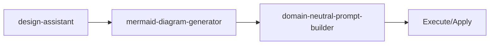

<!-- HEADER:START -->

<!-- HEADER:END -->

# Design Assistant

> **Deterministic design sessions**

[](../../README.md)
[](./README.md#design-workflow)
[](../README.md)

**Complexity**: ⭐⭐⭐⭐ Expert | **Category**: Design & Workflow | **Time to Learn**: Half day

---

## Overview

The `design-assistant` constraint-based workflow, session/phase management, artifacts.

### Key Capabilities

- Multi-phase design sessions
- YAML-based constraint framework
- Coverage enforcement (85% threshold)
- Artifact generation (ADRs, specs, roadmaps)
- Cross-session consistency validation

---

## When to Use

✅ **Good for:**

- Multi-phase design sessions with constraints
- Generating visual diagrams and documentation
- Enforcing design consistency across projects
- Creating architecture decision records (ADRs)

❌ **Not ideal for:**

- Simple one-off diagrams
- Quick wireframe sketches
- Real-time collaboration

---

## Basic Usage

### Example 1: Basic Design & Workflow Task

```json
{
  "tool": "design-assistant",
  "action": "your-action-here",
  "sessionId": "your-session-id-here",
  "config": { "key": "value" },
  "phaseId": "your-phase-id",
  "artifactTypes": "your-artifact-types"
}
```

**Output**: Structured design & workflow output with:

- Multi-phase design sessions
- YAML-based constraint framework
- Coverage enforcement (85% threshold)

---

## Parameters

| Parameter | Type | Required | Default | Description |
|-----------|------|----------|---------|-------------|
| `action` | string | ✅ Yes | - | Design action: `start-session`, `advance-phase`, `check-coverage`, `generate-artifact` |
| `sessionId` | string | ✅ Yes | - | Unique session identifier |
| `config` | object | No | - | Config parameter |
| `phaseId` | string | No | - | Current design phase identifier |
| `artifactTypes` | string | No | - | Types of artifacts to generate (e.g., `adr`, `spec`, `roadmap`) |
| `constraintConfig` | object | No | - | Custom constraint configuration |

---

## What You Get

The tool returns a structured design & workflow output with:

1. **Multi-phase** - Multi-phase design sessions
2. **YAML-based** - YAML-based constraint framework
3. **Coverage** - Coverage enforcement (85% threshold)
4. **Artifact** - Artifact generation (ADRs, specs, roadmaps)
5. **Cross-session** - Cross-session consistency validation

### Output Structure

```markdown
## Design Assistant Output

### Summary
[High-level summary of analysis/output]

### Details
[Detailed content based on your inputs]

### Recommendations
[Actionable next steps]

### References (if enabled)
[Links to external resources]
```

---

## Real-World Examples

### Example 1: Design Session

```json
{
  "tool": "design-assistant",
  "action": "Example action value for design session",
  "sessionId": "Example sessionId value for design session",
  "config": "example-value",
  "phaseId": "example-value"
}
```

**Generated Output Excerpt**:

```markdown
## Design Session Results

### Summary
Analysis complete with actionable insights...

### Key Findings
1. [Finding 1 based on design & workflow analysis]
2. [Finding 2 with specific recommendations]
3. [Finding 3 with priority indicators]

### Next Steps
- Implement recommended changes
- Review and validate results
- Integrate into workflow
```

---

## Tips & Tricks

### 💡 Best Practices

1. **Start with Clear Goals** - What should the design accomplish?
2. **Follow Phase Order** - Don't skip design phases
3. **Check Coverage** - Ensure all constraints are addressed
4. **Generate Artifacts** - Document decisions as you go

### 🚫 Common Mistakes

- ❌ Skipping phases → ✅ Each phase builds on previous ones
- ❌ Ignoring constraints → ✅ They exist for good reasons
- ❌ No artifacts → ✅ Undocumented decisions get forgotten
- ❌ Solo design → ✅ Get feedback early and often

### ⚡ Pro Tips

- Use mermaid diagrams to visualize workflows
- Generate ADRs for important decisions
- Cross-reference with strategy frameworks

---

## Related Tools

- **[mermaid-diagram-generator](./mermaid-diagram-generator.md)** - Generate Mermaid diagrams
- **[domain-neutral-prompt-builder](./domain-neutral-prompt-builder.md)** - Domain-neutral prompts and templates

---

## Workflow Integration

### With Other Tools



1. **design-assistant** - Deterministic design sessions
2. **mermaid-diagram-generator** - Generate Mermaid diagrams
3. **domain-neutral-prompt-builder** - Domain-neutral prompts and templates
4. Execute combined output with your AI model or apply changes

---

<details>
<summary><strong>📚 Related Documentation</strong></summary>

- [All Design & Workflow Tools](./README.md#design-workflow)
- [Design Module Status](../tips/DESIGN_MODULE_STATUS.md)
- [Mermaid Diagram Examples](../tips/MERMAID_DIAGRAM_EXAMPLES.md)
- [AI Interaction Tips](../tips/AI_INTERACTION_TIPS.md)

</details>

<sub>**MCP AI Agent Guidelines** • Licensed under [MIT](../../LICENSE) • [Disclaimer](../../DISCLAIMER.md) • [Contributing](../../CONTRIBUTING.md)</sub>

---

## Related Documentation

- [All Design & Workflow Tools](./README.md#design-workflow)
- [Design Module Status](../tips/DESIGN_MODULE_STATUS.md)
- [Mermaid Diagram Examples](../tips/MERMAID_DIAGRAM_EXAMPLES.md)
- [AI Interaction Tips](../tips/AI_INTERACTION_TIPS.md)

---

<!-- FOOTER:START -->

<!-- FOOTER:END -->
