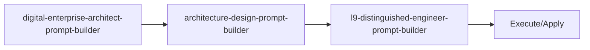

<!-- HEADER:START -->

<!-- HEADER:END -->

# Digital Enterprise Architect Prompt Builder

> **Enterprise architecture strategy**

[](../../README.md)
[](./README.md#prompt-builders)
[](../README.md)

**Complexity**: ⭐⭐⭐⭐ Expert | **Category**: Prompt Builders | **Time to Learn**: Half day

---

## Overview

The `digital-enterprise-architect-prompt-builder` mentor perspectives and current research.

### Key Capabilities

- Strategic problem framing
- Business drivers and stakeholders
- Compliance and technology guardrails
- Innovation themes and research benchmarking

---

## When to Use

✅ **Good for:**

- Complex tasks requiring detailed instructions
- Multi-step workflows with dependencies
- Standardizing prompt patterns across teams
- Generating consistent AI interactions

❌ **Not ideal for:**

- Simple, single-line questions
- Quick clarifications without context
- Tasks with obvious, minimal requirements

---

## Basic Usage

### Example 1: Basic Prompt Builders Task

```json
{
  "tool": "digital-enterprise-architect-prompt-builder",
  "initiativeName": "your-initiative-name-here",
  "problemStatement": "your-problem-statement-here",
  "businessDrivers": "your-business-drivers",
  "targetUsers": "your-target-users",
  "complianceObligations": "your-compliance-obligations"
}
```

**Output**: Structured prompt builders output with:

- Strategic problem framing
- Business drivers and stakeholders
- Compliance and technology guardrails

---

## Parameters

| Parameter | Type | Required | Default | Description |
|-----------|------|----------|---------|-------------|
| `initiativeName` | string | ✅ Yes | - | Initiative Name parameter |
| `problemStatement` | string | ✅ Yes | - | Problem Statement parameter |
| `businessDrivers` | string | No | - | Business Drivers parameter |
| `targetUsers` | string | No | - | Target Users parameter |
| `complianceObligations` | string | No | - | Compliance Obligations parameter |
| `innovationThemes` | string | No | - | Innovation Themes parameter |

---

## What You Get

The tool returns a structured prompt builders output with:

1. **Strategic** - Strategic problem framing
2. **Business** - Business drivers and stakeholders
3. **Compliance** - Compliance and technology guardrails
4. **Innovation** - Innovation themes and research benchmarking

### Output Structure

```markdown
## Digital Enterprise Architect Prompt Builder Output

### Summary
[High-level summary of analysis/output]

### Details
[Detailed content based on your inputs]

### Recommendations
[Actionable next steps]

### References (if enabled)
[Links to external resources]
```

---

## Real-World Examples

### Example 1: Code Review Workflow

```json
{
  "tool": "digital-enterprise-architect-prompt-builder",
  "initiativeName": "Example initiativeName value for code review workflow",
  "problemStatement": "Example problemStatement value for code review workflow",
  "businessDrivers": "example-value",
  "targetUsers": "example-value"
}
```

**Generated Output Excerpt**:

```markdown
## Code Review Workflow Results

### Summary
Analysis complete with actionable insights...

### Key Findings
1. [Finding 1 based on prompt builders analysis]
2. [Finding 2 with specific recommendations]
3. [Finding 3 with priority indicators]

### Next Steps
- Implement recommended changes
- Review and validate results
- Integrate into workflow
```

---

## Tips & Tricks

### 💡 Best Practices

1. **Be Specific in Goals** - Vague goals lead to vague outputs
2. **Prioritize Requirements** - Use keywords like CRITICAL, HIGH, NICE-TO-HAVE
3. **Define Success Criteria** - How will you know when it's done?
4. **Match Style to Use Case** - XML for complex structures, Markdown for readability

### 🚫 Common Mistakes

- ❌ Vague context → ✅ Be specific about the domain and constraints
- ❌ Too many requirements → ✅ Focus on top 3-5 critical ones
- ❌ Mixing goals → ✅ One clear objective per prompt
- ❌ Ignoring audience → ✅ Tailor detail level to expertise

### ⚡ Pro Tips

- Combine with related tools for comprehensive workflows
- Use `autoSelectTechniques: true` for optimal technique selection
- Enable `includePitfalls: true` for complex tasks

---

## Related Tools

- **[architecture-design-prompt-builder](./architecture-design-prompt-builder.md)** - System architecture design prompts
- **[l9-distinguished-engineer-prompt-builder](./l9-distinguished-engineer-prompt-builder.md)** - L9 Distinguished Engineer prompts

---

## Workflow Integration

### With Other Tools



1. **digital-enterprise-architect-prompt-builder** - Enterprise architecture strategy
2. **architecture-design-prompt-builder** - System architecture design prompts
3. **l9-distinguished-engineer-prompt-builder** - L9 Distinguished Engineer prompts
4. Execute combined output with your AI model or apply changes

---

<details>
<summary><strong>📚 Related Documentation</strong></summary>

- [All Prompt Builders Tools](./README.md#prompt-builders)
- [Prompting Hierarchy Guide](../tips/prompting-hierarchy.md)
- [Flow Prompting Examples](../tips/flow-prompting-examples.md)
- [AI Interaction Tips](../tips/ai-interaction-tips.md)

</details>

<sub>**MCP AI Agent Guidelines** • Licensed under [MIT](../../LICENSE) • [Disclaimer](../../DISCLAIMER.md) • [Contributing](../../CONTRIBUTING.md)</sub>

---

## Related Documentation

- [All Prompt Builders Tools](./README.md#prompt-builders)
- [Prompting Hierarchy Guide](../tips/prompting-hierarchy.md)
- [Flow Prompting Examples](../tips/flow-prompting-examples.md)
- [AI Interaction Tips](../tips/ai-interaction-tips.md)

---

<!-- FOOTER:START -->

<!-- FOOTER:END -->
