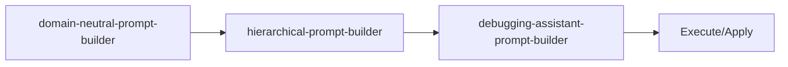

<!-- HEADER:START -->

<!-- HEADER:END -->

# Domain Neutral Prompt Builder

> **Domain-neutral prompts and templates**

[](../../README.md)
[](./README.md#prompt-builders)
[](../README.md)

**Complexity**: ⭐⭐⭐ Advanced | **Category**: Prompt Builders | **Time to Learn**: 1-2 hours

---

## Overview

The `domain-neutral-prompt-builder` objectives, scope, workflow, capabilities, risks, acceptance.

### Key Capabilities

- Comprehensive prompt structure (objectives, scope, I/O, workflow)
- Risk and compliance sections
- Acceptance tests and success metrics
- Flexible milestone tracking

---

## When to Use

✅ **Good for:**

- Complex tasks requiring detailed instructions
- Multi-step workflows with dependencies
- Standardizing prompt patterns across teams
- Generating consistent AI interactions

❌ **Not ideal for:**

- Simple, single-line questions
- Quick clarifications without context
- Tasks with obvious, minimal requirements

---

## Basic Usage

### Example 1: Basic Prompt Builders Task

```json
{
  "tool": "domain-neutral-prompt-builder",
  "title": "your-title-here",
  "summary": "your-summary-here",
  "objectives": ["item1", "item2"],
  "workflow": "your-workflow",
  "capabilities": "your-capabilities"
}
```

**Output**: Structured prompt builders output with:

- Comprehensive prompt structure (objectives, scope, I/O, workflow)
- Risk and compliance sections
- Acceptance tests and success metrics

---

## Parameters

| Parameter | Type | Required | Default | Description |
|-----------|------|----------|---------|-------------|
| `title` | string | ✅ Yes | - | Document or prompt title |
| `summary` | string | ✅ Yes | - | Brief summary or overview |
| `objectives` | array | No | - | Strategic objectives to analyze |
| `workflow` | string | No | - | Workflow steps as an array of strings |
| `capabilities` | string | No | - | Array of capability definitions |
| `risks` | string | No | - | Risk factors and mitigation strategies |
| `acceptanceTests` | string | No | - | Acceptance test scenarios |
| `milestones` | string | No | - | Project milestones and deliverables |

---

## What You Get

The tool returns a structured prompt builders output with:

1. **Comprehensive** - Comprehensive prompt structure (objectives, scope, I/O, workflow)
2. **Risk** - Risk and compliance sections
3. **Acceptance** - Acceptance tests and success metrics
4. **Flexible** - Flexible milestone tracking

### Output Structure

```markdown
## Domain Neutral Prompt Builder Output

### Summary
[High-level summary of analysis/output]

### Details
[Detailed content based on your inputs]

### Recommendations
[Actionable next steps]

### References (if enabled)
[Links to external resources]
```

---

## Real-World Examples

### Example 1: Code Review Workflow

```json
{
  "tool": "domain-neutral-prompt-builder",
  "title": "Example title value for code review workflow",
  "summary": "Example summary value for code review workflow",
  "objectives": ["example1", "example2"],
  "workflow": "example-value"
}
```

**Generated Output Excerpt**:

```markdown
## Code Review Workflow Results

### Summary
Analysis complete with actionable insights...

### Key Findings
1. [Finding 1 based on prompt builders analysis]
2. [Finding 2 with specific recommendations]
3. [Finding 3 with priority indicators]

### Next Steps
- Implement recommended changes
- Review and validate results
- Integrate into workflow
```

---

## Tips & Tricks

### 💡 Best Practices

1. **Be Specific in Goals** - Vague goals lead to vague outputs
2. **Prioritize Requirements** - Use keywords like CRITICAL, HIGH, NICE-TO-HAVE
3. **Define Success Criteria** - How will you know when it's done?
4. **Match Style to Use Case** - XML for complex structures, Markdown for readability

### 🚫 Common Mistakes

- ❌ Vague context → ✅ Be specific about the domain and constraints
- ❌ Too many requirements → ✅ Focus on top 3-5 critical ones
- ❌ Mixing goals → ✅ One clear objective per prompt
- ❌ Ignoring audience → ✅ Tailor detail level to expertise

### ⚡ Pro Tips

- Combine with related tools for comprehensive workflows
- Use `autoSelectTechniques: true` for optimal technique selection
- Enable `includePitfalls: true` for complex tasks

---

## Related Tools

- **[hierarchical-prompt-builder](./hierarchical-prompt-builder.md)** - Build structured prompts with clear hierarchies
- **[debugging-assistant-prompt-builder](./debugging-assistant-prompt-builder.md)** - Systematic debugging prompts

---

## Workflow Integration

### With Other Tools



1. **domain-neutral-prompt-builder** - Domain-neutral prompts and templates
2. **hierarchical-prompt-builder** - Build structured prompts with clear hierarchies
3. **debugging-assistant-prompt-builder** - Systematic debugging prompts
4. Execute combined output with your AI model or apply changes

---

<details>
<summary><strong>📚 Related Documentation</strong></summary>

- [All Prompt Builders Tools](./README.md#prompt-builders)
- [Prompting Hierarchy Guide](../tips/PROMPTING_HIERARCHY.md)
- [Flow Prompting Examples](../tips/FLOW_PROMPTING_EXAMPLES.md)
- [AI Interaction Tips](../tips/AI_INTERACTION_TIPS.md)

</details>

<sub>**MCP AI Agent Guidelines** • Licensed under [MIT](../../LICENSE) • [Disclaimer](../../DISCLAIMER.md) • [Contributing](../../CONTRIBUTING.md)</sub>

---

## Related Documentation

- [All Prompt Builders Tools](./README.md#prompt-builders)
- [Prompting Hierarchy Guide](../tips/PROMPTING_HIERARCHY.md)
- [Flow Prompting Examples](../tips/FLOW_PROMPTING_EXAMPLES.md)
- [AI Interaction Tips](../tips/AI_INTERACTION_TIPS.md)

---

<!-- FOOTER:START -->

<!-- FOOTER:END -->
