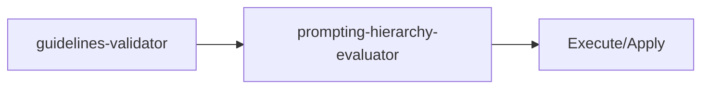

<!-- HEADER:START -->

<!-- HEADER:END -->

# Guidelines Validator

> **Utilities Tool** • **Complexity: Simple**

[](../../README.md)
[](./README.md#utilities)
[](../README.md)

---

# guidelines-validator

> **Validate against AI agent guidelines**

**Complexity**: ⭐ Simple | **Category**: Utilities | **Time to Learn**: 5-10 minutes

---

## Overview

The `guidelines-validator` prompting, code, architecture, visualization best practices.

### Key Capabilities

- Practice validation against established guidelines
- Category-specific rules (prompting, code, architecture, viz, memory, workflow)
- Actionable recommendations
- Best practice references

---

## When to Use

✅ **Good for:**

- AI model selection based on task requirements
- Validating practices against established guidelines
- Context window optimization
- Project onboarding and analysis

❌ **Not ideal for:**

- Complex business logic decisions
- Security-critical operations
- Production deployment automation

---

## Basic Usage

### Example 1: Basic Utilities Task

```json
{
  "tool": "guidelines-validator",
  "practiceDescription": "your-practice-description-here",
  "category": "your-category-here"
}
```

**Output**: Structured utilities output with:

- Practice validation against established guidelines
- Category-specific rules (prompting, code, architecture, viz, memory, workflow)
- Actionable recommendations

---

## Parameters

| Parameter | Type | Required | Default | Description |
|-----------|------|----------|---------|-------------|
| `practiceDescription` | string | ✅ Yes | - | Description of the development practice to validate |
| `category` | enum | ✅ Yes | - | Practice category: `prompting`, `code-management`, `architecture`, `visualization`, `memory`, `workflow` |


---

## What You Get

The tool returns a structured utilities output with:

1. **Practice** - Practice validation against established guidelines
2. **Category-specific** - Category-specific rules (prompting, code, architecture, viz, memory, workflow)
3. **Actionable** - Actionable recommendations
4. **Best** - Best practice references

### Output Structure

```markdown
## Guidelines Validator Output

### Summary
[High-level summary of analysis/output]

### Details
[Detailed content based on your inputs]

### Recommendations
[Actionable next steps]

### References (if enabled)
[Links to external resources]
```

---

## Real-World Examples

### Example 1: Common Use Case

```json
{
  "tool": "guidelines-validator",
  "practiceDescription": "Example practiceDescription value for common use case",
  "category": "Example category value for common use case"
}
```

**Generated Output Excerpt**:

```markdown
## Common Use Case Results

### Summary
Analysis complete with actionable insights...

### Key Findings
1. [Finding 1 based on utilities analysis]
2. [Finding 2 with specific recommendations]
3. [Finding 3 with priority indicators]

### Next Steps
- Implement recommended changes
- Review and validate results
- Integrate into workflow
```

---

## Tips & Tricks

### 💡 Best Practices

1. **Match Tool to Task** - Choose the right utility for the job
2. **Provide Complete Context** - Utilities need information to help
3. **Review Recommendations** - Don't blindly accept suggestions
4. **Integrate into Workflow** - Make utilities part of your process

### 🚫 Common Mistakes

- ❌ Using wrong tool → ✅ Check tool descriptions carefully
- ❌ Incomplete input → ✅ Provide all relevant context
- ❌ Ignoring output → ✅ Act on recommendations
- ❌ One-off usage → ✅ Build into regular workflow

### ⚡ Pro Tips

- Combine utilities for more comprehensive analysis
- Use validation tools before committing changes
- Cache results for frequently used configurations

---

## Related Tools

- **[prompting-hierarchy-evaluator](./prompting-hierarchy-evaluator.md)** - Evaluate prompt quality

---

## Workflow Integration

### With Other Tools



1. **guidelines-validator** - Validate against AI agent guidelines
2. **prompting-hierarchy-evaluator** - Evaluate prompt quality
3. Execute combined output with your AI model or apply changes

---

<details>
<summary><strong>📚 Related Documentation</strong></summary>

- [All Utilities Tools](./README.md#utilities)
- [AI Interaction Tips](../tips/AI_INTERACTION_TIPS.md)

</details>

<sub>**MCP AI Agent Guidelines** • Licensed under [MIT](../../LICENSE) • [Disclaimer](../../DISCLAIMER.md) • [Contributing](../../CONTRIBUTING.md)</sub>

---

## Related Documentation

- [All Utilities Tools](./README.md#utilities)
- [AI Interaction Tips](../tips/AI_INTERACTION_TIPS.md)

---

<!-- FOOTER:START -->

<!-- FOOTER:END -->
