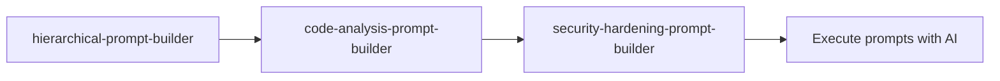

<!-- HEADER:START -->

<!-- HEADER:END -->

# Hierarchical Prompt Builder

> **Prompt Builders Tool** • **Complexity: Medium**

[](../../README.md)
[](./README.md#prompt-builders)
[](../README.md)

---

# hierarchical-prompt-builder

> **Build structured prompts with clear hierarchies and layers of specificity**

**Complexity**: ⭐⭐ Moderate | **Category**: Prompt Builders | **Time to Learn**: 15-30 minutes

---

## Overview

The `hierarchical-prompt-builder` creates well-structured prompts with multiple levels of specificity:

- **Context** (broad domain/background)
- **Goal** (specific objective)
- **Requirements** (detailed constraints and needs)

This hierarchical approach ensures AI models understand both the big picture and specific details, leading to better, more targeted responses.

---

## When to Use

✅ **Good for:**

- Complex tasks requiring detailed instructions
- Code refactoring with specific requirements
- Architecture design with constraints
- Documentation generation with audience considerations
- Multi-step workflows needing clear structure

❌ **Not ideal for:**

- Simple, single-sentence questions
- Quick clarifications
- Tasks with obvious context

---

## Basic Usage

### Example 1: Code Refactoring Prompt

```json
{
  "tool": "hierarchical-prompt-builder",
  "context": "Legacy Express.js API with 5000+ lines in single file",
  "goal": "Refactor into modular, maintainable architecture",
  "requirements": [
    "Preserve all existing endpoints",
    "Add TypeScript types",
    "Implement middleware pattern",
    "Maintain 90%+ test coverage"
  ],
  "style": "markdown",
  "outputFormat": "Step-by-step refactoring plan"
}
```

**Output**: Structured markdown prompt with:

- Background context section
- Clear refactoring objectives
- Numbered requirements checklist
- Expected deliverables
- Success criteria

### Example 2: Architecture Design

```json
{
  "tool": "hierarchical-prompt-builder",
  "context": "E-commerce platform serving 100K+ daily users",
  "goal": "Design scalable microservices architecture for checkout flow",
  "requirements": [
    "Handle 1000 req/sec peak load",
    "99.9% uptime SLA",
    "PCI-DSS compliance",
    "Support multiple payment gateways"
  ],
  "audience": "Senior backend engineers",
  "techniques": ["chain-of-thought", "rag"],
  "autoSelectTechniques": false
}
```

**Output**: Detailed architecture prompt with:

- System context and scale requirements
- Design objectives prioritized
- Technical and compliance constraints
- Recommended AI techniques (CoT + RAG for complex reasoning)

---

## Parameters

| Parameter               | Type    | Required | Default      | Description                                                        |
| ----------------------- | ------- | -------- | ------------ | ------------------------------------------------------------------ |
| `context`               | string  | ✅ Yes   | -            | Broad context or domain (e.g., "React SPA with Redux")             |
| `goal`                  | string  | ✅ Yes   | -            | Specific goal or objective (e.g., "Migrate to React Query")        |
| `requirements`          | array   | No       | `[]`         | Detailed requirements and constraints                              |
| `audience`              | string  | No       | -            | Target audience or expertise level                                 |
| `style`                 | enum    | No       | `"markdown"` | Format: `"markdown"` or `"xml"`                                    |
| `outputFormat`          | string  | No       | -            | Desired output format (e.g., "JSON schema", "Step-by-step plan")   |
| `techniques`            | array   | No       | `[]`         | Prompting techniques to include (see below)                        |
| `autoSelectTechniques`  | boolean | No       | `false`      | Auto-infer techniques from context                                 |
| `provider`              | enum    | No       | -            | Model family for tailored tips (e.g., `"gpt-4.1"`, `"claude-3.7"`) |
| `includeDisclaimer`     | boolean | No       | `false`      | Append third-party disclaimer                                      |
| `includePitfalls`       | boolean | No       | `false`      | Include common pitfalls section                                    |
| `includeReferences`     | boolean | No       | `false`      | Add references list                                                |
| `includeTechniqueHints` | boolean | No       | `false`      | Add technique hints section                                        |

### Prompting Techniques

Choose from these proven AI prompting strategies:

- `zero-shot` - No examples, rely on instructions alone
- `few-shot` - Provide 2-3 examples to guide model
- `chain-of-thought` - Encourage step-by-step reasoning
- `self-consistency` - Generate multiple solutions, select best
- `in-context-learning` - Learn from provided examples
- `generate-knowledge` - Generate background knowledge first
- `prompt-chaining` - Break into sequential sub-prompts
- `tree-of-thoughts` - Explore multiple reasoning paths
- `meta-prompting` - Prompt about prompting strategy
- `rag` - Retrieval-augmented generation (fetch relevant docs)
- `react` - Reasoning + Acting loop
- `art` - Automatic reasoning and tool use

**💡 Tip**: Set `autoSelectTechniques: true` to let the tool choose optimal techniques based on your context and goal.

---

## What You Get

### Prompt Structure

```markdown
## Context

[Broad domain/background]

## Goal

[Specific objective]

## Requirements

1. [Requirement 1]
2. [Requirement 2]
   ...

## Audience

[Target expertise level]

## Output Format

[Expected deliverable type]

## Technique Hints

[Recommended AI techniques]

## Success Criteria

[How to evaluate result quality]
```

---

## Real-World Examples

### Example 1: Migrating Jest → Vitest

```json
{
  "context": "TypeScript monorepo with 500+ Jest tests across 20 packages",
  "goal": "Migrate to Vitest for faster test execution and better ESM support",
  "requirements": [
    "Maintain existing test coverage (85%)",
    "Update all test files incrementally",
    "Keep CI/CD pipelines working",
    "Migrate custom Jest matchers"
  ],
  "audience": "Mid-level frontend engineers",
  "techniques": ["chain-of-thought", "prompt-chaining"],
  "includePitfalls": true
}
```

**Generated Prompt Excerpt**:

```markdown
## Context

You're working with a TypeScript monorepo containing 500+ Jest tests...

## Goal

Migrate the entire test suite to Vitest while maintaining...

## Requirements (Prioritized)

1. ✅ CRITICAL: Maintain 85%+ code coverage throughout migration
2. ⚠️ HIGH: Update test files package-by-package to minimize risk
3. 📋 MEDIUM: Keep CI/CD green at all times
4. 🔧 LOW: Port custom matchers (can be done last)

## Pitfalls to Avoid

❌ Don't migrate all files at once - too risky
❌ Don't ignore snapshot differences - review carefully
❌ Don't forget to update package.json scripts
...
```

### Example 2: Security Hardening Plan

```json
{
  "context": "Node.js API handling financial transactions, currently no security audit",
  "goal": "Create comprehensive security hardening roadmap",
  "requirements": [
    "OWASP Top 10 compliance",
    "PCI-DSS Level 1 certification",
    "Input validation on all endpoints",
    "Rate limiting and DDoS protection"
  ],
  "provider": "claude-3.7",
  "techniques": ["generate-knowledge", "chain-of-thought"],
  "includeReferences": true
}
```

**Output**: Detailed security plan with:

- Current vulnerability assessment (generated knowledge)
- Prioritized remediation steps (CoT reasoning)
- PCI-DSS checklist
- Implementation timeline
- External security resources

---

## Tips & Tricks

### 💡 Best Practices

1. **Be Specific in Goal** - "Refactor for testability" → "Refactor authentication module to achieve 95% test coverage using dependency injection"
2. **Prioritize Requirements** - Use keywords like "CRITICAL", "HIGH", "NICE-TO-HAVE"
3. **Define Success Criteria** - How will you know when it's done?
4. **Match Style to Use Case** - XML for complex nested structures, Markdown for readability
5. **Use Auto-Select First** - Set `autoSelectTechniques: true` and adjust if needed

### 🚫 Common Mistakes

- ❌ Vague context: "Make it better" → ✅ "Improve Express.js middleware error handling"
- ❌ Too many requirements: Focus on top 3-5 critical ones
- ❌ Mixing goals: One clear objective per prompt
- ❌ Ignoring audience: "Junior dev" vs "Staff engineer" needs different detail levels

### ⚡ Pro Tips

- Combine with `prompt-flow-builder` for multi-step workflows
- Use `provider` parameter to get model-specific optimizations
- Enable `includePitfalls: true` for complex migrations
- Check `includeReferences: true` for research-heavy topics

---

## Related Tools

- **[prompt-chaining-builder](./prompt-chaining-builder.md)** - Multi-step prompt sequences
- **[prompt-flow-builder](./prompt-flow-builder.md)** - Parallel and conditional workflows
- **[prompting-hierarchy-evaluator](./prompting-hierarchy-evaluator.md)** - Evaluate prompt quality
- **[hierarchy-level-selector](./hierarchy-level-selector.md)** - Choose right complexity level

---

## Workflow Integration

### With Other Prompt Builders



1. **hierarchical-prompt-builder** - Create high-level refactor plan
2. **code-analysis-prompt-builder** - Generate code review checklist
3. **security-hardening-prompt-builder** - Add security considerations
4. Execute combined prompt with your AI model

---

<details>
<summary><strong>📚 Related Documentation</strong></summary>

- [All Prompt Builders](./README.md#prompt-builders)
- [Prompting Hierarchy Guide](../PROMPTING_HIERARCHY.md)
- [Domain-Neutral Prompt Builder](./domain-neutral-prompt-builder.md)
- [Prompt Flow Builder](./prompt-flow-builder.md)
- [AI Interaction Tips](../AI_INTERACTION_TIPS.md)

</details>

<sub>**MCP AI Agent Guidelines** • Licensed under [MIT](../../LICENSE) • [Disclaimer](../../DISCLAIMER.md) • [Contributing](../../CONTRIBUTING.md)</sub>

---

## Related Documentation

- [All Prompt Builders Tools](./README.md#prompt-builders)
- [Prompting Hierarchy](#prompting-hierarchy)
- [Flow Prompting Examples](#flow-prompting-examples)

---

<!-- FOOTER:START -->

<!-- FOOTER:END -->
