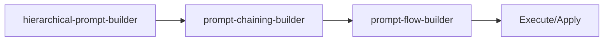

<!-- HEADER:START -->

<!-- HEADER:END -->

# Hierarchical Prompt Builder

> **Build structured prompts with clear hierarchies**

[](../../README.md)
[](./README.md#prompt-builders)
[](../README.md)

**Complexity**: ⭐⭐ Moderate | **Category**: Prompt Builders | **Time to Learn**: 15-30 minutes

---

## Overview

The `hierarchical-prompt-builder` create prompts with context → goal → requirements structure.

### Key Capabilities

- Multi-level specificity (context, goal, requirements)
- Supports markdown and XML output formats
- Auto-technique selection or manual override
- Model-specific optimizations

---

## When to Use

✅ **Good for:**

- Complex tasks requiring detailed instructions
- Multi-step workflows with dependencies
- Standardizing prompt patterns across teams
- Generating consistent AI interactions

❌ **Not ideal for:**

- Simple, single-line questions
- Quick clarifications without context
- Tasks with obvious, minimal requirements

---

## Basic Usage

### Example 1: Basic Prompt Builders Task

```json
{
  "tool": "hierarchical-prompt-builder",
  "context": "your-context-here",
  "goal": "your-goal-here",
  "requirements": ["item1", "item2"],
  "audience": "your-audience",
  "style": "your-style"
}
```

**Output**: Structured prompt builders output with:

- Multi-level specificity (context, goal, requirements)
- Supports markdown and XML output formats
- Auto-technique selection or manual override

---

## Parameters

| Parameter | Type | Required | Default | Description |
|-----------|------|----------|---------|-------------|
| `context` | string | ✅ Yes | - | Broad context or domain background for the task |
| `goal` | string | ✅ Yes | - | Specific objective or target outcome |
| `requirements` | array | No | - | Detailed requirements and constraints as an array of strings |
| `audience` | string | No | - | Target audience or expertise level (e.g., 'Senior engineers') |
| `style` | enum | No | - | Output format style: `markdown` or `xml` |
| `outputFormat` | enum | No | - | Desired output format specification |
| `techniques` | array | No | - | Prompting techniques to apply (e.g., `chain-of-thought`, `few-shot`) |
| `autoSelectTechniques` | boolean | No | `false` | Automatically select optimal techniques based on context |
| `provider` | enum | No | - | AI model provider for optimizations (e.g., `gpt-5`, `claude-4`, `gemini-2.5`) |

---

## What You Get

The tool returns a structured prompt builders output with:

1. **Multi-level** - Multi-level specificity (context, goal, requirements)
2. **Supports** - Supports markdown and XML output formats
3. **Auto-technique** - Auto-technique selection or manual override
4. **Model-specific** - Model-specific optimizations

### Output Structure

```markdown
## Hierarchical Prompt Builder Output

### Summary
[High-level summary of analysis/output]

### Details
[Detailed content based on your inputs]

### Recommendations
[Actionable next steps]

### References (if enabled)
[Links to external resources]
```

---

## Real-World Examples

### Example 1: Code Review Workflow

```json
{
  "tool": "hierarchical-prompt-builder",
  "context": "Example context value for code review workflow",
  "goal": "Example goal value for code review workflow",
  "requirements": ["example1", "example2"],
  "audience": "example-value"
}
```

**Generated Output Excerpt**:

```markdown
## Code Review Workflow Results

### Summary
Analysis complete with actionable insights...

### Key Findings
1. [Finding 1 based on prompt builders analysis]
2. [Finding 2 with specific recommendations]
3. [Finding 3 with priority indicators]

### Next Steps
- Implement recommended changes
- Review and validate results
- Integrate into workflow
```

---

## Tips & Tricks

### 💡 Best Practices

1. **Be Specific in Goals** - Vague goals lead to vague outputs
2. **Prioritize Requirements** - Use keywords like CRITICAL, HIGH, NICE-TO-HAVE
3. **Define Success Criteria** - How will you know when it's done?
4. **Match Style to Use Case** - XML for complex structures, Markdown for readability

### 🚫 Common Mistakes

- ❌ Vague context → ✅ Be specific about the domain and constraints
- ❌ Too many requirements → ✅ Focus on top 3-5 critical ones
- ❌ Mixing goals → ✅ One clear objective per prompt
- ❌ Ignoring audience → ✅ Tailor detail level to expertise

### ⚡ Pro Tips

- Combine with related tools for comprehensive workflows
- Use `autoSelectTechniques: true` for optimal technique selection
- Enable `includePitfalls: true` for complex tasks

---

## Related Tools

- **[prompt-chaining-builder](./prompt-chaining-builder.md)** - Build multi-step prompt chains
- **[prompt-flow-builder](./prompt-flow-builder.md)** - Declarative prompt flows with branching
- **[prompting-hierarchy-evaluator](./prompting-hierarchy-evaluator.md)** - Evaluate prompt quality

---

## Workflow Integration

### With Other Tools



1. **hierarchical-prompt-builder** - Build structured prompts with clear hierarchies
2. **prompt-chaining-builder** - Build multi-step prompt chains
3. **prompt-flow-builder** - Declarative prompt flows with branching
4. Execute combined output with your AI model or apply changes

---

<details>
<summary><strong>📚 Related Documentation</strong></summary>

- [All Prompt Builders Tools](./README.md#prompt-builders)
- [Prompting Hierarchy Guide](../tips/prompting-hierarchy.md)
- [Flow Prompting Examples](../tips/flow-prompting-examples.md)
- [AI Interaction Tips](../tips/ai-interaction-tips.md)

</details>

<sub>**MCP AI Agent Guidelines** • Licensed under [MIT](../../LICENSE) • [Disclaimer](../../DISCLAIMER.md) • [Contributing](../../CONTRIBUTING.md)</sub>

---

## Related Documentation

- [All Prompt Builders Tools](./README.md#prompt-builders)
- [Prompting Hierarchy Guide](../tips/prompting-hierarchy.md)
- [Flow Prompting Examples](../tips/flow-prompting-examples.md)
- [AI Interaction Tips](../tips/ai-interaction-tips.md)

---

<!-- FOOTER:START -->

<!-- FOOTER:END -->
