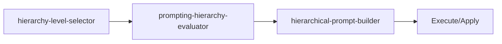

<!-- HEADER:START -->

<!-- HEADER:END -->

# Hierarchy Level Selector

> **Select prompting hierarchy level**

[](../../README.md)
[](./README.md#utilities)
[](../README.md)

**Complexity**: ⭐ Simple | **Category**: Utilities | **Time to Learn**: 5-10 minutes

---

## Overview

The `hierarchy-level-selector` independent, indirect, direct, modeling, scaffolding, full-physical.

### Key Capabilities

- Task complexity assessment
- Agent capability matching
- Autonomy preference consideration
- Level recommendations with examples

---

## When to Use

✅ **Good for:**

- AI model selection based on task requirements
- Validating practices against established guidelines
- Context window optimization
- Project onboarding and analysis

❌ **Not ideal for:**

- Complex business logic decisions
- Security-critical operations
- Production deployment automation

---

## Basic Usage

### Example 1: Basic Utilities Task

```json
{
  "tool": "hierarchy-level-selector",
  "taskDescription": "your-task-description-here",
  "taskComplexity": "your-task-complexity",
  "agentCapability": "your-agent-capability",
  "autonomyPreference": true
}
```

**Output**: Structured utilities output with:

- Task complexity assessment
- Agent capability matching
- Autonomy preference consideration

---

## Parameters

| Parameter | Type | Required | Default | Description |
|-----------|------|----------|---------|-------------|
| `taskDescription` | string | ✅ Yes | - | Description of the task for model selection |
| `taskComplexity` | string | No | - | Task complexity: `simple`, `moderate`, `complex`, or `very-complex` |
| `agentCapability` | string | No | - | Agent capability level: `novice`, `intermediate`, `advanced`, or `expert` |
| `autonomyPreference` | boolean | No | `false` | Desired autonomy level: `low`, `medium`, or `high` |
| `includeExamples` | boolean | No | `false` | Include example scenarios |

---

## What You Get

The tool returns a structured utilities output with:

1. **Task** - Task complexity assessment
2. **Agent** - Agent capability matching
3. **Autonomy** - Autonomy preference consideration
4. **Level** - Level recommendations with examples

### Output Structure

```markdown
## Hierarchy Level Selector Output

### Summary
[High-level summary of analysis/output]

### Details
[Detailed content based on your inputs]

### Recommendations
[Actionable next steps]

### References (if enabled)
[Links to external resources]
```

---

## Real-World Examples

### Example 1: Common Use Case

```json
{
  "tool": "hierarchy-level-selector",
  "taskDescription": "Example taskDescription value for common use case",
  "taskComplexity": "example-value",
  "agentCapability": "example-value"
}
```

**Generated Output Excerpt**:

```markdown
## Common Use Case Results

### Summary
Analysis complete with actionable insights...

### Key Findings
1. [Finding 1 based on utilities analysis]
2. [Finding 2 with specific recommendations]
3. [Finding 3 with priority indicators]

### Next Steps
- Implement recommended changes
- Review and validate results
- Integrate into workflow
```

---

## Tips & Tricks

### 💡 Best Practices

1. **Match Tool to Task** - Choose the right utility for the job
2. **Provide Complete Context** - Utilities need information to help
3. **Review Recommendations** - Don't blindly accept suggestions
4. **Integrate into Workflow** - Make utilities part of your process

### 🚫 Common Mistakes

- ❌ Using wrong tool → ✅ Check tool descriptions carefully
- ❌ Incomplete input → ✅ Provide all relevant context
- ❌ Ignoring output → ✅ Act on recommendations
- ❌ One-off usage → ✅ Build into regular workflow

### ⚡ Pro Tips

- Combine utilities for more comprehensive analysis
- Use validation tools before committing changes
- Cache results for frequently used configurations

---

## Related Tools

- **[prompting-hierarchy-evaluator](./prompting-hierarchy-evaluator.md)** - Evaluate prompt quality
- **[hierarchical-prompt-builder](./hierarchical-prompt-builder.md)** - Build structured prompts with clear hierarchies

---

## Workflow Integration

### With Other Tools



1. **hierarchy-level-selector** - Select prompting hierarchy level
2. **prompting-hierarchy-evaluator** - Evaluate prompt quality
3. **hierarchical-prompt-builder** - Build structured prompts with clear hierarchies
4. Execute combined output with your AI model or apply changes

---

<details>
<summary><strong>📚 Related Documentation</strong></summary>

- [All Utilities Tools](./README.md#utilities)
- [AI Interaction Tips](../tips/ai-interaction-tips.md)

</details>

<sub>**MCP AI Agent Guidelines** • Licensed under [MIT](../../LICENSE) • [Disclaimer](../../DISCLAIMER.md) • [Contributing](../../CONTRIBUTING.md)</sub>

---

## Related Documentation

- [All Utilities Tools](./README.md#utilities)
- [AI Interaction Tips](../tips/ai-interaction-tips.md)

---

<!-- FOOTER:START -->

<!-- FOOTER:END -->
