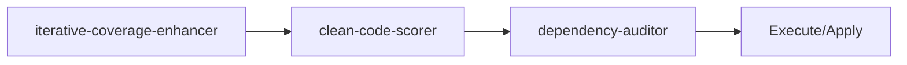

<!-- HEADER:START -->

<!-- HEADER:END -->

# Iterative Coverage Enhancer

> **Code Analysis Tool** • **Complexity: Moderate**

[](../../README.md)
[](./README.md#code-analysis)
[](../README.md)

---

# iterative-coverage-enhancer

> **Analyze coverage gaps and suggest tests**

**Complexity**: ⭐⭐ Moderate | **Category**: Code Analysis | **Time to Learn**: 15-30 minutes

---

## Overview

The `iterative-coverage-enhancer` gap detection, test suggestions, adaptive thresholds.

### Key Capabilities

- Coverage gap analysis
- Test case suggestions
- Dead code detection
- Adaptive threshold recommendations
- CI/CD integration guidance

---

## When to Use

✅ **Good for:**

- Identifying code quality issues and technical debt
- Analyzing test coverage gaps
- Security vulnerability scanning
- Dependency health checks

❌ **Not ideal for:**

- Real-time code execution
- Replacing comprehensive security audits
- Performance benchmarking

---

## Basic Usage

### Example 1: Basic Code Analysis Task

```json
{
  "tool": "iterative-coverage-enhancer",
  "projectPath": "your-project-path",
  "currentCoverage": { "key": "value" },
  "targetCoverage": { "key": "value" }
}
```

**Output**: Structured code analysis output with:

- Coverage gap analysis
- Test case suggestions
- Dead code detection

---

## Parameters

| Parameter | Type | Required | Default | Description |
|-----------|------|----------|---------|-------------|

| `projectPath` | string | No | - | Path to the project root directory |
| `currentCoverage` | object | No | - | Current coverage percentages by type |
| `targetCoverage` | object | No | - | Target coverage goals to achieve |
| `analyzeCoverageGaps` | boolean | No | `false` | Analyze and identify coverage gaps |
| `generateTestSuggestions` | boolean | No | `false` | Generate test suggestions for uncovered code |

---

## What You Get

The tool returns a structured code analysis output with:

1. **Coverage** - Coverage gap analysis
2. **Test** - Test case suggestions
3. **Dead** - Dead code detection
4. **Adaptive** - Adaptive threshold recommendations
5. **CI/CD** - CI/CD integration guidance

### Output Structure

```markdown
## Iterative Coverage Enhancer Output

### Summary
[High-level summary of analysis/output]

### Details
[Detailed content based on your inputs]

### Recommendations
[Actionable next steps]

### References (if enabled)
[Links to external resources]
```

---

## Real-World Examples

### Example 1: Security Analysis

```json
{
  "tool": "iterative-coverage-enhancer",
  "projectPath": "example-value",
  "currentCoverage": "example-value"
}
```

**Generated Output Excerpt**:

```markdown
## Security Analysis Results

### Summary
Analysis complete with actionable insights...

### Key Findings
1. [Finding 1 based on code analysis analysis]
2. [Finding 2 with specific recommendations]
3. [Finding 3 with priority indicators]

### Next Steps
- Implement recommended changes
- Review and validate results
- Integrate into workflow
```

---

## Tips & Tricks

### 💡 Best Practices

1. **Provide Complete Code** - Partial snippets may miss context
2. **Specify Language and Framework** - Enables targeted analysis
3. **Review All Severity Levels** - Not just critical issues
4. **Integrate with CI/CD** - Automate quality checks

### 🚫 Common Mistakes

- ❌ Ignoring low severity issues → ✅ They accumulate as tech debt
- ❌ Skipping context → ✅ Always specify framework and patterns
- ❌ One-time analysis → ✅ Regular monitoring catches regressions
- ❌ Trusting blindly → ✅ Validate recommendations with tests

### ⚡ Pro Tips

- Combine with security hardening for comprehensive reviews
- Use coverage metrics to prioritize testing efforts
- Export results to tracking systems for follow-up

---

## Related Tools

- **[clean-code-scorer](./clean-code-scorer.md)** - Calculate Clean Code score (0-100)
- **[dependency-auditor](./dependency-auditor.md)** - Analyze package.json for issues

---

## Workflow Integration

### With Other Tools



1. **iterative-coverage-enhancer** - Analyze coverage gaps and suggest tests
2. **clean-code-scorer** - Calculate Clean Code score (0-100)
3. **dependency-auditor** - Analyze package.json for issues
4. Execute combined output with your AI model or apply changes

---

<details>
<summary><strong>📚 Related Documentation</strong></summary>

- [All Code Analysis Tools](./README.md#code-analysis)
- [Clean Code Initiative](../tips/CLEAN_CODE_INITIATIVE.md)
- [Code Quality Improvements](../tips/CODE_QUALITY_IMPROVEMENTS.md)
- [AI Interaction Tips](../tips/AI_INTERACTION_TIPS.md)

</details>

<sub>**MCP AI Agent Guidelines** • Licensed under [MIT](../../LICENSE) • [Disclaimer](../../DISCLAIMER.md) • [Contributing](../../CONTRIBUTING.md)</sub>

---

## Related Documentation

- [All Code Analysis Tools](./README.md#code-analysis)
- [Clean Code Initiative](../tips/CLEAN_CODE_INITIATIVE.md)
- [Code Quality Improvements](../tips/CODE_QUALITY_IMPROVEMENTS.md)
- [AI Interaction Tips](../tips/AI_INTERACTION_TIPS.md)

---

<!-- FOOTER:START -->

<!-- FOOTER:END -->
