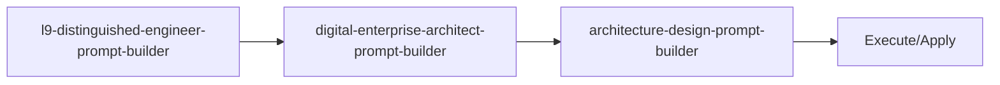

<!-- HEADER:START -->

<!-- HEADER:END -->

# L9 Distinguished Engineer Prompt Builder

> **L9 Distinguished Engineer prompts**

[](../../README.md)
[](./README.md#prompt-builders)
[](../README.md)

**Complexity**: ⭐⭐⭐⭐⭐ Master | **Category**: Prompt Builders | **Time to Learn**: 1-2 days

---

## Overview

The `l9-distinguished-engineer-prompt-builder` high-level software architecture and system design.

### Key Capabilities

- Technical challenge framing
- Performance targets (SLOs/SLAs)
- Security and observability requirements
- Migration strategy and team context

---

## When to Use

✅ **Good for:**

- Complex tasks requiring detailed instructions
- Multi-step workflows with dependencies
- Standardizing prompt patterns across teams
- Generating consistent AI interactions

❌ **Not ideal for:**

- Simple, single-line questions
- Quick clarifications without context
- Tasks with obvious, minimal requirements

---

## Basic Usage

### Example 1: Basic Prompt Builders Task

```json
{
  "tool": "l9-distinguished-engineer-prompt-builder",
  "projectName": "your-project-name-here",
  "technicalChallenge": "your-technical-challenge-here",
  "techStack": "your-tech-stack",
  "performanceTargets": "your-performance-targets",
  "securityRequirements": ["item1", "item2"]
}
```

**Output**: Structured prompt builders output with:

- Technical challenge framing
- Performance targets (SLOs/SLAs)
- Security and observability requirements

---

## Parameters

| Parameter | Type | Required | Default | Description |
|-----------|------|----------|---------|-------------|
| `projectName` | string | ✅ Yes | - | Project or initiative name |
| `technicalChallenge` | string | ✅ Yes | - | Technical Challenge parameter |
| `techStack` | string | No | - | Tech Stack parameter |
| `performanceTargets` | string | No | - | Performance Targets parameter |
| `securityRequirements` | array | No | - | Specific security requirements to validate |
| `migrationStrategy` | string | No | - | Migration Strategy parameter |

---

## What You Get

The tool returns a structured prompt builders output with:

1. **Technical** - Technical challenge framing
2. **Performance** - Performance targets (SLOs/SLAs)
3. **Security** - Security and observability requirements
4. **Migration** - Migration strategy and team context

### Output Structure

```markdown
## L9 Distinguished Engineer Prompt Builder Output

### Summary
[High-level summary of analysis/output]

### Details
[Detailed content based on your inputs]

### Recommendations
[Actionable next steps]

### References (if enabled)
[Links to external resources]
```

---

## Real-World Examples

### Example 1: Code Review Workflow

```json
{
  "tool": "l9-distinguished-engineer-prompt-builder",
  "projectName": "Example projectName value for code review workflow",
  "technicalChallenge": "Example technicalChallenge value for code review workflow",
  "techStack": "example-value",
  "performanceTargets": "example-value"
}
```

**Generated Output Excerpt**:

```markdown
## Code Review Workflow Results

### Summary
Analysis complete with actionable insights...

### Key Findings
1. [Finding 1 based on prompt builders analysis]
2. [Finding 2 with specific recommendations]
3. [Finding 3 with priority indicators]

### Next Steps
- Implement recommended changes
- Review and validate results
- Integrate into workflow
```

---

## Tips & Tricks

### 💡 Best Practices

1. **Be Specific in Goals** - Vague goals lead to vague outputs
2. **Prioritize Requirements** - Use keywords like CRITICAL, HIGH, NICE-TO-HAVE
3. **Define Success Criteria** - How will you know when it's done?
4. **Match Style to Use Case** - XML for complex structures, Markdown for readability

### 🚫 Common Mistakes

- ❌ Vague context → ✅ Be specific about the domain and constraints
- ❌ Too many requirements → ✅ Focus on top 3-5 critical ones
- ❌ Mixing goals → ✅ One clear objective per prompt
- ❌ Ignoring audience → ✅ Tailor detail level to expertise

### ⚡ Pro Tips

- Combine with related tools for comprehensive workflows
- Use `autoSelectTechniques: true` for optimal technique selection
- Enable `includePitfalls: true` for complex tasks

---

## Related Tools

- **[digital-enterprise-architect-prompt-builder](./digital-enterprise-architect-prompt-builder.md)** - Enterprise architecture strategy
- **[architecture-design-prompt-builder](./architecture-design-prompt-builder.md)** - System architecture design prompts

---

## Workflow Integration

### With Other Tools



1. **l9-distinguished-engineer-prompt-builder** - L9 Distinguished Engineer prompts
2. **digital-enterprise-architect-prompt-builder** - Enterprise architecture strategy
3. **architecture-design-prompt-builder** - System architecture design prompts
4. Execute combined output with your AI model or apply changes

---

<details>
<summary><strong>📚 Related Documentation</strong></summary>

- [All Prompt Builders Tools](./README.md#prompt-builders)
- [Prompting Hierarchy Guide](../tips/PROMPTING_HIERARCHY.md)
- [Flow Prompting Examples](../tips/FLOW_PROMPTING_EXAMPLES.md)
- [AI Interaction Tips](../tips/AI_INTERACTION_TIPS.md)

</details>

<sub>**MCP AI Agent Guidelines** • Licensed under [MIT](../../LICENSE) • [Disclaimer](../../DISCLAIMER.md) • [Contributing](../../CONTRIBUTING.md)</sub>

---

## Related Documentation

- [All Prompt Builders Tools](./README.md#prompt-builders)
- [Prompting Hierarchy Guide](../tips/PROMPTING_HIERARCHY.md)
- [Flow Prompting Examples](../tips/FLOW_PROMPTING_EXAMPLES.md)
- [AI Interaction Tips](../tips/AI_INTERACTION_TIPS.md)

---

<!-- FOOTER:START -->

<!-- FOOTER:END -->
