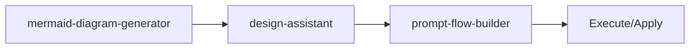

<!-- HEADER:START -->

<!-- HEADER:END -->

# Mermaid Diagram Generator

> **Generate Mermaid diagrams**

[](../../README.md)
[](./README.md#design-workflow)
[](../README.md)

**Complexity**: ⭐⭐ Moderate | **Category**: Design & Workflow | **Time to Learn**: 15-30 minutes

---

## Overview

The `mermaid-diagram-generator` 12+ diagram types with accessibility and customization.

### Key Capabilities

- 12+ diagram types (flowchart, sequence, class, state, gantt, pie, ER)
- Accessibility support (accTitle, accDescr)
- Theme customization
- Auto-repair on validation errors

---

## When to Use

✅ **Good for:**

- Multi-phase design sessions with constraints
- Generating visual diagrams and documentation
- Enforcing design consistency across projects
- Creating architecture decision records (ADRs)

❌ **Not ideal for:**

- Simple one-off diagrams
- Quick wireframe sketches
- Real-time collaboration

---

## Basic Usage

### Example 1: Basic Design & Workflow Task

```json
{
  "tool": "mermaid-diagram-generator",
  "description": "your-description-here",
  "diagramType": "your-diagram-type-here",
  "theme": "your-theme",
  "direction": "your-direction",
  "customStyles": "your-custom-styles"
}
```

**Output**: Structured design & workflow output with:

- 12+ diagram types (flowchart, sequence, class, state, gantt, pie, ER)
- Accessibility support (accTitle, accDescr)
- Theme customization

---

## Parameters

| Parameter | Type | Required | Default | Description |
|-----------|------|----------|---------|-------------|
| `description` | string | ✅ Yes | - | Description of the diagram to generate |
| `diagramType` | string | ✅ Yes | - | Diagram type: `flowchart`, `sequence`, `class`, `state`, `gantt`, `pie`, `er` |
| `theme` | string | No | - | Visual theme: `default`, `dark`, `forest`, `neutral` |
| `direction` | string | No | - | Flow direction: `TB`, `LR`, `BT`, `RL` |
| `customStyles` | enum | No | - | Custom CSS styles for diagram elements |
| `advancedFeatures` | string | No | - | Enable advanced mermaid features |
| `repair` | string | No | - | Auto-repair on validation errors |

---

## What You Get

The tool returns a structured design & workflow output with:

1. **12+** - 12+ diagram types (flowchart, sequence, class, state, gantt, pie, ER)
2. **Accessibility** - Accessibility support (accTitle, accDescr)
3. **Theme** - Theme customization
4. **Auto-repair** - Auto-repair on validation errors

### Output Structure

```markdown
## Mermaid Diagram Generator Output

### Summary
[High-level summary of analysis/output]

### Details
[Detailed content based on your inputs]

### Recommendations
[Actionable next steps]

### References (if enabled)
[Links to external resources]
```

---

## Real-World Examples

### Example 1: Design Session

```json
{
  "tool": "mermaid-diagram-generator",
  "description": "Example description value for design session",
  "diagramType": "Example diagramType value for design session",
  "theme": "example-value",
  "direction": "example-value"
}
```

**Generated Output Excerpt**:

```markdown
## Design Session Results

### Summary
Analysis complete with actionable insights...

### Key Findings
1. [Finding 1 based on design & workflow analysis]
2. [Finding 2 with specific recommendations]
3. [Finding 3 with priority indicators]

### Next Steps
- Implement recommended changes
- Review and validate results
- Integrate into workflow
```

---

## Tips & Tricks

### 💡 Best Practices

1. **Start with Clear Goals** - What should the design accomplish?
2. **Follow Phase Order** - Don't skip design phases
3. **Check Coverage** - Ensure all constraints are addressed
4. **Generate Artifacts** - Document decisions as you go

### 🚫 Common Mistakes

- ❌ Skipping phases → ✅ Each phase builds on previous ones
- ❌ Ignoring constraints → ✅ They exist for good reasons
- ❌ No artifacts → ✅ Undocumented decisions get forgotten
- ❌ Solo design → ✅ Get feedback early and often

### ⚡ Pro Tips

- Use mermaid diagrams to visualize workflows
- Generate ADRs for important decisions
- Cross-reference with strategy frameworks

---

## Related Tools

- **[design-assistant](./design-assistant.md)** - Deterministic design sessions
- **[prompt-flow-builder](./prompt-flow-builder.md)** - Declarative prompt flows with branching

---

## Workflow Integration

### With Other Tools



1. **mermaid-diagram-generator** - Generate Mermaid diagrams
2. **design-assistant** - Deterministic design sessions
3. **prompt-flow-builder** - Declarative prompt flows with branching
4. Execute combined output with your AI model or apply changes

---

<details>
<summary><strong>📚 Related Documentation</strong></summary>

- [All Design & Workflow Tools](./README.md#design-workflow)
- [Design Module Status](../tips/design-module-status.md)
- [Mermaid Diagram Examples](../tips/mermaid-diagram-examples.md)
- [AI Interaction Tips](../tips/ai-interaction-tips.md)

</details>

<sub>**MCP AI Agent Guidelines** • Licensed under [MIT](../../LICENSE) • [Disclaimer](../../DISCLAIMER.md) • [Contributing](../../CONTRIBUTING.md)</sub>

---

## Related Documentation

- [All Design & Workflow Tools](./README.md#design-workflow)
- [Design Module Status](../tips/design-module-status.md)
- [Mermaid Diagram Examples](../tips/mermaid-diagram-examples.md)
- [AI Interaction Tips](../tips/ai-interaction-tips.md)

---

<!-- FOOTER:START -->

<!-- FOOTER:END -->
