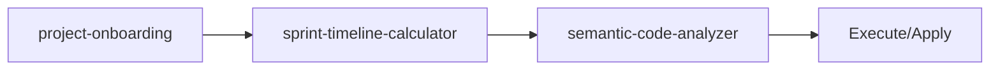

<!-- HEADER:START -->

<!-- HEADER:END -->

# Project Onboarding

> **Comprehensive project onboarding**

[](../../README.md)
[](./README.md#utilities)
[](../README.md)

**Complexity**: ⭐⭐ Moderate | **Category**: Utilities | **Time to Learn**: 15-30 minutes

---

## Overview

The `project-onboarding` tool scans a real project directory and generates comprehensive onboarding documentation. It automatically detects frameworks, dependencies, build scripts, and project structure to help developers quickly understand a new codebase.

### Key Capabilities

- Automatic project type detection (TypeScript, JavaScript, Python, Go, Rust, etc.)
- Framework identification (React, Vue, Express, Next.js, Django, etc.)
- Dependency extraction from package managers (npm, pip, cargo, go modules)
- Build script discovery (npm scripts, Makefile, etc.)
- Directory structure visualization
- Entry point detection

---

## When to Use

✅ **Good for:**

- Onboarding new developers to a codebase
- Documenting project structure and dependencies
- Understanding an unfamiliar project quickly
- Creating project overview documentation
- Generating memory entries for AI agent context

❌ **Not ideal for:**

- Real-time code execution analysis
- In-depth code quality assessment (use clean-code-scorer instead)
- Security auditing (use security-hardening-prompt-builder instead)

---

## Basic Usage

### Example 1: Quick Onboarding Scan

```typescript
// Basic onboarding scan of a project
const result = await callTool('project-onboarding', {
  projectPath: '/path/to/project',
});
```

### Example 2: Detailed Structure Analysis

```typescript
// Include detailed directory tree
const result = await callTool('project-onboarding', {
  projectPath: '/path/to/project',
  includeDetailedStructure: true,
});
```

### Example 3: Focused Analysis

```typescript
// Focus on specific areas
const result = await callTool('project-onboarding', {
  projectPath: '/path/to/project',
  includeDetailedStructure: true,
  focusAreas: ['dependencies', 'scripts', 'frameworks'],
});
```

---

## Parameters

| Parameter | Type | Required | Default | Description |
|-----------|------|----------|---------|-------------|
| `projectPath` | string | ✅ Yes | - | Path to the project directory to scan |
| `includeDetailedStructure` | boolean | No | `false` | Include detailed directory tree structure in output |
| `focusAreas` | array | No | All areas | Specific areas to focus on. Options: `dependencies`, `scripts`, `structure`, `frameworks` |
| `includeReferences` | boolean | No | `false` | Include external reference links in output |
| `includeMetadata` | boolean | No | `false` | Include metadata section in output |

---

## What You Get

The tool returns a comprehensive project onboarding document with:

1. **Project Overview** - Name, type, and root path
2. **Frameworks Detected** - Automatically identified frameworks with confidence levels
3. **Entry Points** - Main files where execution starts
4. **Dependencies** - Production and development dependencies with versions
5. **Available Scripts** - Build, test, and development scripts
6. **Directory Structure** - Visual tree representation (if requested)

### Output Structure

```markdown
# Project Onboarding: [Project Name]

**Type**: [Project Type]
**Root**: [Root Path]

## Frameworks Detected

- **React** 18.2.0 (confidence: high)
- **Express** 4.18.2 (confidence: high)

## Entry Points

- `src/index.ts`
- `src/server.ts`

## Dependencies (42)

### Production Dependencies

- react@18.2.0
- express@4.18.2
- zod@3.22.4
...

### Development Dependencies

- typescript@5.3.3
- vitest@1.0.4
- biome@1.4.0
...

## Available Scripts

- `npm run build`: tsc && npm run copy-assets
- `npm run test`: vitest
- `npm run dev`: tsc --watch
...

## Directory Structure (if includeDetailedStructure: true)

```
project-root
├── src
│   ├── index.ts
│   ├── tools
│   │   ├── prompt
│   │   └── analysis
│   └── domain
└── tests
    └── vitest
```
```

---

## Supported Project Types

The tool automatically detects and supports:

### JavaScript/TypeScript Ecosystem
- **Indicators**: `package.json`, `tsconfig.json`, `package-lock.json`
- **Frameworks**: React, Vue, Angular, Svelte, Next.js, Express, Nest.js, etc.
- **Scripts**: Extracted from `package.json` scripts section
- **Dependencies**: npm, yarn, pnpm

### Python Ecosystem
- **Indicators**: `pyproject.toml`, `requirements.txt`, `setup.py`, `Pipfile`
- **Frameworks**: Django, Flask, FastAPI, etc.
- **Dependencies**: pip, poetry, pipenv

### Go Ecosystem
- **Indicators**: `go.mod`, `go.sum`
- **Dependencies**: Go modules

### Rust Ecosystem
- **Indicators**: `Cargo.toml`, `Cargo.lock`
- **Dependencies**: Cargo

### Ruby Ecosystem
- **Indicators**: `Gemfile`, `Gemfile.lock`
- **Dependencies**: Bundler

### Other Languages
The tool can detect project structure even without specific package managers by analyzing file patterns and directory layout.

---

## Real-World Examples

### Example 1: TypeScript MCP Server

```typescript
const result = await callTool('project-onboarding', {
  projectPath: '/workspace/mcp-server',
  includeDetailedStructure: true,
  focusAreas: ['dependencies', 'scripts', 'frameworks'],
});
```

**Output Highlights**:
- Detected: TypeScript project with MCP server
- Frameworks: Model Context Protocol SDK
- Entry points: `src/index.ts`
- Scripts: 15+ npm scripts for build, test, quality checks
- Dependencies: 20 production, 30+ dev dependencies

### Example 2: Python Django Project

```typescript
const result = await callTool('project-onboarding', {
  projectPath: '/workspace/django-app',
  focusAreas: ['dependencies', 'frameworks'],
});
```

**Output Highlights**:
- Detected: Python project with Django
- Framework: Django 4.2
- Dependencies from requirements.txt
- Common Django scripts (migrate, runserver, etc.)

---

## Tips & Tricks

### 💡 Best Practices

1. **Start with Quick Scan** - Run without `includeDetailedStructure` first for overview
2. **Use Focus Areas** - Narrow down to specific areas to reduce output size
3. **Scan Project Root** - Always provide the actual project root path, not a subdirectory
4. **Generate Documentation** - Use output to create README or onboarding docs

### 🚫 Common Mistakes

- ❌ Scanning nested subdirectory → ✅ Scan from project root
- ❌ Requesting full structure for large projects → ✅ Use focusAreas to limit output
- ❌ Ignoring framework detection → ✅ Review detected frameworks for accuracy
- ❌ Manual dependency tracking → ✅ Let the tool extract from package files

### ⚡ Pro Tips

- Combine with `semantic-code-analyzer` for deeper code understanding
- Use `focusAreas: ['scripts']` to quickly find build/test commands
- Save output to create project documentation or README
- Use detected frameworks to guide tool selection (e.g., React → use React-specific tools)
- Check entry points to understand application startup flow

---

## Focus Areas Reference

### `dependencies`
- Lists production and development dependencies
- Shows version information
- Truncates long lists (shows first 20 production, 10 dev)
- Counts total dependencies

### `scripts`
- Extracts available scripts from package.json (Node.js) or equivalent
- Shows proper invocation command (e.g., `npm run build` for Node.js)
- For non-Node projects, shows raw commands

### `frameworks`
- Automatically detects common frameworks
- Reports confidence level (high, medium, low)
- Shows framework version when available

### `structure`
- Shows entry points (main files)
- Optionally includes detailed directory tree (with `includeDetailedStructure: true`)
- Visual tree representation for easy navigation

**Note**: If no `focusAreas` specified, all areas are included in the output.

---

## Related Tools

- **[sprint-timeline-calculator](./sprint-timeline-calculator.md)** - Sprint timelines and development cycles
- **[semantic-code-analyzer](./semantic-code-analyzer.md)** - Semantic code analysis

---

## Workflow Integration

### With Other Tools



1. **project-onboarding** - Comprehensive project onboarding
2. **sprint-timeline-calculator** - Sprint timelines and development cycles
3. **semantic-code-analyzer** - Semantic code analysis
4. Execute combined output with your AI model or apply changes

---

<details>
<summary><strong>📚 Related Documentation</strong></summary>

- [All Utilities Tools](./README.md#utilities)
- [AI Interaction Tips](../tips/ai-interaction-tips.md)

</details>

<sub>**MCP AI Agent Guidelines** • Licensed under [MIT](../../LICENSE) • [Disclaimer](../../DISCLAIMER.md) • [Contributing](../../CONTRIBUTING.md)</sub>

---

## Related Documentation

- [All Utilities Tools](./README.md#utilities)
- [AI Interaction Tips](../tips/ai-interaction-tips.md)

---

<!-- FOOTER:START -->

<!-- FOOTER:END -->
