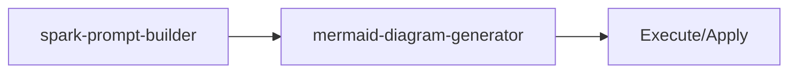

<!-- HEADER:START -->

<!-- HEADER:END -->

# Spark Prompt Builder

> **UI/UX product prompts**

[](../../README.md)
[](./README.md#prompt-builders)
[](../README.md)

**Complexity**: ⭐⭐⭐ Advanced | **Category**: Prompt Builders | **Time to Learn**: 1-2 hours

---

## Overview

The `spark-prompt-builder` features, colors, typography, animations, components.

### Key Capabilities

- Color scheme and palette definitions
- Typography and spacing rules
- Animation philosophy and hierarchy
- Component states and variations

---

## When to Use

✅ **Good for:**

- Complex tasks requiring detailed instructions
- Multi-step workflows with dependencies
- Standardizing prompt patterns across teams
- Generating consistent AI interactions

❌ **Not ideal for:**

- Simple, single-line questions
- Quick clarifications without context
- Tasks with obvious, minimal requirements

---

## Basic Usage

### Example 1: Basic Prompt Builders Task

```json
{
  "tool": "spark-prompt-builder",
  "title": "your-title-here",
  "summary": "your-summary-here",
  "complexityLevel": "your-complexity-level-here",
  "designDirection": "your-design-direction-here",
  "colorSchemeType": "your-color-scheme-type-here",
  "features": "your-features",
  "components": "your-components",
  "typography": "your-typography"
}
```

**Output**: Structured prompt builders output with:

- Color scheme and palette definitions
- Typography and spacing rules
- Animation philosophy and hierarchy

---

## Parameters

| Parameter | Type | Required | Default | Description |
|-----------|------|----------|---------|-------------|
| `title` | string | ✅ Yes | - | Document or prompt title |
| `summary` | string | ✅ Yes | - | Brief summary or overview |
| `complexityLevel` | string | ✅ Yes | - | Complexity Level parameter |
| `designDirection` | string | ✅ Yes | - | Design Direction parameter |
| `colorSchemeType` | string | ✅ Yes | - | Color Scheme Type parameter |
| `features` | string | No | - | Features parameter |
| `components` | string | No | - | Components parameter |
| `typography` | string | No | - | Typography parameter |
| `states` | string | No | - | States parameter |
| `edgeCases` | string | No | - | Edge Cases parameter |

---

## What You Get

The tool returns a structured prompt builders output with:

1. **Color** - Color scheme and palette definitions
2. **Typography** - Typography and spacing rules
3. **Animation** - Animation philosophy and hierarchy
4. **Component** - Component states and variations

### Output Structure

```markdown
## Spark Prompt Builder Output

### Summary
[High-level summary of analysis/output]

### Details
[Detailed content based on your inputs]

### Recommendations
[Actionable next steps]

### References (if enabled)
[Links to external resources]
```

---

## Real-World Examples

### Example 1: Code Review Workflow

```json
{
  "tool": "spark-prompt-builder",
  "title": "Example title value for code review workflow",
  "summary": "Example summary value for code review workflow",
  "complexityLevel": "Example complexityLevel value for code review workflow",
  "designDirection": "Example designDirection value for code review workflow",
  "colorSchemeType": "Example colorSchemeType value for code review workflow",
  "features": "example-value",
  "components": "example-value"
}
```

**Generated Output Excerpt**:

```markdown
## Code Review Workflow Results

### Summary
Analysis complete with actionable insights...

### Key Findings
1. [Finding 1 based on prompt builders analysis]
2. [Finding 2 with specific recommendations]
3. [Finding 3 with priority indicators]

### Next Steps
- Implement recommended changes
- Review and validate results
- Integrate into workflow
```

---

## Tips & Tricks

### 💡 Best Practices

1. **Be Specific in Goals** - Vague goals lead to vague outputs
2. **Prioritize Requirements** - Use keywords like CRITICAL, HIGH, NICE-TO-HAVE
3. **Define Success Criteria** - How will you know when it's done?
4. **Match Style to Use Case** - XML for complex structures, Markdown for readability

### 🚫 Common Mistakes

- ❌ Vague context → ✅ Be specific about the domain and constraints
- ❌ Too many requirements → ✅ Focus on top 3-5 critical ones
- ❌ Mixing goals → ✅ One clear objective per prompt
- ❌ Ignoring audience → ✅ Tailor detail level to expertise

### ⚡ Pro Tips

- Combine with related tools for comprehensive workflows
- Use `autoSelectTechniques: true` for optimal technique selection
- Enable `includePitfalls: true` for complex tasks

---

## Related Tools

- **[mermaid-diagram-generator](./mermaid-diagram-generator.md)** - Generate Mermaid diagrams

---

## Workflow Integration

### With Other Tools



1. **spark-prompt-builder** - UI/UX product prompts
2. **mermaid-diagram-generator** - Generate Mermaid diagrams
3. Execute combined output with your AI model or apply changes

---

<details>
<summary><strong>📚 Related Documentation</strong></summary>

- [All Prompt Builders Tools](./README.md#prompt-builders)
- [Prompting Hierarchy Guide](../tips/prompting-hierarchy.md)
- [Flow Prompting Examples](../tips/flow-prompting-examples.md)
- [AI Interaction Tips](../tips/ai-interaction-tips.md)

</details>

<sub>**MCP AI Agent Guidelines** • Licensed under [MIT](../../LICENSE) • [Disclaimer](../../DISCLAIMER.md) • [Contributing](../../CONTRIBUTING.md)</sub>

---

## Related Documentation

- [All Prompt Builders Tools](./README.md#prompt-builders)
- [Prompting Hierarchy Guide](../tips/prompting-hierarchy.md)
- [Flow Prompting Examples](../tips/flow-prompting-examples.md)
- [AI Interaction Tips](../tips/ai-interaction-tips.md)

---

<!-- FOOTER:START -->

<!-- FOOTER:END -->
