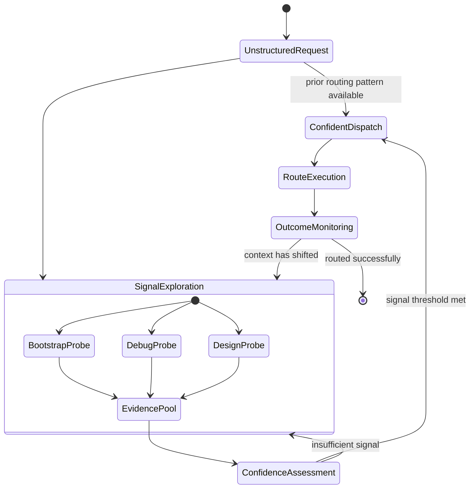
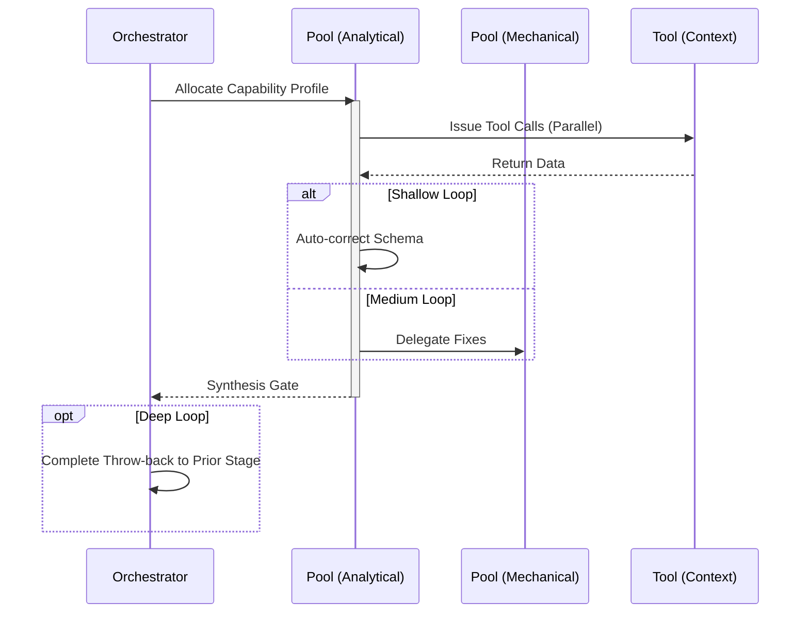

# Meta-Routing Workflow

## 1. Trigger & Intent
**Triggered by:** The absolute entry-point of any user interaction in the ecosystem.
**Intent:** Triage ambiguous, generic queries into the 20 structured master instructions without human input.

## 2. Resource Pooling
- **Routing today:** capability/profile-based via `orchestration.toml`; meta-routing defaults to the `meta_routing` profile (`classification` required, `low_latency` preferred, `fast_draft` fallback, fan-out 1).
- Low-latency classification requires speed, not deep-synthesis.

## 3. Required Skills
- `core-scope-clarification`
- `core-ambiguity-detection`

## 4. Input Constraints (Schema)
`zod.object({ request: zod.string(), context: zod.string().optional(), taskType: zod.string().optional(), currentPhase: zod.string().optional() })`

## 5. Decisions & Throw-Backs
- Checks if intent is clearly actionable. If missing architecture -> route to `bootstrap`.
- If explicit stack trace provided -> route directly to `debug`.
- If structural rewrite requested -> route to `design`.

## Success Chains

This workflow is a terminal node — it does not chain to other workflows on completion.

## 6. Mermaid FSM — *Exploration vs Exploitation (adapted: route-dispatch)*

## 7. Execution Sequence

