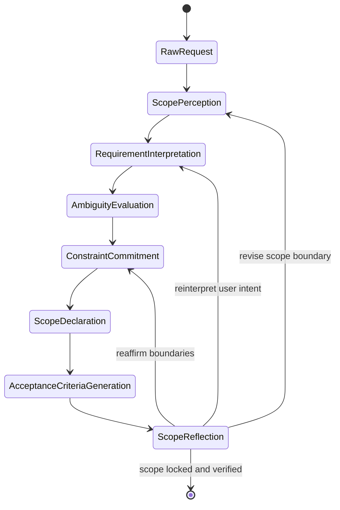
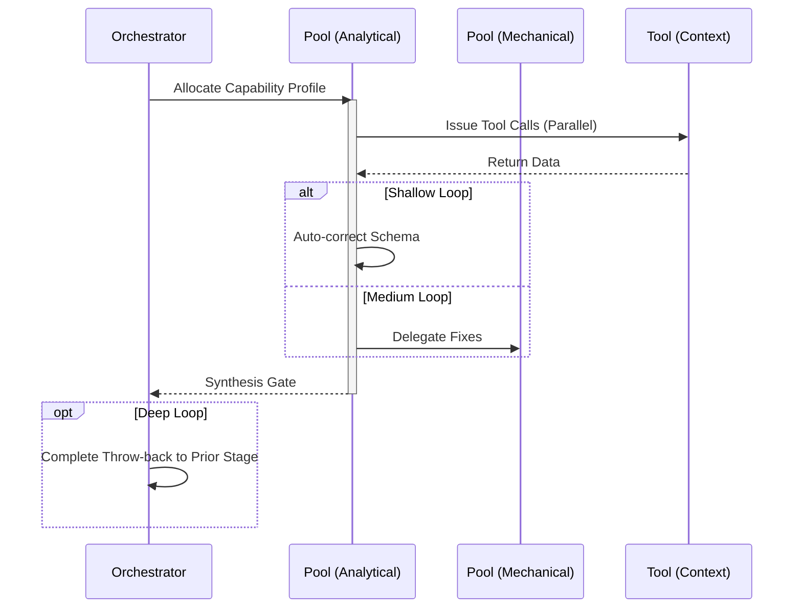

# Bootstrap Workflow

## 1. Trigger & Intent
**Triggered by:** `meta-routing` when a user request is greenfield or has an unclear scope.
**Intent:** Preemptively prevents scope creep and vague requirements by forcing a formal extraction and ambiguity detection phase before any code is written.

## 2. Resource Pooling
- **Routing today:** capability/profile-based via `orchestration.toml`; bootstrap-style work uses `bootstrap`/`elicitation` profiles that favor structured, cost-sensitive routing with `fast_draft` fallback.

## 3. Required Skills
- `core-scope-clarification`
- `core-requirements-analysis`
- `core-ambiguity-detection`

## 4. Input Constraints
`zod.object({ rawInput: zod.string(), constraints: zod.array(zod.string()).optional() })`

## 5. Decisions & Throw-Backs
If requirements conflict or are ambiguous, it loops back to the user to clarify. Only tightly scoped, bounded requirements exit the workflow.

## Success Chains

On successful completion, this workflow may chain to:

- **design**
- **implement**
- **research**
- **review**
- **plan**
- **debug**
- **refactor**
- **testing**
- **orchestrate**
- **govern**
- **enterprise**
- **physics-analysis**

## 6. Mermaid FSM — *Serial cognition with reflective interruption (adapted: scope clarification)*

## 7. Execution Sequence

