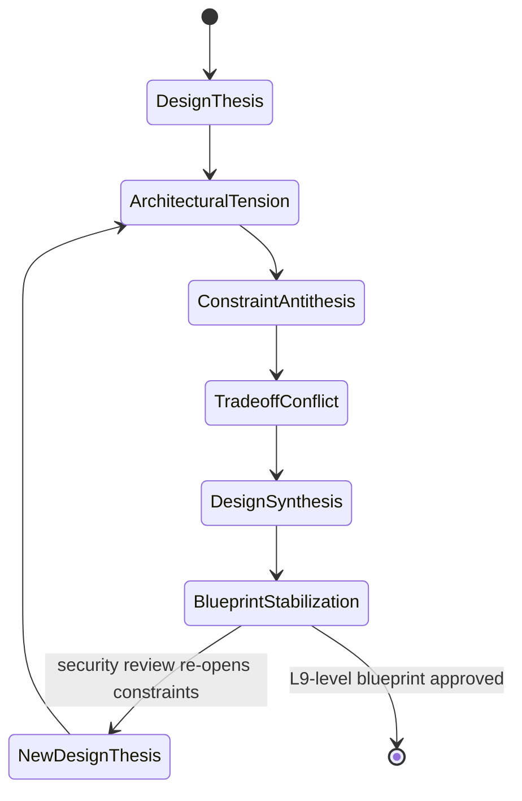
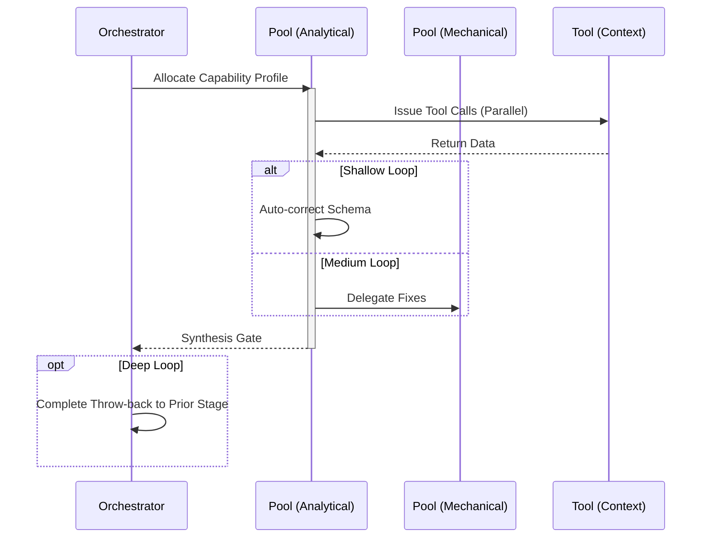

# Design / Architecture Workflow

## 1. Trigger & Intent
**Triggered by:** `bootstrap` or directly from user asking for system architecture, data models, or tradeoff analysis.
**Intent:** Formulates structural guarantees. Generates L9-level system blueprints without rushing into implementation.

## 2. Resource Pooling
- **Routing today:** capability/profile-based via `orchestration.toml`; design defaults to the `design` profile (`large_context` + `code_analysis` required, `synthesis` preferred, `cost_sensitive` fallback).

## 3. Required Skills
- `core-system-design`
- `core-tradeoff-analysis`
- `core-security-design`
- `adv-digital-enterprise-architect`

## 4. Input Constraints
`zod.object({ verifiedScope: zod.string(), targetScale: zod.enum(['local', 'enterprise', 'global']) })`

## 5. Decisions & Throw-Backs
Performs a build-vs-buy and tradeoff analysis. If the security design phase flags critical vulnerabilities, throws back to the tradeoff matrix. 

## Success Chains

On successful completion, this workflow may chain to:

- **implement**
- **govern**

## 6. Mermaid FSM — *Dialectical becoming (adapted: architecture design)*

## 7. Execution Sequence

