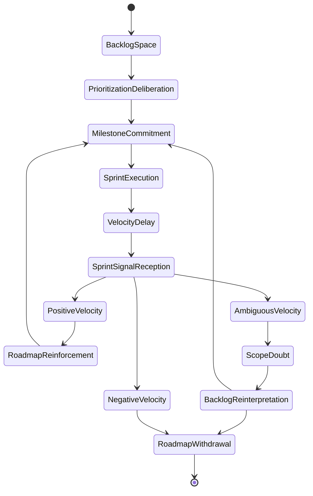
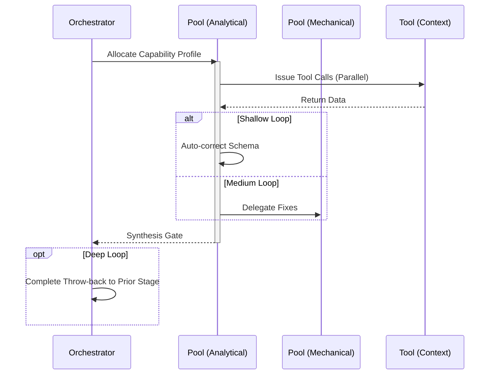

# Plan / Roadmap Workflow

## 1. Trigger & Intent
**Triggered by:** The user asking for a sprint plan, roadmap, prioritization matrix, or an organizational setup.
**Intent:** Produces a structured sequence of work blocks with explicit milestones. Prevents jumping into execution without a strategy.

## 2. Resource Pooling
- **Routing today:** capability/profile-based via `orchestration.toml`; planning aligns with the `strategy` profile (`large_context` + `structured_output` required, `cost_sensitive` preferred, fan-out 1).

## 3. Required Skills
- `core-strategy-advisor`
- `core-prioritization`
- `core-roadmap-planning`

## 4. Input Constraints
`zod.object({ goal: zod.string(), constraints: zod.array(zod.string()).optional(), horizon: zod.enum(['sprint', 'quarter', 'year']) })`

## 5. Decisions & Throw-Backs
If the work exceeds the current capability matrix, flags constraints. Throws to user if the prioritized list is out of budget.

## Success Chains

On successful completion, this workflow may chain to:

- **implement**
- **enterprise**
- **research**

## 6. Mermaid FSM — *Commitment under uncertainty with delayed consequence (adapted: roadmap planning)*

## 7. Execution Sequence

