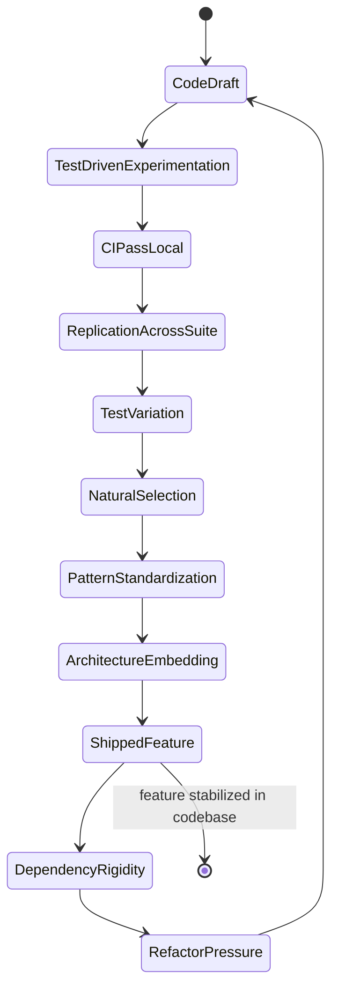
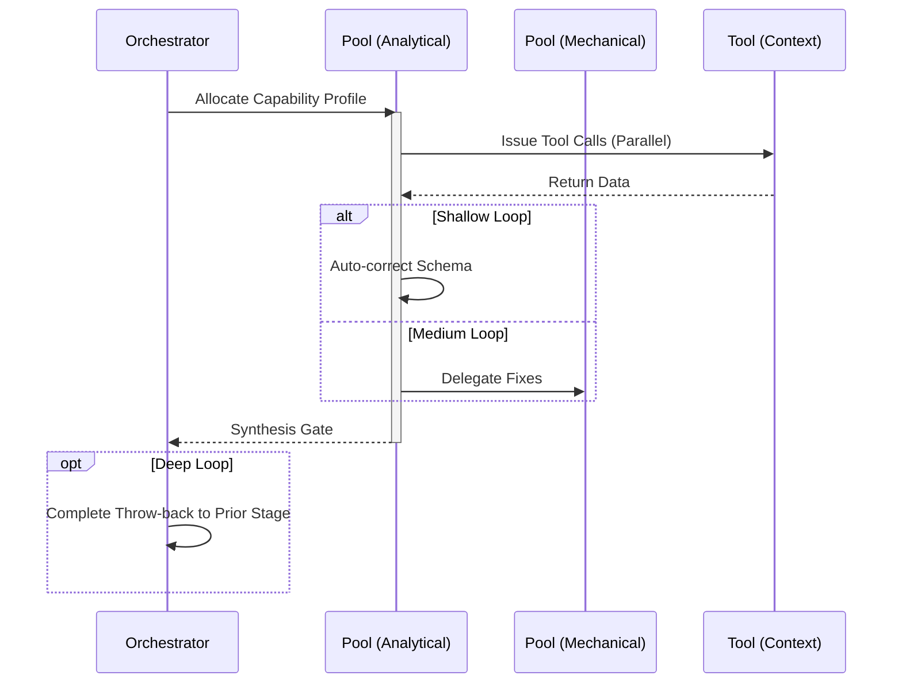

# Implementation Workflow

## 1. Trigger & Intent
**Triggered by:** `design` or `meta-routing` when a clear specification is present.
**Intent:** Writes deterministic, dependency-aware code with immediate test-driven guardrails.

## 2. Resource Pooling
- **Routing today:** capability/profile-based via `orchestration.toml`; implementation defaults to the `implement` profile (`code_analysis` + `structured_output` required, `cost_sensitive` preferred, `fast_draft` fallback, fan-out 2).

## 3. Required Skills
- `core-requirements-analysis`
- `qual-code-analysis`
- `arch-system`

## 4. Input Constraints
`zod.object({ specification: zod.string(), constraints: zod.array(zod.string()) })`

## 5. Decisions & Throw-Backs
Drafts code, generates an AST-level test suite. 
- If tests pass -> push to `Review`. 
- If tests fail -> silent auto-loop (Throw-back) 3 times before failing entirely and invoking `Resilient-Adapt`.

## Success Chains

On successful completion, this workflow may chain to:

- **testing**
- **review**

## 6. Mermaid FSM — *Institutionalization of innovation (adapted: feature build lifecycle)*

## 7. Execution Sequence

