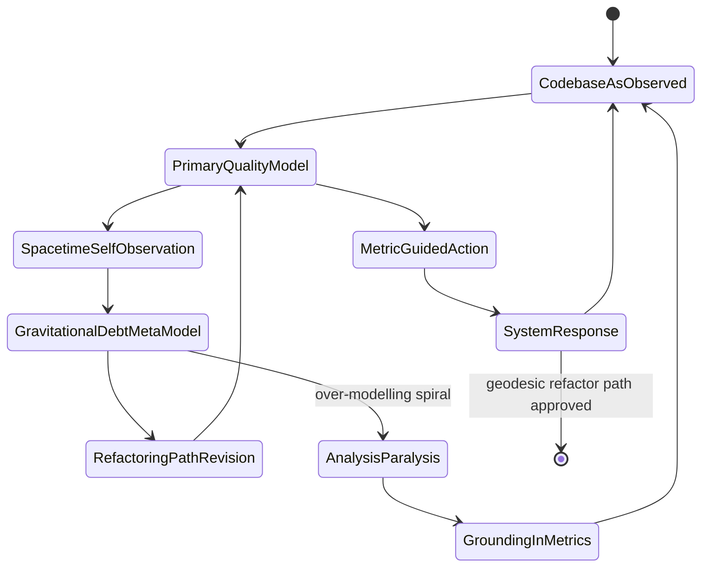
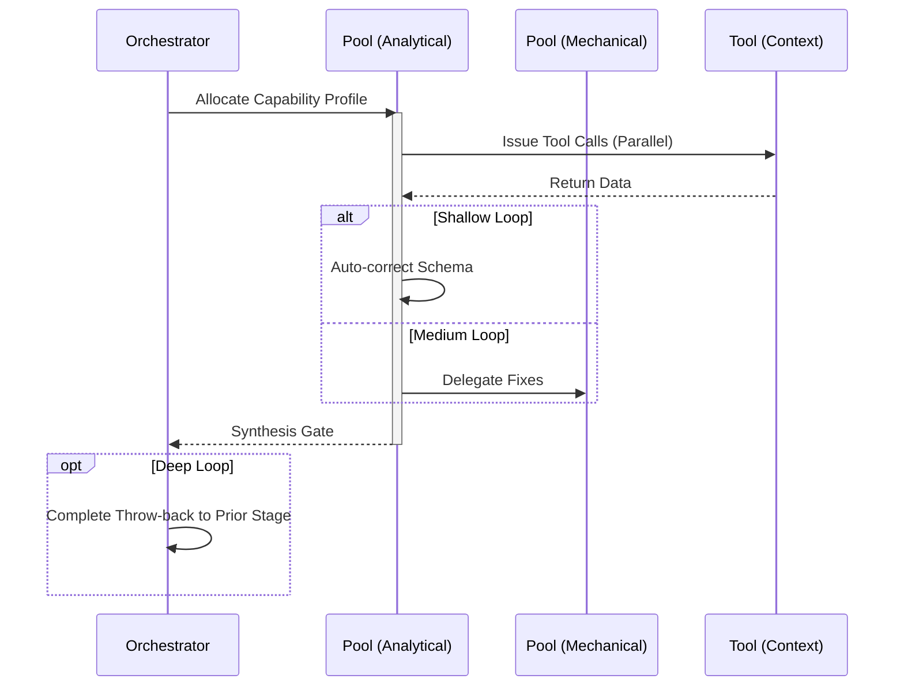

# Tech Debt & Physics Analysis Workflow

## 1. Trigger & Intent
**Triggered by:** The `qual-review` loop when standard cyclomatic complexity exceeds 80, or coupling metrics are breached.
**Intent:** Use high-end metaphors (QM/GR) to diagnose unmaintainable dependency webs without bias.

## 2. Resource Pooling
- **Routing today:** capability/profile-based via `orchestration.toml`; physics analysis uses the `physics_analysis` profile (`math_physics` + `deep_reasoning` required, no fallback configured, schema enforcement enabled).

## 3. Required Skills
- `gr-event-horizon-detector` (Identifying modules past the point of refactoring return)
- `qm-entanglement-mapper` (Detecting invisible coupling through co-change histories)
- `qm-heisenberg-picture` (Tracking non-commuting quality metrics)

## 4. Input Constraints
`zod.object({ targetPath: zod.string(), baselineAST: zod.any() })`

## 5. Decisions & Throw-Backs
Calculates 'spacetime debt' and proposes a 'geodesic refactoring' path. If the cost of the refactor is too high, throws the execution back to `strategy` to prioritize in the roadmap instead of proceeding.

## Success Chains

This workflow is a terminal node — it does not chain to other workflows on completion.

## 6. Mermaid FSM — *Recursive self-modeling (adapted: QM/GR tech-debt analysis)*

## 7. Execution Sequence

