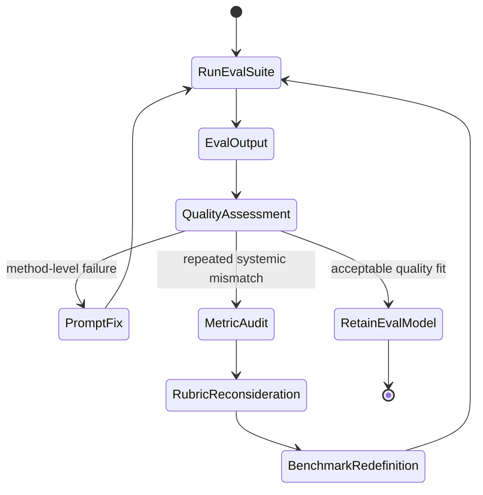
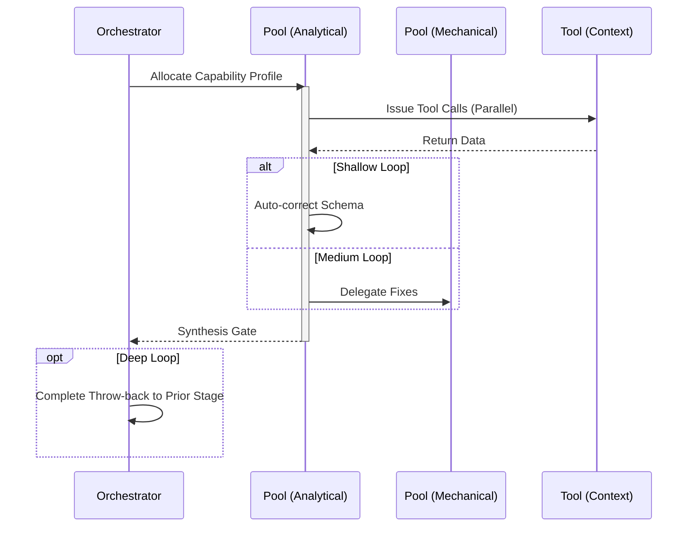

# Continuous Evaluation Workflow

## 1. Trigger & Intent
**Triggered by:** The `implement` workflow or a direct `eval` request against prompt templates.
**Intent:** Quantify the variance and accuracy of agent pipelines without human intervention. Benchmarks must be repeatable.

## 2. Resource Pooling
- **Routing today:** capability/profile-based via `orchestration.toml`; evaluation uses the `evaluation` profile (`structured_output` + `classification` required, `cost_sensitive` preferred, `fast_draft` fallback, fan-out 3), with tie-break/synthesis escalation handled by configured orchestration patterns.

## 3. Required Skills
- `core-prompt-evaluation`
- `core-variance-analysis`
- `adv-blind-comparison`

## 4. Input Constraints
`zod.object({ evalSuiteId: zod.string(), targetModel: zod.string() })`

## 5. Decisions & Throw-Backs
If performance degrades (variance increases, or score drops), throws an exception and routes back to `prompt-engineering` to refine templates. Evaluates output quality using A/B pairwise comparisons randomly generated.

## Success Chains

On successful completion, this workflow may chain to:

- **prompt-engineering**
- **refactor**
- **govern**

## 6. Mermaid FSM — *Double-loop learning with assumption revision (adapted: eval benchmarking)*

## 7. Execution Sequence

