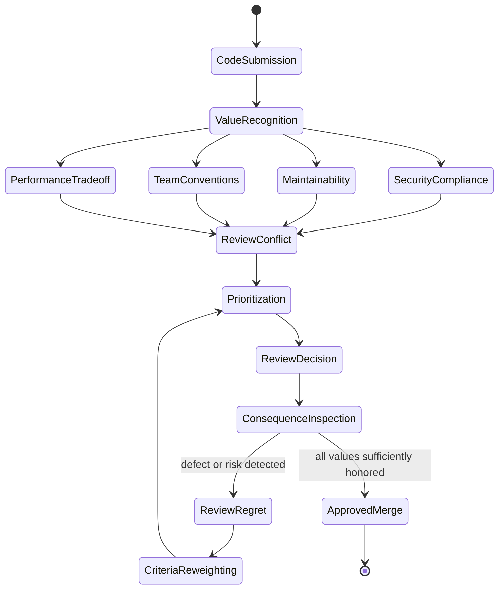
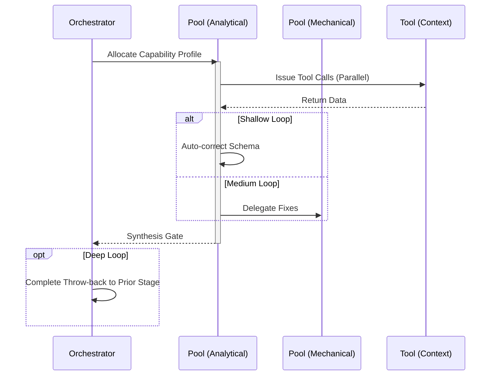

# Review Workflow

## 1. Trigger & Intent
**Triggered by:** A pull request, a completed `implement` step, or an explicit request to audit existing code.
**Intent:** Enforce L9-level quality, security, and performance gates before merging.

## 2. Resource Pooling
- **Routing today:** capability/profile-based via `orchestration.toml`; review work aligns with the `code_review` profile (`code_analysis` required, `structured_output` preferred, `fast_draft` fallback), with stronger review models selected by availability rules when needed.

## 3. Required Skills
- `core-quality-review`
- `core-security-review`
- `core-performance-review`

## 4. Input Constraints
`zod.object({ targetFiles: zod.array(zod.string()), reviewDepth: zod.enum(['standard', 'deep', 'adversarial']) })`

## 5. Decisions & Throw-Backs
If security review fails, instantly rejects the PR / draft and throws back to `implement`. Performance degradation throws back.

## Success Chains

On successful completion, this workflow may chain to:

- **govern**
- **refactor**
- **testing**

## 6. Mermaid FSM — *Ethical deliberation under conflicting goods (adapted: code review)*

## 7. Execution Sequence

