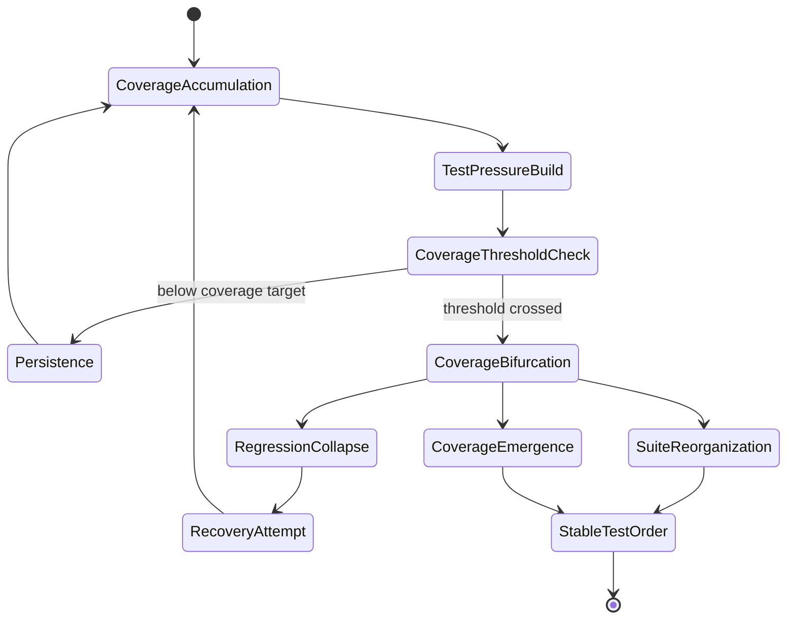
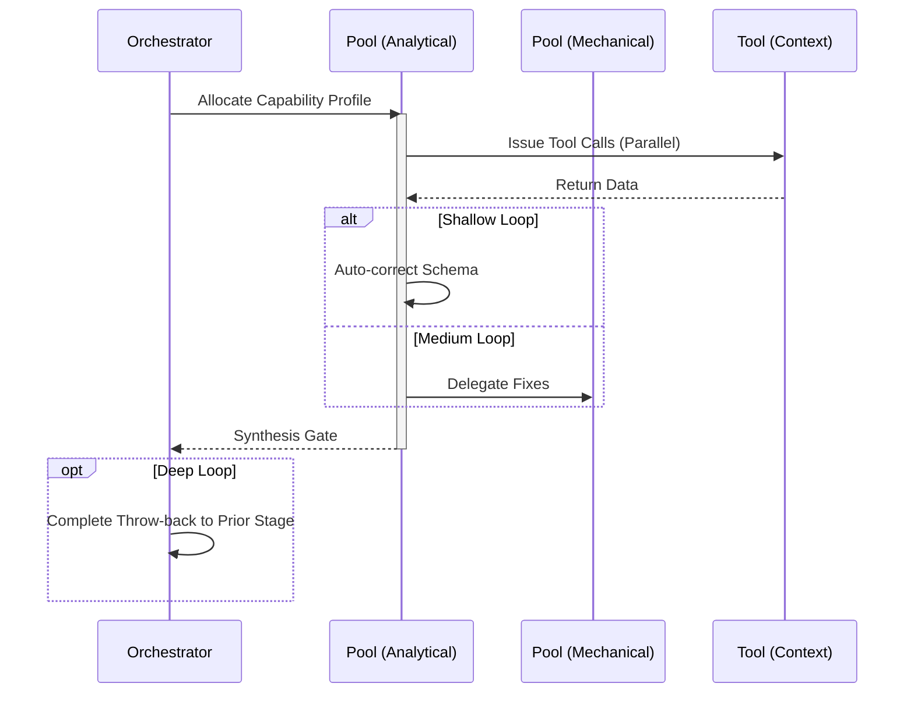

# Testing Workflow

## 1. Trigger & Intent
**Triggered by:** Completing `implement` or a request to shore up a module's tests.
**Intent:** Ensures that every new piece of work is regression-safe, building reliable infrastructure.

## 2. Resource Pooling
- **Routing today:** capability/profile-based via `orchestration.toml`; testing defaults to the `testing` profile (`code_analysis` + `structured_output` required, `cost_sensitive` preferred, `fast_draft` fallback).

## 3. Required Skills
- `core-eval-design`
- `core-reliability-design`

## 4. Input Constraints
`zod.object({ targetFiles: zod.array(zod.string()), testFramework: zod.string() })`

## 5. Decisions & Throw-Backs
If tests cannot cover logic -> throws to `refactor` (logic is untestable). Output must reach high test coverage.

## Success Chains

On successful completion, this workflow may chain to:

- **review**
- **debug**
- **evaluate**

## 6. Mermaid FSM — *Threshold crossing and bifurcation (adapted: test coverage gates)*

## 7. Execution Sequence

