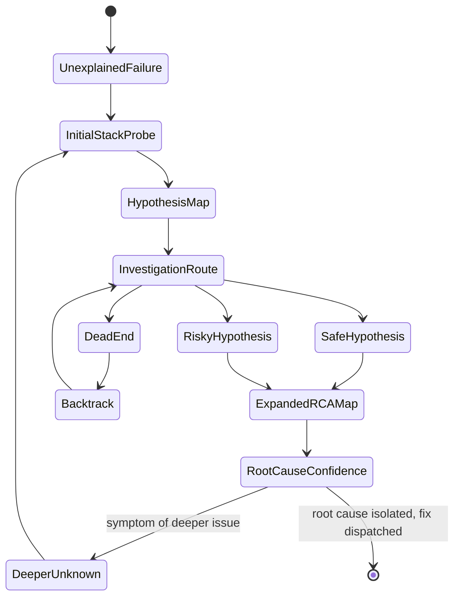
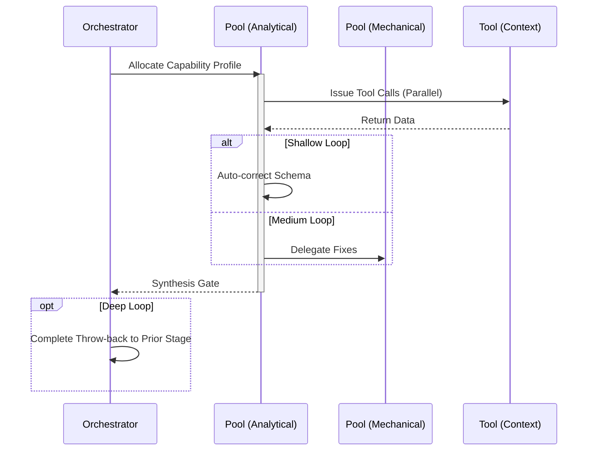

# Debug Workflow

## 1. Trigger & Intent
**Triggered by:** Explicit stack traces, failing CI/CD runs, or execution failures in `implement`.
**Intent:** Performs rigorous Root Cause Analysis (RCA) instead of blindly guessing fixes. 

## 2. Resource Pooling
- **Routing today:** capability/profile-based via `orchestration.toml`; debugging defaults to the `debugging` profile (`code_analysis` required, `cost_sensitive` preferred, `fast_draft` fallback).

## 3. Required Skills
- `core-debugging-assistant`
- `core-root-cause-analysis`
- `core-reproduction-planner`

## 4. Input Constraints
`zod.object({ stackTrace: zod.string().optional(), observedBehavior: zod.string(), expectedBehavior: zod.string() })`

## 5. Decisions & Throw-Backs
Attempts to write a minimal failing test case. If the bug cannot be reproduced, throws back asking for more environment context. Once RCA is found, routes directly to `implement`.

## Success Chains

On successful completion, this workflow may chain to:

- **testing**
- **refactor**
- **govern**

## 6. Mermaid FSM — *Exploration of the unknown with recursive map-making (adapted: root-cause analysis)*

## 7. Execution Sequence

