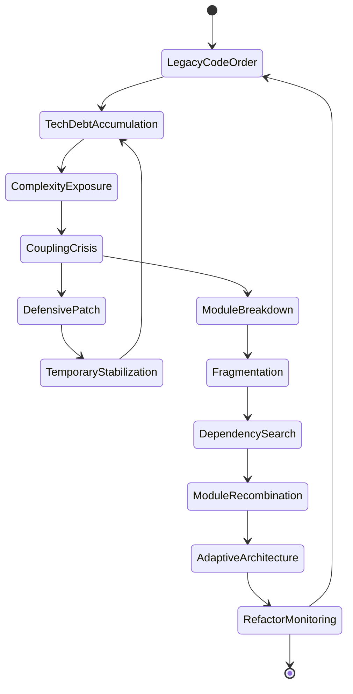
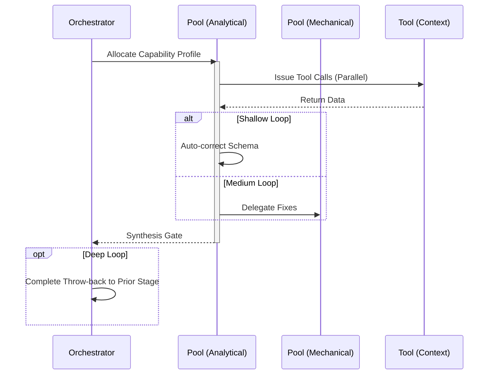

# Refactor Workflow

## 1. Trigger & Intent
**Triggered by:** `physics-analysis` or a user request to clean up technical debt.
**Intent:** Reduces complexity without changing observable functionality. Modifies AST safely.

## 2. Resource Pooling
- **Routing today:** capability/profile-based via `orchestration.toml`; refactoring defaults to the `refactor` profile (`code_analysis` required, `structured_output` preferred, `fast_draft` fallback).

## 3. Required Skills
- `core-refactoring-priority`
- `gr-geodesic-refactor`
- `gr-spacetime-debt-metric`

## 4. Input Constraints
`zod.object({ targetModules: zod.array(zod.string()), complexityTarget: zod.number().optional() })`

## 5. Decisions & Throw-Backs
Uses relativity metrics (spacetime-debt) to compute the cheapest cross-module refactoring path. Once written, throws to `testing`.

## Success Chains

On successful completion, this workflow may chain to:

- **testing**
- **review**

## 6. Mermaid FSM — *Crisis, collapse, and adaptive reassembly (adapted: tech-debt refactoring)*

## 7. Execution Sequence

