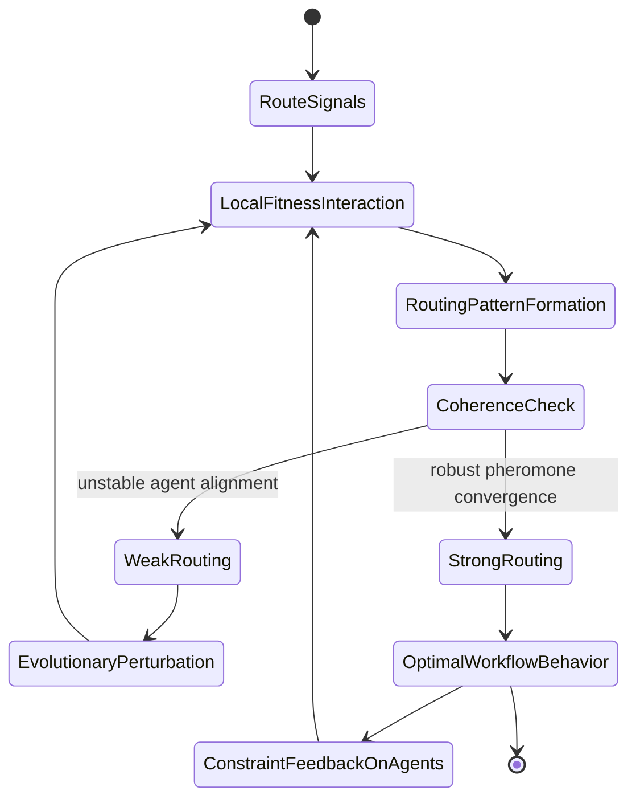
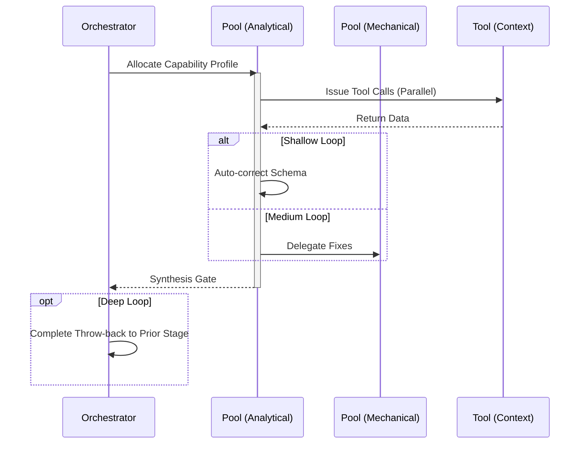

# Adapt Workflow

## 1. Trigger & Intent
**Triggered by:** Workflow efficiency degrading, or request to "self-optimize routing" and prune unused agent paths.
**Intent:** Mutates and reinforces good pathways dynamically without hardcoded modifications. Uses biological metaphors for adaptation.

## 2. Resource Pooling
- **Routing today:** capability/profile-based via `orchestration.toml`; adaptive work uses the `adaptive_routing` profile (`structured_output` required, `cost_sensitive` preferred, `fast_draft` fallback) and is gated by `ENABLE_ADAPTIVE_ROUTING=true`.

## 3. Required Skills
- `adv-aco-router`
- `adv-annealing-optimizer`
- `adv-clone-mutate`
- `adv-hebbian-router`
- `adv-physarum-router`
- `adv-quorum-coordinator`
- `adv-replay-consolidator`

## 4. Input Constraints
`zod.object({ executionLogs: zod.array(zod.any()), targetMetric: zod.string() })`

## 5. Decisions & Throw-Backs
If the simulated annealing optimizer finds a structurally better layout, auto-updates the routing config and tests it against benchmarks. If tests fail, throw back to the previous routing table.

## Success Chains

This workflow is a terminal node — it does not chain to other workflows on completion.

> **Precondition:** Requires `ENABLE_ADAPTIVE_ROUTING=true` environment variable.

## 6. Mermaid FSM — *Emergence from local interaction (adapted: bio-inspired adaptive routing)*

## 7. Execution Sequence

