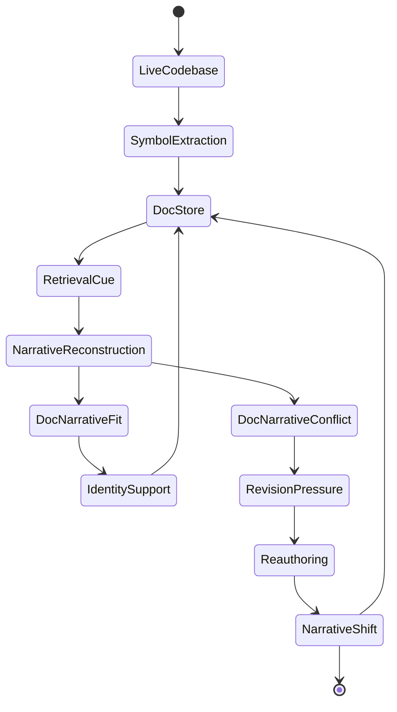
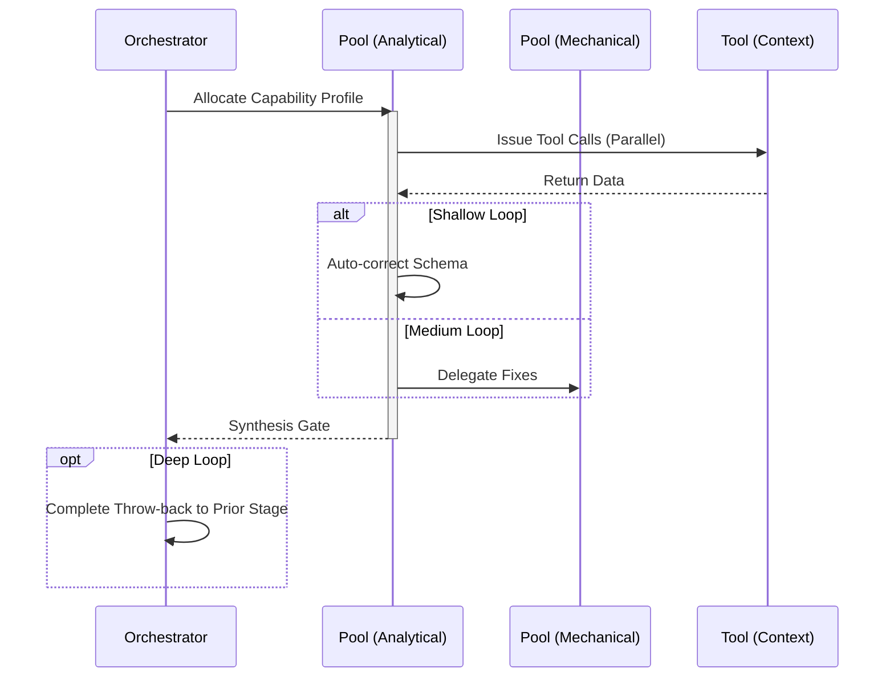

# Document Workflow

## 1. Trigger & Intent
**Triggered by:** A request to auto-document code, generate APIs, or write runbooks.
**Intent:** Ensures deep technical context is exposed for humans in predictable schemas without subjective fluff.

## 2. Resource Pooling
- **Routing today:** capability/profile-based via `orchestration.toml`; documentation uses the `documentation` profile (`fast_draft` required, `cost_sensitive` preferred, fan-out 3).

## 3. Required Skills
- `core-api-documentation`
- `core-documentation-generator`
- `core-readme-generator`
- `core-runbook-generator`

## 4. Input Constraints
`zod.object({ sourcePaths: zod.array(zod.string()), docType: zod.enum(['api', 'runbook', 'readme']) })`

## 5. Decisions & Throw-Backs
If the API docs fail schema-validation tests, throw back to `implement` to fix the underlying API. Code dictates docs.

## Success Chains

On successful completion, this workflow may chain to:

- **review**
- **enterprise**

## 6. Mermaid FSM — *Narrative identity through memory reconstruction (adapted: documentation generation)*

## 7. Execution Sequence

