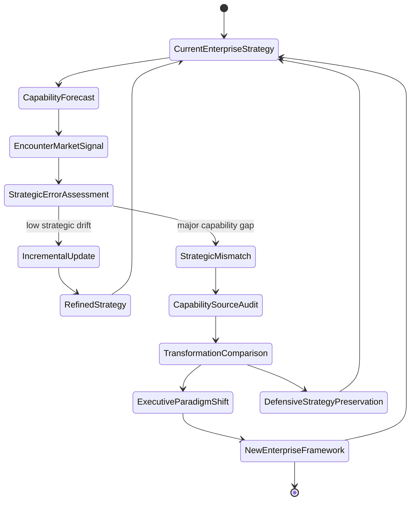
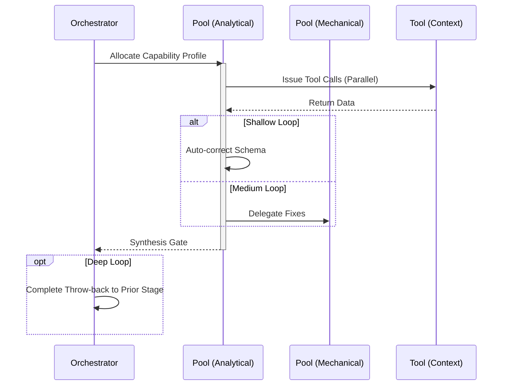

# Enterprise / Leadership Workflow

## 1. Trigger & Intent
**Triggered by:** Exec briefings, staff-level mentoring, or capability mappings at the organizational scale.
**Intent:** Provides distinguished-engineer perspective on AI strategy and ecosystem design without duck-tape legacy debt.

## 2. Resource Pooling
- **Routing today:** capability/profile-based via `orchestration.toml`; enterprise work uses the `enterprise` profile (`large_context` + `synthesis` required, `deep_reasoning` preferred, `cost_sensitive` fallback).

## 3. Required Skills
- `adv-capability-mapping`
- `adv-digital-enterprise-architect`
- `adv-executive-technical-briefing`
- `adv-l9-distinguished-engineer`
- `adv-staff-engineering-mentor`
- `adv-transformation-roadmap`
- `lead-software-evangelist`

## 4. Input Constraints
`zod.object({ orgData: zod.any(), scale: zod.string() })`

## 5. Decisions & Throw-Backs
Evangelist check: If any strategy retains legacy AI or "duck tape", throw back and refuse to sign off. Radical integration only.

## Success Chains

On successful completion, this workflow may chain to:

- **govern**
- **design**
- **plan**

## 6. Mermaid FSM — *Meta-learning engine of belief revision (adapted: enterprise AI strategy)*

## 7. Execution Sequence

