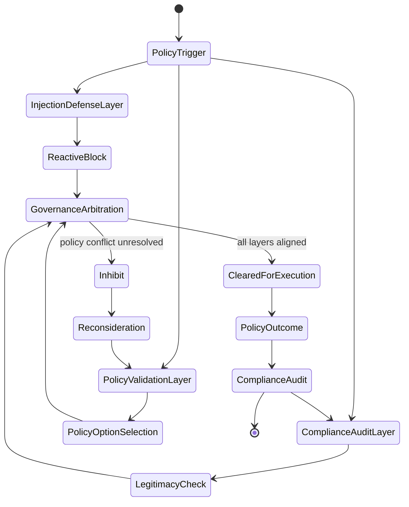
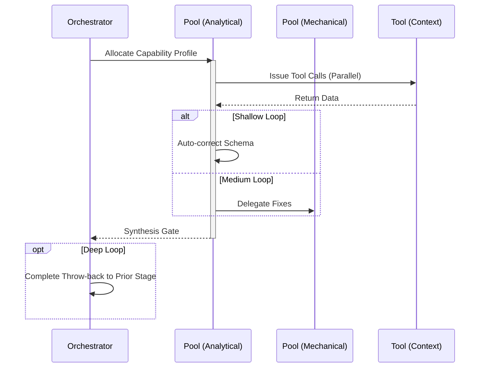

# Govern Workflow

## 1. Trigger & Intent
**Triggered by:** Compliance checks, prompt injection hardening, and safety validation for regulated workflows.
**Intent:** Strictly validates outputs against policy controls before letting them interact with sensitive systems.

## 2. Resource Pooling
- **Routing today:** capability/profile-based via `orchestration.toml`; governance uses the `governance` profile (`security_audit` + `adversarial` required, `deep_reasoning` preferred, human-in-the-loop required) and `gov-*` execution is gated by `ALLOW_GOVERNANCE_SKILLS=true`.

## 3. Required Skills
- `gov-data-guardrails`
- `gov-model-compatibility`
- `gov-model-governance`
- `gov-policy-validation`
- `gov-prompt-injection-hardening`
- `gov-regulated-workflow-design`
- `gov-workflow-compliance`

## 4. Input Constraints
`zod.object({ targetPipeline: zod.string(), policySchema: zod.string() })`

## 5. Decisions & Throw-Backs
If any PII, injection vulnerability, or policy violation is flagged by the adversarial tier, throw back to `design` or `implement` loudly.

## Success Chains

On successful completion, this workflow may chain to:

- **review**
- **resilience**
- **document**

## 6. Mermaid FSM — *Multi-level governance of action (adapted: AI safety and compliance)*

## 7. Execution Sequence

