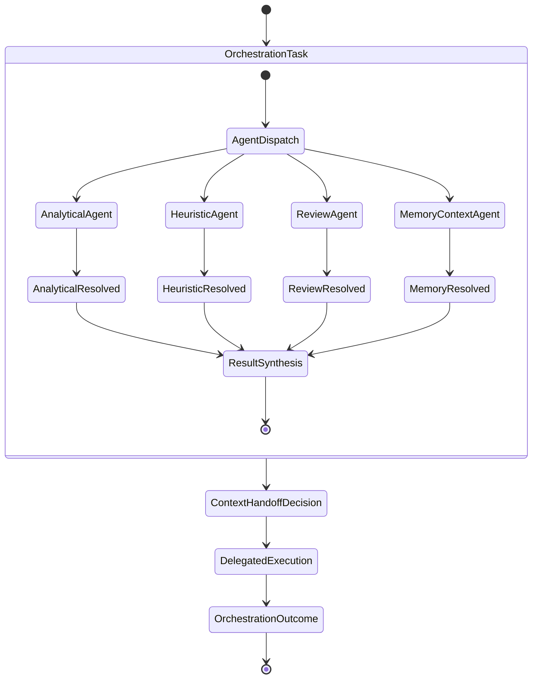
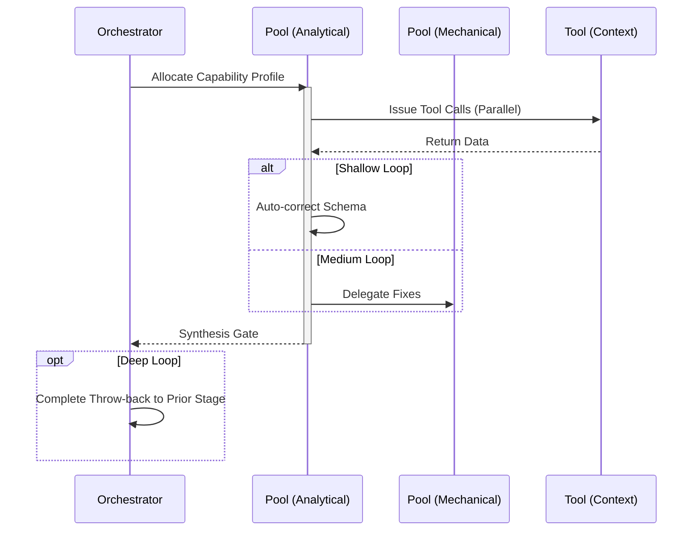

# Orchestrate Workflow

## 1. Trigger & Intent
**Triggered by:** The absolute entry point for designing multi-agent coordination. Not a task-execution command, but a framework designer.
**Intent:** Replaces single-threaded chains with advanced routing like Quorum or Membrane layouts. 

## 2. Resource Pooling
- **Routing today:** capability/profile-based via `orchestration.toml`; orchestration work uses the `orchestration` profile (`structured_output` + `large_context` required, `cost_sensitive` preferred, `fast_draft` fallback).

## 3. Required Skills
- `adv-membrane-orchestrator`
- `core-agent-orchestrator`
- `core-context-handoff`
- `core-delegation-strategy`
- `core-mode-switching`
- `core-multi-agent-design`
- `core-result-synthesis`
- `core-workflow-orchestrator`

## 4. Input Constraints
`zod.object({ agents: zod.array(zod.string()), sharedState: zod.any() })`

## 5. Decisions & Throw-Backs
If the membrane orchestrator identifies leaked context windows between unrelated agents, throw back to the `delegation-strategy` to encapsulate them correctly.

## Success Chains

On successful completion, this workflow may chain to:

- **evaluate**
- **resilience**

## 6. Mermaid FSM — *Parallel inner faculties competing for control (adapted: multi-agent coordination)*

## 7. Execution Sequence

