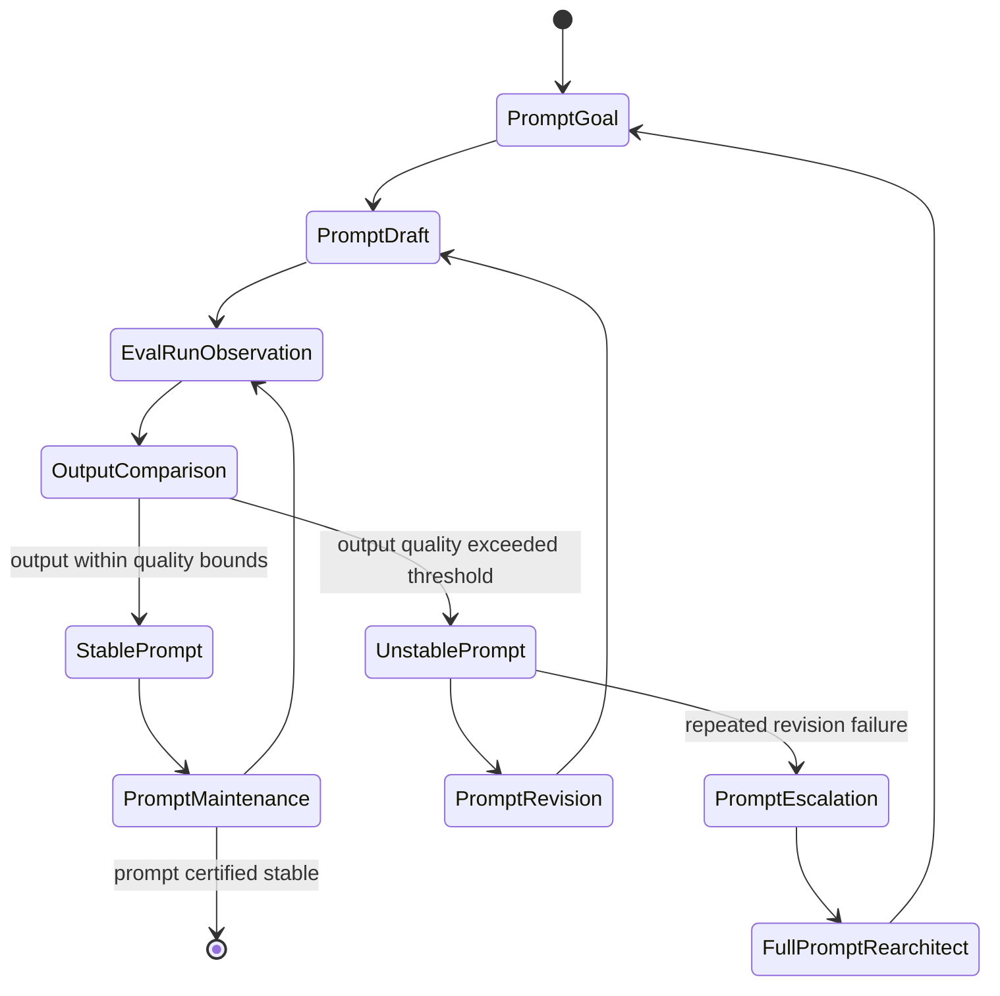
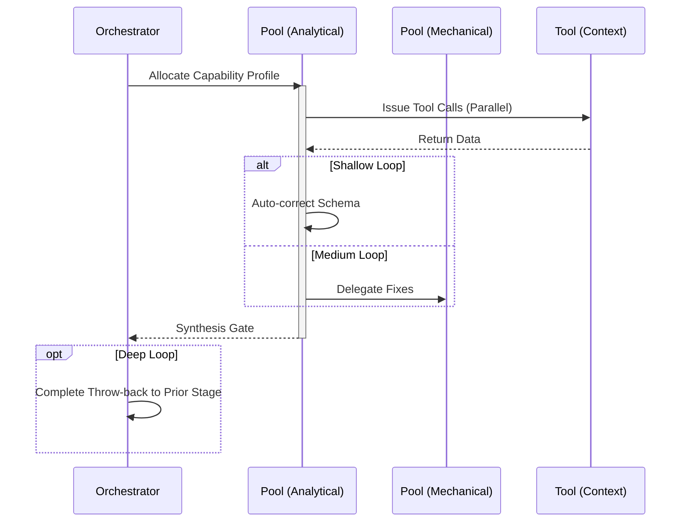

# Prompt Engineering Workflow

## 1. Trigger & Intent
**Triggered by:** Prompt hallucination reports from `eval` or requests to tune / build prompt templates.
**Intent:** Versions, evaluates, and iteratively improves templates mathematically against baselines. No blind string hacking.

## 2. Resource Pooling
- **Routing today:** capability/profile-based via `orchestration.toml`; prompt work uses the `prompt_engineering` profile (`structured_output` required, `cost_sensitive` preferred, `fast_draft` fallback, fan-out 2).

## 3. Required Skills
- `core-prompt-benchmarking`
- `core-prompt-chaining`
- `core-prompt-engineering`
- `core-prompt-evaluation`
- `core-prompt-hierarchy`
- `core-prompt-refinement`
- `core-output-grading`

## 4. Input Constraints
`zod.object({ baseTemplate: zod.string(), evalRubric: zod.string() })`

## 5. Decisions & Throw-Backs
Iterates blindly through `refinement` until the new prompt scores strictly higher than baseline on the `evalRubric`. Will throw away hundreds of prompts silently.

## Success Chains

On successful completion, this workflow may chain to:

- **evaluate**
- **govern**

## 6. Mermaid FSM — *Feedback system with stable and unstable regimes (adapted: prompt iteration)*

## 7. Execution Sequence

