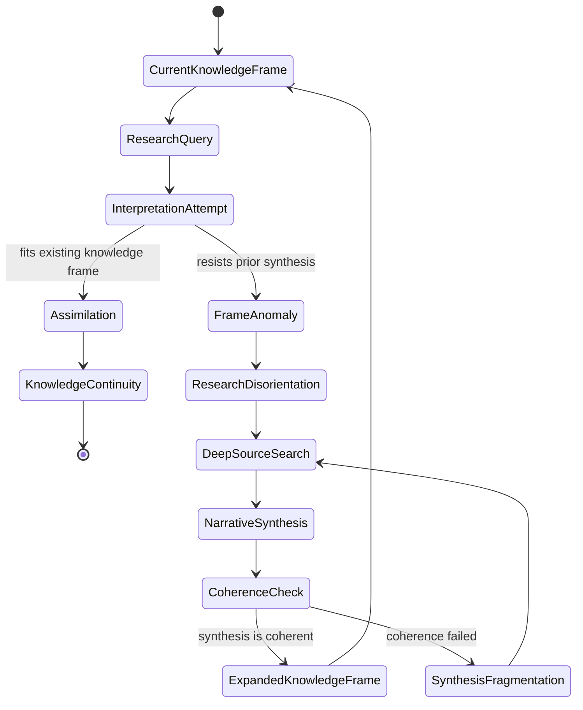
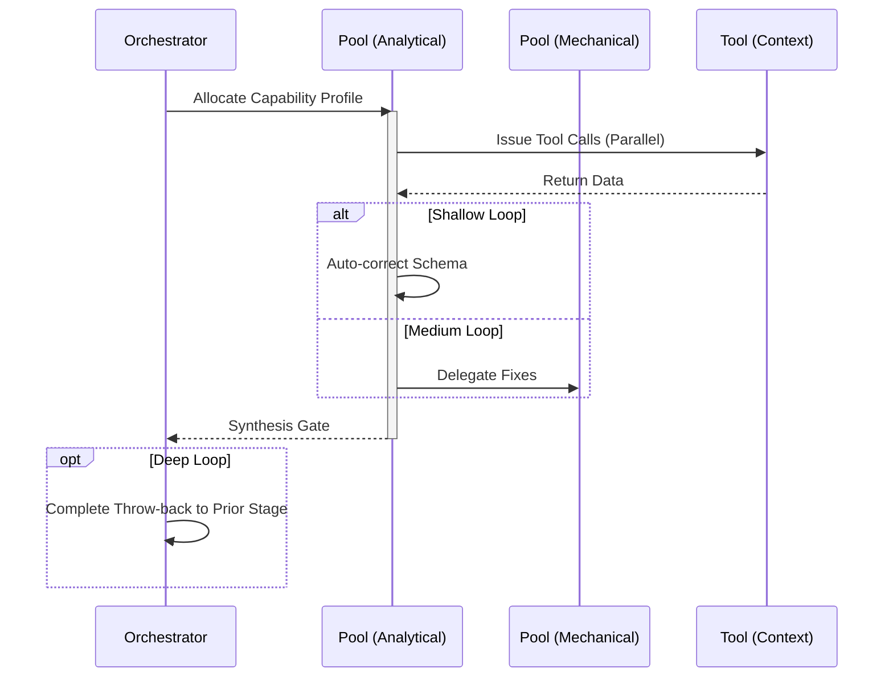

# Research Workflow

## 1. Trigger & Intent
**Triggered by:** Need to compare approaches, run a trade study, or synthesize scattered evidence before designing a module.
**Intent:** Ensures answers are derived from multiple sources without subjective confirmation bias. Uses the Triple Parallel fan-out.

## 2. Resource Pooling
- **Routing today:** capability/profile-based via `orchestration.toml`; research uses the `research` profile (`large_context` required, `cost_sensitive` preferred, `fast_draft` fallback, fan-out 3). The builtin `triple_parallel_synthesis` pattern fans out three lanes and reduces through a stronger synthesis profile.

## 3. Required Skills
- `core-comparative-analysis`
- `core-recommendation-framing`
- `core-research-assistant`
- `core-synthesis-engine`
- `core-tradeoff-analysis`

## 4. Input Constraints
`zod.object({ topic: zod.string(), constraints: zod.array(zod.string()) })`

## 5. Decisions & Throw-Backs
If the synthesis engine determines there's a hallucination or source conflict among the three mechanical inputs, throws back to research.

## Success Chains

On successful completion, this workflow may chain to:

- **plan**
- **design**
- **enterprise**

## 6. Mermaid FSM — *Meaning-making with breakdown and reconstruction (adapted: research synthesis)*

## 7. Execution Sequence

