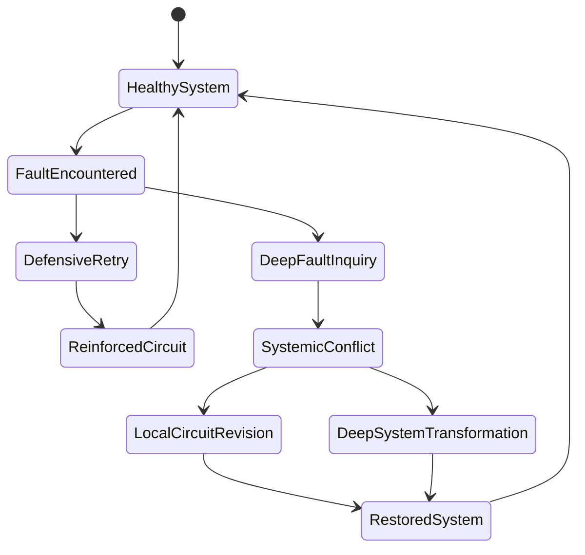
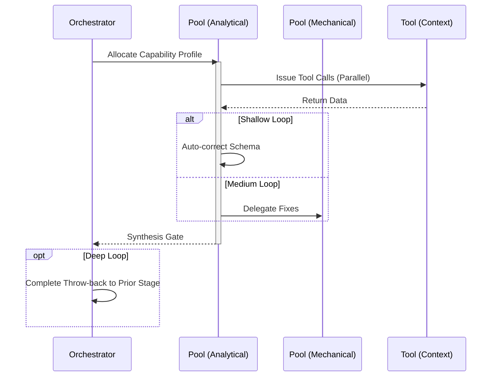

# Resilience Workflow

## 1. Trigger & Intent
**Triggered by:** Workflow flakiness, system hallucination reports, or requirements for high availability/reliability (H/A).
**Intent:** Injects fault tolerance intrinsically. Redundant voting and Homeostatic control modules.

## 2. Resource Pooling
- **Routing today:** capability/profile-based via `orchestration.toml`; resilience work uses the `resilience` profile (`structured_output` required, `cost_sensitive` preferred, `fast_draft` fallback).

## 3. Required Skills
- `adv-homeostatic-controller`
- `adv-redundant-voter`
- `core-incident-postmortem`

## 4. Input Constraints
`zod.object({ targetWorkflowId: zod.string(), setpoints: zod.any() })`

## 5. Decisions & Throw-Backs
Analyzes incident postmortems using redundant voting patterns to stabilize failing production graphs. If it fails permanently, triggers a silent degradation mode.

## Success Chains

On successful completion, this workflow may chain to:

- **govern**
- **evaluate**

## 6. Mermaid FSM — *Adaptive identity through repeated contradiction (adapted: fault tolerance and self-healing)*

## 7. Execution Sequence

