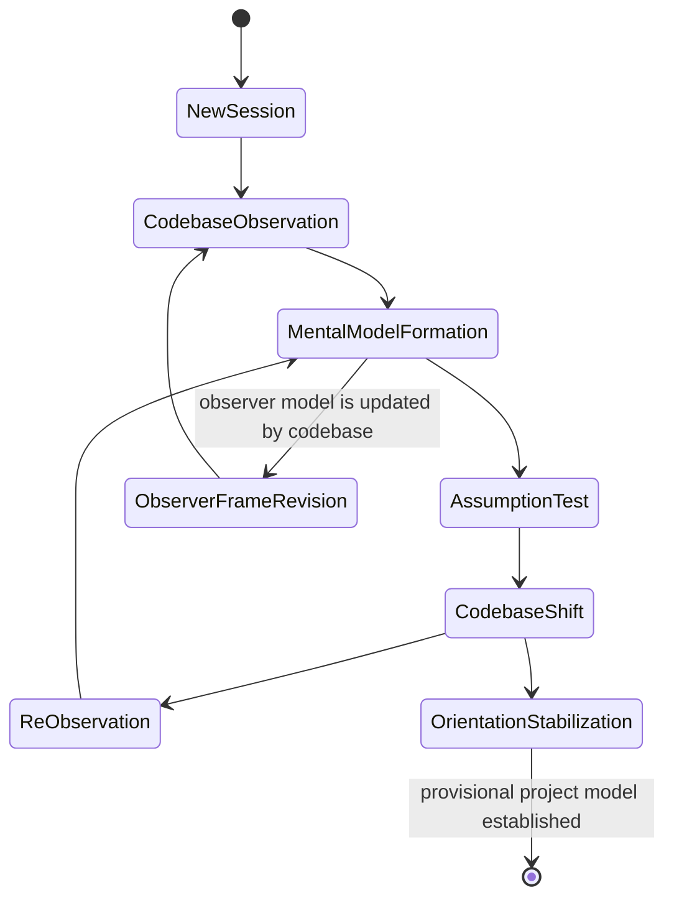
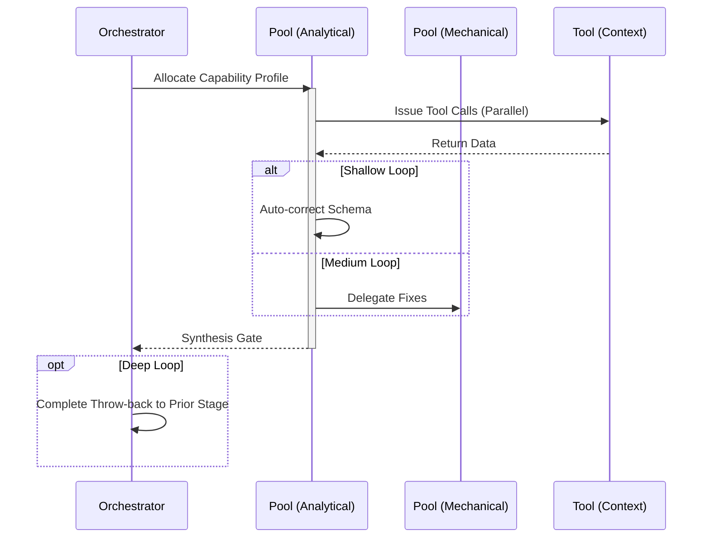

# Onboarding Workflow

## 1. Trigger & Intent
**Triggered by:** Start of a new session or encountering this architecture for the first time.
**Intent:** Auto-discovers the directory structure, loads the primary `.mcp-ai-agent-guidelines/config/orchestration.toml` config, and falls back to the builtin `src/config/orchestration-defaults.ts` bootstrap config only when no workspace file is available.

## 2. Resource Pooling
- **Routing today:** onboarding is primarily config discovery rather than a dedicated legacy tier; when model selection is needed it follows the same profile/capability routing and low-cost defaults as the rest of the system.

## 3. Required Skills
- `context7-mcp`
- `get-search-view-results`
- `summarize-github-issue-pr-notification`
- `suggest-fix-issue`
- `form-github-search-query`
- `show-github-search-result`
- `address-pr-comments`

## 4. Input Constraints
`zod.object({ initialContext: zod.string(), environment: zod.string() })`

## 5. Decisions & Throw-Backs
If the orchestration config schema is missing or invalid, throws immediately to `bootstrap` to fix the repo structure before interacting.

## Success Chains

This workflow is a terminal node — it does not chain to other workflows on completion.

## 6. Mermaid FSM — *Observer-system entanglement (adapted: project onboarding and exploration)*

## 7. Execution Sequence

