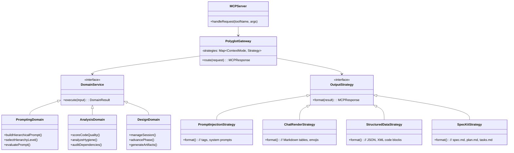

# v0.13.x Target Architecture

> **Vision**: Separate core domain logic from output strategies, enabling the same business logic to produce outputs optimized for different contexts (prompt injection, chat rendering, structured data, or SpecKit format).

## Architecture Diagram

## Key Components

### 1. MCPServer (Entry Point)
- Receives tool invocations from MCP clients
- Routes to PolyglotGateway for processing

### 2. PolyglotGateway (Orchestrator)
- Maintains mapping of context modes to output strategies
- Routes requests to appropriate domain services
- Selects output strategy based on request context

### 3. Domain Services (Core Logic)
Pure business logic separated from output concerns:

| Domain | Responsibilities |
|--------|------------------|
| **PromptingDomain** | Hierarchical prompts, level selection, prompt evaluation |
| **AnalysisDomain** | Code quality scoring, hygiene analysis, dependency auditing |
| **DesignDomain** | Session management, phase advancement, artifact generation |

### 4. Output Strategies (Context Modes)
Different formatting strategies for the same domain result:

| Strategy | Use Case | Output Format |
|----------|----------|---------------|
| **PromptInjectionStrategy** | System prompts | `<context>` tags, structured prompts |
| **ChatRenderStrategy** | User-facing chat | Markdown tables, emojis, rich formatting |
| **StructuredDataStrategy** | Programmatic use | JSON, XML code blocks |
| **SpecKitStrategy** | Specification docs | `spec.md`, `plan.md`, `tasks.md` |

## Design Principles

### Separation of Concerns
- Domain logic is **pure** - no formatting, no side effects
- Output strategies handle **all** presentation concerns
- Gateway routes based on **context mode** in request

### Extensibility
- New domain services can be added without changing gateway
- New output strategies can be added without changing domains
- Context modes are declarative and configurable

### Testability
- Domain services can be tested in isolation
- Output strategies can be tested with mock domain results
- Integration tests verify end-to-end flows

## Migration Path

1. **Phase 1**: Improve discoverability (current tools, better descriptions)
2. **Phase 2**: Extract domain logic from existing tools
3. **Phase 3**: Fix broken tools using new architecture
4. **Phase 4**: Integrate SpecKit as output strategy

---

*See [ADR-001](./adrs/ADR-001-polyglot-gateway.md) for detailed decision rationale*
