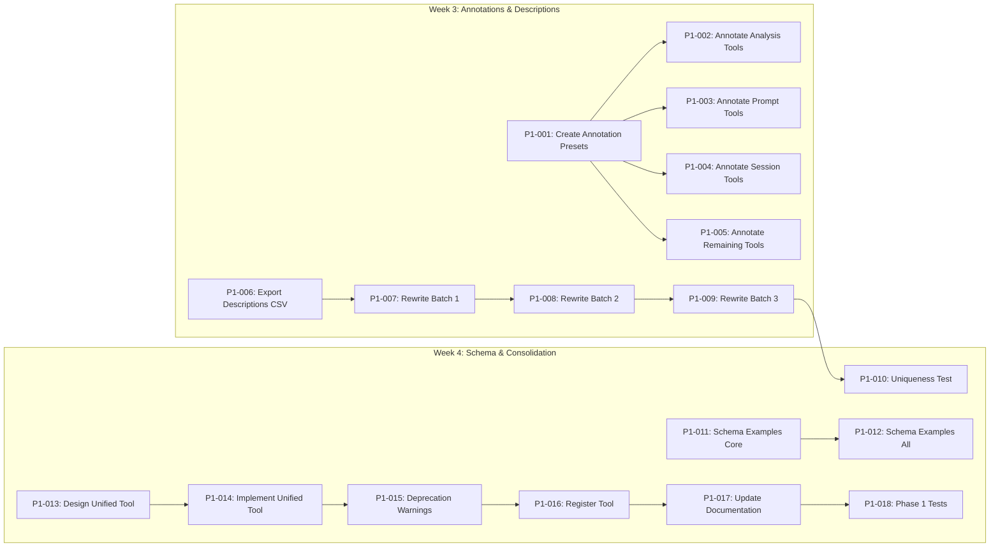

# 🎯 Epic: Phase 1 — LLM Tool Discoverability [serial]

> **Milestone**: M2: Discoverability (End Week 4)
> **Labels**: `phase-1`, `epic`, `copilot-suitable`
> **Duration**: 2 weeks (Week 3-4)

## Summary

Phase 1 addresses the **LLM Tool Discoverability Crisis** — the most impactful improvement with lowest effort. Currently, LLMs struggle to select the correct tool from 30+ available tools due to:
- Repetitive descriptions ("Use this MCP to...")
- Missing ToolAnnotations hints
- No schema examples
- Overlapping tool functionality

**Goal**: Make every tool immediately discoverable and correctly selectable by any LLM.

---

## Implementation Plan

| Order | Issue | Task ID | Priority | Execution | Assignee | Description               |
| ----- | ----- | ------- | -------- | --------- | -------- | ------------------------- |
| 1     | #699  | P1-001  | High     | Serial    | @copilot | Create Annotation Presets |
| 2     | #700  | P1-002  | High     | Parallel  | @copilot | Annotate Analysis Tools   |
| 3     | #701  | P1-003  | High     | Parallel  | @copilot | Annotate Prompt Tools     |
| 4     | #702  | P1-004  | High     | Parallel  | @copilot | Annotate Session Tools    |
| 5     | #703  | P1-005  | Medium   | Parallel  | @copilot | Annotate Remaining Tools  |
| 6     | #704  | P1-006  | Medium   | Parallel  | @copilot | Export Descriptions CSV   |
| 7     | #705  | P1-007  | High     | Serial    | @copilot | Rewrite Batch 1           |
| 8     | #706  | P1-008  | High     | Serial    | @copilot | Rewrite Batch 2           |
| 9     | #707  | P1-009  | Medium   | Serial    | @copilot | Rewrite Batch 3           |
| 10    | #708  | P1-010  | High     | Serial    | @copilot | Uniqueness Test           |
| 11    | #709  | P1-011  | High     | Parallel  | @copilot | Schema Examples Core      |
| 12    | #710  | P1-012  | Medium   | Parallel  | @copilot | Schema Examples All       |
| 13    | #711  | P1-013  | High     | Serial    | @copilot | Design Unified Tool       |
| 14    | #712  | P1-014  | High     | Serial    | @copilot | Implement Unified Tool    |
| 15    | #713  | P1-015  | Medium   | Serial    | @copilot | Deprecation Warnings      |
| 16    | #714  | P1-016  | High     | Serial    | @copilot | Register Tool             |
| 17    | #715  | P1-017  | Medium   | Serial    | @copilot | Update Documentation      |
| 18    | #716  | P1-018  | Medium   | Serial    | @copilot | Phase 1 Tests             |

---

## Dependency Graph

---

## Technical Summary

### Key Changes

1. **ToolAnnotations** (MCP 2024-11-05 spec)
   - Add to all 30+ tools in `src/index.ts`
   - Use presets: `ANALYSIS_TOOL`, `GENERATION_TOOL`, `SESSION_TOOL`, `FILESYSTEM_TOOL`

2. **Description Rewrite**
   - Template: `[ACTION] [WHAT] for [PURPOSE]. BEST FOR: [cases]. OUTPUTS: [format]`
   - First 10 words must be unique across all tools

3. **Schema Examples**
   - Add `.examples()` to all Zod schemas with required params
   - Examples must be realistic and diverse

4. **Tool Consolidation**
   - Merge 3 prompt tools → `prompt-hierarchy` with `mode` param
   - Add deprecation warnings to old tools

### Files Changed

| Category | Files                                                      |
| -------- | ---------------------------------------------------------- |
| Create   | `src/tools/shared/annotation-presets.ts`                   |
| Create   | `src/tools/prompt/prompt-hierarchy.ts`                     |
| Create   | `docs/api/prompt-hierarchy.md`                             |
| Create   | `tests/vitest/discoverability/unique-descriptions.spec.ts` |
| Modify   | `src/index.ts` (major changes)                             |
| Modify   | `src/schemas/*.ts` (add examples)                          |
| Modify   | `src/tools/prompt/*.ts` (deprecation warnings)             |

---

## Exit Criteria

- [ ] All 30+ tools have ToolAnnotations
- [ ] All tools have unique, action-oriented descriptions
- [ ] All required params have schema examples
- [ ] 3 prompt tools consolidated into `prompt-hierarchy`
- [ ] Uniqueness test passes in CI
- [ ] Test coverage remains ≥90%
- [ ] Manual verification: LLMs select correct tool 90%+ of time

---

## Success Metrics

| Metric                 | Before | Target |
| ---------------------- | ------ | ------ |
| Unique first-5-words   | ~40%   | 100%   |
| Tools with annotations | 0      | 30+    |
| Tools with examples    | ~10    | 30+    |
| Overlapping tools      | 3 sets | 0      |

---

## Related Documents

- [SPEC-002: Tool Harmonization](https://github.com/Anselmoo/mcp-ai-agent-guidelines/blob/development/plan-v0.13.x/specs/SPEC-002-tool-harmonization.md)
- [ADR-002: Tool Annotations Standard](https://github.com/Anselmoo/mcp-ai-agent-guidelines/blob/development/plan-v0.13.x/adrs/ADR-002-tool-annotations-standard.md)
- [TIMELINE: Phase 1](https://github.com/Anselmoo/mcp-ai-agent-guidelines/blob/development/plan-v0.13.x/TIMELINE.md#phase-1-discoverability-week-3-4)

---

## Notes for Copilot Agent

This epic is **highly suitable for Copilot agent** because:
- Well-scoped, atomic tasks
- Clear acceptance criteria
- File paths specified
- Code patterns provided in SPEC-002
- Tests verify correctness

**Recommended approach**:
1. Start with P1-001 (creates foundation)
2. Do P1-002 through P1-005 in parallel
3. Then sequential flow for descriptions and consolidation
