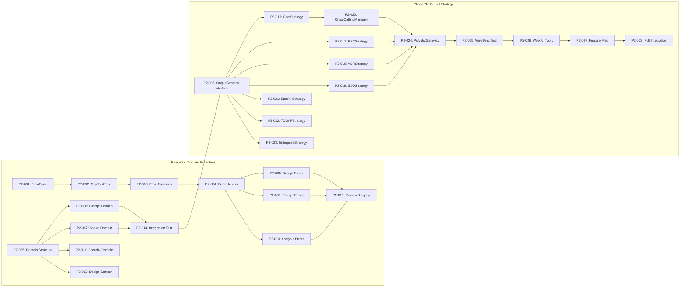

# 🎯 Epic: Phase 2 — Domain Extraction & Output Strategy [serial]

> **Milestone**: M3: Domain Layer (End Week 8)
> **Labels**: `phase-2`, `epic`, `human-required`
> **Duration**: 4 weeks (Week 5-8)

## Summary

Phase 2 is the **core architectural refactoring** — extracting pure domain logic from tools and implementing the OutputStrategy pattern. This enables:
- **Pure domain functions** that return structured data
- **7 output strategies** (Chat, RFC, ADR, SDD, SpecKit, TOGAF, Enterprise)
- **Cross-cutting capabilities** in any output format
- **Centralized error handling** via ErrorCode enum

**⚠️ Note**: This phase has the highest complexity. Some tasks may require human oversight even when assigned to Copilot.

---

## Implementation Plan

### Phase 2a: Domain Extraction (Week 5-6) — 14 Tasks

| Order | Issue | Task ID | Priority | Execution | Assignee | Description                        |
| ----- | ----- | ------- | -------- | --------- | -------- | ---------------------------------- |
| 1     | #TBD  | P2-001  | High     | Serial    | @copilot | Create ErrorCode enum              |
| 2     | #TBD  | P2-002  | High     | Serial    | @copilot | Create McpToolError class          |
| 3     | #TBD  | P2-003  | High     | Serial    | @copilot | Create error factory functions     |
| 4     | #TBD  | P2-004  | High     | Serial    | @copilot | Create central error handler       |
| 5     | #TBD  | P2-005  | High     | Parallel  | @copilot | Create domain layer structure      |
| 6     | #TBD  | P2-006  | High     | Parallel  | human    | Extract hierarchical-prompt domain |
| 7     | #TBD  | P2-007  | High     | Parallel  | human    | Extract clean-code-scorer domain   |
| 8     | #TBD  | P2-008  | High     | Serial    | human    | Migrate design-assistant errors    |
| 9     | #TBD  | P2-009  | Medium   | Parallel  | @copilot | Migrate prompt tools errors        |
| 10    | #TBD  | P2-010  | Medium   | Parallel  | @copilot | Migrate analysis tools errors      |
| 11    | #TBD  | P2-011  | Medium   | Parallel  | @copilot | Extract security-prompt domain     |
| 12    | #TBD  | P2-012  | High     | Serial    | human    | Extract design-session domain      |
| 13    | #TBD  | P2-013  | Low      | Serial    | @copilot | Remove legacy error classes        |
| 14    | #TBD  | P2-014  | High     | Serial    | @copilot | Domain layer integration test      |

### Phase 2b: Output Strategy (Week 7-8) — 14 Tasks

| Order | Issue  | Task ID | Priority | Execution | Assignee                            | Description                     |
| ----- | ------ | ------- | -------- | --------- | ----------------------------------- | ------------------------------- |
| 15    | #TBD   | P2-015  | High     | Serial    | human                               | Create OutputStrategy interface |
| 16    | #TBD   | P2-016  | High     | Serial    | @copilot                            | Implement ChatStrategy          |
| 17    | #TBD   | P2-017  | High     | Parallel  | @copilot                            | Implement RFCStrategy           |
| 18    | #TBD   | P2-018  | High     | Parallel  | @copilot                            | Implement ADRStrategy           |
| 19    | #TBD   | P2-019  | High     | Parallel  | @copilot                            | Implement SDDStrategy           |
| 20    | #TBD   | P2-020  | High     | Serial    | human                               | Implement CrossCuttingManager   |
| 21    | #TBD   | P2-021  | Medium   | Parallel  | @copilot                            | Implement SpecKitStrategy       |
| 22    | P2-022 | Medium  | Parallel | @copilot  | Implement TOGAFStrategy             |
| 23    | P2-023 | Medium  | Parallel | @copilot  | Implement EnterpriseStrategy        |
| 24    | P2-024 | High    | Serial   | human     | Implement PolyglotGateway           |
| 25    | P2-025 | High    | Serial   | @copilot  | Wire first tool to gateway          |
| 26    | P2-026 | Medium  | Parallel | @copilot  | Wire remaining tools                |
| 27    | P2-027 | Medium  | Serial   | @copilot  | Feature flag for strategy selection |
| 28    | P2-028 | High    | Serial   | @copilot  | Full integration test               |

---

## Dependency Graph



---

## Technical Summary

### New Directory Structure

```
src/
├── domain/                    # NEW: Pure business logic
│   ├── prompting/
│   │   ├── hierarchical-builder.ts
│   │   ├── security-builder.ts
│   │   └── types.ts
│   ├── analysis/
│   │   ├── code-scorer.ts
│   │   ├── hygiene-analyzer.ts
│   │   └── types.ts
│   └── design/
│       ├── session-manager.ts
│       ├── phase-workflow.ts
│       └── types.ts
├── strategies/                # NEW: Output formatting
│   ├── output-strategy.ts     # Interface + enums
│   ├── chat-strategy.ts
│   ├── rfc-strategy.ts
│   ├── adr-strategy.ts
│   ├── sdd-strategy.ts
│   ├── speckit-strategy.ts
│   ├── togaf-strategy.ts
│   ├── enterprise-strategy.ts
│   └── cross-cutting-manager.ts
├── gateway/                   # NEW: Request routing
│   └── polyglot-gateway.ts
└── tools/                     # Existing (thin wrappers)
    └── shared/
        ├── error-codes.ts     # NEW
        ├── error-factory.ts   # NEW
        └── error-handler.ts   # NEW
```

### Key Interfaces

```typescript
// OutputStrategy pattern
interface OutputStrategy {
  approach: OutputApproach;
  supports(crossCutting: CrossCuttingCapability[]): boolean;
  render(result: DomainResult, options: RenderOptions): OutputArtifacts;
}

// ErrorCode pattern
enum ErrorCode {
  VALIDATION_REQUIRED_MISSING = 1001,
  VALIDATION_SCHEMA_INVALID = 1002,
  // ...
}
```

---

## Exit Criteria

### Phase 2a (Week 6)
- [ ] ErrorCode enum with 6 categories
- [ ] McpToolError class with toResponse()
- [ ] All tools use handleToolError()
- [ ] 3+ domain functions extracted (prompt, scorer, design)
- [ ] Domain functions return structured types, not formatted strings

### Phase 2b (Week 8)
- [ ] OutputStrategy interface defined
- [ ] 7 strategies implemented
- [ ] CrossCuttingManager working
- [ ] PolyglotGateway routing requests
- [ ] At least 3 tools wired to gateway
- [ ] Feature flag for strategy selection

---

## Risk Mitigation

| Risk                         | Mitigation                                       |
| ---------------------------- | ------------------------------------------------ |
| Breaking existing tools      | Strangler Fig: new code alongside old            |
| Complex domain extraction    | Extract one function at a time, test immediately |
| Strategy interface too rigid | Start with ChatStrategy, iterate                 |
| Performance regression       | Benchmark before/after gateway                   |

---

## Related Documents

- [SPEC-001: Output Strategy Layer](https://github.com/Anselmoo/mcp-ai-agent-guidelines/blob/development/plan-v0.13.x/specs/SPEC-001-output-strategy-layer.md)
- [SPEC-003: Error Handling Refactor](https://github.com/Anselmoo/mcp-ai-agent-guidelines/blob/development/plan-v0.13.x/specs/SPEC-003-error-handling-refactor.md)
- [ADR-001: Output Strategy Pattern](https://github.com/Anselmoo/mcp-ai-agent-guidelines/blob/development/plan-v0.13.x/adrs/ADR-001-output-strategy-pattern.md)
- [ADR-003: Strangler Fig Migration](https://github.com/Anselmoo/mcp-ai-agent-guidelines/blob/development/plan-v0.13.x/adrs/ADR-003-strangler-fig-migration.md)
- [ADR-004: Error Code Enum](https://github.com/Anselmoo/mcp-ai-agent-guidelines/blob/development/plan-v0.13.x/adrs/ADR-004-error-code-enum.md)

---

## Notes for Implementation

**Human-required tasks** (marked above):
- P2-006, P2-007: Domain extraction requires understanding business logic
- P2-008: Complex tool with session state
- P2-012: Design session has intricate state management
- P2-015: Interface design sets foundation for all strategies
- P2-020: Cross-cutting is architecturally complex
- P2-024: Gateway orchestration

**Copilot-suitable tasks**:
- Error infrastructure (P2-001 to P2-004)
- Strategy implementations following pattern (P2-016 to P2-019)
- Wiring and tests (P2-025, P2-026, P2-028)
