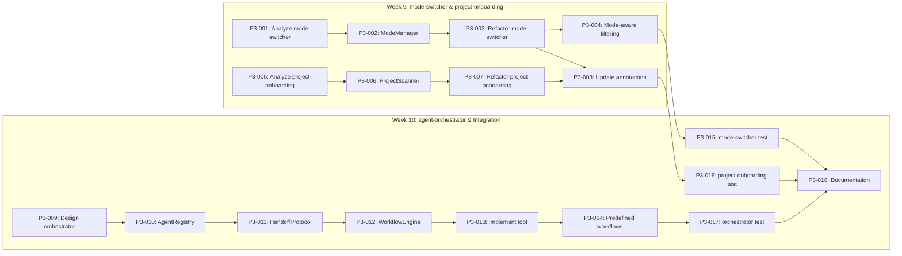

# 🎯 Epic: Phase 3 — Fix Broken Tools [serial]

> **Milestone**: M4: Tools Fixed (End Week 10)
> **Labels**: `phase-3`, `epic`, `human-required`
> **Duration**: 2 weeks (Week 9-10)

## Summary

Phase 3 fixes the **3 identified broken tools** that currently provide no real functionality:

1. **mode-switcher** — Returns guidance text but doesn't change agent state
2. **project-onboarding** — Generates generic docs, doesn't scan real projects
3. **agent-orchestrator** — Placeholder with no actual orchestration

These tools damage user trust when they fail silently. Fixing them is critical for v0.13.x credibility.

---

## Implementation Plan

### Week 9: mode-switcher & project-onboarding — 8 Tasks

| Order | Issue | Task ID | Priority | Execution | Assignee | Description                              |
| ----- | ----- | ------- | -------- | --------- | -------- | ---------------------------------------- |
| 1     | #TBD  | P3-001  | High     | Serial    | @copilot | Analyze mode-switcher current state      |
| 2     | #TBD  | P3-002  | High     | Serial    | human    | Implement ModeManager singleton          |
| 3     | #TBD  | P3-003  | High     | Serial    | @copilot | Refactor mode-switcher tool              |
| 4     | #TBD  | P3-004  | Medium   | Serial    | @copilot | Add mode-aware tool filtering            |
| 5     | #TBD  | P3-005  | High     | Parallel  | @copilot | Analyze project-onboarding current state |
| 6     | #TBD  | P3-006  | High     | Serial    | human    | Implement ProjectScanner service         |
| 7     | #TBD  | P3-007  | High     | Serial    | @copilot | Refactor project-onboarding tool         |
| 8     | #TBD  | P3-008  | Medium   | Serial    | @copilot | Update ToolAnnotations for fixed tools   |

### Week 10: agent-orchestrator & Integration — 10 Tasks

| Order | Issue | Task ID | Priority | Execution | Assignee | Description                            |
| ----- | ----- | ------- | -------- | --------- | -------- | -------------------------------------- |
| 9     | #TBD  | P3-009  | High     | Serial    | human    | Design agent orchestrator architecture |
| 10    | #TBD  | P3-010  | High     | Serial    | human    | Implement AgentRegistry                |
| 11    | #TBD  | P3-011  | High     | Serial    | human    | Implement HandoffProtocol              |
| 12    | #TBD  | P3-012  | High     | Serial    | @copilot | Implement WorkflowEngine               |
| 13    | #TBD  | P3-013  | High     | Serial    | @copilot | Implement agent-orchestrator tool      |
| 14    | #TBD  | P3-014  | High     | Serial    | @copilot | Add predefined workflows               |
| 15    | #TBD  | P3-015  | Medium   | Serial    | @copilot | Integration test: mode-switcher        |
| 16    | #TBD  | P3-016  | Medium   | Serial    | @copilot | Integration test: project-onboarding   |
| 17    | #TBD  | P3-017  | Medium   | Serial    | @copilot | Integration test: agent-orchestrator   |
| 18    | #TBD  | P3-018  | High     | Serial    | @copilot | Phase 3 documentation                  |

---

## Dependency Graph



---

## Technical Summary

### mode-switcher Fix

**Problem**: Returns text like "To switch to editing mode, use..." but doesn't actually track or change mode.

**Solution**:
```typescript
// src/tools/shared/mode-manager.ts
class ModeManager {
  private static instance: ModeManager;
  private currentMode: AgentMode = 'planning';

  static getInstance(): ModeManager { /* singleton */ }
  getCurrentMode(): AgentMode { return this.currentMode; }
  setMode(mode: AgentMode): void { this.currentMode = mode; }
  getToolsForMode(mode: AgentMode): string[] { /* tool filtering */ }
}
```

### project-onboarding Fix

**Problem**: Generates generic documentation, doesn't read actual project files.

**Solution**:
```typescript
// src/tools/bridge/project-scanner.ts
class ProjectScanner {
  async scan(projectPath: string): Promise<ProjectStructure> {
    // Actually read file system
    const packageJson = await this.readPackageJson(projectPath);
    const tsconfig = await this.readTsconfig(projectPath);
    const structure = await this.scanDirectory(projectPath);
    return { packageJson, tsconfig, structure };
  }
}
```

### agent-orchestrator Fix

**Problem**: Placeholder tool with minimal implementation.

**Solution**: Full implementation based on [SPEC-004](https://github.com/Anselmoo/mcp-ai-agent-guidelines/blob/development/plan-v0.13.x/specs/SPEC-004-agent-handoffs.md):
- Agent registration via `AgentRegistry`
- Handoff protocol for agent-to-agent communication
- Workflow engine for multi-step processes
- Predefined workflows (CODE_REVIEW_WORKFLOW, DESIGN_TO_SPEC_WORKFLOW)

---

## Exit Criteria

- [ ] mode-switcher actually tracks and changes mode state
- [ ] Mode persists across tool calls within session
- [ ] project-onboarding scans real directory structures
- [ ] project-onboarding reads actual package.json, tsconfig.json
- [ ] agent-orchestrator supports agent registration
- [ ] agent-orchestrator executes predefined workflows
- [ ] All 3 tools have passing integration tests
- [ ] ToolAnnotations reflect actual behavior
- [ ] Documentation updated for all fixed tools

---

## Success Metrics

| Tool               | Before                | After                       |
| ------------------ | --------------------- | --------------------------- |
| mode-switcher      | Returns guidance text | Actually changes mode state |
| project-onboarding | Generic output        | Project-specific analysis   |
| agent-orchestrator | Placeholder           | Full workflow execution     |

---

## Related Documents

- [SPEC-002: Tool Harmonization](https://github.com/Anselmoo/mcp-ai-agent-guidelines/blob/development/plan-v0.13.x/specs/SPEC-002-tool-harmonization.md)
- [SPEC-003: Error Handling Refactor](https://github.com/Anselmoo/mcp-ai-agent-guidelines/blob/development/plan-v0.13.x/specs/SPEC-003-error-handling-refactor.md)
- [SPEC-004: Agent Handoffs](https://github.com/Anselmoo/mcp-ai-agent-guidelines/blob/development/plan-v0.13.x/specs/SPEC-004-agent-handoffs.md)
- [TODOS.md](https://github.com/Anselmoo/mcp-ai-agent-guidelines/blob/development/plan-v0.13.x/BACKGROUND.md) — Original broken tool identification

---

## Notes for Implementation

**Human-required tasks**:
- P3-002: ModeManager is architectural (state management pattern)
- P3-006: ProjectScanner needs file system expertise
- P3-009, P3-010, P3-011: Agent orchestration is complex architecture

**Copilot-suitable tasks**:
- Analysis tasks (P3-001, P3-005)
- Refactoring with clear patterns (P3-003, P3-007)
- Tests (P3-015 through P3-017)
- Documentation (P3-018)
