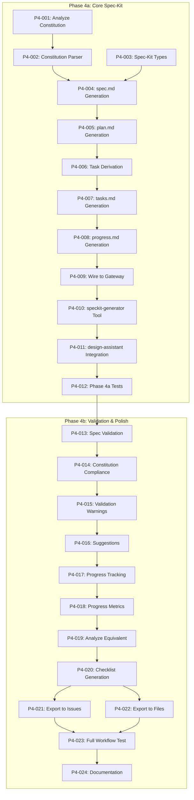
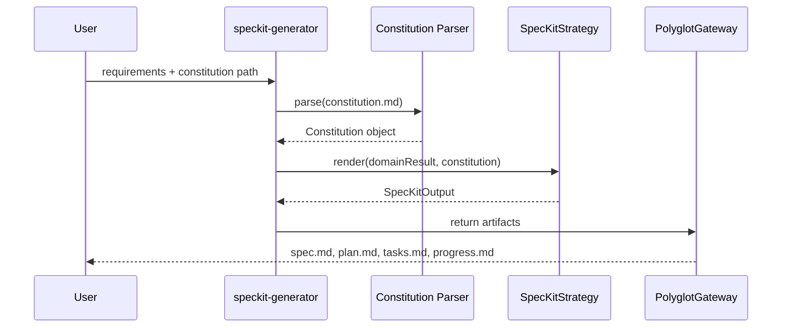

# 🎯 Epic: Phase 4 — Spec-Kit Integration [serial]

> **Milestone**: M5: Spec-Kit (End Week 14)
> **Labels**: `phase-4`, `epic`, `copilot-suitable`
> **Duration**: 4 weeks (Week 11-14)

## Summary

Phase 4 integrates **GitHub's Spec-Kit methodology** into MCP tools, enabling:
- **spec.md** generation from requirements
- **plan.md** generation with phases and timelines
- **tasks.md** derivation from specifications
- **progress.md** tracking with metrics
- **Constitution validation** against project principles

This aligns with Spec-Driven Development (SDD) workflow: specify → plan → tasks → implement.

---

## Implementation Plan

### Phase 4a: Core Spec-Kit (Week 11-12) — 12 Tasks

| Order | Issue | Task ID | Priority | Execution | Assignee | Description                       |
| ----- | ----- | ------- | -------- | --------- | -------- | --------------------------------- |
| 1     | #TBD  | P4-001  | High     | Serial    | @copilot | Analyze CONSTITUTION.md structure |
| 2     | #TBD  | P4-002  | High     | Serial    | @copilot | Implement constitution parser     |
| 3     | #TBD  | P4-003  | High     | Parallel  | @copilot | Create Spec-Kit types             |
| 4     | #TBD  | P4-004  | High     | Serial    | @copilot | Implement spec.md generation      |
| 5     | #TBD  | P4-005  | High     | Serial    | @copilot | Implement plan.md generation      |
| 6     | #TBD  | P4-006  | High     | Serial    | @copilot | Implement task derivation         |
| 7     | #TBD  | P4-007  | High     | Serial    | @copilot | Implement tasks.md generation     |
| 8     | #TBD  | P4-008  | High     | Serial    | @copilot | Implement progress.md generation  |
| 9     | #TBD  | P4-009  | High     | Serial    | @copilot | Wire SpecKitStrategy to gateway   |
| 10    | #TBD  | P4-010  | High     | Serial    | @copilot | Add speckit-generator tool        |
| 11    | #TBD  | P4-011  | High     | Serial    | @copilot | Integrate with design-assistant   |
| 12    | #TBD  | P4-012  | Medium   | Serial    | @copilot | Phase 4a integration tests        |

### Phase 4b: Validation & Polish (Week 13-14) — 12 Tasks

| Order | Issue | Task ID | Priority | Execution | Assignee | Description                             |
| ----- | ----- | ------- | -------- | --------- | -------- | --------------------------------------- |
| 13    | #TBD  | P4-013  | High     | Serial    | @copilot | Implement spec validation               |
| 14    | #TBD  | P4-014  | High     | Serial    | @copilot | Implement constitution compliance check |
| 15    | #TBD  | P4-015  | Medium   | Serial    | @copilot | Add validation warnings                 |
| 16    | #TBD  | P4-016  | Medium   | Serial    | @copilot | Implement validation suggestions        |
| 17    | #TBD  | P4-017  | High     | Serial    | @copilot | Implement progress tracking             |
| 18    | #TBD  | P4-018  | Medium   | Serial    | @copilot | Add progress metrics calculation        |
| 19    | #TBD  | P4-019  | Medium   | Serial    | @copilot | Implement /speckit.analyze equivalent   |
| 20    | #TBD  | P4-020  | Medium   | Serial    | @copilot | Add checklist generation                |
| 21    | #TBD  | P4-021  | Low      | Parallel  | @copilot | Add export to GitHub Issues             |
| 22    | #TBD  | P4-022  | Low      | Parallel  | @copilot | Add export to local files               |
| 23    | #TBD  | P4-023  | Medium   | Serial    | @copilot | Full workflow integration test          |
| 24    | #TBD  | P4-024  | High     | Serial    | @copilot | Documentation and examples              |

---

## Dependency Graph



---

## Technical Summary

### New Files

```
src/strategies/speckit/
├── constitution-parser.ts     # Parse CONSTITUTION.md format
├── spec-generator.ts          # Generate spec.md
├── plan-generator.ts          # Generate plan.md
├── task-deriver.ts            # Derive tasks from spec
├── progress-tracker.ts        # Track and report progress
├── spec-validator.ts          # Validate spec against constitution
└── types.ts                   # Spec-Kit domain types

src/strategies/
└── speckit-strategy.ts        # OutputStrategy implementation
```

### Key Interfaces

```typescript
// Constitution structure
interface Constitution {
  principles: Principle[];
  constraints: Constraint[];
  architectureRules: ArchitectureRule[];
  designPrinciples: DesignPrinciple[];
  qualityGates: QualityGate[];
}

// Spec-Kit artifacts
interface SpecKitArtifacts {
  spec: ParsedSpec;
  plan: Plan;
  tasks: Task[];
  progress: ProgressReport;
}

// Generated output
interface SpecKitOutput {
  'spec.md': string;
  'plan.md': string;
  'tasks.md': string;
  'progress.md': string;
}
```

### Spec-Kit Workflow Integration



---

## Exit Criteria

### Phase 4a (Week 12)
- [ ] Constitution parser extracts all section types
- [ ] spec.md generation with requirements and objectives
- [ ] plan.md generation with phases and timeline
- [ ] tasks.md generation from spec
- [ ] progress.md generation with metrics
- [ ] SpecKitStrategy registered with gateway
- [ ] speckit-generator tool working

### Phase 4b (Week 14)
- [ ] Spec validation against constitution
- [ ] Compliance warnings for violations
- [ ] Progress tracking across spec lifecycle
- [ ] Checklist generation for reviews
- [ ] Optional export to GitHub Issues
- [ ] Full workflow integration test passing
- [ ] Documentation and examples complete

---

## Success Metrics

| Metric                       | Target                          |
| ---------------------------- | ------------------------------- |
| Constitution sections parsed | 5 types (P, C, AR, DP, QG)      |
| Spec-Kit documents generated | 4 (spec, plan, tasks, progress) |
| Task derivation accuracy     | ~80% match to manual tasks      |
| Validation coverage          | All constitution constraints    |

---

## Related Documents

- [SPEC-005: Spec-Kit Integration](https://github.com/Anselmoo/mcp-ai-agent-guidelines/blob/development/plan-v0.13.x/specs/SPEC-005-speckit-integration.md)
- [ADR-001: Output Strategy Pattern](https://github.com/Anselmoo/mcp-ai-agent-guidelines/blob/development/plan-v0.13.x/adrs/ADR-001-output-strategy-pattern.md)
- [GitHub Spec-Kit](https://github.com/github/spec-kit)
- [Spec-Driven Development](https://github.com/github/spec-kit/blob/main/spec-driven.md)

---

## Notes for Implementation

**All tasks are Copilot-suitable** because:
- Clear spec with code examples in SPEC-005
- Pattern-based implementation (parsing, generation)
- Well-defined inputs/outputs
- Test-driven development friendly

**Recommended sequence**:
1. Start with types (P4-003) and parser (P4-002) in parallel
2. Build generators sequentially (spec → plan → tasks → progress)
3. Wire to gateway and create tool
4. Add validation layer
5. Polish with exports and documentation
