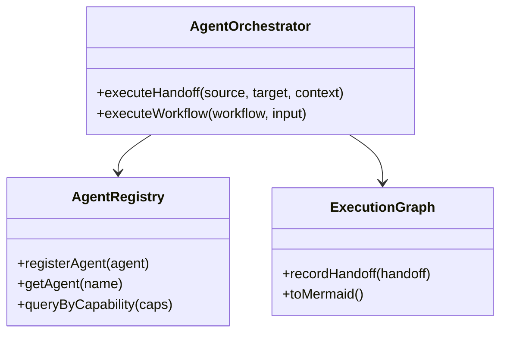

# 🔧 P3-009: Design Agent Orchestrator Architecture [serial]

> **Parent**: #697
> **Labels**: `phase-3`, `priority-high`, `serial`, `copilot-suitable`
> **Milestone**: M4: Broken Tools
> **Estimate**: 4 hours
> **Depends On**: None
> **Blocks**: P3-010

## Context

The agent-orchestrator is currently a placeholder. Before implementing, we need a clear architecture design based on SPEC-004.

## Task Description

Design agent orchestrator based on SPEC-004:

**Design Document Structure:**

```markdown
# Agent Orchestrator Architecture

## 1. Overview

The Agent Orchestrator enables multi-tool workflows where output from one tool
becomes input to another.

## 2. Core Concepts

### 2.1 Agent
A tool wrapped with metadata for orchestration:
- Name
- Capabilities (tags)
- Input/output schema
- Resource requirements

### 2.2 Handoff
Transfer of context from one agent to another:
- Source agent
- Target agent
- Context payload
- Handoff reason

### 2.3 Workflow
Predefined sequence of handoffs:
- Sequential execution
- Conditional branching (future)
- Parallel execution (future)

## 3. Architecture



## 4. API Surface

### 4.1 AgentRegistry
- `registerAgent(agent: AgentDefinition): void`
- `getAgent(name: string): Agent | undefined`
- `queryByCapability(capabilities: string[]): Agent[]`

### 4.2 AgentOrchestrator
- `executeHandoff(request: HandoffRequest): Promise<HandoffResult>`
- `executeWorkflow(workflow: Workflow, input: unknown): Promise<WorkflowResult>`
- `listAgents(): AgentInfo[]`

## 5. Integration Points

- Existing tools registered as agents on server startup
- Agent orchestrator exposed as MCP tool
- Execution graph logged for observability
```

## Acceptance Criteria

- [ ] Architecture design document: `docs/design/agent-orchestrator.md`
- [ ] Core concepts defined (Agent, Handoff, Workflow)
- [ ] API surface defined
- [ ] Integration with existing tools mapped
- [ ] Mermaid diagrams included

## Files to Create

- `docs/design/agent-orchestrator.md`

## Verification

```bash
cat docs/design/agent-orchestrator.md
```

## References

- [SPEC-004: Agent Orchestration](https://github.com/Anselmoo/mcp-ai-agent-guidelines/blob/development/plan-v0.13.x/specs/SPEC-004-agent-orchestration.md)
- [TASKS Phase 3](https://github.com/Anselmoo/mcp-ai-agent-guidelines/blob/development/plan-v0.13.x/tasks/TASKS-phase-3-broken-tools.md) P3-009
