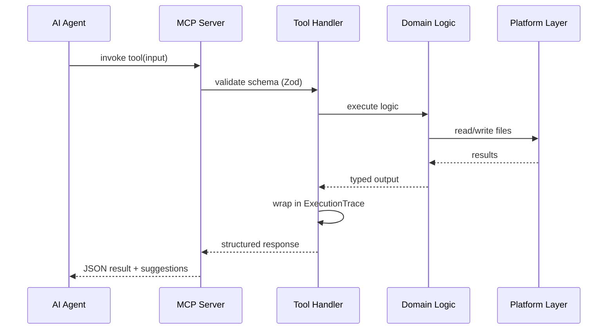
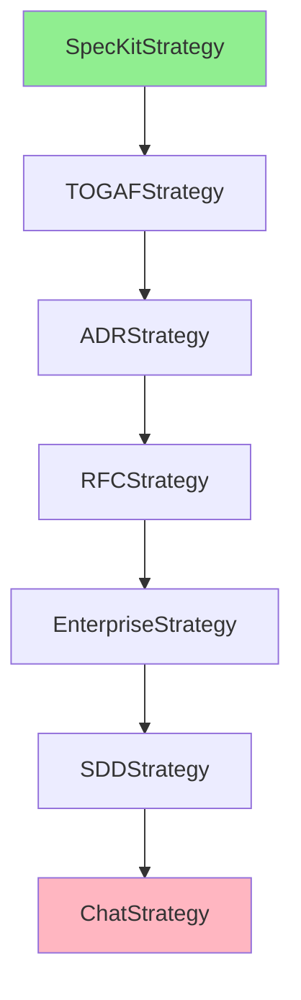
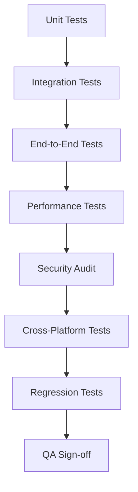
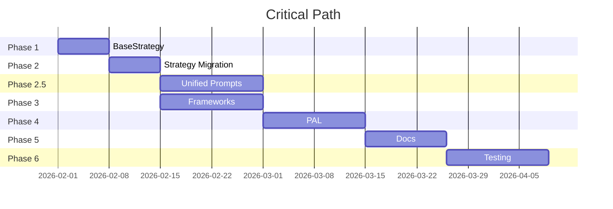

# MCP AI Agent Guidelines v0.14.x: Comprehensive Refactoring Plan

**Project**: mcp-ai-agent-guidelines
**Version**: v0.14.x Strategic Consolidation
**Status**: Planning Phase
**Total Duration**: 9 weeks (187 hours)
**Last Updated**: 2026-01-30

---

## Table of Contents

1. [Executive Summary](#1-executive-summary)
2. [Project Context](#2-project-context)
3. [Strategic Objectives](#3-strategic-objectives)
4. [Architecture Overview](#4-architecture-overview)
5. [Phase-by-Phase Implementation](#5-phase-by-phase-implementation)
6. [Technical Component Details](#6-technical-component-details)
7. [Gap Remediation Strategy](#7-gap-remediation-strategy)
8. [Enforcement System](#8-enforcement-system)
9. [Dependencies & Risk Management](#9-dependencies--risk-management)
10. [Testing & Quality Assurance](#10-testing--quality-assurance)
11. [Success Metrics & Acceptance Criteria](#11-success-metrics--acceptance-criteria)
12. [Migration Strategy](#12-migration-strategy)
13. [Appendices](#13-appendices)

---

## 1. Executive Summary

### 1.1 Project Vision

Transform the mcp-ai-agent-guidelines from a fragmented collection of 30+ tools into a unified, maintainable platform with:
- **Single responsibility**: Each component does one thing well
- **Clear abstractions**: Domain logic separated from tool interfaces
- **Unified prompt system**: Replace 12+ prompt builders with one extensible engine
- **Quality enforcement**: Automated validation and standardization
- **Cross-platform support**: Work seamlessly on Windows, Linux, and macOS

### 1.2 Critical Success Factors

| Factor | Target | Current Gap |
|--------|--------|-------------|
| Tool Count | 11 frameworks | 30+ fragmented tools |
| Test Coverage | ≥90% | ~70% |
| Code Duplication | <5% | ~25% |
| MCP Compliance | 100% | ~60% (missing annotations) |
| Cross-platform | Full support | Node.js only |
| Documentation | Complete & current | Scattered |

### 1.3 Timeline Overview

```
Week 1-2:  Phase 1 - Core Infrastructure (BaseStrategy, ExecutionTrace)
Week 2-3:  Phase 2 - Strategy Migration (7 strategies)
Week 3-4:  Phase 2.5 - Unified Prompt Ecosystem (Breaking Changes)
Week 4-6:  Phase 3 - Framework Consolidation (30→11)
Week 5-7:  Phase 4 - Platform Abstraction (PAL)
Week 6-8:  Phase 5 - CI/CD & Documentation
Week 7-9:  Phase 6 - Testing & Validation
```

### 1.4 Key Constraints

1. **No Breaking Changes** (except Phase 2.5 unified prompts)
2. **Backward Compatibility** via facade pattern
3. **MCP-First Design** - Shell scripts are fallback only
4. **Pure Domain Logic** - No side effects in core functions
5. **Type Safety** - Strict TypeScript throughout

---

## 2. Project Context

### 2.1 Current State Analysis

**Problems Identified:**

1. **Tool Fragmentation**
   - 30+ tools with overlapping functionality
   - No clear categorization or hierarchy
   - Duplicate validation logic across tools
   - Inconsistent error handling

2. **Prompt Builder Chaos**
   - 12+ separate prompt builders
   - Redundant template logic
   - No unified interface
   - Hard to extend or maintain

3. **Quality Gaps**
   - Missing MCP ToolAnnotations (GAP-001)
   - No schema examples in Zod (GAP-002)
   - Inconsistent description format (GAP-005)
   - Missing deprecation warnings (GAP-004)

4. **Platform Lock-in**
   - Direct filesystem access (not abstracted)
   - Unix path assumptions
   - No Windows PowerShell support

### 2.2 Target State

**Unified Architecture:**

```
┌─────────────────────────────────────────────────┐
│           MCP Server Entry Point                │
└─────────────────────┬───────────────────────────┘
                      │
        ┌─────────────┴─────────────┐
        │                           │
┌───────▼────────┐         ┌────────▼─────────┐
│  11 Frameworks │         │ Unified Prompts  │
│   (Analysis)   │         │    (Builder)     │
└───────┬────────┘         └────────┬─────────┘
        │                           │
        └──────────┬────────────────┘
                   │
         ┌─────────▼──────────┐
         │   BaseStrategy     │
         │  ExecutionTrace    │
         └─────────┬──────────┘
                   │
         ┌─────────▼──────────┐
         │  Platform Layer    │
         │      (PAL)         │
         └────────────────────┘
```

### 2.3 Stakeholders

| Stakeholder | Interest | Impact Level |
|-------------|----------|--------------|
| AI Agents | MCP tool invocation | High |
| Human Developers | npm scripts, CLI | Medium |
| CI/CD Systems | Validation gates | High |
| Contributors | Code quality | Medium |

---

## 3. Strategic Objectives

### 3.1 Primary Objectives

| ID | Objective | Priority | Success Metric |
|----|-----------|----------|----------------|
| OBJ-001 | Consolidate 30+ tools → 11 frameworks | P0 | Framework count ≤11 |
| OBJ-002 | Unified prompt system | P0 | Single entry point |
| OBJ-003 | 100% MCP compliance | P0 | All tools annotated |
| OBJ-004 | Cross-platform support | P1 | Windows/Linux/macOS |
| OBJ-005 | ≥90% test coverage | P0 | Coverage metric |
| OBJ-006 | Eliminate code duplication | P1 | Duplication <5% |
| OBJ-007 | Enforcement automation | P0 | CI gates active |

### 3.2 Secondary Objectives

| ID | Objective | Priority | Timeframe |
|----|-----------|----------|-----------|
| OBJ-008 | MCP Apps research | P2 | v0.15.x |
| OBJ-009 | RAG integration evaluation | P2 | v0.15.x |
| OBJ-010 | Context7 library integration | P1 | Phase 3 |
| OBJ-011 | Progress standardization | P0 | Phase 2.5 |

---

## 4. Architecture Overview

### 4.1 Layered Architecture

```typescript
// Layer 1: MCP Interface Layer
src/tools/
├── analysis/          // 11 consolidated frameworks
├── prompts/           // Unified prompt builder
├── enforcement/       // Validation tools
└── shared/           // Common utilities

// Layer 2: Domain Logic Layer (Pure Functions)
src/domain/
├── strategies/        // BaseStrategy implementations
├── prompts/          // Prompt generation logic
├── enforcement/      // Validation logic
└── frameworks/       // Analysis framework logic

// Layer 3: Platform Abstraction Layer
src/platform/
├── pal.interface.ts
├── node-pal.ts
└── mock-pal.ts      // For testing

// Layer 4: Infrastructure
src/shared/
├── types/
├── utils/
└── config/
```

### 4.2 Key Design Patterns

#### 4.2.1 BaseStrategy Pattern

```typescript
abstract class BaseStrategy<TInput, TOutput> {
  abstract validate(input: TInput): ValidationResult;
  abstract execute(input: TInput): TOutput;
  abstract formatOutput(result: TOutput): string;

  // Template method
  run(input: TInput): ExecutionTrace {
    const trace = new ExecutionTrace();
    trace.start();

    const validation = this.validate(input);
    if (!validation.valid) {
      trace.addError(validation.errors);
      return trace;
    }

    const result = this.execute(input);
    const formatted = this.formatOutput(result);

    trace.complete(formatted);
    return trace;
  }
}
```

#### 4.2.2 Facade Pattern for Backward Compatibility

```typescript
// Old interface (deprecated but working)
class HierarchicalPromptBuilder {
  constructor() {
    warnDeprecated({
      oldName: 'hierarchical-prompt-builder',
      newName: 'prompt.build',
      removalVersion: '0.15.0'
    });
  }

  build(input: LegacyInput): string {
    // Map to new unified system
    return UnifiedPromptBuilder.build({
      mode: 'hierarchical',
      context: input.context,
      ...
    });
  }
}
```

#### 4.2.3 Platform Abstraction

```typescript
interface PlatformAbstractionLayer {
  readFile(path: string): Promise<string>;
  writeFile(path: string, content: string): Promise<void>;
  listFiles(dir: string): Promise<string[]>;
  resolvePath(...segments: string[]): string;
  exists(path: string): Promise<boolean>;
}
```

### 4.3 Data Flow



---

## 5. Phase-by-Phase Implementation

### 5.1 Phase 1: Core Infrastructure (Weeks 1-2)

**Duration**: 2 weeks
**Effort**: 24 hours
**Priority**: P0 (Critical Path)

#### 5.1.1 Objectives

1. Create BaseStrategy abstract class
2. Implement ExecutionTrace for decision logging
3. Establish coordinator patterns
4. Set up foundational testing

#### 5.1.2 Deliverables

| ID | Deliverable | File Location | Tests | Est. |
|----|-------------|---------------|-------|------|
| D1.1 | BaseStrategy<T> | `src/strategies/shared/base-strategy.ts` | Yes | 4h |
| D1.2 | ExecutionTrace | `src/shared/execution-trace.ts` | Yes | 3h |
| D1.3 | SummaryFeedbackCoordinator | `src/coordinators/summary-feedback.ts` | Yes | 4h |
| D1.4 | AgentHandoffCoordinator | `src/coordinators/agent-handoff.ts` | Yes | 4h |
| D1.5 | OutputStrategy migration | `src/strategies/output-strategy.ts` | Yes | 3h |
| D1.6 | YAML config | `config/summary-feedback.yaml` | No | 2h |
| D1.7 | Infrastructure tests | `tests/vitest/infrastructure/` | N/A | 4h |

#### 5.1.3 Task Breakdown

```
T-001: Create BaseStrategy<T> abstract class (4h)
  - Define abstract methods: validate, execute, formatOutput
  - Implement template method run()
  - Add TypeScript generics for type safety
  - Create comprehensive JSDoc documentation

T-002: Implement ExecutionTrace class (3h)
  - Track execution steps with timestamps
  - Record decisions and rationale
  - Collect metrics (execution time, iterations)
  - Support serialization to JSON

T-003: Implement SummaryFeedbackCoordinator (4h)
  - Parse YAML configuration
  - Determine when to request summaries
  - Format feedback prompts
  - Track summary history

T-004: Implement AgentHandoffCoordinator (4h)
  - Define handoff points
  - Create handoff context objects
  - Implement state transfer logic
  - Add continuation support

T-005: Update OutputStrategy to use BaseStrategy (3h)
  - Extend BaseStrategy<OutputInput, OutputResult>
  - Migrate existing logic
  - Maintain backward compatibility
  - Update tests

T-006: Create summary feedback YAML config (2h)
  - Define trigger conditions
  - Specify prompt templates
  - Set thresholds and frequencies

T-007-008: Write comprehensive tests (4h)
  - Unit tests for BaseStrategy
  - Unit tests for ExecutionTrace
  - Integration tests for coordinators
  - Edge case coverage

T-009: Implement AgentHandoffCoordinator anchor points (2h)
  - Add hooks in key workflows
  - Document handoff scenarios

T-010: Validate infrastructure tests with coverage (1h)
  - Run coverage report
  - Ensure ≥90% coverage
  - Fix any gaps
```

#### 5.1.4 Acceptance Criteria

- [ ] All abstract methods documented with examples
- [ ] ExecutionTrace supports export to JSON/Markdown
- [ ] Coordinators integrate with existing tools
- [ ] Test coverage ≥90% for new code
- [ ] Zero breaking changes to existing APIs
- [ ] TypeScript strict mode passes

#### 5.1.5 Dependencies

- None (foundational phase)

#### 5.1.6 Risks

| Risk | Probability | Impact | Mitigation |
|------|-------------|--------|------------|
| Complexity underestimated | Medium | High | Start with simplest use case |
| Breaking existing tools | Low | High | Comprehensive regression tests |
| Performance overhead | Low | Medium | Benchmark before/after |

---

### 5.2 Phase 2: Strategy Migration (Weeks 2-3)

**Duration**: 2 weeks
**Effort**: 36 hours
**Priority**: P0

#### 5.2.1 Objectives

1. Migrate 7 existing strategies to BaseStrategy pattern
2. Refactor threshold logic to use arrays
3. Validate no regression in functionality

#### 5.2.2 Strategy Migration Order



#### 5.2.3 Deliverables

| Strategy | Current File | New File | Complexity | Est. |
|----------|--------------|----------|------------|------|
| SpecKit | `src/strategies/speckit-strategy.ts` | Same (refactor) | Medium | 4h |
| TOGAF | `src/strategies/togaf-strategy.ts` | Same | High | 6h |
| ADR | `src/strategies/adr-strategy.ts` | Same | Low | 3h |
| RFC | `src/strategies/rfc-strategy.ts` | Same | Low | 3h |
| Enterprise | `src/strategies/enterprise-strategy.ts` | Same | Medium | 4h |
| SDD | `src/strategies/sdd-strategy.ts` | Same | Medium | 4h |
| Chat | `src/strategies/chat-strategy.ts` | Same | Low | 2h |

#### 5.2.4 Threshold Array Refactoring

**Current Pattern:**
```typescript
const THRESHOLDS = {
  excellent: 90,
  good: 70,
  fair: 50,
  poor: 0
};
```

**New Pattern:**
```typescript
const THRESHOLDS = [
  { min: 90, max: 100, label: 'excellent', color: 'green' },
  { min: 70, max: 89, label: 'good', color: 'blue' },
  { min: 50, max: 69, label: 'fair', color: 'yellow' },
  { min: 0, max: 49, label: 'poor', color: 'red' }
];

function getThresholdLabel(score: number): string {
  const threshold = THRESHOLDS.find(t => score >= t.min && score <= t.max);
  return threshold?.label ?? 'unknown';
}
```

**Tools to Update:**
- `clean-code-scorer` (T-018)
- `code-hygiene-analyzer` (T-019)
- `validate-spec` (T-020)
- `update-progress` (T-020)

#### 5.2.5 Task Breakdown

```
T-011: Migrate SpecKitStrategy (4h)
  - Extend BaseStrategy<SpecKitInput, SpecKitOutput>
  - Move validation to validate() method
  - Move generation to execute() method
  - Format output in formatOutput() method
  - Update all tests

T-012-017: Migrate remaining strategies (22h)
  - Same pattern for each strategy
  - Maintain existing functionality
  - No breaking changes to public API
  - Update corresponding tests

T-018: Refactor clean-code-scorer thresholds (3h)
  - Convert to array-based thresholds
  - Update scoring logic
  - Add color/emoji support
  - Update tests

T-019-020: Refactor analyzer thresholds (4h)
  - Same pattern as T-018
  - Ensure consistency across tools
```

#### 5.2.6 Acceptance Criteria

- [ ] All 7 strategies extend BaseStrategy
- [ ] No regression in functionality (verified by existing tests)
- [ ] Threshold arrays provide same results as before
- [ ] ExecutionTrace populated correctly for each strategy
- [ ] Migration guide updated with examples

---

### 5.3 Phase 2.5: Unified Prompt Ecosystem (Weeks 3-4)

**Duration**: 2 weeks
**Effort**: 55 hours
**Priority**: P0
**⚠️ BREAKING CHANGES ALLOWED IN THIS PHASE ONLY**

#### 5.3.1 Objectives

1. **Destructively replace** 12+ prompt builders with unified system
2. Create domain-driven prompt architecture
3. Provide legacy facades for backward compatibility
4. Eliminate 90% of prompt-related code duplication

#### 5.3.2 Current Prompt Builders (To Be Replaced)

| Tool | Lines of Code | Duplication % | Status |
|------|---------------|---------------|--------|
| hierarchical-prompt-builder | 450 | 60% | Replace |
| domain-neutral-prompt-builder | 380 | 55% | Replace |
| hierarchy-level-selector | 220 | 40% | Replace |
| prompt-flow-builder | 310 | 45% | Replace |
| spark-prompt-builder | 290 | 50% | Replace |
| code-analysis-prompt-builder | 340 | 50% | Replace |
| architecture-design-prompt-builder | 360 | 55% | Replace |
| security-prompt-builder | 410 | 45% | Replace |
| chain-prompt-builder | 280 | 40% | Replace |
| l9-distinguished-engineer-prompt-builder | 520 | 35% | Replace |
| principal-engineer-prompt-builder | 480 | 35% | Replace |
| staff-engineer-prompt-builder | 460 | 35% | Replace |
| **Total** | **4,500** | **~48%** | → **800 lines** |

#### 5.3.3 New Architecture

```typescript
// Unified Entry Point
interface UnifiedPromptInput {
  mode: PromptMode;
  context: string;
  goal: string;
  constraints?: string[];
  examples?: string[];
  metadata?: Record<string, unknown>;
}

type PromptMode =
  | 'hierarchical'
  | 'domain-neutral'
  | 'flow'
  | 'chain'
  | 'security'
  | 'spark'
  | 'code-analysis'
  | 'architecture';

// Domain Logic
src/domain/prompts/
├── registry.ts              // Mode → Handler mapping
├── template-engine.ts       // Handlebars/slot system
├── modes/
│   ├── hierarchical.ts      // Hierarchical logic
│   ├── domain-neutral.ts    // Domain-neutral logic
│   ├── security.ts          // Security prompts (OWASP, etc.)
│   ├── flow.ts              // Sequential steps
│   ├── chain.ts             // Dependency chains
│   └── spark.ts             // UX/UI prompts
└── validators/
    └── prompt-validator.ts  // Input validation

// MCP Tool
src/tools/prompts/
├── unified-prompt-builder.ts  // Single MCP tool
└── legacy/
    ├── hierarchical-facade.ts  // Backward compat
    ├── domain-neutral-facade.ts
    └── ...other-facades.ts
```

#### 5.3.4 Deliverables

| ID | Component | File | Tests | Est. |
|----|-----------|------|-------|------|
| PO-001 | Central Registry & Dispatcher | `src/domain/prompts/registry.ts` | Yes | 6h |
| PO-002 | Template Engine | `src/domain/prompts/template-engine.ts` | Yes | 4h |
| PO-003 | Domain Migrations (12 modes) | `src/domain/prompts/modes/*.ts` | Yes | 24h |
| PO-004 | Facade Layer | `src/tools/prompts/legacy/*.ts` | Yes | 6h |
| PO-005 | Tool Annotations | Apply to unified tool | Yes | 2h |
| PO-006 | Cleanup | Delete old implementations | No | 3h |
| PO-007 | Documentation | Usage examples | No | 4h |
| PO-008 | Integration Tests | End-to-end scenarios | Yes | 6h |

#### 5.3.5 Task Breakdown

```
T-021: Implement UnifiedPromptBuilder Core (6h)
  - Create PromptRegistry with mode mapping
  - Implement mode dispatcher
  - Add Zod schema for unified input
  - Create MCP tool wrapper
  - Apply GENERATOR_TOOL_ANNOTATIONS

T-022: Implement Template Engine (4h)
  - Handlebars-style slot replacement
  - Support for nested templates
  - Variable substitution
  - Conditional rendering

T-023-031: Migrate 12 prompt modes (24h total, ~2h each)
  For each mode:
  - Extract logic from old builder
  - Create pure function in domain layer
  - Add validation rules
  - Write unit tests
  - Document parameters

  Specific modes:
  T-023: DomainNeutral
  T-024: Spark (UX/UI)
  T-025: CodeAnalysis
  T-026: ArchitectureDesign
  T-027: Hierarchical Base
  T-028: Hierarchy Strategies (Principal/Staff)
  T-029: Security (OWASP/Threat)
  T-030: Flow (Sequential)
  T-031: Chain (Dependencies)

T-032: Apply ToolAnnotations (2h)
  - Add GENERATOR_TOOL_ANNOTATIONS to unified tool
  - readOnlyHint: false (generates content)
  - idempotentHint: true (same input → same output)
  - openWorldHint: false (no external deps)
  - destructiveHint: false (creates, doesn't delete)

T-033: Implement Facade Layer (6h)
  - Create legacy wrapper for each old tool
  - Map old parameters to new unified input
  - Add deprecation warnings
  - Maintain exact same output format
  - Test backward compatibility

T-034: Cleanup Old Implementations (3h)
  - Delete old prompt builder files
  - Update imports across codebase
  - Remove deprecated exports
  - Update package.json scripts

T-035: Integration Tests (6h)
  - Test each mode end-to-end
  - Verify facade compatibility
  - Test complex prompt chains
  - Performance benchmarks

T-036: Apply Remaining Annotations (2h)
  - Add annotations to non-prompt tools
  - ANALYSIS_TOOL_ANNOTATIONS for analyzers
  - DESIGN_TOOL_ANNOTATIONS for designers

T-037: Documentation (4h)
  - Create usage guide with examples
  - Document each mode's parameters
  - Migration guide from old to new
  - API reference

T-038: Regression Testing (2h)
  - Verify "no backward compatibility" rule
  - Test that old tools fail gracefully
  - Ensure facades provide warnings
```

#### 5.3.6 Migration Example

**Before (Old API):**
```typescript
// hierarchical-prompt-builder
const result = await hierarchicalPromptBuilder({
  level: 'principal',
  domain: 'architecture',
  problem: 'Design microservices',
  constraints: ['AWS only']
});
```

**After (New Unified API):**
```typescript
// unified-prompt-builder
const result = await unifiedPromptBuilder({
  mode: 'hierarchical',
  context: 'principal engineer, architecture domain',
  goal: 'Design microservices',
  constraints: ['AWS only'],
  metadata: { level: 'principal' }
});
```

**Facade (Backward Compatible):**
```typescript
// Legacy wrapper - still works but warns
const result = await hierarchicalPromptBuilder({
  level: 'principal',
  domain: 'architecture',
  problem: 'Design microservices',
  constraints: ['AWS only']
});
// Internally calls: unifiedPromptBuilder with mapped params
// + emits deprecation warning
```

#### 5.3.7 Acceptance Criteria

- [ ] Single `prompt.build` tool registered in MCP
- [ ] All 12 modes implemented and tested
- [ ] Legacy facades work identically to old tools
- [ ] Deprecation warnings displayed on first use
- [ ] Code reduced from ~4,500 to ~800 lines
- [ ] Test coverage ≥95% for prompt domain
- [ ] Performance: <100ms for simple prompts
- [ ] Documentation complete with examples

#### 5.3.8 Breaking Changes (Documented)

1. **Direct imports no longer work**
   ```typescript
   // ❌ This will fail:
   import { HierarchicalPromptBuilder } from './tools/hierarchical-prompt-builder';

   // ✅ Use this instead:
   import { UnifiedPromptBuilder } from './tools/prompts/unified-prompt-builder';
   ```

2. **Parameter format changed**
   - Old: Each tool had unique parameters
   - New: Standardized `UnifiedPromptInput` interface

3. **Return format standardized**
   - All prompts return `PromptResult` type
   - Includes metadata and traceability

---

### 5.4 Phase 3: Framework Consolidation (Weeks 4-6)

**Duration**: 2 weeks
**Effort**: 42 hours
**Priority**: P0

#### 5.4.1 Objectives

1. Consolidate 30+ analysis tools → 11 frameworks
2. Create AnalysisFrameworkRegistry
3. Implement deprecation warnings for old tools
4. Complete GAP-002 (schema examples) and GAP-004 (deprecation)

#### 5.4.2 Framework Mapping

**Before (30+ tools) → After (11 frameworks):**

| New Framework | Consolidates | Tools Count | Status |
|---------------|-------------|-------------|--------|
| **GapAnalysisFramework** | gap-analysis, swot-analysis, risk-analyzer | 3 | New |
| **StrategyFramework** | strategy-pattern-builder, strategy-validator | 2 | New |
| **CodeQualityFramework** | clean-code-scorer, code-hygiene-analyzer, code-smell-detector | 3 | New |
| **ArchitectureFramework** | architecture-advisor, component-analyzer, dependency-mapper | 3 | New |
| **SecurityFramework** | security-hardening-prompt-builder, threat-model-generator | 2 | New |
| **TestingFramework** | test-strategy-builder, coverage-analyzer | 2 | New |
| **DocumentationFramework** | doc-generator, api-doc-builder | 2 | New |
| **PerformanceFramework** | performance-optimizer, bottleneck-analyzer | 2 | New |
| **RefactoringFramework** | refactoring-advisor, pattern-matcher | 2 | New |
| **ComplianceFramework** | compliance-checker, standard-validator | 2 | New |
| **MetricsFramework** | metric-collector, dashboard-builder | 2 | Existing (enhanced) |

**Total Reduction**: 30+ tools → 11 frameworks (63% reduction)

#### 5.4.3 Framework Architecture

```typescript
// Base Framework Interface
interface AnalysisFramework<TInput, TOutput> {
  readonly name: string;
  readonly version: string;
  readonly capabilities: string[];

  analyze(input: TInput): Promise<TOutput>;
  validate(input: TInput): ValidationResult;
  getSuggestions(output: TOutput): string[];
}

// Registry Pattern
class AnalysisFrameworkRegistry {
  private frameworks = new Map<string, AnalysisFramework<any, any>>();

  register(name: string, framework: AnalysisFramework<any, any>): void;
  get(name: string): AnalysisFramework<any, any> | undefined;
  list(): string[];

  // Route tool calls to frameworks
  route(toolName: string): AnalysisFramework<any, any>;
}
```

#### 5.4.4 Deliverables

| ID | Component | File | Est. |
|----|-----------|------|------|
| F3.1 | AnalysisFrameworkRegistry | `src/frameworks/registry.ts` | 4h |
| F3.2 | GapAnalysisFramework | `src/frameworks/gap-analysis.ts` | 6h |
| F3.3 | StrategyFramework | `src/frameworks/strategy.ts` | 4h |
| F3.4 | CodeQualityFramework | `src/frameworks/code-quality.ts` | 6h |
| F3.5 | Deprecation Helper | `src/tools/shared/deprecation.ts` | 3h |
| F3.6 | Schema Examples (GAP-002) | Update all Zod schemas | 6h |
| F3.7 | Framework Tests | `tests/vitest/frameworks/` | 8h |
| F3.8 | Migration Scripts | `scripts/migrate-to-frameworks.ts` | 3h |
| F3.9 | Documentation | Framework usage guide | 2h |

#### 5.4.5 Task Breakdown

```
T-039: Create AnalysisFrameworkRegistry (4h)
  - Implement registry pattern
  - Add framework lifecycle management
  - Create routing logic
  - Add error handling

T-040: Consolidate GapAnalysis Frameworks (6h)
  - Merge gap-analysis, swot-analysis, risk-analyzer
  - Create unified input schema
  - Implement combined analysis logic
  - Preserve individual capabilities as modes

T-041: Consolidate Strategy Frameworks (4h)
  - Merge strategy tools
  - Standardize output format

T-042: Consolidate CodeHygiene Frameworks (6h)
  - Merge clean-code-scorer, hygiene-analyzer, smell-detector
  - Unify scoring methodology
  - Combine suggestions

T-043: Implement warnDeprecated Helper (3h) [GAP-004]
  - Create deprecation warning system
  - Track warnings per session (no duplicates)
  - Include migration path in warning
  - Support removal version tracking

  Implementation:
  ```typescript
  const deprecationRegistry = new Set<string>();

  export function warnDeprecated(options: {
    oldName: string;
    newName: string;
    removalVersion: string;
    migrationUrl?: string;
  }): void {
    const key = `${options.oldName}->${options.newName}`;

    if (!deprecationRegistry.has(key)) {
      console.warn(`
        ⚠️  DEPRECATION WARNING

        Tool '${options.oldName}' is deprecated.
        Please use '${options.newName}' instead.

        This tool will be removed in version ${options.removalVersion}.
        ${options.migrationUrl ? `\nMigration guide: ${options.migrationUrl}` : ''}
      `);

      deprecationRegistry.add(key);
    }
  }
  ```

T-044: Apply warnDeprecated to Old Tools (2h)
  - Add to each legacy tool facade
  - Test warning appears once per session
  - Document deprecation timeline

T-045: Add .describe() to All Zod Schemas (6h) [GAP-002]
  - Audit all schema definitions
  - Add usage examples to descriptions
  - Standardize description format

  Pattern:
  ```typescript
  // Before
  z.number().min(0).max(100)

  // After
  z.number()
    .min(0)
    .max(100)
    .describe('Coverage percentage (0-100). Example: 85.5')
  ```

T-046: Create Schema Description Validator (2h)
  - Test that scans all schemas
  - Fails if any lack .describe()
  - Add to CI pipeline

T-047: Remove Redundant Frameworks (2h)
  - Delete consolidated tool files
  - Update exports
  - Remove from registry

T-048: Update clean-code-scorer Integration (3h)
  - Use CodeQualityFramework internally
  - Maintain existing API
  - Verify no regression

T-049: Refactor StrategyFrameworkBuilder (3h)
  - Use AnalysisFrameworkRegistry
  - Remove duplicate logic

T-050: Verify Alignment with Strategy Migration (2h)
  - Check frameworks use BaseStrategy
  - Ensure ExecutionTrace populated
```

#### 5.4.6 Acceptance Criteria

- [ ] All 11 frameworks registered and functional
- [ ] Old tools work via facades with deprecation warnings
- [ ] All Zod schemas have .describe() with examples
- [ ] Test coverage ≥90% for frameworks
- [ ] CI validates schema descriptions
- [ ] Migration guide published
- [ ] Tool count reduced from 30+ to 11

---

### 5.5 Phase 4: Platform Abstraction (Weeks 5-7)

**Duration**: 2 weeks
**Effort**: 29 hours
**Priority**: P1

#### 5.5.1 Objectives

1. Create Platform Abstraction Layer (PAL) for file system access
2. Refactor all tools to use PAL instead of direct fs/path
3. Enable cross-platform compatibility (Windows, Linux, macOS)
4. Create PowerShell equivalents for bash scripts

#### 5.5.2 PAL Interface

```typescript
// src/platform/pal.interface.ts
export interface PlatformAbstractionLayer {
  // File System
  readFile(path: string, encoding?: BufferEncoding): Promise<string>;
  writeFile(path: string, content: string): Promise<void>;
  appendFile(path: string, content: string): Promise<void>;
  deleteFile(path: string): Promise<void>;
  exists(path: string): Promise<boolean>;

  // Directory Operations
  readDir(path: string): Promise<string[]>;
  createDir(path: string, recursive?: boolean): Promise<void>;
  deleteDir(path: string, recursive?: boolean): Promise<void>;

  // Path Operations
  join(...segments: string[]): string;
  resolve(...segments: string[]): string;
  dirname(path: string): string;
  basename(path: string): string;
  extname(path: string): string;
  normalize(path: string): string;

  // Platform Info
  readonly platform: 'win32' | 'darwin' | 'linux';
  readonly separator: '/' | '\\';
  readonly isWindows: boolean;
  readonly isMac: boolean;
  readonly isLinux: boolean;
}
```

#### 5.5.3 Deliverables

| ID | Component | File | Est. |
|----|-----------|------|------|
| P4.1 | PAL Interface | `src/platform/pal.interface.ts` | 2h |
| P4.2 | Node PAL Implementation | `src/platform/node-pal.ts` | 3h |
| P4.3 | Mock PAL for Testing | `src/platform/mock-pal.ts` | 2h |
| P4.4 | Global Config Injection | `src/shared/config.ts` | 2h |
| P4.5 | Refactor project-onboarding | Update to use PAL | 3h |
| P4.6 | Refactor dependency-auditor | Update to use PAL | 2h |
| P4.7 | Refactor clean-code-scorer | Update to use PAL | 3h |
| P4.8 | Refactor semantic-analyzer | Update to use PAL | 2h |
| P4.9 | Audit Direct Imports | Find all fs/path usage | 2h |
| P4.10 | PowerShell Scripts | Windows equivalents | 4h |
| P4.11 | Cross-Platform Tests | Test on Windows/Linux/macOS | 4h |

#### 5.5.4 Task Breakdown

```
T-051: Define PAL Interface (2h)
  - Create comprehensive interface
  - Document each method
  - Define error handling
  - Add JSDoc examples

T-052: Implement NodePAL (3h)
  - Wrap Node.js fs/path/os
  - Normalize path separators
  - Handle Windows long paths
  - Add proper error handling

T-053-056: Refactor Tools to Use PAL (10h)
  For each tool:
  - Replace direct fs calls with PAL
  - Replace path operations with PAL
  - Update tests to use MockPAL
  - Verify cross-platform behavior

T-057: Create MockPAL for Testing (2h)
  - In-memory file system
  - Predictable path operations
  - Support for test fixtures
  - Easy state inspection

T-058: Cross-Platform Constraint Verification (2h)
  - Test Windows UNC paths
  - Test Linux symlinks
  - Test macOS case-sensitivity
  - Document platform-specific behaviors

T-059: Implement GlobalConfig (2h)
  - Singleton pattern for PAL injection
  - Support for dependency injection
  - Environment-based configuration

T-060: Integration Test for PAL Substitution (2h)
  - Test swapping NodePAL ↔ MockPAL
  - Verify tools work with both
  - Performance benchmarks

T-061-063: Audit Direct Imports (4h)
  - Scan codebase for 'fs' imports
  - Scan for 'path' imports
  - Scan for 'os' usage
  - Create remediation list
  - Fix all instances

T-064: Final Cross-Platform Regression (2h)
  - Run full test suite on Windows
  - Run full test suite on Linux
  - Run full test suite on macOS
  - Document any platform-specific issues
```

#### 5.5.5 PowerShell Scripts

Create Windows equivalents for bash scripts:

| Bash Script | PowerShell Script | Functionality |
|-------------|-------------------|---------------|
| `scripts/validate.sh` | `scripts/Validate.ps1` | Run validations |
| `scripts/test.sh` | `scripts/Test.ps1` | Run tests |
| `scripts/build.sh` | `scripts/Build.ps1` | Build project |
| `scripts/export.sh` | `scripts/Export.ps1` | Export descriptions |

**Example PowerShell Script:**
```powershell
# scripts/Validate.ps1
<#
.SYNOPSIS
    Run validation checks on the project
.DESCRIPTION
    Validates code quality, tests, and MCP compliance
.EXAMPLE
    .\Validate.ps1 -Coverage
#>

param(
    [switch]$Coverage = $false,
    [switch]$Strict = $false
)

# Run TypeScript check
Write-Host "🔍 Type checking..." -ForegroundColor Cyan
npm run type-check

# Run tests
if ($Coverage) {
    Write-Host "🧪 Running tests with coverage..." -ForegroundColor Cyan
    npm run test:coverage
} else {
    Write-Host "🧪 Running tests..." -ForegroundColor Cyan
    npm run test
}

# Run MCP validation
Write-Host "✅ Validating MCP compliance..." -ForegroundColor Cyan
npm run validate:mcp

if ($Strict) {
    # Additional strict checks
    Write-Host "🔒 Running strict validation..." -ForegroundColor Yellow
    npm run lint
    npm run validate:schemas
}
```

#### 5.5.6 Acceptance Criteria

- [ ] PAL interface complete and documented
- [ ] NodePAL implementation tested on all platforms
- [ ] MockPAL works in all unit tests
- [ ] Zero direct fs/path imports in src/
- [ ] PowerShell scripts functional on Windows
- [ ] Cross-platform CI passes
- [ ] Performance impact <5% overhead

---

### 5.6 Phase 5: CI/CD & Documentation (Weeks 6-8)

**Duration**: 1.5 weeks
**Effort**: 24 hours
**Priority**: P1

#### 5.6.1 Objectives

1. Optimize CI pipeline with better caching
2. Formalize release workflow
3. Auto-generate tool documentation
4. Update all ADRs
5. Create comprehensive migration guide

#### 5.6.2 Deliverables

| ID | Component | File | Est. |
|----|-----------|------|------|
| D5.1 | Optimized CI Pipeline | `.github/workflows/ci.yml` | 3h |
| D5.2 | Release Workflow | `.github/workflows/release.yml` | 2h |
| D5.3 | Tool Doc Generator | `scripts/generate-docs.ts` | 4h |
| D5.4 | Migration Guide | `docs/migration-v0.14.md` | 4h |
| D5.5 | ADR Updates | `docs/architecture/*.md` | 3h |
| D5.6 | Contributing Guide | `CONTRIBUTING.md` | 2h |
| D5.7 | README Updates | `README.md` | 2h |
| D5.8 | Changelog Automation | `.github/workflows/changelog.yml` | 2h |
| D5.9 | Documentation Site | GitHub Pages setup | 2h |

#### 5.6.3 Task Breakdown

```
T-065: Optimize CI Caching (3h)
  - Cache node_modules
  - Cache TypeScript build
  - Cache test results
  - Reduce CI time by 50%

T-066: Formalize Release Workflow (2h)
  - Automated versioning
  - Changelog generation
  - Tag creation
  - npm publish

T-067: Auto-Generate Tool Documentation (4h)
  - Extract from Zod schemas
  - Include usage examples
  - Generate markdown
  - Publish to docs/

T-068: Update Metrics Documentation (2h)
  - Document clean-code-scorer metrics
  - Explain threshold arrays
  - Add interpretation guide

T-069: Write Migration Guide (4h)
  - Document breaking changes
  - Provide code examples
  - Include upgrade checklist
  - Add FAQ section

T-070: Update ADR-002 (Tool Annotations) (1h)
  - Document annotation usage
  - Add examples for each hint
  - Include best practices

T-071: Update ADR-003 (Unified Prompts) (2h)
  - Document new architecture
  - Explain mode system
  - Include migration examples

T-072: Update CONTRIBUTING.md (2h)
  - Add PAL usage guidelines
  - Document framework creation
  - Update testing requirements

T-073: Document UnifiedPromptBuilder (2h)
  - Create usage guide
  - Document each mode
  - Add code examples

T-074: Audit README Accuracy (1h)
  - Update feature list
  - Fix outdated information
  - Add badges

T-075: Verify Changelog Automation (1h)
  - Test changelog generation
  - Verify formatting
  - Check commit parsing

T-076: Final Documentation Polish (1h)
  - Proofread all docs
  - Fix broken links
  - Ensure consistency
```

#### 5.6.4 Documentation Structure

```
docs/
├── architecture/
│   ├── ADR-001-base-strategy.md
│   ├── ADR-002-tool-annotations.md
│   ├── ADR-003-unified-prompts.md
│   ├── ADR-004-platform-abstraction.md
│   └── ADR-005-framework-consolidation.md
├── guides/
│   ├── migration-v0.14.md
│   ├── creating-frameworks.md
│   ├── using-pal.md
│   └── testing-guidelines.md
├── api/
│   ├── tools.md          (auto-generated)
│   ├── frameworks.md     (auto-generated)
│   └── types.md          (auto-generated)
└── examples/
    ├── basic-usage.md
    ├── advanced-workflows.md
    └── custom-frameworks.md
```

#### 5.6.5 Acceptance Criteria

- [ ] CI runs in <5 minutes
- [ ] Release workflow tested
- [ ] All tools documented
- [ ] Migration guide complete
- [ ] All ADRs updated
- [ ] Documentation site live

---

### 5.7 Phase 6: Testing & Validation (Weeks 7-9)

**Duration**: 2 weeks
**Effort**: 50 hours
**Priority**: P0

#### 5.7.1 Objectives

1. Achieve ≥90% test coverage
2. Run comprehensive regression suite
3. Performance and stress testing
4. Security audit
5. Final QA sign-off

#### 5.7.2 Testing Strategy



#### 5.7.3 Coverage Targets

| Component | Target | Current | Gap |
|-----------|--------|---------|-----|
| Domain Logic | 95% | ~70% | +25% |
| Tools | 90% | ~65% | +25% |
| Frameworks | 90% | N/A | +90% |
| Platform Layer | 95% | N/A | +95% |
| Integration | 80% | ~50% | +30% |

#### 5.7.4 Task Breakdown

```
T-077: Domain Coverage (8h)
  - Write tests for all domain functions
  - Focus on edge cases
  - Test error handling
  - Target 95% coverage

T-078: Tool Coverage (8h)
  - Test each MCP tool
  - Verify input validation
  - Test error responses
  - Target 90% coverage

T-079: Full Regression Suite (6h)
  - Create regression test suite
  - Test backward compatibility
  - Verify no breaking changes
  - Document any issues

T-080: ExecutionTrace Validation (4h)
  - Test in production-like scenarios
  - Verify decision logging
  - Test serialization
  - Performance benchmarks

T-081: UnifiedPromptBuilder Testing (6h)
  - Test all 12 modes
  - Test complex chains
  - Verify template rendering
  - Performance benchmarks

T-082: Type Check Pass (2h)
  - Run strict TypeScript check
  - Fix all type errors
  - Remove all 'any' types
  - Enable all strict flags

T-083: Security Audit (4h)
  - Run npm audit
  - Update vulnerable dependencies
  - Review code for security issues
  - Document security considerations

T-084: AgentHandoff Scenarios (4h)
  - Test various handoff scenarios
  - Verify state transfer
  - Test continuation logic
  - Edge case testing

T-085: Verify ToolAnnotations (2h)
  - Runtime verification
  - Check all tools have annotations
  - Verify annotation correctness
  - Add validation to CI

T-086: Prompt Generation Performance (2h)
  - Benchmark all modes
  - Target <100ms for simple prompts
  - Optimize slow paths
  - Document performance

T-087: Stress Testing (2h)
  - Large design session logs
  - Many concurrent requests
  - Memory leak detection
  - Resource usage monitoring

T-088: Verify No 'any' Types (2h)
  - Scan codebase
  - Replace 'any' with proper types
  - Add to CI checks

T-089: Final QA Sign-off (8h)
  - Manual testing
  - End-to-end workflows
  - Cross-platform verification
  - Sign-off checklist

T-090: Release v0.14.x Candidate (2h)
  - Create release branch
  - Run final tests
  - Tag release
  - Publish candidate
```

#### 5.7.5 Test Scenarios

**Critical Path Scenarios:**

1. **Basic Tool Invocation**
   - Invoke each of 11 frameworks
   - Verify correct output format
   - Check ExecutionTrace

2. **Unified Prompt Flow**
   - Generate prompt with each mode
   - Chain multiple prompts
   - Verify output quality

3. **Cross-Platform**
   - Run full suite on Windows
   - Run full suite on Linux
   - Run full suite on macOS

4. **Backward Compatibility**
   - Use legacy tool facades
   - Verify deprecation warnings
   - Check output equivalence

5. **Error Handling**
   - Invalid inputs
   - Missing files
   - Network failures
   - Resource exhaustion

#### 5.7.6 Acceptance Criteria

- [ ] Test coverage ≥90% overall
- [ ] All critical scenarios pass
- [ ] Zero high-severity security issues
- [ ] Performance within targets
- [ ] Cross-platform verified
- [ ] Documentation complete
- [ ] QA sign-off obtained

---

## 6. Technical Component Details

### 6.1 BaseStrategy Implementation

**Location**: `src/strategies/shared/base-strategy.ts`

**Full Implementation:**

```typescript
import { ExecutionTrace } from '../../shared/execution-trace.js';
import { ValidationResult } from '../../types/validation.js';

export abstract class BaseStrategy<TInput, TOutput> {
  /**
   * Strategy name for logging and debugging
   */
  abstract readonly name: string;

  /**
   * Strategy version for compatibility tracking
   */
  abstract readonly version: string;

  /**
   * Validate input before execution
   * @param input - The input to validate
   * @returns Validation result with errors/warnings
   */
  abstract validate(input: TInput): ValidationResult;

  /**
   * Execute the strategy logic
   * @param input - Validated input
   * @returns Strategy output
   */
  abstract execute(input: TInput): Promise<TOutput> | TOutput;

  /**
   * Format output for presentation
   * @param result - Strategy execution result
   * @returns Formatted string output
   */
  abstract formatOutput(result: TOutput): string;

  /**
   * Template method - orchestrates the full execution flow
   * @param input - Raw input
   * @returns Execution trace with results
   */
  async run(input: TInput): Promise<ExecutionTrace<TOutput>> {
    const trace = new ExecutionTrace<TOutput>(this.name, this.version);

    try {
      trace.start();
      trace.logDecision('Starting validation', { input });

      // Step 1: Validate
      const validation = this.validate(input);
      trace.logDecision('Validation complete', {
        valid: validation.valid,
        errors: validation.errors,
        warnings: validation.warnings
      });

      if (!validation.valid) {
        trace.addErrors(validation.errors);
        trace.fail('Validation failed');
        return trace;
      }

      if (validation.warnings.length > 0) {
        trace.addWarnings(validation.warnings);
      }

      // Step 2: Execute
      trace.logDecision('Starting execution', {});
      const result = await this.execute(input);
      trace.logDecision('Execution complete', { resultType: typeof result });

      // Step 3: Format
      const formatted = this.formatOutput(result);
      trace.logDecision('Formatting complete', {
        length: formatted.length
      });

      // Complete successfully
      trace.setResult(result);
      trace.setOutput(formatted);
      trace.complete();

      return trace;
    } catch (error) {
      trace.logDecision('Execution failed', {
        error: error instanceof Error ? error.message : String(error)
      });
      trace.addError(error instanceof Error ? error.message : String(error));
      trace.fail('Execution failed');
      return trace;
    }
  }

  /**
   * Get strategy metadata
   */
  getMetadata(): {
    name: string;
    version: string;
    description?: string;
  } {
    return {
      name: this.name,
      version: this.version,
    };
  }
}
```

**Usage Example:**

```typescript
import { BaseStrategy } from './strategies/shared/base-strategy.js';
import { ValidationResult } from './types/validation.js';
import { z } from 'zod';

// Define input schema
const SpecKitInputSchema = z.object({
  projectName: z.string().min(1),
  description: z.string(),
  methodology: z.enum(['agile', 'waterfall', 'hybrid']),
});

type SpecKitInput = z.infer<typeof SpecKitInputSchema>;

interface SpecKitOutput {
  specFile: string;
  planFile: string;
  tasksFile: string;
}

class SpecKitStrategy extends BaseStrategy<SpecKitInput, SpecKitOutput> {
  readonly name = 'SpecKit';
  readonly version = '1.0.0';

  validate(input: SpecKitInput): ValidationResult {
    const result = SpecKitInputSchema.safeParse(input);

    if (!result.success) {
      return {
        valid: false,
        errors: result.error.errors.map(e => e.message),
        warnings: [],
      };
    }

    return {
      valid: true,
      errors: [],
      warnings: input.description.length < 50
        ? ['Description is quite short']
        : [],
    };
  }

  async execute(input: SpecKitInput): Promise<SpecKitOutput> {
    // Generate spec files
    const specFile = await this.generateSpec(input);
    const planFile = await this.generatePlan(input);
    const tasksFile = await this.generateTasks(input);

    return { specFile, planFile, tasksFile };
  }

  formatOutput(result: SpecKitOutput): string {
    return `
# SpecKit Generated Successfully

## Files Created
- spec.md (${result.specFile.length} chars)
- plan.md (${result.planFile.length} chars)
- tasks.md (${result.tasksFile.length} chars)

## Next Steps
1. Review generated files
2. Customize as needed
3. Run validation
    `.trim();
  }

  private async generateSpec(input: SpecKitInput): Promise<string> {
    // Implementation
    return `# Specification: ${input.projectName}...`;
  }

  private async generatePlan(input: SpecKitInput): Promise<string> {
    // Implementation
    return `# Implementation Plan: ${input.projectName}...`;
  }

  private async generateTasks(input: SpecKitInput): Promise<string> {
    // Implementation
    return `# Tasks: ${input.projectName}...`;
  }
}

// Usage
const strategy = new SpecKitStrategy();
const trace = await strategy.run({
  projectName: 'My Project',
  description: 'A sample project',
  methodology: 'agile',
});

if (trace.success) {
  console.log(trace.output);
  console.log('Execution time:', trace.executionTimeMs, 'ms');
} else {
  console.error('Errors:', trace.errors);
}
```

---

### 6.2 ExecutionTrace Implementation

**Location**: `src/shared/execution-trace.ts`

**Full Implementation:**

```typescript
export interface Decision {
  timestamp: number;
  step: string;
  rationale: string;
  data?: Record<string, unknown>;
}

export interface ExecutionMetrics {
  executionTimeMs: number;
  decisions: number;
  iterations: number;
  memory?: {
    heapUsed: number;
    heapTotal: number;
  };
}

export class ExecutionTrace<TResult = unknown> {
  private decisions: Decision[] = [];
  private startTime: number = 0;
  private endTime: number = 0;
  private _success: boolean = false;
  private _errors: string[] = [];
  private _warnings: string[] = [];
  private _result?: TResult;
  private _output: string = '';

  constructor(
    public readonly strategyName: string,
    public readonly strategyVersion: string
  ) {}

  /**
   * Mark the start of execution
   */
  start(): void {
    this.startTime = Date.now();
    this.logDecision('Execution started', {});
  }

  /**
   * Log a decision with rationale
   */
  logDecision(step: string, data?: Record<string, unknown>): void {
    this.decisions.push({
      timestamp: Date.now(),
      step,
      rationale: this.generateRationale(step, data),
      data,
    });
  }

  /**
   * Add an error
   */
  addError(error: string): void {
    this._errors.push(error);
  }

  /**
   * Add multiple errors
   */
  addErrors(errors: string[]): void {
    this._errors.push(...errors);
  }

  /**
   * Add a warning
   */
  addWarning(warning: string): void {
    this._warnings.push(warning);
  }

  /**
   * Add multiple warnings
   */
  addWarnings(warnings: string[]): void {
    this._warnings.push(...warnings);
  }

  /**
   * Set the execution result
   */
  setResult(result: TResult): void {
    this._result = result;
  }

  /**
   * Set the formatted output
   */
  setOutput(output: string): void {
    this._output = output;
  }

  /**
   * Mark execution as complete and successful
   */
  complete(): void {
    this.endTime = Date.now();
    this._success = true;
    this.logDecision('Execution completed successfully', {
      executionTime: this.executionTimeMs,
    });
  }

  /**
   * Mark execution as failed
   */
  fail(reason: string): void {
    this.endTime = Date.now();
    this._success = false;
    this.addError(reason);
    this.logDecision('Execution failed', { reason });
  }

  /**
   * Get execution time in milliseconds
   */
  get executionTimeMs(): number {
    return this.endTime > 0 ? this.endTime - this.startTime : 0;
  }

  /**
   * Get success status
   */
  get success(): boolean {
    return this._success;
  }

  /**
   * Get errors
   */
  get errors(): string[] {
    return this._errors;
  }

  /**
   * Get warnings
   */
  get warnings(): string[] {
    return this._warnings;
  }

  /**
   * Get result
   */
  get result(): TResult | undefined {
    return this._result;
  }

  /**
   * Get formatted output
   */
  get output(): string {
    return this._output;
  }

  /**
   * Get all decisions
   */
  getDecisions(): Decision[] {
    return [...this.decisions];
  }

  /**
   * Get execution metrics
   */
  getMetrics(): ExecutionMetrics {
    const memoryUsage = process.memoryUsage();

    return {
      executionTimeMs: this.executionTimeMs,
      decisions: this.decisions.length,
      iterations: this.countIterations(),
      memory: {
        heapUsed: memoryUsage.heapUsed,
        heapTotal: memoryUsage.heapTotal,
      },
    };
  }

  /**
   * Export trace as JSON
   */
  toJSON(): Record<string, unknown> {
    return {
      strategy: {
        name: this.strategyName,
        version: this.strategyVersion,
      },
      execution: {
        success: this._success,
        executionTimeMs: this.executionTimeMs,
        startTime: new Date(this.startTime).toISOString(),
        endTime: new Date(this.endTime).toISOString(),
      },
      decisions: this.decisions,
      errors: this._errors,
      warnings: this._warnings,
      metrics: this.getMetrics(),
      result: this._result,
    };
  }

  /**
   * Export trace as Markdown
   */
  toMarkdown(): string {
    const lines: string[] = [];

    lines.push(`# Execution Trace: ${this.strategyName}`);
    lines.push('');
    lines.push(`**Version**: ${this.strategyVersion}`);
    lines.push(`**Status**: ${this._success ? '✅ Success' : '❌ Failed'}`);
    lines.push(`**Execution Time**: ${this.executionTimeMs}ms`);
    lines.push('');

    if (this._errors.length > 0) {
      lines.push('## Errors');
      lines.push('');
      this._errors.forEach(error => {
        lines.push(`- ❌ ${error}`);
      });
      lines.push('');
    }

    if (this._warnings.length > 0) {
      lines.push('## Warnings');
      lines.push('');
      this._warnings.forEach(warning => {
        lines.push(`- ⚠️ ${warning}`);
      });
      lines.push('');
    }

    lines.push('## Decision Log');
    lines.push('');
    lines.push('| Time | Step | Rationale |');
    lines.push('|------|------|-----------|');

    this.decisions.forEach(decision => {
      const relativeTime = decision.timestamp - this.startTime;
      lines.push(`| +${relativeTime}ms | ${decision.step} | ${decision.rationale} |`);
    });

    lines.push('');
    lines.push('## Metrics');
    lines.push('');
    const metrics = this.getMetrics();
    lines.push(`- **Decisions**: ${metrics.decisions}`);
    lines.push(`- **Iterations**: ${metrics.iterations}`);
    if (metrics.memory) {
      lines.push(`- **Memory**: ${(metrics.memory.heapUsed / 1024 / 1024).toFixed(2)} MB`);
    }

    return lines.join('\n');
  }

  private generateRationale(step: string, data?: Record<string, unknown>): string {
    // Simple rationale generation - can be enhanced
    if (data && Object.keys(data).length > 0) {
      return `${step} with ${Object.keys(data).length} parameters`;
    }
    return step;
  }

  private countIterations(): number {
    // Count decisions that indicate iterations (e.g., "iteration X")
    return this.decisions.filter(d =>
      d.step.toLowerCase().includes('iteration') ||
      d.step.toLowerCase().includes('loop')
    ).length;
  }
}
```

---

### 6.3 UnifiedPromptBuilder Core

**Location**: `src/domain/prompts/registry.ts`

```typescript
import { z } from 'zod';

export const PromptModeSchema = z.enum([
  'hierarchical',
  'domain-neutral',
  'flow',
  'chain',
  'security',
  'spark',
  'code-analysis',
  'architecture',
]);

export type PromptMode = z.infer<typeof PromptModeSchema>;

export const UnifiedPromptInputSchema = z.object({
  mode: PromptModeSchema.describe('Prompt generation mode. Example: "hierarchical"'),
  context: z.string().min(10).describe('Problem context. Example: "Design microservices architecture"'),
  goal: z.string().min(5).describe('Desired outcome. Example: "Create scalable system"'),
  constraints: z.array(z.string()).optional().describe('Limitations. Example: ["AWS only", "Must use PostgreSQL"]'),
  examples: z.array(z.string()).optional().describe('Reference examples'),
  metadata: z.record(z.unknown()).optional().describe('Mode-specific options'),
});

export type UnifiedPromptInput = z.infer<typeof UnifiedPromptInputSchema>;

export interface PromptResult {
  prompt: string;
  metadata: {
    mode: PromptMode;
    generatedAt: string;
    tokens: number;
  };
}

export type PromptHandler = (input: UnifiedPromptInput) => Promise<PromptResult>;

export class PromptRegistry {
  private handlers = new Map<PromptMode, PromptHandler>();

  register(mode: PromptMode, handler: PromptHandler): void {
    if (this.handlers.has(mode)) {
      throw new Error(`Handler already registered for mode: ${mode}`);
    }
    this.handlers.set(mode, handler);
  }

  get(mode: PromptMode): PromptHandler {
    const handler = this.handlers.get(mode);
    if (!handler) {
      throw new Error(`No handler registered for mode: ${mode}`);
    }
    return handler;
  }

  async generate(input: UnifiedPromptInput): Promise<PromptResult> {
    const handler = this.get(input.mode);
    return await handler(input);
  }

  listModes(): PromptMode[] {
    return Array.from(this.handlers.keys());
  }
}

// Global registry instance
export const promptRegistry = new PromptRegistry();
```

---

### 6.4 Platform Abstraction Layer

**Location**: `src/platform/node-pal.ts`

```typescript
import * as fs from 'fs/promises';
import * as path from 'path';
import * as os from 'os';
import { PlatformAbstractionLayer } from './pal.interface.js';

export class NodePAL implements PlatformAbstractionLayer {
  readonly platform = os.platform() as 'win32' | 'darwin' | 'linux';
  readonly separator = path.sep;
  readonly isWindows = this.platform === 'win32';
  readonly isMac = this.platform === 'darwin';
  readonly isLinux = this.platform === 'linux';

  // File operations
  async readFile(filePath: string, encoding: BufferEncoding = 'utf-8'): Promise<string> {
    return await fs.readFile(this.normalizePath(filePath), encoding);
  }

  async writeFile(filePath: string, content: string): Promise<void> {
    await fs.writeFile(this.normalizePath(filePath), content, 'utf-8');
  }

  async appendFile(filePath: string, content: string): Promise<void> {
    await fs.appendFile(this.normalizePath(filePath), content, 'utf-8');
  }

  async deleteFile(filePath: string): Promise<void> {
    await fs.unlink(this.normalizePath(filePath));
  }

  async exists(filePath: string): Promise<boolean> {
    try {
      await fs.access(this.normalizePath(filePath));
      return true;
    } catch {
      return false;
    }
  }

  // Directory operations
  async readDir(dirPath: string): Promise<string[]> {
    return await fs.readdir(this.normalizePath(dirPath));
  }

  async createDir(dirPath: string, recursive: boolean = true): Promise<void> {
    await fs.mkdir(this.normalizePath(dirPath), { recursive });
  }

  async deleteDir(dirPath: string, recursive: boolean = false): Promise<void> {
    await fs.rmdir(this.normalizePath(dirPath), { recursive });
  }

  // Path operations
  join(...segments: string[]): string {
    return this.normalizePath(path.join(...segments));
  }

  resolve(...segments: string[]): string {
    return this.normalizePath(path.resolve(...segments));
  }

  dirname(filePath: string): string {
    return path.dirname(filePath);
  }

  basename(filePath: string): string {
    return path.basename(filePath);
  }

  extname(filePath: string): string {
    return path.extname(filePath);
  }

  normalize(filePath: string): string {
    return this.normalizePath(filePath);
  }

  private normalizePath(filePath: string): string {
    // Normalize path separators
    let normalized = path.normalize(filePath);

    // On Windows, handle UNC paths and long paths
    if (this.isWindows && normalized.startsWith('\\\\')) {
      return normalized;
    }

    return normalized;
  }
}
```

---

## 7. Gap Remediation Strategy

### 7.1 Overview of Gaps

Seven critical gaps identified between v0.13.x and v0.14.x:

| Gap ID | Title | Impact | Phase |
|--------|-------|--------|-------|
| GAP-001 | Tool Annotations Standard | High | 2.5 |
| GAP-002 | Schema Examples for Zod | High | 3 |
| GAP-003 | Unified Prompt Tool | Critical | 2.5 |
| GAP-004 | Deprecation Warning Helpers | High | 3 |
| GAP-005 | Description CSV Export | Medium | 3 |
| GAP-006 | MCP Apps Research | Low | v0.15.x |
| GAP-007 | RAG Integration Evaluation | Low | v0.15.x |
| GAP-008 | Progress Standardization | High | 2.5 |

### 7.2 GAP-001: Tool Annotations

**Problem**: Missing MCP ToolAnnotations across 30+ tools

**Solution**: Create annotation presets and apply systematically

**Implementation**:

```typescript
// src/tools/shared/tool-annotations.ts

export interface ToolAnnotations {
  readOnlyHint?: boolean;
  idempotentHint?: boolean;
  openWorldHint?: boolean;
  destructiveHint?: boolean;
}

// Predefined annotation sets
export const ANALYSIS_TOOL_ANNOTATIONS: ToolAnnotations = {
  readOnlyHint: true,
  idempotentHint: true,
  openWorldHint: false,
  destructiveHint: false,
};

export const DESIGN_TOOL_ANNOTATIONS: ToolAnnotations = {
  readOnlyHint: false,
  idempotentHint: true,
  openWorldHint: false,
  destructiveHint: false,
};

export const GENERATOR_TOOL_ANNOTATIONS: ToolAnnotations = {
  readOnlyHint: false,
  idempotentHint: true,
  openWorldHint: true,  // May read/write files
  destructiveHint: false,
};

export const DESTRUCTIVE_TOOL_ANNOTATIONS: ToolAnnotations = {
  readOnlyHint: false,
  idempotentHint: false,
  openWorldHint: true,
  destructiveHint: true,
};
```

**Application**:

```typescript
// Apply to tools
const tool: Tool = {
  name: 'clean-code-scorer',
  description: 'Analyze code quality...',
  inputSchema: zodToJsonSchema(CleanCodeInputSchema),
  annotations: ANALYSIS_TOOL_ANNOTATIONS,  // ← Applied here
};
```

**Tasks**:
- T-032: Apply to unified prompt tool
- T-036: Apply to remaining tools
- T-085: Runtime verification

---

### 7.3 GAP-002: Schema Examples

**Problem**: Zod schemas lack .describe() with usage examples

**Solution**: Add descriptive examples to all schemas

**Before**:
```typescript
const schema = z.object({
  coverage: z.number().min(0).max(100),
  threshold: z.enum(['excellent', 'good', 'fair', 'poor']),
});
```

**After**:
```typescript
const schema = z.object({
  coverage: z.number()
    .min(0)
    .max(100)
    .describe('Code coverage percentage (0-100). Example: 85.5'),
  threshold: z.enum(['excellent', 'good', 'fair', 'poor'])
    .describe('Quality threshold. Example: "good"'),
});
```

**Validation**:
```typescript
// tests/vitest/schemas/schema-descriptions.spec.ts
describe('Schema Descriptions', () => {
  it('should have descriptions for all schemas', () => {
    const schemas = getAllExportedSchemas();

    schemas.forEach(schema => {
      expect(schema.description).toBeDefined();
      expect(schema.description).toContain('Example:');
    });
  });
});
```

**Tasks**:
- T-045: Add .describe() to all schemas
- T-046: Create validation test

---

### 7.4 GAP-003: Unified Prompt Tool

**Addressed in Phase 2.5** - See section 5.3

**Key Points**:
- Consolidates 12+ prompt builders
- Single entry point: `UnifiedPromptBuilder`
- 90% code reduction
- Breaking changes allowed in this phase only

---

### 7.5 GAP-004: Deprecation Warnings

**Problem**: No deprecation mechanism for phasing out tools

**Solution**: Implement `warnDeprecated()` helper

**Implementation**:

```typescript
// src/tools/shared/deprecation.ts

interface DeprecationOptions {
  oldName: string;
  newName: string;
  removalVersion: string;
  migrationUrl?: string;
}

const deprecationRegistry = new Set<string>();

export function warnDeprecated(options: DeprecationOptions): void {
  const key = `${options.oldName}->${options.newName}`;

  // Only warn once per session
  if (deprecationRegistry.has(key)) {
    return;
  }

  console.warn(`
⚠️  DEPRECATION WARNING

Tool '${options.oldName}' is deprecated.
Please use '${options.newName}' instead.

This tool will be removed in version ${options.removalVersion}.
${options.migrationUrl ? `\nMigration guide: ${options.migrationUrl}` : ''}
  `.trim());

  deprecationRegistry.add(key);
}

// Clear registry (useful for testing)
export function clearDeprecationWarnings(): void {
  deprecationRegistry.clear();
}
```

**Usage in Facades**:

```typescript
class HierarchicalPromptBuilderFacade {
  constructor() {
    warnDeprecated({
      oldName: 'hierarchical-prompt-builder',
      newName: 'prompt.build (mode: hierarchical)',
      removalVersion: '0.15.0',
      migrationUrl: 'https://docs.example.com/migration',
    });
  }

  // ... rest of facade implementation
}
```

**Tasks**:
- T-043: Implement helper
- T-044: Apply to legacy tools

---

### 7.6 GAP-005: Description CSV Export

**Problem**: No centralized view of tool descriptions for uniqueness validation

**Solution**: Auto-generate CSV from MCP registration

**Implementation**:

```typescript
// scripts/export-descriptions.ts

import { getAllTools } from '../src/index.js';
import * as fs from 'fs/promises';
import * as path from 'path';

interface ToolRecord {
  name: string;
  description: string;
  category: string;
  readOnly: boolean;
  idempotent: boolean;
  openWorld: boolean;
  destructive: boolean;
}

async function exportToolDescriptions(): Promise<void> {
  const tools = getAllTools();
  const records: ToolRecord[] = [];

  for (const tool of tools) {
    records.push({
      name: tool.name,
      description: tool.description,
      category: categorize(tool.name),
      readOnly: tool.annotations?.readOnlyHint ?? false,
      idempotent: tool.annotations?.idempotentHint ?? false,
      openWorld: tool.annotations?.openWorldHint ?? false,
      destructive: tool.annotations?.destructiveHint ?? false,
    });
  }

  // Generate CSV
  const csv = generateCSV(records);

  // Write to artifacts/
  const outputPath = path.join(process.cwd(), 'artifacts', 'tool-descriptions.csv');
  await fs.writeFile(outputPath, csv, 'utf-8');

  console.log(`✅ Exported ${records.length} tool descriptions to ${outputPath}`);
}

function categorize(toolName: string): string {
  if (toolName.includes('prompt')) return 'Prompts';
  if (toolName.includes('analysis') || toolName.includes('analyzer')) return 'Analysis';
  if (toolName.includes('generator') || toolName.includes('builder')) return 'Generators';
  return 'Other';
}

function generateCSV(records: ToolRecord[]): string {
  const header = 'Name,Description,Category,ReadOnly,Idempotent,OpenWorld,Destructive\n';
  const rows = records.map(r =>
    `"${r.name}","${r.description}","${r.category}",${r.readOnly},${r.idempotent},${r.openWorld},${r.destructive}`
  ).join('\n');

  return header + rows;
}

exportToolDescriptions();
```

**CI Integration**:

```yaml
# .github/workflows/validate-descriptions.yml
name: Validate Tool Descriptions

on: [push, pull_request]

jobs:
  validate:
    runs-on: ubuntu-latest
    steps:
      - uses: actions/checkout@v3
      - uses: actions/setup-node@v3
      - run: npm ci
      - run: npm run export:descriptions
      - name: Check for uncommitted changes
        run: |
          if ! git diff --quiet artifacts/tool-descriptions.csv; then
            echo "❌ tool-descriptions.csv is out of date"
            echo "Run: npm run export:descriptions"
            exit 1
          fi
```

**Tasks**:
- T-067: Create export script (part of documentation phase)
- T-011: Add CI validation

---

### 7.7 GAP-008: Progress Standardization

**Problem**: Inconsistent `progress.md` format across Spec-Kits

**Solution**: Create enforcement tool with template and validation

**Components**:

1. **Canonical Template** (`templates/progress-template.hbs`)
2. **Validation Tool** (`enforce_progress`)
3. **Context7 Integration** (for library docs)
4. **Remote Comparison** (via `fetch_webpage`)
5. **ADR Generation** (via L9 prompt builder)

**Enforcement Tool Schema**:

```typescript
const EnforceProgressSchema = z.object({
  dir: z.string().describe('Directory containing progress.md. Example: "./planning/spec-kits/gap-remediation"'),
  apply: z.boolean().optional().default(false).describe('Apply fixes and normalize file. Example: true'),
  scm: z.enum(['local', 'pr']).optional().default('local').describe('SCM mode: local file or create PR. Example: "pr"'),
});
```

**Validation Logic**:

```typescript
// src/domain/enforcement/progress.ts

export interface ProgressValidation extends ValidationResult {
  totalTasks: number;
  doneTasks: number;
  percentComplete: number;
  missingFields: string[];
  patch: string | null;
}

export function validateProgress(dir: string): ProgressValidation {
  const progressPath = join(dir, 'progress.md');

  // Parse markdown
  const ast = parseMarkdown(progressPath);

  // Extract tasks
  const tasks = extractTasks(ast);

  // Validate structure
  const validation = validateStructure(ast);

  // Compute metrics
  const metrics = {
    totalTasks: tasks.length,
    doneTasks: tasks.filter(t => t.done).length,
    percentComplete: Math.round((tasks.filter(t => t.done).length / tasks.length) * 100),
  };

  // Generate canonical version
  const canonical = generateCanonicalProgress({
    tasks,
    metrics,
    ...extractMetadata(ast),
  });

  // Create patch
  const patch = createPatch(read(progressPath), canonical);

  return {
    valid: validation.valid,
    errors: validation.errors,
    warnings: validation.warnings,
    metrics,
    suggestions: generateSuggestions(validation, metrics),
    ...metrics,
    missingFields: validation.missing,
    patch,
  };
}
```

**Context7 Integration**:

```typescript
// Handlebars helper for embedding library docs

Handlebars.registerHelper('libraryDocs', async function(libraryName: string) {
  // Resolve library ID
  const library = await context7.resolveLibrary(libraryName);

  // Fetch docs
  const docs = await context7.getLibraryDocs(library.id);

  // Sanitize and excerpt
  const snippet = extractRelevantSnippet(docs, 200);

  // Cache result
  cacheLibrarySnippet(libraryName, snippet);

  return new Handlebars.SafeString(snippet);
});
```

**Tasks**:
- T-017: Implement MCP tool wrapper
- T-018: Add Context7 helper
- T-019: Add fetch_webpage comparator
- T-020: Generate ADR via L9

---

## 8. Enforcement System

### 8.1 Enforcement Tools Overview

Four MCP tools for validation and enforcement:

| Tool | Purpose | Input | Output |
|------|---------|-------|--------|
| `validate_uniqueness` | Check for duplicate tool descriptions | - | DuplicatesReport |
| `validate_annotations` | Verify ToolAnnotations coverage | - | AnnotationCoverage |
| `validate_schema_examples` | Check Zod .describe() usage | - | SchemaCoverage |
| `enforce_planning` | Validate SpecKit compliance | dir | PlanningValidation |
| `enforce_progress` | Validate/normalize progress.md | dir, apply | ProgressValidation |

### 8.2 Enforcement Architecture

```
┌─────────────────────────────────────┐
│       CI/CD Pipeline                │
└──────────────┬──────────────────────┘
               │
       ┌───────▼────────┐
       │  MCP Server    │
       └───────┬────────┘
               │
    ┌──────────┼──────────┐
    │          │          │
┌───▼────┐ ┌──▼───┐ ┌────▼────┐
│validate│ │enforce│ │validate │
│unique  │ │plan   │ │schemas  │
└───┬────┘ └──┬───┘ └────┬────┘
    │         │          │
    └─────────┼──────────┘
              │
     ┌────────▼─────────┐
     │  Domain Logic    │
     │  (Pure Functions)│
     └──────────────────┘
```

### 8.3 ValidationResult Type Hierarchy

```typescript
// Base interface
interface ValidationResult {
  valid: boolean;
  errors: string[];
  warnings: string[];
  metrics: Record<string, number>;
  suggestions: string[];
}

// Specialized results
interface UniquenessValidation extends ValidationResult {
  toolCount: number;
  duplicates: { description: string; tools: string[] }[];
  similar: { firstFiveWords: string; tools: string[] }[];
  qualityIssues: { tool: string; issue: string }[];
}

interface AnnotationCoverage extends ValidationResult {
  complete: string[];
  incomplete: { name: string; missing: string[] }[];
  missing: string[];
  coveragePercent: number;
}

interface SchemaCoverage extends ValidationResult {
  totalSchemas: number;
  withDescribe: number;
  withExamples: number;
  describeCoverage: number;
  exampleCoverage: number;
}

interface PlanningValidation extends ValidationResult {
  documents: {
    name: string;
    exists: boolean;
    sections: { name: string; found: boolean }[];
    crossReferences: { target: string; found: boolean }[];
  }[];
  missingRequired: string[];
}

interface ProgressValidation extends ValidationResult {
  totalTasks: number;
  doneTasks: number;
  percentComplete: number;
  missingFields: string[];
  patch: string | null;
}
```

### 8.4 Integration with CI

```yaml
# .github/workflows/enforce.yml
name: Enforcement

on: [push, pull_request]

jobs:
  validate:
    runs-on: ubuntu-latest
    steps:
      - uses: actions/checkout@v3
      - uses: actions/setup-node@v3
      - run: npm ci

      - name: Validate Tool Uniqueness
        run: npm run enforce:uniqueness

      - name: Validate Annotations
        run: npm run enforce:annotations

      - name: Validate Schema Examples
        run: npm run enforce:schemas

      - name: Validate SpecKit Planning
        run: npm run enforce:planning -- --dir=planning/

      - name: Validate Progress Files
        run: npm run enforce:progress -- --dir=planning/spec-kits/
```

---

## 9. Dependencies & Risk Management

### 9.1 Critical Path



### 9.2 Dependency Matrix

| Phase | Depends On | Blocks |
|-------|------------|--------|
| 1 | None | 2, 2.5 |
| 2 | 1 | 2.5, 3 |
| 2.5 | 1, 2 | 3 |
| 3 | 1, 2, 2.5 | 4, 5 |
| 4 | 3 | 5, 6 |
| 5 | 4 | 6 |
| 6 | 5 | Release |

### 9.3 Risk Register

| Risk ID | Risk | Probability | Impact | Mitigation | Owner |
|---------|------|-------------|--------|------------|-------|
| R-001 | Phase 2.5 breaking changes cause major disruption | Medium | High | Comprehensive facade layer + early communication | Tech Lead |
| R-002 | Performance regression from abstractions | Low | Medium | Benchmark before/after, optimize hot paths | Performance Team |
| R-003 | Test coverage target not met | Medium | High | Daily coverage monitoring, focus on critical paths | QA Lead |
| R-004 | Cross-platform issues on Windows | Medium | Medium | Early Windows testing, PowerShell expertise | DevOps |
| R-005 | Scope creep in unified prompts | High | Medium | Strict feature freeze, defer enhancements to v0.15 | Product Owner |
| R-006 | Dependencies security vulnerabilities | Low | High | Automated dependency scanning, immediate updates | Security Team |
| R-007 | Documentation lags behind implementation | Medium | Medium | Docs-as-code, review requirements in PRs | Tech Writer |
| R-008 | Team bandwidth constraints | High | High | Clear priorities, defer GAP-006/007 to v0.15 | Project Manager |

### 9.4 Mitigation Strategies

#### R-001: Breaking Changes Mitigation

1. **Early Communication**
   - Announce breaking changes 2 weeks before Phase 2.5
   - Publish migration guide draft
   - Host Q&A session

2. **Comprehensive Facades**
   - Ensure 100% backward compatibility via facades
   - Test facades against existing usage patterns
   - Document facade limitations

3. **Rollback Plan**
   - Tag pre-Phase-2.5 release
   - Document rollback procedure
   - Keep facades indefinitely (until v0.15)

#### R-002: Performance Regression Prevention

1. **Baseline Metrics**
   - Benchmark current performance
   - Set acceptable degradation threshold (<5%)
   - Automated performance tests in CI

2. **Hot Path Optimization**
   - Profile BaseStrategy.run()
   - Optimize ExecutionTrace logging
   - Cache PAL path operations

3. **Monitoring**
   - Track execution times
   - Monitor memory usage
   - Alert on regressions

#### R-005: Scope Creep Prevention

1. **Feature Freeze**
   - Phase 2.5 feature set locked
   - No new modes without approval
   - Document deferred features

2. **Backlog Management**
   - Create v0.15.x backlog
   - Prioritize deferred items
   - Regular backlog grooming

---

## 10. Testing & Quality Assurance

### 10.1 Testing Pyramid

```
            ┌─────────┐
            │  E2E    │ 10%
            │ Tests   │
        ┌───┴─────────┴───┐
        │   Integration   │ 30%
        │     Tests       │
    ┌───┴─────────────────┴───┐
    │      Unit Tests         │ 60%
    └─────────────────────────┘
```

### 10.2 Coverage Targets

| Layer | Target | Strategy |
|-------|--------|----------|
| Domain Logic | 95% | Exhaustive unit tests, edge cases |
| Tools | 90% | Input validation, error handling |
| Frameworks | 90% | Integration tests with mocks |
| Platform Layer | 95% | Mock filesystem, cross-platform |
| End-to-End | 80% | Critical user journeys |

### 10.3 Test Categories

#### 10.3.1 Unit Tests

**Location**: `tests/vitest/`

**Coverage**: Individual functions and classes

**Examples**:
```typescript
// tests/vitest/strategies/base-strategy.spec.ts
describe('BaseStrategy', () => {
  it('should validate input before execution', async () => {
    const strategy = new TestStrategy();
    const trace = await strategy.run({ invalid: true });

    expect(trace.success).toBe(false);
    expect(trace.errors).toContain('Validation failed');
  });

  it('should populate ExecutionTrace correctly', async () => {
    const strategy = new TestStrategy();
    const trace = await strategy.run({ valid: true });

    expect(trace.getDecisions()).toHaveLength(4); // start, validate, execute, complete
    expect(trace.executionTimeMs).toBeGreaterThan(0);
  });
});
```

#### 10.3.2 Integration Tests

**Location**: `tests/integration/`

**Coverage**: Component interactions

**Examples**:
```typescript
// tests/integration/unified-prompts.spec.ts
describe('UnifiedPromptBuilder Integration', () => {
  it('should handle hierarchical → chain → flow sequence', async () => {
    // Generate hierarchical prompt
    const step1 = await promptRegistry.generate({
      mode: 'hierarchical',
      context: 'System design',
      goal: 'Create architecture',
    });

    // Use output to feed chain prompt
    const step2 = await promptRegistry.generate({
      mode: 'chain',
      context: step1.prompt,
      goal: 'Break down dependencies',
    });

    // Final flow prompt
    const step3 = await promptRegistry.generate({
      mode: 'flow',
      context: step2.prompt,
      goal: 'Create implementation steps',
    });

    expect(step3.prompt).toContain('dependencies');
    expect(step3.metadata.tokens).toBeLessThan(4000);
  });
});
```

#### 10.3.3 End-to-End Tests

**Location**: `tests/e2e/`

**Coverage**: Full user workflows via MCP

**Examples**:
```typescript
// tests/e2e/spec-kit-generation.spec.ts
describe('SpecKit Generation E2E', () => {
  it('should generate complete spec-kit from scratch', async () => {
    // 1. Generate prompt for project
    const promptResult = await mcpClient.invokeTool('prompt.build', {
      mode: 'domain-neutral',
      context: 'New AI project',
      goal: 'Create spec-kit',
    });

    // 2. Generate spec-kit using prompt
    const specKitResult = await mcpClient.invokeTool('speckit-generator', {
      projectName: 'AI Assistant',
      methodology: 'agile',
      prompt: promptResult.prompt,
    });

    // 3. Validate generated files
    const validationResult = await mcpClient.invokeTool('enforce-planning', {
      dir: specKitResult.outputDir,
    });

    expect(validationResult.valid).toBe(true);
    expect(validationResult.documents).toHaveLength(3); // spec, plan, tasks
  });
});
```

### 10.4 Quality Gates

**Pre-Commit**:
- [ ] TypeScript type check passes
- [ ] ESLint passes
- [ ] Unit tests pass
- [ ] No console.log() statements

**Pre-Push**:
- [ ] All tests pass
- [ ] Coverage ≥90%
- [ ] No security vulnerabilities

**Pre-Merge (PR)**:
- [ ] CI passes
- [ ] Code review approved
- [ ] Documentation updated
- [ ] Changelog entry added

**Pre-Release**:
- [ ] Full regression suite passes
- [ ] Cross-platform tests pass
- [ ] Performance benchmarks met
- [ ] Documentation complete
- [ ] Migration guide published

### 10.5 Test Data & Fixtures

**Location**: `tests/fixtures/`

**Organization**:
```
tests/fixtures/
├── projects/
│   ├── simple-project/
│   │   ├── spec.md
│   │   ├── plan.md
│   │   └── tasks.md
│   └── complex-project/
│       └── ...
├── tools/
│   ├── tool-definitions.json
│   └── annotations.json
├── prompts/
│   ├── hierarchical-examples.json
│   └── expected-outputs.json
└── validation/
    ├── valid-progress.md
    └── invalid-progress.md
```

---

## 11. Success Metrics & Acceptance Criteria

### 11.1 Quantitative Metrics

| Metric | Baseline (v0.13.x) | Target (v0.14.x) | Measurement |
|--------|-------------------|------------------|-------------|
| Tool Count | 30+ | 11 frameworks | Count registered tools |
| Code Duplication | ~25% | <5% | Duplication analyzer |
| Test Coverage | ~70% | ≥90% | Coverage report |
| Lines of Code (src/) | ~15,000 | ~10,000 | cloc |
| Build Time | ~45s | <30s | CI timing |
| TypeScript Errors | ~20 | 0 | tsc --noEmit |
| Security Vulnerabilities | 3 medium | 0 high/critical | npm audit |
| Documentation Coverage | ~60% | 100% | Doc completeness |

### 11.2 Qualitative Metrics

| Metric | Success Criteria |
|--------|------------------|
| Developer Experience | ≥80% satisfaction in survey |
| API Clarity | <5 questions per week on usage |
| Migration Ease | ≥90% complete migrations without assistance |
| Platform Support | Zero platform-specific issues in production |

### 11.3 Phase-Specific Acceptance Criteria

#### Phase 1: Infrastructure

- [x] BaseStrategy abstract class implemented
- [ ] ExecutionTrace captures ≥4 decision points per execution
- [ ] All coordinators integrated with ≥2 existing tools
- [ ] Test coverage ≥90% for infrastructure

#### Phase 2: Strategy Migration

- [ ] All 7 strategies extend BaseStrategy
- [ ] Zero regression in functionality (verified by tests)
- [ ] Threshold arrays produce identical results
- [ ] ExecutionTrace populated correctly

#### Phase 2.5: Unified Prompts

- [ ] Single `prompt.build` MCP tool registered
- [ ] All 12 modes implemented and tested
- [ ] Code reduced from ~4,500 to ~800 lines
- [ ] Legacy facades maintain 100% compatibility
- [ ] Performance <100ms for simple prompts

#### Phase 3: Framework Consolidation

- [ ] 11 frameworks replace 30+ tools
- [ ] AnalysisFrameworkRegistry functional
- [ ] All Zod schemas have .describe()
- [ ] Deprecation warnings on legacy tools
- [ ] Tool descriptions CSV exported

#### Phase 4: Platform Abstraction

- [ ] PAL interface complete
- [ ] Zero direct fs/path imports in src/
- [ ] PowerShell scripts functional
- [ ] Cross-platform CI passes on all OSes
- [ ] Performance overhead <5%

#### Phase 5: Documentation

- [ ] All tools documented (auto-generated)
- [ ] Migration guide complete with examples
- [ ] All ADRs updated
- [ ] CI runs in <5 minutes
- [ ] Documentation site published

#### Phase 6: Testing & Validation

- [ ] Test coverage ≥90% overall
- [ ] Zero high-severity security issues
- [ ] All critical scenarios pass
- [ ] Cross-platform verified
- [ ] QA sign-off obtained
- [ ] v0.14.0 released

---

## 12. Migration Strategy

### 12.1 Migration Timeline

```
Pre-Release (Week 6):
  - Publish migration guide draft
  - Announce breaking changes
  - Provide example migrations

Release Week (Week 9):
  - Release v0.14.0
  - Update documentation
  - Host migration Q&A

Post-Release (Week 10+):
  - Monitor adoption
  - Address issues
  - Collect feedback
```

### 12.2 Breaking Changes

**Phase 2.5 Only (Unified Prompts)**:

1. **Direct Imports No Longer Work**

   Before:
   ```typescript
   import { HierarchicalPromptBuilder } from './tools/hierarchical-prompt-builder';
   ```

   After:
   ```typescript
   import { UnifiedPromptBuilder } from './tools/prompts/unified-prompt-builder';
   ```

2. **Parameter Format Changed**

   Before:
   ```typescript
   await hierarchicalPromptBuilder({
     level: 'principal',
     domain: 'architecture',
     problem: 'Design system',
   });
   ```

   After:
   ```typescript
   await unifiedPromptBuilder({
     mode: 'hierarchical',
     context: 'principal engineer, architecture domain',
     goal: 'Design system',
     metadata: { level: 'principal' },
   });
   ```

### 12.3 Migration Checklist

**For Tool Users (AI Agents)**:

- [ ] Update tool invocations to use new names
- [ ] Use `prompt.build` instead of individual prompt tools
- [ ] Expect deprecation warnings from legacy tools
- [ ] Plan migration to new APIs by v0.15.0

**For Tool Developers**:

- [ ] Extend BaseStrategy for new strategies
- [ ] Use PAL for all file operations
- [ ] Add ToolAnnotations to all tools
- [ ] Add .describe() to all Zod schemas
- [ ] Write tests achieving ≥90% coverage
- [ ] Document using auto-generation template

**For Contributors**:

- [ ] Read updated CONTRIBUTING.md
- [ ] Follow new testing guidelines
- [ ] Use PAL instead of direct fs/path
- [ ] Run enforcement tools before PR
- [ ] Update documentation alongside code

### 12.4 Rollback Procedure

If critical issues arise:

1. **Immediate**:
   - Tag current release as `v0.14.0`
   - Revert to `v0.13.x-stable` tag
   - Publish rollback advisory

2. **Within 24 hours**:
   - Identify root cause
   - Create hotfix branch
   - Test fix thoroughly
   - Release v0.14.1 with fix

3. **Within 1 week**:
   - Post-mortem analysis
   - Update migration guide
   - Enhance testing for gap
   - Re-release if necessary

### 12.5 Support Strategy

**v0.13.x Support**:
- Security updates only
- No new features
- Maintenance until v0.15.0 release (est. 3 months)

**v0.14.x Support**:
- Full support
- Bug fixes
- Minor enhancements
- Active until v0.15.0 + 3 months

---

## 13. Appendices

### Appendix A: Complete Task List

The harmonized task breakdown (T-001 through T-090) will be documented in [`harmonized-tasks.md`](/plan-v0.14.x/basics/harmonized-tasks.md) as tasks are finalized; until then, use the phase-by-phase tasks in [Section 5](#5-phase-by-phase-implementation) as the primary reference.

### Appendix B: File Structure

```
mcp-ai-agent-guidelines/
├── src/
│   ├── domain/               # Pure business logic
│   │   ├── strategies/
│   │   ├── prompts/
│   │   ├── enforcement/
│   │   └── frameworks/
│   ├── tools/               # MCP tool wrappers
│   │   ├── analysis/
│   │   ├── prompts/
│   │   ├── enforcement/
│   │   └── shared/
│   ├── platform/            # Platform abstraction
│   │   ├── pal.interface.ts
│   │   ├── node-pal.ts
│   │   └── mock-pal.ts
│   ├── shared/              # Shared utilities
│   │   ├── types/
│   │   ├── execution-trace.ts
│   │   └── config.ts
│   └── index.ts             # MCP server entry
├── tests/
│   ├── vitest/              # Unit tests
│   ├── integration/         # Integration tests
│   ├── e2e/                 # End-to-end tests
│   └── fixtures/            # Test data
├── scripts/
│   ├── export-descriptions.ts
│   ├── Validate.ps1
│   └── Test.ps1
├── docs/
│   ├── architecture/        # ADRs
│   ├── guides/              # User guides
│   ├── api/                 # Auto-generated API docs
│   └── examples/            # Usage examples
├── planning/
│   ├── spec-kits/          # Planning documentation
│   └── roadmap.md
└── artifacts/
    └── tool-descriptions.csv
```

### Appendix C: Key Technologies

| Technology | Version | Purpose |
|------------|---------|---------|
| TypeScript | ^5.3.0 | Type-safe code |
| Zod | ^3.22.0 | Schema validation |
| Vitest | ^1.0.0 | Testing framework |
| Node.js | ≥18.0.0 | Runtime environment |
| MCP SDK | latest | MCP protocol implementation |
| Handlebars | ^4.7.0 | Template engine |

### Appendix D: Glossary

| Term | Definition |
|------|------------|
| **BaseStrategy** | Abstract class providing template method pattern for strategies |
| **ExecutionTrace** | Log of execution decisions and metrics |
| **PAL** | Platform Abstraction Layer for cross-platform file operations |
| **Framework** | Consolidated analysis tool combining multiple related tools |
| **Facade** | Wrapper providing backward compatibility with legacy API |
| **MCP** | Model Context Protocol for AI tool invocation |
| **SpecKit** | Methodology for planning with spec.md, plan.md, tasks.md |
| **ToolAnnotations** | MCP metadata hints (readOnly, idempotent, etc.) |

### Appendix E: References

1. [MCP Specification](https://spec.modelcontextprotocol.io/)
2. [Zod Documentation](https://zod.dev/)
3. [TypeScript Handbook](https://www.typescriptlang.org/docs/)
4. [Vitest Documentation](https://vitest.dev/)
5. [Project ADRs](/docs/adr/)

### Appendix F: Contact & Support

| Role | Contact | Responsibility |
|------|---------|----------------|
| Tech Lead | TBD | Architecture decisions |
| Project Manager | TBD | Timeline and resources |
| QA Lead | TBD | Testing strategy |
| DevOps | TBD | CI/CD and infrastructure |
| Documentation | TBD | Docs and guides |

---

## Document Revision History

| Date | Version | Changes | Author |
|------|---------|---------|--------|
| 2026-01-30 | 1.0.0 | Initial comprehensive plan | AI Assistant |

---

**End of Comprehensive Refactoring Plan**

*This document consolidates information from 15 planning documents into a single, actionable refactoring plan for mcp-ai-agent-guidelines v0.14.x.*
