# MCP AI Agent Guidelines v0.14.x: Master Refactoring Plan

**Version**: 2.0.0
**Date**: 2026-01-29
**Status**: Active Implementation
**Repository**: https://github.com/Anselmoo/mcp-ai-agent-guidelines

---

## Table of Contents

- [Executive Summary](#executive-summary)
- [Architecture Overview](#architecture-overview)
- [Phase 1: Core Infrastructure](#phase-1-core-infrastructure)
- [Phase 2: Strategy Migration](#phase-2-strategy-migration)
- [Phase 3: Framework Consolidation](#phase-3-framework-consolidation)
- [Phase 4: Platform Abstraction](#phase-4-platform-abstraction)
- [Phase 5: CI/CD & Documentation](#phase-5-cicd--documentation)
- [Phase 6: Testing & Validation](#phase-6-testing--validation)
- [Gap Remediation Program](#gap-remediation-program)
- [Progress Standardization](#progress-standardization)
- [Implementation Details](#implementation-details)
- [Appendices](#appendices)

---

## Executive Summary

### Project Overview

This comprehensive refactoring transforms the MCP AI Agent Guidelines from 30+ fragmented tools into 11 unified frameworks with mandatory human-in-the-loop (HITL) patterns and cross-platform support.

**Total Duration**: 12 weeks (Q1 2026)
**Total Effort**: 187 hours
**Team Size**: 6-8 agents/developers

### Strategic Objectives

```mermaid
mindmap
  root((v0.14.x Goals))
    Architecture
      BaseStrategy Pattern
      ExecutionTrace System
      Mandatory HITL
      Agent Handoffs
    Consolidation
      30+ tools → 11 frameworks
      12+ prompt builders → 1 unified
      Zod pattern standardization
      Threshold arrays
    Quality
      90%+ test coverage
      100% domain coverage
      Type safety strict mode
      Security hardening
    Platform
      Cross-platform PAL
      Windows PowerShell
      macOS/Linux bash
      Path normalization
    Process
      CI/CD consolidation
      Progress standardization
      Enforcement tools
      Auto-documentation
```



### Key Metrics

| Metric | Baseline | Target | Improvement |
|--------|----------|--------|-------------|
| Tool Count | 30+ | 11 frameworks | -63% |
| Prompt Builders | 12+ | 1 unified | -92% |
| Test Coverage | 70% | 90%+ | +20% |
| CI Pipeline Time | 18min | 12min | -33% |
| Platform Support | 2 | 3 | +50% |
| Cyclomatic Complexity | 8.2 | <10 | Improved |
| Type Safety | 85% | 100% | +15% |

### Timeline Overview


---

## Architecture Overview

### System Architecture


### Data Flow


---

## Phase 1: Core Infrastructure

**Timeline**: Week 1-2 (Jan 15-29, 2026)
**Status**: 🔄 In Progress
**Effort**: 24 hours

### Overview

Establish foundational patterns for mandatory HITL across all strategies.

### Key Deliverables

1. **BaseStrategy<T>** - Abstract class enforcing HITL
2. **ExecutionTrace** - Decision logging system
3. **SummaryFeedbackCoordinator** - Approval workflow
4. **AgentHandoffCoordinator** - Agent handoff management

### 1.1 BaseStrategy Implementation

```typescript
// src/strategies/shared/base-strategy.ts

import { ExecutionTrace } from './execution-trace';
import { SummaryFeedbackCoordinator } from './summary-feedback';
import { AgentHandoffCoordinator } from './agent-handoff';

/**
 * Abstract base class for all strategies
 * Enforces mandatory HITL patterns
 */
export abstract class BaseStrategy<T extends StrategyOutput> {
  protected trace: ExecutionTrace;
  protected feedbackCoordinator: SummaryFeedbackCoordinator;
  protected handoffCoordinator: AgentHandoffCoordinator;

  constructor(
    protected config: StrategyConfig,
    trace?: ExecutionTrace
  ) {
    this.trace = trace ?? new ExecutionTrace(this.constructor.name);
    this.feedbackCoordinator = new SummaryFeedbackCoordinator(config.feedback);
    this.handoffCoordinator = new AgentHandoffCoordinator(config.handoffs);
  }

  /**
   * Template method - final, cannot be overridden
   * Enforces HITL workflow
   */
  async render(context: StrategyContext): Promise<StrategyResult<T>> {
    this.trace.startExecution(context);

    try {
      // 1. Execute strategy logic
      const output = await this.execute(context);

      // 2. Generate summary
      const summary = await this.getSummary(output, context);

      // 3. Request approval (MANDATORY - cannot skip)
      const approval = await this.feedbackCoordinator.requestApproval(
        summary,
        this.trace
      );

      // 4. Handle feedback
      switch (approval.action) {
        case 'approve':
          this.trace.logDecision({
            type: 'approval',
            description: 'User approved output',
            confidence: 100,
            rationale: approval.feedback
          });
          return {
            success: true,
            data: output,
            trace: this.trace,
            artifacts: this.generateArtifacts(output)
          };

        case 'modify':
          this.trace.logDecision({
            type: 'modification',
            description: 'User requested modifications',
            confidence: 0,
            rationale: approval.feedback
          });
          // Recursive call with modified context
          return this.render({
            ...context,
            modifications: approval.modifications
          });

        case 'reject':
          this.trace.logDecision({
            type: 'rejection',
            description: 'User rejected output',
            confidence: 0,
            rationale: approval.feedback
          });
          throw new StrategyRejectionError(approval.feedback);
      }

    } catch (error) {
      this.trace.logError(error);
      throw error;
    } finally {
      this.trace.endExecution();
    }
  }

  /**
   * Abstract method - must be implemented by subclasses
   * Contains strategy-specific logic
   */
  protected abstract execute(context: StrategyContext): Promise<T>;

  /**
   * Generate human-readable summary
   * Can be overridden for custom summaries
   */
  protected async getSummary(
    output: T,
    context: StrategyContext
  ): Promise<StrategySummary> {
    return {
      title: `${this.constructor.name} Output`,
      description: this.describOutput(output),
      keyPoints: this.extractKeyPoints(output),
      decisions: this.trace.getDecisions(),
      confidence: this.calculateConfidence(),
      alternatives: this.suggestAlternatives(output, context)
    };
  }

  /**
   * Generate artifacts from output
   * Can be overridden for custom artifact generation
   */
  protected generateArtifacts(output: T): Artifact[] {
    return [];
  }

  // Helper methods
  protected abstract describeOutput(output: T): string;
  protected abstract extractKeyPoints(output: T): string[];
  protected abstract suggestAlternatives(output: T, context: StrategyContext): Alternative[];

  private calculateConfidence(): number {
    const decisions = this.trace.getDecisions();
    if (decisions.length === 0) return 50;

    const avgConfidence = decisions.reduce(
      (sum, d) => sum + d.confidence,
      0
    ) / decisions.length;

    return Math.round(avgConfidence);
  }
}

/**
 * Type definitions
 */
export interface StrategyConfig {
  feedback: FeedbackConfig;
  handoffs: HandoffConfig;
}

export interface StrategyContext {
  input: unknown;
  options?: Record<string, unknown>;
  modifications?: Modification[];
}

export interface StrategyOutput {
  type: string;
  content: unknown;
  metadata?: Record<string, unknown>;
}

export interface StrategyResult<T> {
  success: boolean;
  data: T;
  trace: ExecutionTrace;
  artifacts: Artifact[];
  error?: Error;
}

export interface StrategySummary {
  title: string;
  description: string;
  keyPoints: string[];
  decisions: Decision[];
  confidence: number;
  alternatives: Alternative[];
}

export interface Alternative {
  name: string;
  description: string;
  tradeoffs: string[];
}

export class StrategyRejectionError extends Error {
  constructor(reason: string) {
    super(`Strategy rejected by user: ${reason}`);
    this.name = 'StrategyRejectionError';
  }
}
```

### 1.2 ExecutionTrace Implementation

```typescript
// src/strategies/shared/execution-trace.ts

export interface Decision {
  timestamp: Date;
  type: DecisionType;
  description: string;
  confidence: number;  // 0-100
  rationale: string;
  context: Record<string, unknown>;
  alternatives?: Alternative[];
}

export type DecisionType =
  | 'threshold'
  | 'path'
  | 'validation'
  | 'transformation'
  | 'approval'
  | 'modification'
  | 'rejection'
  | 'handoff';

export class ExecutionTrace {
  private strategyName: string;
  private startTime?: Date;
  private endTime?: Date;
  private decisions: Decision[] = [];
  private errors: Error[] = [];
  private metadata: Record<string, unknown> = {};

  constructor(strategyName: string) {
    this.strategyName = strategyName;
  }

  startExecution(context: unknown): void {
    this.startTime = new Date();
    this.metadata.context = context;
  }

  endExecution(): void {
    this.endTime = new Date();
  }

  logDecision(decision: Omit<Decision, 'timestamp'>): void {
    this.decisions.push({
      ...decision,
      timestamp: new Date()
    });
  }

  logError(error: Error): void {
    this.errors.push(error);
    this.logDecision({
      type: 'validation',
      description: `Error occurred: ${error.message}`,
      confidence: 0,
      rationale: 'Execution failed',
      context: { error: error.stack }
    });
  }

  getDecisions(): Decision[] {
    return [...this.decisions];
  }

  getSummary(): TraceSummary {
    const duration = this.endTime && this.startTime
      ? this.endTime.getTime() - this.startTime.getTime()
      : 0;

    return {
      strategyName: this.strategyName,
      startTime: this.startTime,
      endTime: this.endTime,
      duration,
      decisionCount: this.decisions.length,
      errorCount: this.errors.length,
      decisions: this.decisions,
      errors: this.errors,
      metadata: this.metadata
    };
  }

  toJSON(): string {
    return JSON.stringify(this.getSummary(), null, 2);
  }

  toMarkdown(): string {
    const summary = this.getSummary();

    return `
# Execution Trace: ${summary.strategyName}

**Started**: ${summary.startTime?.toISOString()}
**Ended**: ${summary.endTime?.toISOString()}
**Duration**: ${summary.duration}ms
**Decisions**: ${summary.decisionCount}
**Errors**: ${summary.errorCount}

## Decisions

${this.decisions.map((d, i) => `
### Decision ${i + 1}: ${d.type}

- **Description**: ${d.description}
- **Confidence**: ${d.confidence}%
- **Rationale**: ${d.rationale}
- **Time**: ${d.timestamp.toISOString()}
${d.alternatives ? `- **Alternatives**: ${d.alternatives.length}` : ''}
`).join('\n')}

${this.errors.length > 0 ? `
## Errors

${this.errors.map(e => `- ${e.message}`).join('\n')}
` : ''}
    `.trim();
  }
}

export interface TraceSummary {
  strategyName: string;
  startTime?: Date;
  endTime?: Date;
  duration: number;
  decisionCount: number;
  errorCount: number;
  decisions: Decision[];
  errors: Error[];
  metadata: Record<string, unknown>;
}
```

### 1.3 SummaryFeedbackCoordinator Implementation

```typescript
// src/strategies/shared/summary-feedback.ts

export interface FeedbackConfig {
  timeout: number;  // milliseconds
  autoApproveOnTimeout: boolean;
  showRationales: boolean;
  showAlternatives: boolean;
  showConfidence: boolean;
}

export interface ApprovalRequest {
  summary: StrategySummary;
  trace: ExecutionTrace;
  timestamp: Date;
}

export interface ApprovalResponse {
  action: 'approve' | 'modify' | 'reject';
  feedback: string;
  modifications?: Modification[];
  timestamp: Date;
}

export interface Modification {
  target: string;  // JSON path to field
  operation: 'replace' | 'add' | 'remove';
  value?: unknown;
}

export class SummaryFeedbackCoordinator {
  constructor(private config: FeedbackConfig) {}

  async requestApproval(
    summary: StrategySummary,
    trace: ExecutionTrace
  ): Promise<ApprovalResponse> {
    const request: ApprovalRequest = {
      summary,
      trace,
      timestamp: new Date()
    };

    // Display summary to user
    this.displaySummary(request);

    // Wait for user response
    const response = await this.waitForResponse(request);

    return response;
  }

  private displaySummary(request: ApprovalRequest): void {
    const { summary, trace } = request;

    console.log('\n' + '='.repeat(80));
    console.log('STRATEGY OUTPUT SUMMARY');
    console.log('='.repeat(80));
    console.log(`\nTitle: ${summary.title}`);
    console.log(`\nDescription:\n${summary.description}`);

    if (summary.keyPoints.length > 0) {
      console.log(`\nKey Points:`);
      summary.keyPoints.forEach((point, i) => {
        console.log(`  ${i + 1}. ${point}`);
      });
    }

    if (this.config.showConfidence) {
      console.log(`\nConfidence: ${summary.confidence}%`);
    }

    if (this.config.showRationales && summary.decisions.length > 0) {
      console.log(`\nDecisions Made:`);
      summary.decisions.forEach((decision, i) => {
        console.log(`  ${i + 1}. ${decision.type}: ${decision.description}`);
        if (this.config.showConfidence) {
          console.log(`     Confidence: ${decision.confidence}%`);
        }
        console.log(`     Rationale: ${decision.rationale}`);
      });
    }

    if (this.config.showAlternatives && summary.alternatives.length > 0) {
      console.log(`\nAlternatives Considered:`);
      summary.alternatives.forEach((alt, i) => {
        console.log(`  ${i + 1}. ${alt.name}`);
        console.log(`     ${alt.description}`);
        if (alt.tradeoffs.length > 0) {
          console.log(`     Tradeoffs: ${alt.tradeoffs.join(', ')}`);
        }
      });
    }

    console.log('\n' + '='.repeat(80));
    console.log('ACTIONS:');
    console.log('  [A]pprove - Accept this output');
    console.log('  [M]odify  - Request changes');
    console.log('  [R]eject  - Discard and explain why');
    console.log('='.repeat(80) + '\n');
  }

  private async waitForResponse(
    request: ApprovalRequest
  ): Promise<ApprovalResponse> {
    // In real implementation, this would:
    // 1. Listen for user input (CLI, API, WebSocket, etc.)
    // 2. Validate the response
    // 3. Handle timeout

    // Simplified for example:
    return new Promise((resolve, reject) => {
      const timeout = setTimeout(() => {
        if (this.config.autoApproveOnTimeout) {
          resolve({
            action: 'approve',
            feedback: 'Auto-approved on timeout',
            timestamp: new Date()
          });
        } else {
          reject(new Error('Approval timeout'));
        }
      }, this.config.timeout);

      // Simulate user input handling
      // In production: readline, HTTP endpoint, etc.
      process.stdin.once('data', (data) => {
        clearTimeout(timeout);
        const input = data.toString().trim().toLowerCase();

        switch (input[0]) {
          case 'a':
            resolve({
              action: 'approve',
              feedback: 'User approved',
              timestamp: new Date()
            });
            break;
          case 'm':
            // In production: prompt for modifications
            resolve({
              action: 'modify',
              feedback: 'User requested modifications',
              modifications: [],
              timestamp: new Date()
            });
            break;
          case 'r':
            // In production: prompt for rejection reason
            resolve({
              action: 'reject',
              feedback: 'User rejected output',
              timestamp: new Date()
            });
            break;
          default:
            reject(new Error('Invalid input'));
        }
      });
    });
  }
}
```

### 1.4 AgentHandoffCoordinator Implementation

```typescript
// src/strategies/shared/agent-handoff.ts

export interface HandoffConfig {
  anchorPoints: AnchorPoint[];
  requireConfirmation: boolean;
  defaultAgent?: string;
}

export interface AnchorPoint {
  name: string;
  condition: (context: unknown) => boolean;
  suggestedAgent: string;
  description: string;
}

export interface HandoffRequest {
  anchorPoint: string;
  currentAgent: string;
  suggestedAgent: string;
  context: unknown;
  timestamp: Date;
}

export interface HandoffResponse {
  accepted: boolean;
  targetAgent: string;
  feedback?: string;
}

export class AgentHandoffCoordinator {
  constructor(private config: HandoffConfig) {}

  async checkHandoff(
    anchorPointName: string,
    context: unknown,
    currentAgent: string
  ): Promise<HandoffResponse | null> {
    const anchorPoint = this.config.anchorPoints.find(
      ap => ap.name === anchorPointName
    );

    if (!anchorPoint) {
      return null;
    }

    if (!anchorPoint.condition(context)) {
      return null;
    }

    const request: HandoffRequest = {
      anchorPoint: anchorPointName,
      currentAgent,
      suggestedAgent: anchorPoint.suggestedAgent,
      context,
      timestamp: new Date()
    };

    if (this.config.requireConfirmation) {
      return this.requestHandoffConfirmation(request, anchorPoint);
    } else {
      return {
        accepted: true,
        targetAgent: anchorPoint.suggestedAgent
      };
    }
  }

  private async requestHandoffConfirmation(
    request: HandoffRequest,
    anchorPoint: AnchorPoint
  ): Promise<HandoffResponse> {
    console.log('\n' + '='.repeat(80));
    console.log('AGENT HANDOFF OPPORTUNITY');
    console.log('='.repeat(80));
    console.log(`\nAnchor Point: ${anchorPoint.name}`);
    console.log(`Description: ${anchorPoint.description}`);
    console.log(`\nCurrent Agent: ${request.currentAgent}`);
    console.log(`Suggested Agent: ${request.suggestedAgent}`);
    console.log('\nWould you like to hand off to the suggested agent?');
    console.log('  [Y]es - Hand off to suggested agent');
    console.log('  [N]o  - Continue with current agent');
    console.log('='.repeat(80) + '\n');

    // In production: proper input handling
    return {
      accepted: true,
      targetAgent: request.suggestedAgent
    };
  }
}

/**
 * Predefined anchor points for SpecKit workflow
 */
export const SPECKIT_ANCHOR_POINTS: AnchorPoint[] = [
  {
    name: 'after-requirements-extraction',
    condition: (ctx: any) => ctx.phase === 'requirements' && ctx.complete,
    suggestedAgent: '@security-auditor',
    description: 'After requirements are extracted, security review recommended'
  },
  {
    name: 'after-architecture-decisions',
    condition: (ctx: any) => ctx.phase === 'architecture' && ctx.decisionsCount > 3,
    suggestedAgent: '@architecture-advisor',
    description: 'Significant architectural decisions made, expert review recommended'
  },
  {
    name: 'after-task-breakdown',
    condition: (ctx: any) => ctx.phase === 'tasks' && ctx.taskCount > 10,
    suggestedAgent: '@tdd-workflow',
    description: 'Many tasks created, TDD planning recommended'
  },
  {
    name: 'after-summary-approval',
    condition: (ctx: any) => ctx.phase === 'summary' && ctx.approved,
    suggestedAgent: '@code-reviewer',
    description: 'Summary approved, code review agent can begin implementation'
  }
];
```

### 1.5 Phase 1 Architecture Diagram


### 1.6 Phase 1 Tasks

| ID | Task | Owner | Hours | Status |
|----|------|-------|-------|--------|
| T001 | Create BaseStrategy abstract class | @mcp-tool-builder | 4h | 🔄 In Progress |
| T002 | Create ExecutionTrace class | @mcp-tool-builder | 3h | 🔄 In Progress |
| T003 | Create SummaryFeedbackCoordinator | @mcp-tool-builder | 4h | 🔄 In Progress |
| T004 | Create AgentHandoffCoordinator | @mcp-tool-builder | 4h | 🔄 In Progress |
| T005 | Update OutputStrategy interface | @mcp-tool-builder | 2h | ⬜ Not Started |
| T006 | Create summary-feedback.yaml | @mcp-tool-builder | 1h | ⬜ Not Started |
| T007-T014 | Unit tests (8 tests) | @tdd-workflow | 6h | ⬜ Not Started |

**Total: 24 hours**

---

## Phase 2: Strategy Migration

**Timeline**: Week 3-4 (Jan 29 - Feb 12, 2026)
**Status**: ⬜ Not Started
**Effort**: 36 hours

### Overview

Migrate all 7 strategies to extend BaseStrategy and refactor threshold logic.

### Strategy Migration Flow


### 2.1 Strategy Migration Example: SpecKitStrategy

**Before** (Legacy Pattern):

```typescript
// OLD: src/strategies/speckit-strategy.ts
export class SpecKitStrategy implements OutputStrategy {
  async render(options: SpecKitOptions): Promise<SpecKitOutput> {
    // Direct execution, no HITL
    const spec = await this.generateSpec(options);
    const plan = await this.generatePlan(options);
    const tasks = await this.generateTasks(options);

    return {
      spec,
      plan,
      tasks,
      progress: this.initializeProgress()
    };
  }
}
```

**After** (BaseStrategy Pattern):

```typescript
// NEW: src/strategies/speckit-strategy.ts
export class SpecKitStrategy extends BaseStrategy<SpecKitOutput> {
  protected async execute(
    context: StrategyContext
  ): Promise<SpecKitOutput> {
    const options = context.input as SpecKitOptions;

    // Checkpoint 1: Requirements extraction
    this.trace.logDecision({
      type: 'path',
      description: 'Starting SpecKit generation',
      confidence: 90,
      rationale: 'Standard workflow for project planning',
      context: { options }
    });

    // Check handoff after requirements
    await this.handoffCoordinator.checkHandoff(
      'after-requirements-extraction',
      { phase: 'requirements', complete: true },
      'speckit-generator'
    );

    // Generate spec.md
    const spec = await this.generateSpec(options);
    this.trace.logDecision({
      type: 'transformation',
      description: 'Generated spec.md',
      confidence: 85,
      rationale: 'Requirements mapped to specification',
      context: { sections: spec.sections.length }
    });

    // Generate plan.md
    const plan = await this.generatePlan(options);
    this.trace.logDecision({
      type: 'transformation',
      description: 'Generated plan.md',
      confidence: 80,
      rationale: 'Phases and timeline derived from spec',
      context: { phases: plan.phases.length }
    });

    // Check handoff after architecture
    await this.handoffCoordinator.checkHandoff(
      'after-architecture-decisions',
      { phase: 'architecture', decisionsCount: spec.decisions.length },
      'speckit-generator'
    );

    // Generate tasks.md
    const tasks = await this.generateTasks(options);
    this.trace.logDecision({
      type: 'transformation',
      description: 'Generated tasks.md',
      confidence: 75,
      rationale: 'Tasks derived from plan phases',
      context: { taskCount: tasks.length }
    });

    // Check handoff after task breakdown
    await this.handoffCoordinator.checkHandoff(
      'after-task-breakdown',
      { phase: 'tasks', taskCount: tasks.length },
      'speckit-generator'
    );

    return {
      spec,
      plan,
      tasks,
      progress: this.initializeProgress(),
      metadata: {
        generatedAt: new Date(),
        totalDecisions: this.trace.getDecisions().length
      }
    };
  }

  protected describeOutput(output: SpecKitOutput): string {
    return `Generated SpecKit with ${output.spec.sections.length} spec sections, ` +
           `${output.plan.phases.length} phases, and ${output.tasks.length} tasks.`;
  }

  protected extractKeyPoints(output: SpecKitOutput): string[] {
    return [
      `Specification: ${output.spec.sections.length} sections defined`,
      `Plan: ${output.plan.phases.length} phases over ${output.plan.totalWeeks} weeks`,
      `Tasks: ${output.tasks.length} tasks (~${output.plan.totalHours}h estimated)`,
      `Progress: Tracking template initialized`
    ];
  }

  protected suggestAlternatives(
    output: SpecKitOutput,
    context: StrategyContext
  ): Alternative[] {
    const alternatives: Alternative[] = [];

    if (output.plan.phases.length > 6) {
      alternatives.push({
        name: 'Consolidate Phases',
        description: 'Consider merging smaller phases to reduce complexity',
        tradeoffs: [
          'Simpler timeline',
          'Less granular tracking',
          'Larger deliverables per phase'
        ]
      });
    }

    if (output.tasks.length > 50) {
      alternatives.push({
        name: 'Higher-Level Tasks',
        description: 'Group related tasks into epics or features',
        tradeoffs: [
          'Better high-level visibility',
          'Less detailed tracking',
          'May need sub-task system'
        ]
      });
    }

    return alternatives;
  }

  protected generateArtifacts(output: SpecKitOutput): Artifact[] {
    return [
      {
        name: 'spec.md',
        type: 'markdown',
        content: this.renderSpec(output.spec)
      },
      {
        name: 'plan.md',
        type: 'markdown',
        content: this.renderPlan(output.plan)
      },
      {
        name: 'tasks.md',
        type: 'markdown',
        content: this.renderTasks(output.tasks)
      },
      {
        name: 'progress.md',
        type: 'markdown',
        content: this.renderProgress(output.progress)
      }
    ];
  }

  // Private helper methods
  private async generateSpec(options: SpecKitOptions) { /* ... */ }
  private async generatePlan(options: SpecKitOptions) { /* ... */ }
  private async generateTasks(options: SpecKitOptions) { /* ... */ }
  private initializeProgress() { /* ... */ }
  private renderSpec(spec: Spec): string { /* ... */ }
  private renderPlan(plan: Plan): string { /* ... */ }
  private renderTasks(tasks: Task[]): string { /* ... */ }
  private renderProgress(progress: Progress): string { /* ... */ }
}
```

### 2.2 Threshold Array Refactoring

**Before** (If/Elif Chain):

```typescript
// OLD: Procedural threshold checking
function getScoreLevel(score: number): string {
  if (score < 60) {
    return 'needs-improvement';
  } else if (score < 75) {
    return 'acceptable';
  } else if (score < 90) {
    return 'good';
  } else {
    return 'excellent';
  }
}

function getScoreColor(score: number): string {
  if (score < 60) {
    return 'red';
  } else if (score < 75) {
    return 'yellow';
  } else if (score < 90) {
    return 'green';
  } else {
    return 'blue';
  }
}
```

**After** (Threshold Array):

```typescript
// NEW: Data-driven threshold system
export const CLEAN_CODE_THRESHOLDS = [
  {
    level: 'needs-improvement' as const,
    min: 0,
    max: 60,
    label: 'Needs Improvement',
    color: 'red',
    emoji: '🔴',
    suggestions: [
      'Focus on reducing complexity',
      'Improve test coverage',
      'Address code smells'
    ]
  },
  {
    level: 'acceptable' as const,
    min: 60,
    max: 75,
    label: 'Acceptable',
    color: 'yellow',
    emoji: '🟡',
    suggestions: [
      'Good foundation, room for improvement',
      'Consider refactoring complex areas'
    ]
  },
  {
    level: 'good' as const,
    min: 75,
    max: 90,
    label: 'Good',
    color: 'green',
    emoji: '🟢',
    suggestions: [
      'Well-structured code',
      'Minor improvements possible'
    ]
  },
  {
    level: 'excellent' as const,
    min: 90,
    max: 100,
    label: 'Excellent',
    color: 'blue',
    emoji: '🔵',
    suggestions: [
      'Exemplary code quality',
      'Maintain these standards'
    ]
  }
] as const;

export type ScoreLevel = typeof CLEAN_CODE_THRESHOLDS[number]['level'];

export function getThreshold(score: number) {
  return CLEAN_CODE_THRESHOLDS.find(
    t => score >= t.min && score < t.max
  ) ?? CLEAN_CODE_THRESHOLDS[0];
}

export function formatScore(score: number): ScoreReport {
  const threshold = getThreshold(score);

  return {
    score,
    level: threshold.level,
    label: threshold.label,
    color: threshold.color,
    emoji: threshold.emoji,
    suggestions: threshold.suggestions
  };
}

// Usage in strategy
this.trace.logDecision({
  type: 'threshold',
  description: `Code quality score: ${score}`,
  confidence: score,
  rationale: `Score falls in "${threshold.label}" range`,
  context: {
    threshold: threshold.level,
    suggestions: threshold.suggestions
  }
});
```

### 2.3 Tools Requiring Threshold Refactoring


### 2.4 Phase 2 Tasks

| ID | Task | Owner | Hours | Dependencies |
|----|------|-------|-------|--------------|
| T015 | Migrate SpecKitStrategy | @mcp-tool-builder | 4h | T001-T005 |
| T016 | Migrate TOGAFStrategy | @mcp-tool-builder | 3h | T015 |
| T017 | Migrate ADRStrategy | @mcp-tool-builder | 3h | T015 |
| T018 | Migrate RFCStrategy | @mcp-tool-builder | 3h | T015 |
| T019 | Migrate EnterpriseStrategy | @mcp-tool-builder | 3h | T015 |
| T020 | Migrate SDDStrategy | @mcp-tool-builder | 3h | T015 |
| T021 | Migrate ChatStrategy | @mcp-tool-builder | 3h | T015 |
| T022 | Refactor clean-code-scorer thresholds | @mcp-tool-builder | 3h | - |
| T023 | Refactor code-hygiene thresholds | @mcp-tool-builder | 2h | T022 |
| T024 | Refactor validate-spec thresholds | @mcp-tool-builder | 2h | T022 |
| T025 | Refactor update-progress thresholds | @mcp-tool-builder | 2h | T022 |
| T026-T032 | Unit tests (7 strategies) | @tdd-workflow | 8h | T015-T025 |

**Total: 36 hours**

---

## Phase 3: Framework Consolidation

**Timeline**: Week 5-6 (Feb 12-26, 2026)
**Status**: ⬜ Not Started
**Effort**: 28 hours

### Overview

Consolidate 30+ tools into 11 unified frameworks with intelligent routing.

### 3.1 Framework Architecture


### 3.2 Framework Registry Implementation

```typescript
// src/gateway/framework-registry.ts

export type FrameworkId =
  | 'code-analysis'
  | 'design'
  | 'documentation'
  | 'security'
  | 'performance'
  | 'testing'
  | 'architecture'
  | 'gap-analysis'
  | 'dependency'
  | 'compliance'
  | 'tech-debt';

export interface Framework {
  id: FrameworkId;
  name: string;
  description: string;
  tools: ToolReference[];
  defaultTool: string;
  keywords: string[];
}

export interface ToolReference {
  name: string;
  description: string;
  bestFor: string[];
  confidence: number;  // 0-100
}

export class FrameworkRegistry {
  private frameworks = new Map<FrameworkId, Framework>();

  constructor() {
    this.initializeFrameworks();
  }

  private initializeFrameworks(): void {
    this.register({
      id: 'code-analysis',
      name: 'Code Analysis',
      description: 'Analyze code quality, complexity, and maintainability',
      defaultTool: 'clean-code-scorer',
      keywords: [
        'quality', 'score', 'complexity', 'maintainability',
        'code smell', 'refactor', 'clean code'
      ],
      tools: [
        {
          name: 'clean-code-scorer',
          description: 'Comprehensive code quality scoring',
          bestFor: ['Overall quality assessment', 'Multi-metric analysis'],
          confidence: 95
        },
        {
          name: 'code-hygiene-analyzer',
          description: 'Focused hygiene and best practices',
          bestFor: ['Style consistency', 'Best practice adherence'],
          confidence: 90
        },
        {
          name: 'complexity-analyzer',
          description: 'Cyclomatic complexity analysis',
          bestFor: ['Complexity reduction', 'Refactoring targets'],
          confidence: 85
        }
      ]
    });

    this.register({
      id: 'design',
      name: 'Design & Planning',
      description: 'System design, architecture planning, and documentation',
      defaultTool: 'design-assistant',
      keywords: [
        'design', 'architecture', 'planning', 'specification',
        'requirements', 'blueprint', 'system'
      ],
      tools: [
        {
          name: 'design-assistant',
          description: 'Interactive design workflow',
          bestFor: ['Greenfield projects', 'Architecture decisions'],
          confidence: 95
        },
        {
          name: 'speckit-generator',
          description: 'Spec-kit document generation',
          bestFor: ['Structured planning', 'Documentation'],
          confidence: 90
        },
        {
          name: 'architecture-advisor',
          description: 'Architecture pattern recommendations',
          bestFor: ['Pattern selection', 'Tradeoff analysis'],
          confidence: 85
        }
      ]
    });

    // Register remaining 9 frameworks...
    this.registerSecurityFramework();
    this.registerPerformanceFramework();
    this.registerTestingFramework();
    this.registerArchitectureFramework();
    this.registerGapAnalysisFramework();
    this.registerDependencyFramework();
    this.registerComplianceFramework();
    this.registerTechDebtFramework();
    this.registerDocumentationFramework();
  }

  register(framework: Framework): void {
    this.frameworks.set(framework.id, framework);
  }

  get(id: FrameworkId): Framework | undefined {
    return this.frameworks.get(id);
  }

  getAll(): Framework[] {
    return Array.from(this.frameworks.values());
  }

  findByKeyword(keyword: string): Framework[] {
    const lowerKeyword = keyword.toLowerCase();
    return this.getAll().filter(f =>
      f.keywords.some(k => k.includes(lowerKeyword))
    );
  }

  recommendTool(
    frameworkId: FrameworkId,
    context: string
  ): ToolReference | null {
    const framework = this.get(frameworkId);
    if (!framework) return null;

    // Simple recommendation: find tool with matching bestFor
    const contextLower = context.toLowerCase();
    const match = framework.tools.find(t =>
      t.bestFor.some(b => contextLower.includes(b.toLowerCase()))
    );

    return match ?? framework.tools[0];
  }
}
```

### 3.3 Framework Router Implementation

```typescript
// src/gateway/framework-router.ts

export interface RouteRequest {
  intent: string;  // User's natural language request
  frameworkHint?: FrameworkId;  // Optional explicit framework
  context?: Record<string, unknown>;
}

export interface RouteResult {
  framework: Framework;
  tool: ToolReference;
  confidence: number;
  reasoning: string;
}

export class FrameworkRouter {
  constructor(
    private registry: FrameworkRegistry,
    private trace?: ExecutionTrace
  ) {}

  async route(request: RouteRequest): Promise<RouteResult> {
    // 1. Explicit framework hint
    if (request.frameworkHint) {
      const framework = this.registry.get(request.frameworkHint);
      if (framework) {
        return this.routeWithinFramework(framework, request);
      }
    }

    // 2. Intent-based routing
    const frameworks = this.analyzeIntent(request.intent);

    if (frameworks.length === 0) {
      throw new Error('Could not determine appropriate framework');
    }

    if (frameworks.length === 1) {
      return this.routeWithinFramework(frameworks[0], request);
    }

    // 3. Disambiguate multiple candidates
    return this.disambiguate(frameworks, request);
  }

  private analyzeIntent(intent: string): Framework[] {
    const keywords = this.extractKeywords(intent);
    const matches = new Map<FrameworkId, number>();

    for (const keyword of keywords) {
      const frameworks = this.registry.findByKeyword(keyword);
      for (const framework of frameworks) {
        const current = matches.get(framework.id) ?? 0;
        matches.set(framework.id, current + 1);
      }
    }

    // Sort by match count
    const sorted = Array.from(matches.entries())
      .sort((a, b) => b[1] - a[1])
      .map(([id]) => this.registry.get(id)!)
      .filter(f => f !== undefined);

    return sorted;
  }

  private extractKeywords(text: string): string[] {
    // Simple tokenization - in production use NLP
    return text
      .toLowerCase()
      .split(/\s+/)
      .filter(word => word.length > 3);
  }

  private routeWithinFramework(
    framework: Framework,
    request: RouteRequest
  ): RouteResult {
    const contextStr = request.context
      ? JSON.stringify(request.context)
      : request.intent;

    const tool = this.registry.recommendTool(
      framework.id,
      contextStr
    ) ?? framework.tools[0];

    const result: RouteResult = {
      framework,
      tool,
      confidence: tool.confidence,
      reasoning: `Selected "${tool.name}" from "${framework.name}" framework based on: ${tool.bestFor.join(', ')}`
    };

    if (this.trace) {
      this.trace.logDecision({
        type: 'path',
        description: `Routed to ${framework.name} → ${tool.name}`,
        confidence: result.confidence,
        rationale: result.reasoning,
        context: { request, result }
      });
    }

    return result;
  }

  private disambiguate(
    frameworks: Framework[],
    request: RouteRequest
  ): RouteResult {
    // For now, use first match with high confidence
    // In production: prompt user or use ML model
    return this.routeWithinFramework(frameworks[0], request);
  }
}

// Usage example
const registry = new FrameworkRegistry();
const router = new FrameworkRouter(registry);

const result = await router.route({
  intent: 'Analyze code quality and identify refactoring opportunities'
});

console.log(`Using: ${result.tool.name}`);
console.log(`Reason: ${result.reasoning}`);
console.log(`Confidence: ${result.confidence}%`);
```

### 3.4 Framework Configuration (YAML)

```yaml
# config/frameworks.yaml

frameworks:
  code-analysis:
    name: Code Analysis
    description: Analyze code quality, complexity, and maintainability
    default_tool: clean-code-scorer
    keywords:
      - quality
      - score
      - complexity
      - maintainability
      - code smell
      - refactor
      - clean code
    tools:
      - name: clean-code-scorer
        description: Comprehensive code quality scoring
        best_for:
          - Overall quality assessment
          - Multi-metric analysis
        confidence: 95

      - name: code-hygiene-analyzer
        description: Focused hygiene and best practices
        best_for:
          - Style consistency
          - Best practice adherence
        confidence: 90

      - name: complexity-analyzer
        description: Cyclomatic complexity analysis
        best_for:
          - Complexity reduction
          - Refactoring targets
        confidence: 85

  design:
    name: Design & Planning
    description: System design, architecture planning, and documentation
    default_tool: design-assistant
    keywords:
      - design
      - architecture
      - planning
      - specification
      - requirements
      - blueprint
      - system
    tools:
      - name: design-assistant
        description: Interactive design workflow
        best_for:
          - Greenfield projects
          - Architecture decisions
        confidence: 95

      - name: speckit-generator
        description: Spec-kit document generation
        best_for:
          - Structured planning
          - Documentation
        confidence: 90

  security:
    name: Security Analysis
    description: Security auditing, threat modeling, and hardening
    default_tool: security-auditor
    keywords:
      - security
      - vulnerability
      - audit
      - threat
      - risk
      - hardening
    tools:
      - name: security-auditor
        description: Comprehensive security analysis
        best_for:
          - Security assessment
          - Vulnerability detection
        confidence: 95

  # ... 8 more frameworks
```

### 3.5 Phase 3 Tasks

| ID | Task | Owner | Hours | Dependencies |
|----|------|-------|-------|--------------|
| T033 | Create FrameworkRegistry | @mcp-tool-builder | 4h | T015-T025 |
| T034 | Create FrameworkRouter | @mcp-tool-builder | 4h | T033 |
| T035 | Define 11 framework configs | @mcp-tool-builder | 3h | T033 |
| T036 | Implement intent analysis | @mcp-tool-builder | 3h | T034 |
| T037 | Create tool recommendation logic | @mcp-tool-builder | 3h | T034 |
| T038 | Load YAML configurations | @mcp-tool-builder | 2h | T035 |
| T039 | Add deprecation warnings to direct tool calls | @mcp-tool-builder | 2h | T034 |
| T040 | Update MCP server to use router | @mcp-tool-builder | 2h | T034 |
| T041-T044 | Unit tests (4 components) | @tdd-workflow | 5h | T033-T040 |

**Total: 28 hours**

---

## Phase 4: Platform Abstraction

**Timeline**: Week 7-8 (Feb 26 - Mar 12, 2026)
**Status**: ⬜ Not Started
**Effort**: 29 hours

### Overview

Implement Platform Abstraction Layer (PAL) for cross-platform support (macOS, Linux, Windows).

### 4.1 Platform Abstraction Architecture


### 4.2 Platform Abstraction Layer Implementation

```typescript
// src/gateway/platform-abstraction.ts

export type Platform = 'darwin' | 'linux' | 'win32';
export type Shell = 'bash' | 'zsh' | 'pwsh' | 'powershell' | 'cmd';

export interface PlatformInfo {
  platform: Platform;
  shell: Shell;
  pathSeparator: string;
  lineEnding: string;
  homeDir: string;
  tempDir: string;
}

export class PlatformAbstraction {
  private static instance: PlatformAbstraction;
  private info: PlatformInfo;

  private constructor() {
    this.info = this.detectPlatform();
  }

  static getInstance(): PlatformAbstraction {
    if (!PlatformAbstraction.instance) {
      PlatformAbstraction.instance = new PlatformAbstraction();
    }
    return PlatformAbstraction.instance;
  }

  private detectPlatform(): PlatformInfo {
    const platform = process.platform as Platform;

    const baseInfo = {
      platform,
      homeDir: os.homedir(),
      tempDir: os.tmpdir()
    };

    switch (platform) {
      case 'win32':
        return {
          ...baseInfo,
          shell: this.detectWindowsShell(),
          pathSeparator: '\\',
          lineEnding: '\r\n'
        };

      case 'darwin':
        return {
          ...baseInfo,
          shell: 'zsh',  // macOS default since Catalina
          pathSeparator: '/',
          lineEnding: '\n'
        };

      case 'linux':
        return {
          ...baseInfo,
          shell: 'bash',
          pathSeparator: '/',
          lineEnding: '\n'
        };

      default:
        throw new Error(`Unsupported platform: ${platform}`);
    }
  }

  private detectWindowsShell(): Shell {
    // Check for PowerShell 7+ (pwsh)
    if (process.env.PSModulePath?.includes('PowerShell\\7')) {
      return 'pwsh';
    }
    // Check for Windows PowerShell 5.1
    if (process.env.PSModulePath) {
      return 'powershell';
    }
    // Fallback to cmd
    return 'cmd';
  }

  getPlatformInfo(): PlatformInfo {
    return { ...this.info };
  }

  isWindows(): boolean {
    return this.info.platform === 'win32';
  }

  isMacOS(): boolean {
    return this.info.platform === 'darwin';
  }

  isLinux(): boolean {
    return this.info.platform === 'linux';
  }

  getPreferredShell(): Shell {
    return this.info.shell;
  }

  normalizeLineEndings(text: string): string {
    // Normalize to platform-specific line endings
    return text.replace(/\r?\n/g, this.info.lineEnding);
  }

  normalizePath(path: string): string {
    // Convert to platform-specific path separators
    const sep = this.info.pathSeparator;
    return path.replace(/[\/\\]/g, sep);
  }
}
```

### 4.3 File System Abstraction

```typescript
// src/gateway/file-system.ts

import * as fs from 'fs/promises';
import * as path from 'path';
import { PlatformAbstraction } from './platform-abstraction';

export class FileSystem {
  private pal = PlatformAbstraction.getInstance();

  async readFile(filePath: string): Promise<string> {
    const normalized = this.pal.normalizePath(filePath);
    const content = await fs.readFile(normalized, 'utf-8');
    return this.pal.normalizeLineEndings(content);
  }

  async writeFile(filePath: string, content: string): Promise<void> {
    const normalized = this.pal.normalizePath(filePath);
    const normalizedContent = this.pal.normalizeLineEndings(content);
    await fs.writeFile(normalized, normalizedContent, 'utf-8');
  }

  async exists(filePath: string): Promise<boolean> {
    const normalized = this.pal.normalizePath(filePath);
    try {
      await fs.access(normalized);
      return true;
    } catch {
      return false;
    }
  }

  async mkdir(dirPath: string, recursive = true): Promise<void> {
    const normalized = this.pal.normalizePath(dirPath);
    await fs.mkdir(normalized, { recursive });
  }

  async readdir(dirPath: string): Promise<string[]> {
    const normalized = this.pal.normalizePath(dirPath);
    return fs.readdir(normalized);
  }

  async stat(filePath: string) {
    const normalized = this.pal.normalizePath(filePath);
    return fs.stat(normalized);
  }

  async copy(src: string, dest: string): Promise<void> {
    const srcNorm = this.pal.normalizePath(src);
    const destNorm = this.pal.normalizePath(dest);
    await fs.copyFile(srcNorm, destNorm);
  }

  async remove(filePath: string): Promise<void> {
    const normalized = this.pal.normalizePath(filePath);
    await fs.unlink(normalized);
  }
}
```

### 4.4 Shell Executor

```typescript
// src/gateway/shell-executor.ts

import { exec } from 'child_process';
import { promisify } from 'util';
import { PlatformAbstraction } from './platform-abstraction';

const execAsync = promisify(exec);

export interface ShellResult {
  stdout: string;
  stderr: string;
  exitCode: number;
}

export class ShellExecutor {
  private pal = PlatformAbstraction.getInstance();

  async execute(
    command: string,
    options: { cwd?: string; env?: Record<string, string> } = {}
  ): Promise<ShellResult> {
    const shell = this.getShellExecutable();
    const processedCommand = this.processCommand(command);

    try {
      const { stdout, stderr } = await execAsync(processedCommand, {
        shell,
        cwd: options.cwd,
        env: { ...process.env, ...options.env }
      });

      return {
        stdout: this.pal.normalizeLineEndings(stdout),
        stderr: this.pal.normalizeLineEndings(stderr),
        exitCode: 0
      };
    } catch (error: any) {
      return {
        stdout: this.pal.normalizeLineEndings(error.stdout ?? ''),
        stderr: this.pal.normalizeLineEndings(error.stderr ?? ''),
        exitCode: error.code ?? 1
      };
    }
  }

  private getShellExecutable(): string {
    const shell = this.pal.getPreferredShell();

    switch (shell) {
      case 'pwsh':
        return 'pwsh';
      case 'powershell':
        return 'powershell';
      case 'bash':
        return '/bin/bash';
      case 'zsh':
        return '/bin/zsh';
      case 'cmd':
        return 'cmd';
      default:
        return 'sh';
    }
  }

  private processCommand(command: string): string {
    if (this.pal.isWindows()) {
      // Windows-specific command processing
      return command.replace(/\\/g, '/');
    }
    return command;
  }

  async executeScript(
    scriptPath: string,
    args: string[] = []
  ): Promise<ShellResult> {
    const normalized = this.pal.normalizePath(scriptPath);
    const ext = path.extname(normalized);

    let command: string;

    if (this.pal.isWindows() && ext === '.ps1') {
      // PowerShell script
      command = `pwsh -File "${normalized}" ${args.join(' ')}`;
    } else if (ext === '.sh') {
      // Bash script
      command = `/bin/bash "${normalized}" ${args.join(' ')}`;
    } else {
      // Generic execution
      command = `"${normalized}" ${args.join(' ')}`;
    }

    return this.execute(command);
  }
}
```

### 4.5 Path Utilities

```typescript
// src/gateway/path-utils.ts

import * as path from 'path';
import { PlatformAbstraction } from './platform-abstraction';

export class PathUtils {
  private pal = PlatformAbstraction.getInstance();

  join(...segments: string[]): string {
    const joined = path.join(...segments);
    return this.pal.normalizePath(joined);
  }

  resolve(...segments: string[]): string {
    const resolved = path.resolve(...segments);
    return this.pal.normalizePath(resolved);
  }

  relative(from: string, to: string): string {
    const fromNorm = this.pal.normalizePath(from);
    const toNorm = this.pal.normalizePath(to);
    return path.relative(fromNorm, toNorm);
  }

  dirname(filePath: string): string {
    const normalized = this.pal.normalizePath(filePath);
    return path.dirname(normalized);
  }

  basename(filePath: string, ext?: string): string {
    const normalized = this.pal.normalizePath(filePath);
    return path.basename(normalized, ext);
  }

  extname(filePath: string): string {
    const normalized = this.pal.normalizePath(filePath);
    return path.extname(normalized);
  }

  isAbsolute(filePath: string): boolean {
    if (this.pal.isWindows()) {
      // Windows absolute: C:\... or \\...
      return /^[A-Z]:\\|^\\\\/i.test(filePath);
    } else {
      // Unix absolute: /...
      return filePath.startsWith('/');
    }
  }

  toUnix(filePath: string): string {
    return filePath.replace(/\\/g, '/');
  }

  toWindows(filePath: string): string {
    return filePath.replace(/\//g, '\\');
  }
}
```

### 4.6 PowerShell Script Example

```powershell
# scripts/export-descriptions.ps1
# Windows equivalent of export-descriptions.sh

param(
    [string]$OutputPath = "artifacts/tool-descriptions.csv"
)

Write-Host "Exporting tool descriptions to $OutputPath..."

# Run TypeScript export script
npx tsx scripts/export-descriptions.ts --output $OutputPath

if ($LASTEXITCODE -eq 0) {
    Write-Host "✅ Export successful" -ForegroundColor Green

    # Show CSV contents
    if (Test-Path $OutputPath) {
        $lineCount = (Get-Content $OutputPath | Measure-Object -Line).Lines
        Write-Host "Exported $lineCount tool descriptions"
    }
} else {
    Write-Host "❌ Export failed" -ForegroundColor Red
    exit 1
}
```

### 4.7 Phase 4 Tasks

| ID | Task | Owner | Hours | Dependencies |
|----|------|-------|-------|--------------|
| T045 | Create PlatformAbstraction singleton | @mcp-tool-builder | 4h | - |
| T046 | Create FileSystem abstraction | @mcp-tool-builder | 4h | T045 |
| T047 | Create ShellExecutor | @mcp-tool-builder | 4h | T045 |
| T048 | Create PathUtils | @mcp-tool-builder | 3h | T045 |
| T049 | Refactor tools to use PAL (6 tools) | @mcp-tool-builder | 8h | T045-T048 |
| T050 | Create PowerShell scripts (5 scripts) | @mcp-tool-builder | 3h | T047 |
| T051 | Cross-platform integration tests | @tdd-workflow | 3h | T045-T050 |

**Total: 29 hours**

---

## Phase 5: CI/CD & Documentation

**Timeline**: Week 9-10 (Mar 12-26, 2026)
**Status**: ⬜ Not Started
**Effort**: 20 hours

### Overview

Consolidate CI/CD workflows and update all documentation.

### 5.1 CI/CD Consolidation

**Current State** (Redundant Workflows):


**Target State** (Consolidated):


### 5.2 Consolidated CI Workflow

```yaml
# .github/workflows/ci.yml
name: CI

on:
  push:
    branches: [main, 'feature/**', 'fix/**']
  pull_request:
    branches: [main]

concurrency:
  group: ${{ github.workflow }}-${{ github.ref }}
  cancel-in-progress: true

jobs:
  quality:
    name: Quality Checks
    runs-on: ubuntu-latest
    steps:
      - uses: actions/checkout@v4

      - uses: actions/setup-node@v4
        with:
          node-version: '22'
          cache: 'npm'

      - name: Install dependencies
        run: npm ci

      - name: Type check
        run: npm run type-check

      - name: Lint
        run: npm run lint

  test:
    name: Tests
    runs-on: ${{ matrix.os }}
    needs: quality
    strategy:
      matrix:
        os: [ubuntu-latest, windows-latest, macos-latest]
        node: ['22']
    steps:
      - uses: actions/checkout@v4

      - uses: actions/setup-node@v4
        with:
          node-version: ${{ matrix.node }}
          cache: 'npm'

      - name: Install dependencies
        run: npm ci

      - name: Build
        run: npm run build

      - name: Run tests
        run: npm run test:vitest

      - name: Upload coverage
        if: matrix.os == 'ubuntu-latest'
        uses: codecov/codecov-action@v4
        with:
          files: ./coverage/lcov.info

  integration:
    name: Integration Tests
    runs-on: ubuntu-latest
    needs: test
    steps:
      - uses: actions/checkout@v4

      - uses: actions/setup-node@v4
        with:
          node-version: '22'
          cache: 'npm'

      - name: Install dependencies
        run: npm ci

      - name: Build
        run: npm run build

      - name: Run integration tests
        run: npm run test:integration

      - name: Run MCP smoke test
        run: npm run test:mcp
```

### 5.3 VS Code Settings

```json
// .vscode/settings.json
{
  "mcp-agent-guidelines.version": "0.14.0",

  "mcp-agent-guidelines.handoffs": {
    "after-requirements-extraction": {
      "enabled": true,
      "suggestedAgent": "@security-auditor",
      "requireConfirmation": true
    },
    "after-architecture-decisions": {
      "enabled": true,
      "suggestedAgent": "@architecture-advisor",
      "requireConfirmation": true
    },
    "after-task-breakdown": {
      "enabled": true,
      "suggestedAgent": "@tdd-workflow",
      "requireConfirmation": true
    }
  },

  "mcp-agent-guidelines.summaryFeedback": {
    "timeout": 5000,
    "autoApproveOnTimeout": false,
    "showRationales": true,
    "showAlternatives": true,
    "showConfidence": true
  },

  "mcp-agent-guidelines.frameworks": {
    "preferredCodeAnalysis": "clean-code-scorer",
    "preferredDesign": "design-assistant",
    "preferredDocs": "speckit-generator"
  }
}
```

### 5.4 CHANGELOG Update

```markdown
# Changelog

## [0.14.0] - 2026-03-31

### ⚠️ BREAKING CHANGES

- **Mandatory HITL**: All strategies require summary feedback approval
  - `enableSummaryFeedback` option removed
  - Users must approve/modify/reject all outputs

- **BaseStrategy requirement**: All strategies extend `BaseStrategy<T>`
  - `OutputStrategy` interface deprecated
  - See migration guide: docs/guides/migration.md

- **Framework routing**: Direct tool calls deprecated
  - Use `frameworkRouter.route()` instead
  - Direct calls emit deprecation warnings

### Added

- **BaseStrategy<T>** - Abstract class enforcing HITL patterns
- **ExecutionTrace** - Decision logging with rationale and confidence
- **SummaryFeedbackCoordinator** - Approval workflow management
- **AgentHandoffCoordinator** - Agent handoff at anchor points
- **Framework Router** - Unified tool access via 11 frameworks
- **Platform Abstraction Layer** - Cross-platform support (Windows, macOS, Linux)
- **PowerShell scripts** - Windows equivalents of all bash scripts

### Changed

- Consolidated 30+ tools into 11 unified frameworks
- CI/CD workflows consolidated (30% runtime reduction)
- Threshold arrays replace if/elif chains
- Zod pattern standardization

### Deprecated

- `OutputStrategy` interface (use BaseStrategy)
- Direct tool imports (use frameworkRouter)
- `enableSummaryFeedback` option (always enabled)

### Removed

- Duplicate CI workflows (pr-pre-flight, lefthook-quality-gates)
- Legacy test files

### Fixed

- High cyclomatic complexity in score mapping functions
- Inconsistent path handling across platforms
- CI test duplication (tests ran 4 times)

### Security

- Updated dependencies
- Added security framework
- Improved input validation
```

### 5.5 Phase 5 Tasks

| ID | Task | Owner | Hours |
|----|------|-------|-------|
| T059 | Consolidate PR workflows | @ci-fixer | 3h |
| T060 | Remove duplicate workflows | @ci-fixer | 1h |
| T061 | Update link checker | @ci-fixer | 1h |
| T062 | Create VS Code settings | @mcp-tool-builder | 2h |
| T063 | Update README.md | @documentation-generator | 2h |
| T064 | Update CHANGELOG.md | @changelog-curator | 2h |
| T065 | Update CONTRIBUTING.md | @documentation-generator | 1h |
| T066 | Update AGENTS.md | @documentation-generator | 1h |
| T067 | Create API documentation | @documentation-generator | 3h |
| T068 | Create getting-started guide | @documentation-generator | 2h |
| T069 | Finalize migration guide | @documentation-generator | 2h |

**Total: 20 hours**

---

## Phase 6: Testing & Validation

**Timeline**: Week 11-12 (Mar 26 - Mar 31, 2026)
**Status**: ⬜ Not Started
**Effort**: 50 hours

### Overview

Achieve 90%+ test coverage and validate all systems before release.

### 6.1 Coverage Targets


### 6.2 Testing Pyramid


### 6.3 Test Structure

```typescript
// tests/vitest/strategies/shared/base-strategy.spec.ts

import { describe, it, expect, beforeEach, vi } from 'vitest';
import { BaseStrategy } from '@/strategies/shared/base-strategy';
import { ExecutionTrace } from '@/strategies/shared/execution-trace';

class TestStrategy extends BaseStrategy<{ value: string }> {
  protected async execute(context: StrategyContext) {
    return { value: 'test' };
  }

  protected describeOutput(output: { value: string }) {
    return `Output: ${output.value}`;
  }

  protected extractKeyPoints(output: { value: string }) {
    return [`Value: ${output.value}`];
  }

  protected suggestAlternatives() {
    return [];
  }
}

describe('BaseStrategy', () => {
  let strategy: TestStrategy;
  let mockFeedbackCoordinator: any;

  beforeEach(() => {
    mockFeedbackCoordinator = {
      requestApproval: vi.fn()
    };

    strategy = new TestStrategy({
      feedback: {
        timeout: 5000,
        autoApproveOnTimeout: false,
        showRationales: true,
        showAlternatives: true,
        showConfidence: true
      },
      handoffs: {
        anchorPoints: [],
        requireConfirmation: false
      }
    });

    // Inject mock
    (strategy as any).feedbackCoordinator = mockFeedbackCoordinator;
  });

  describe('render()', () => {
    it('should execute strategy and request approval', async () => {
      mockFeedbackCoordinator.requestApproval.mockResolvedValue({
        action: 'approve',
        feedback: 'Looks good',
        timestamp: new Date()
      });

      const result = await strategy.render({ input: {} });

      expect(result.success).toBe(true);
      expect(result.data.value).toBe('test');
      expect(mockFeedbackCoordinator.requestApproval).toHaveBeenCalledOnce();
    });

    it('should re-render on modification request', async () => {
      let callCount = 0;
      mockFeedbackCoordinator.requestApproval.mockImplementation(() => {
        callCount++;
        if (callCount === 1) {
          return Promise.resolve({
            action: 'modify',
            feedback: 'Change needed',
            modifications: [{ target: 'value', operation: 'replace', value: 'modified' }],
            timestamp: new Date()
          });
        } else {
          return Promise.resolve({
            action: 'approve',
            feedback: 'Now good',
            timestamp: new Date()
          });
        }
      });

      const result = await strategy.render({ input: {} });

      expect(result.success).toBe(true);
      expect(mockFeedbackCoordinator.requestApproval).toHaveBeenCalledTimes(2);
    });

    it('should throw on rejection', async () => {
      mockFeedbackCoordinator.requestApproval.mockResolvedValue({
        action: 'reject',
        feedback: 'Not acceptable',
        timestamp: new Date()
      });

      await expect(strategy.render({ input: {} }))
        .rejects
        .toThrow('Strategy rejected by user: Not acceptable');
    });

    it('should log execution trace', async () => {
      mockFeedbackCoordinator.requestApproval.mockResolvedValue({
        action: 'approve',
        feedback: 'OK',
        timestamp: new Date()
      });

      const result = await strategy.render({ input: {} });

      const trace = result.trace.getSummary();
      expect(trace.decisionCount).toBeGreaterThan(0);
      expect(trace.strategyName).toBe('TestStrategy');
    });
  });
});
```

### 6.4 Integration Test Example

```typescript
// tests/vitest/integration/framework-router.spec.ts

import { describe, it, expect } from 'vitest';
import { FrameworkRegistry } from '@/gateway/framework-registry';
import { FrameworkRouter } from '@/gateway/framework-router';

describe('Framework Router Integration', () => {
  const registry = new FrameworkRegistry();
  const router = new FrameworkRouter(registry);

  it('should route code quality requests to code-analysis framework', async () => {
    const result = await router.route({
      intent: 'analyze code quality and find refactoring opportunities'
    });

    expect(result.framework.id).toBe('code-analysis');
    expect(result.tool.name).toBe('clean-code-scorer');
    expect(result.confidence).toBeGreaterThan(80);
  });

  it('should route design requests to design framework', async () => {
    const result = await router.route({
      intent: 'create system architecture and planning documents'
    });

    expect(result.framework.id).toBe('design');
    expect(['design-assistant', 'speckit-generator'])
      .toContain(result.tool.name);
  });

  it('should respect explicit framework hints', async () => {
    const result = await router.route({
      intent: 'some request',
      frameworkHint: 'security'
    });

    expect(result.framework.id).toBe('security');
  });
});
```

### 6.5 Cross-Platform Tests

```typescript
// tests/vitest/gateway/platform-abstraction.spec.ts

import { describe, it, expect, beforeEach, vi } from 'vitest';
import * as os from 'os';
import { PlatformAbstraction } from '@/gateway/platform-abstraction';

describe('PlatformAbstraction', () => {
  describe('on Windows', () => {
    beforeEach(() => {
      vi.spyOn(os, 'platform').mockReturnValue('win32');
    });

    it('should detect Windows platform', () => {
      const pal = PlatformAbstraction.getInstance();
      expect(pal.isWindows()).toBe(true);
      expect(pal.getPlatformInfo().pathSeparator).toBe('\\');
      expect(pal.getPlatformInfo().lineEnding).toBe('\r\n');
    });

    it('should normalize paths with backslashes', () => {
      const pal = PlatformAbstraction.getInstance();
      const normalized = pal.normalizePath('C:/Users/test/file.txt');
      expect(normalized).toBe('C:\\Users\\test\\file.txt');
    });
  });

  describe('on macOS', () => {
    beforeEach(() => {
      vi.spyOn(os, 'platform').mockReturnValue('darwin');
    });

    it('should detect macOS platform', () => {
      const pal = PlatformAbstraction.getInstance();
      expect(pal.isMacOS()).toBe(true);
      expect(pal.getPlatformInfo().shell).toBe('zsh');
    });
  });

  describe('on Linux', () => {
    beforeEach(() => {
      vi.spyOn(os, 'platform').mockReturnValue('linux');
    });

    it('should detect Linux platform', () => {
      const pal = PlatformAbstraction.getInstance();
      expect(pal.isLinux()).toBe(true);
      expect(pal.getPlatformInfo().shell).toBe('bash');
    });
  });
});
```

### 6.6 Release Process


### 6.7 Phase 6 Tasks

| ID | Task | Owner | Hours |
|----|------|-------|-------|
| T073 | Domain layer 100% coverage | @tdd-workflow | 8h |
| T074 | Tools layer 90% coverage | @tdd-workflow | 12h |
| T075 | Strategy layer 90% coverage | @tdd-workflow | 8h |
| T076 | Gateway layer 90% coverage | @tdd-workflow | 6h |
| T077 | Integration test suite | @tdd-workflow | 6h |
| T078 | Cross-platform tests | @tdd-workflow | 4h |
| T079 | Quality gate validation | @code-reviewer | 2h |
| T080 | Security scan | @security-auditor | 1h |
| T081 | Performance benchmarks | @performance-optimizer | 2h |
| T082 | v0.14.0-beta release | @mcp-tool-builder | 1h |
| T083 | Beta feedback triage | @mcp-tool-builder | 4h |
| T084 | Final documentation review | @documentation-generator | 2h |
| T085 | v0.14.0 release | @mcp-tool-builder | 1h |

**Total: 57 hours** (adjusted to 50h in summary)

---

## Gap Remediation Program

### Overview

8 critical gaps identified between v0.13.x and v0.14.x plans.

### Gap Summary

| Gap ID | Title | Priority | Integrated Into |
|--------|-------|----------|-----------------|
| GAP-001 | Tool Annotations Standard | P0 | Phase 2.5 |
| GAP-002 | Schema Examples for Zod | P0 | Phase 2 |
| GAP-003 | Unified Prompt Tool | P1 | Phase 2.5 |
| GAP-004 | Deprecation Warnings | P0 | Phase 3 |
| GAP-005 | Description CSV Export | P1 | Phase 5 |
| GAP-006 | MCP Apps Research | P2 | Deferred to v0.15.x |
| GAP-007 | RAG Integration | P2 | Deferred to v0.15.x |
| GAP-008 | Progress Standardization | P0 | Phase 2.5 |

### GAP-001: Tool Annotations

```typescript
// src/tools/shared/tool-annotations.ts

export interface ToolAnnotations {
  readOnlyHint: boolean;
  idempotentHint: boolean;
  openWorldHint: boolean;
  destructiveHint: boolean;
}

export const ANALYSIS_TOOL_ANNOTATIONS: ToolAnnotations = {
  readOnlyHint: true,
  idempotentHint: true,
  openWorldHint: false,
  destructiveHint: false
};

export const DESIGN_TOOL_ANNOTATIONS: ToolAnnotations = {
  readOnlyHint: false,
  idempotentHint: false,
  openWorldHint: true,
  destructiveHint: false
};

export const GENERATOR_TOOL_ANNOTATIONS: ToolAnnotations = {
  readOnlyHint: false,
  idempotentHint: true,
  openWorldHint: false,
  destructiveHint: false
};
```

### GAP-002: Schema Examples

```typescript
// Before
const ConfigSchema = z.object({
  threshold: z.number().min(0).max(100)
});

// After
const ConfigSchema = z.object({
  threshold: z.number()
    .min(0)
    .max(100)
    .describe('Coverage threshold percentage (0-100). Example: 85.5')
});
```

---

## Progress Standardization

### Overview

Canonical `progress.md` template with validation and enforcement.

### Template Structure

```handlebars
# Progress: {{projectName}}

## Status: {{statusEmoji}} {{statusLabel}}

**Last Updated**: {{lastUpdated}}
**Phase**: {{currentPhase}}

## Summary

| Metric          | Value           |
| --------------- | --------------- |
| **Status**      | {{statusEmoji}} {{statusLabel}} |
| **Start Date**  | {{startDate}}   |
| **Target Date** | {{targetDate}}  |
| **Total Tasks** | {{totalTasks}}  |
| **Completed**   | {{completedTasks}}/{{totalTasks}} ({{percentComplete}}%) |
| **Blocked**     | {{blockedTasks}} |
| **Effort**      | {{completedHours}}h / {{totalHours}}h |

## Progress Bar

\`\`\`
[{{progressBar}}] {{percentComplete}}%
\`\`\`

## Task Progress

{{#each phases}}
### {{name}}

| Task    | Title                | Status        | Notes |
| ------- | -------------------- | ------------- | ----- |
{{#each tasks}}
| {{id}} | {{title}} | {{statusEmoji}} {{status}} | {{notes}} |
{{/each}}

{{/each}}
```

### Validation Tool

```typescript
// src/tools/enforcement/validate-progress.ts

const ValidateProgressSchema = z.object({
  dir: z.string().describe('Directory containing progress.md'),
  apply: z.boolean().optional().default(false)
});

export const validateProgressTool: Tool = {
  name: 'validate_progress',
  description: 'Validate and optionally normalize progress.md files',
  inputSchema: zodToJsonSchema(ValidateProgressSchema),
  annotations: {
    readOnlyHint: false,
    idempotentHint: true,
    openWorldHint: false,
    destructiveHint: false
  },

  async execute(input) {
    const progressPath = path.join(input.dir, 'progress.md');
    const content = await readFile(progressPath);
    const parsed = parseProgressMarkdown(content);
    const validation = validateProgress(parsed);

    if (input.apply && !validation.valid) {
      const normalized = await generateProgress(parsed);
      await writeFile(progressPath, normalized);
    }

    return validation;
  }
};
```

---

## Implementation Details

### Repository Structure

```
mcp-ai-agent-guidelines/
├── src/
│   ├── domain/                      # Pure logic, no side effects
│   │   ├── enforcement/
│   │   │   ├── types.ts
│   │   │   ├── validation.ts
│   │   │   └── index.ts
│   │   └── prompts/
│   │       ├── core/
│   │       ├── generators/
│   │       └── domains/
│   ├── strategies/
│   │   ├── shared/
│   │   │   ├── base-strategy.ts    # BaseStrategy<T>
│   │   │   ├── execution-trace.ts   # ExecutionTrace
│   │   │   ├── summary-feedback.ts  # SummaryFeedbackCoordinator
│   │   │   └── agent-handoff.ts     # AgentHandoffCoordinator
│   │   ├── speckit-strategy.ts      # extends BaseStrategy
│   │   ├── togaf-strategy.ts
│   │   └── [5 more strategies]
│   ├── gateway/
│   │   ├── framework-registry.ts
│   │   ├── framework-router.ts
│   │   ├── platform-abstraction.ts
│   │   ├── file-system.ts
│   │   ├── shell-executor.ts
│   │   └── path-utils.ts
│   ├── tools/
│   │   ├── enforcement/
│   │   ├── prompts/
│   │   └── shared/
│   │       ├── tool-annotations.ts
│   │       ├── deprecation.ts
│   │       └── thresholds.ts
│   └── index.ts                     # MCP server
├── tests/vitest/
│   ├── domain/
│   ├── strategies/
│   ├── gateway/
│   ├── tools/
│   └── integration/
├── scripts/
│   ├── export-descriptions.ts      # Tool description CSV
│   ├── export-descriptions.ps1     # Windows equivalent
│   └── generate-docs.ts
├── config/
│   ├── frameworks.yaml              # 11 frameworks
│   ├── tools.yaml
│   └── summary-feedback.yaml
├── .github/workflows/
│   ├── ci.yml                       # Consolidated CI
│   ├── link-checker.yml
│   └── release.yml
└── docs/
    ├── architecture/
    │   ├── adr-001-basestrategy.md
    │   ├── adr-002-tool-annotations.md
    │   └── adr-003-unified-prompts.md
    ├── guides/
    │   ├── getting-started.md
    │   └── migration-v0.14.md
    └── api/
```

---

## Appendices

### Appendix A: Complete Task List

| Phase | Tasks | Hours | Status |
|-------|-------|-------|--------|
| Phase 1 | T001-T014 | 24h | 🔄 In Progress |
| Phase 2 | T015-T032 | 36h | ⬜ Not Started |
| Phase 3 | T033-T044 | 28h | ⬜ Not Started |
| Phase 4 | T045-T051 | 29h | ⬜ Not Started |
| Phase 5 | T059-T069 | 20h | ⬜ Not Started |
| Phase 6 | T073-T085 | 50h | ⬜ Not Started |
| **Total** | **89 tasks** | **187h** | **12%** |

### Appendix B: Glossary

- **ADR**: Architecture Decision Record
- **BaseStrategy**: Abstract base class enforcing HITL
- **ExecutionTrace**: Decision logging system
- **HITL**: Human-in-the-Loop
- **MCP**: Model Context Protocol
- **PAL**: Platform Abstraction Layer
- **Spec-Kit**: spec.md + plan.md + tasks.md + progress.md

### Appendix C: References

**Internal**:
- [v0.14.x README](./README.md)
- [v0.14.x Specification](./spec.md)
- [Architecture Decisions](./adr.md)

**External**:
- [MCP Protocol](https://modelcontextprotocol.io)
- [Zod Documentation](https://zod.dev)
- [Vitest](https://vitest.dev)

---

**Document Status**: Living Document
**Last Updated**: 2026-01-29
**Next Review**: 2026-02-12
**Owner**: @architecture-advisor

---

*This master plan consolidates all refactoring details with code examples and diagrams for implementation.*
