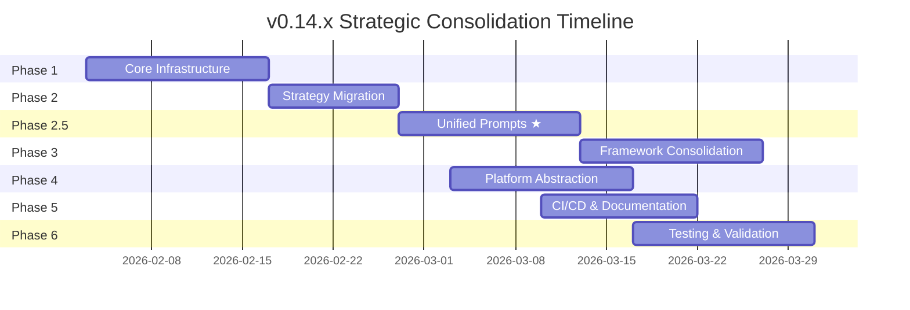
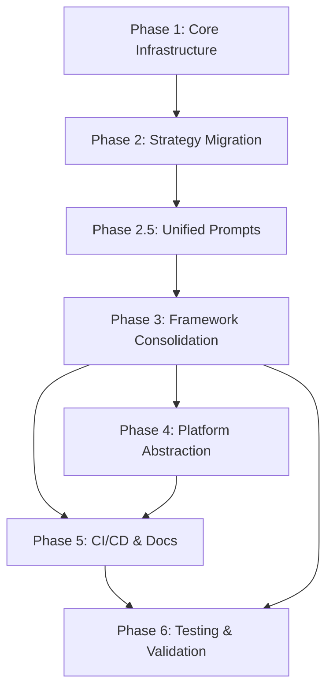

# Implementation Plan: MCP AI Agent Guidelines v0.14.x - Strategic Consolidation

**Status**: Active Planning
**Version**: 1.1.0
**Date**: 2026-02-01
**Total Duration**: 9 weeks (260 hours)

---

## 1. Approach

This implementation follows an iterative, phase-based approach with:

- **Test-Driven Development (TDD)**: Red-Green-Refactor cycle for all new code
- **Continuous Integration**: Every phase includes CI validation
- **Human-In-The-Loop**: Mandatory review at phase boundaries
- **Agent Handoffs**: Specialized agents for specific tasks
- **Detailed Task Guides**: Each task has a [detailed implementation guide](/plan-v0.14.x/speckit-v0.14.x-strategic-consolidation/tasks/README.md) with full code examples

### Key Architectural Patterns

| Pattern | Current State | Target State | Implementation |
|---------|---------------|--------------|----------------|
| Strategy abstraction | 7 independent classes | `BaseStrategy<T>` with generics | [T-001](/plan-v0.14.x/speckit-v0.14.x-strategic-consolidation/tasks/phase-1-foundation/T-001-base-strategy.md) |
| Execution tracing | None | `ExecutionTrace` with decisions/metrics | [T-003](/plan-v0.14.x/speckit-v0.14.x-strategic-consolidation/tasks/phase-1-foundation/T-003-execution-trace.md) |
| Prompt generation | 12+ builders with duplication | `UnifiedPromptBuilder` | [T-026](/plan-v0.14.x/speckit-v0.14.x-strategic-consolidation/tasks/phase-25-unified-prompts/T-026-unified-builder.md) |
| Framework routing | Direct instantiation | `FrameworkRouter` with registry | [T-037](/plan-v0.14.x/speckit-v0.14.x-strategic-consolidation/tasks/phase-3-consolidation/T-037-framework-router.md) |
| Platform ops | Direct fs/path | Platform Abstraction Layer | [T-053](/plan-v0.14.x/speckit-v0.14.x-strategic-consolidation/tasks/phase-4-platform/T-053-pal-interface.md) |

---

## 2. Phase Overview



---

## 3. Phase Details

### 3.1 Phase 1: Core Infrastructure (Weeks 1-2)

**Duration**: 2 weeks
**Effort**: 24 hours
**Status**: ⬜ Not Started
**Priority**: P0 (Critical Path)

#### Core Types to Create

```typescript
// src/domain/base-strategy/types.ts
export interface StrategyResult<T> {
  success: boolean;
  output?: T;
  error?: StrategyError;
  trace: ExecutionTraceData;
}

export interface ValidationResult {
  isValid: boolean;
  errors: ValidationIssue[];
  warnings: ValidationIssue[];
}

export interface Decision {
  id: string;
  timestamp: Date;
  category: string;
  description: string;
  context: Record<string, unknown>;
}
```

#### BaseStrategy<T> Implementation Target

```typescript
// src/domain/base-strategy/base-strategy.ts
export abstract class BaseStrategy<TInput, TOutput> {
  abstract readonly name: string;
  abstract readonly version: string;
  protected trace: ExecutionTrace;

  constructor(protected readonly inputSchema: z.ZodSchema<TInput>) {}

  async execute(rawInput: unknown): Promise<StrategyResult<TOutput>> {
    this.trace = new ExecutionTrace(this.name, this.version);

    // 1. Validate
    const validation = this.inputSchema.safeParse(rawInput);
    if (!validation.success) { /* record error, return failure */ }

    // 2. Execute
    const output = await this.executeStrategy(validation.data);

    // 3. Complete trace
    this.trace.complete();
    return { success: true, output, trace: this.trace.toData() };
  }

  protected abstract executeStrategy(input: TInput): Promise<TOutput>;
}
```

#### Deliverables with Detailed Guides

| ID   | Deliverable                     | Task Guide | Hours |
| ---- | ------------------------------- | ---------- | ----- |
| D1.1 | BaseStrategy<T>                 | [T-001](/plan-v0.14.x/speckit-v0.14.x-strategic-consolidation/tasks/phase-1-foundation/T-001-base-strategy.md) | 4h |
| D1.2 | ExecutionTrace                  | [T-003](/plan-v0.14.x/speckit-v0.14.x-strategic-consolidation/tasks/phase-1-foundation/T-003-execution-trace.md) | 4h |
| D1.3 | SummaryFeedbackCoordinator      | [T-005](/plan-v0.14.x/speckit-v0.14.x-strategic-consolidation/tasks/phase-1-foundation/T-005-summary-feedback.md) | 4h |
| D1.4 | AgentHandoffCoordinator         | [T-007](/plan-v0.14.x/speckit-v0.14.x-strategic-consolidation/tasks/phase-1-foundation/T-007-agent-handoff.md) | 4h |
| D1.5 | Update OutputStrategy interface | Part of T-001 | 2h |
| D1.6 | Tests for all components        | Included in each task | 6h |

#### Entry Criteria

- [ ] Specification approved
- [ ] Repository access confirmed
- [ ] Development environment ready

#### Exit Criteria

- [ ] All deliverables implemented
- [ ] 100% unit test coverage for new code
- [ ] Code review approved
- [ ] CI pipeline passing

#### Agent Assignments

| Task           | Primary Agent     | Reviewer              |
| -------------- | ----------------- | --------------------- |
| BaseStrategy   | @mcp-tool-builder | @code-reviewer        |
| ExecutionTrace | @mcp-tool-builder | @code-reviewer        |
| Coordinators   | @mcp-tool-builder | @architecture-advisor |
| Tests          | @tdd-workflow     | @code-reviewer        |

---

### 3.2 Phase 2: Strategy Migration (Weeks 2-3)

**Duration**: 1.5 weeks
**Effort**: 36 hours
**Status**: ⬜ Not Started
**Priority**: P0 (Critical Path)
**Dependencies**: Phase 1 complete

#### Migration Pattern

Each strategy will be migrated following this pattern:

```typescript
// BEFORE: src/strategies/speckit-strategy.ts (2181 lines)
export class SpecKitStrategy implements OutputStrategy {
  // Mixed concerns, no tracing, no generics
}

// AFTER: src/strategies/speckit/speckit-strategy.ts (~400 lines)
export class SpecKitStrategy extends BaseStrategy<SpecKitInput, SpecKitOutput> {
  readonly name = 'speckit';
  readonly version = '2.0.0';

  constructor() {
    super(SpecKitInputSchema);
  }

  protected async executeStrategy(input: SpecKitInput): Promise<SpecKitOutput> {
    // Orchestration only - business logic in domain layer
    this.trace.recordDecision('init', 'Starting SpecKit generation', { title: input.title });

    const state = createInitialSessionState(input);
    const artifacts = await this.generateAllArtifacts(state);

    return { artifacts, stats: this.computeStats(artifacts) };
  }
}
```

#### Domain Layer Structure (Per Strategy)

```
src/domain/speckit/
├── types.ts               # SpecKitInput, SpecKitOutput, SessionState
├── generators/
│   ├── spec-generator.ts  # generateSpec(state): MarkdownSection
│   ├── plan-generator.ts  # generatePlan(state): MarkdownSection
│   └── index.ts
├── validators/
│   └── constitution-validator.ts
└── index.ts
```

#### Strategies to Migrate

| Strategy | Current Lines | Target Lines | Task Guide | Complexity |
|----------|--------------|--------------|------------|------------|
| SpecKitStrategy | 2181 | ~400 | [T-011](/plan-v0.14.x/speckit-v0.14.x-strategic-consolidation/tasks/phase-2-migration/T-011-migrate-speckit.md) | High |
| TOGAFStrategy | ~1800 | ~350 | T-012 | Medium |
| ADRStrategy | ~800 | ~200 | T-013 | Low |
| RFCStrategy | ~700 | ~180 | T-014 | Low |
| EnterpriseStrategy | ~2000 | ~400 | T-015 | High |
| SDDStrategy | ~1200 | ~300 | T-016 | Medium |
| ChatStrategy | ~500 | ~150 | T-017 | Low |

#### Exit Criteria

- [ ] All 7 strategies extend BaseStrategy<T>
- [ ] ExecutionTrace enabled for all strategies
- [ ] Cyclomatic complexity <10 for score-mapping
- [ ] 90% test coverage for migrated code

---

### 3.3 Phase 2.5: Unified Prompt Ecosystem (Weeks 3-4) ★

**Duration**: 2 weeks
**Effort**: 55 hours
**Status**: ⬜ Not Started
**Priority**: P0 (Critical Path)
**Dependencies**: Phase 2 complete

> ⚠️ **BREAKING CHANGE**: This phase has strict "no backward compatibility" policy for internal prompt builder APIs. Public facades will maintain compatibility.

#### Target Architecture

```typescript
// src/domain/prompts/unified-prompt-builder.ts
export class UnifiedPromptBuilder {
  constructor(
    private readonly registry: PromptRegistry,
    private readonly templateEngine: TemplateEngine
  ) {}

  build<T>(request: PromptRequest): PromptResult<T> {
    // 1. Get domain generator
    const generator = this.registry.get(request.domain);

    // 2. Generate sections
    const sections = generator.generate(request);

    // 3. Apply template
    return this.templateEngine.render(sections, request.options);
  }
}

// Usage (new way)
const builder = new UnifiedPromptBuilder(registry, engine);
const result = builder.build({
  domain: 'hierarchical',
  context: 'Microservices authentication',
  goal: 'Implement OAuth2 flow',
  requirements: ['JWT tokens', 'Refresh token rotation'],
});

// Usage (legacy facade - deprecated)
const legacyBuilder = new HierarchicalPromptBuilder(); // ⚠️ emits deprecation warning
```

#### Components to Build

| Component | Purpose | Task Guide |
|-----------|---------|------------|
| PromptRegistry | Singleton registry of domain generators | [T-024](/plan-v0.14.x/speckit-v0.14.x-strategic-consolidation/tasks/phase-25-unified-prompts/T-024-prompt-registry.md) |
| TemplateEngine | Markdown/XML template composition | [T-025](/plan-v0.14.x/speckit-v0.14.x-strategic-consolidation/tasks/phase-25-unified-prompts/T-025-template-engine.md) |
| UnifiedPromptBuilder | Single entry point | [T-026](/plan-v0.14.x/speckit-v0.14.x-strategic-consolidation/tasks/phase-25-unified-prompts/T-026-unified-builder.md) |
| HierarchicalGenerator | Domain generator | Part of T-026 |
| LegacyFacades | Backward compatibility | [T-032](/plan-v0.14.x/speckit-v0.14.x-strategic-consolidation/tasks/phase-25-unified-prompts/T-032-legacy-facades.md) |

#### Deliverables

| ID     | Deliverable                          | Hours |
| ------ | ------------------------------------ | ----- |
| D2.5.1 | UnifiedPromptBuilder core            | 8h    |
| D2.5.2 | PromptRegistry                       | 4h    |
| D2.5.3 | TemplateEngine                       | 6h    |
| D2.5.4 | Domain generators (5)                | `src/domain/prompts/domains/`                  | 15h   |
| D2.5.5 | Legacy facades                       | `src/tools/prompts/legacy-facades/`            | 8h    |
| D2.5.6 | ToolAnnotations for all prompt tools | Various                                        | 6h    |
| D2.5.7 | Tests                                | `tests/vitest/domain/prompts/`                 | 8h    |

#### Exit Criteria

- [ ] Single entry point for all prompt generation
- [ ] All legacy builders deprecated with warnings
- [ ] 100% ToolAnnotations coverage for prompt tools
- [ ] Migration guide complete

---

### 3.4 Phase 3: Framework Consolidation (Weeks 4-6)

**Duration**: 2 weeks
**Effort**: 42 hours
**Status**: ⬜ Not Started
**Priority**: P0
**Dependencies**: Phase 2.5 complete

#### Objectives

1. Consolidate 30+ tools into 11 unified frameworks
2. Implement GAP-002 (Schema Examples)
3. Implement GAP-004 (Deprecation Helpers)
4. Implement GAP-008 (Progress Standardization)

#### Target Frameworks (11)

| #   | Framework               | Current Tools                             | New Entry Point                |
| --- | ----------------------- | ----------------------------------------- | ------------------------------ |
| 1   | Prompt Engineering      | hierarchical, domain-neutral, spark       | `prompt-engineering-framework` |
| 2   | Code Quality & Analysis | clean-code-scorer, code-hygiene, semantic | `code-quality-framework`       |
| 3   | Design & Architecture   | architecture-design, l9-engineer          | `design-framework`             |
| 4   | Security & Compliance   | security-hardening, vulnerability         | `security-framework`           |
| 5   | Testing & Coverage      | coverage-enhancer, coverage-dashboard     | `testing-framework`            |
| 6   | Documentation           | documentation-generator, quick-prompts    | `documentation-framework`      |
| 7   | Strategic Planning      | strategy-frameworks, gap-analysis         | `strategy-framework`           |
| 8   | AI Agent Orchestration  | agent-orchestrator, design-assistant      | `orchestration-framework`      |
| 9   | Prompt Optimization     | memory-optimizer, hierarchy-selector      | `optimization-framework`       |
| 10  | Visualization           | mermaid-generator, spark-ui               | `visualization-framework`      |
| 11  | Project Management      | speckit-generator, sprint-calculator      | `project-framework`            |

#### Deliverables

| ID   | Deliverable                       | Hours |
| ---- | --------------------------------- | ----- |
| D3.1 | Framework router                  | 4h    |
| D3.2 | 11 framework implementations      | 20h   |
| D3.3 | GAP-002: Zod .describe() coverage | 6h    |
| D3.4 | GAP-004: warnDeprecated() helper  | 4h    |
| D3.5 | GAP-008: validate_progress tool   | 6h    |
| D3.6 | Tests                             | 2h    |

---

### 3.5 Phase 4: Platform Abstraction (Weeks 5-7)

**Duration**: 2 weeks
**Effort**: 29 hours
**Status**: ⬜ Not Started
**Priority**: P1
**Dependencies**: Phase 3 started

#### Objectives

1. Create Platform Abstraction Layer (PAL) interface
2. Implement NodePAL for Node.js runtime
3. Implement MockPAL for testing
4. Replace all direct fs/path calls

#### PAL Interface

```typescript
interface PlatformAbstractionLayer {
  // File operations
  readFile(path: string): Promise<string>;
  writeFile(path: string, content: string): Promise<void>;
  exists(path: string): Promise<boolean>;

  // Directory operations
  listFiles(dir: string, pattern?: string): Promise<string[]>;
  createDir(path: string): Promise<void>;

  // Path operations
  resolvePath(...segments: string[]): string;
  joinPath(...segments: string[]): string;
  dirname(path: string): string;
  basename(path: string): string;

  // Environment
  getEnv(key: string): string | undefined;
  getPlatform(): 'darwin' | 'linux' | 'win32';
}
```

#### Deliverables

| ID   | Deliverable            | File                            | Hours |
| ---- | ---------------------- | ------------------------------- | ----- |
| D4.1 | PAL interface          | `src/platform/pal.interface.ts` | 3h    |
| D4.2 | NodePAL implementation | `src/platform/node-pal.ts`      | 6h    |
| D4.3 | MockPAL implementation | `src/platform/mock-pal.ts`      | 4h    |
| D4.4 | Replace fs/path calls  | Various                         | 12h   |
| D4.5 | Tests                  | `tests/vitest/platform/`        | 4h    |

---

### 3.6 Phase 5: CI/CD & Documentation (Weeks 6-8)

**Duration**: 1.5 weeks
**Effort**: 24 hours
**Status**: ⬜ Not Started
**Priority**: P1
**Dependencies**: Phases 3-4 complete

#### Objectives

1. Add CI jobs for enforcement tools
2. Optimize CI pipeline to ≤12 minutes
3. Generate API documentation
4. Create migration guide
5. Implement GAP-005 (CSV Export)

#### Deliverables

| ID   | Deliverable                      | Hours |
| ---- | -------------------------------- | ----- |
| D5.1 | CI job: validate_progress        | 2h    |
| D5.2 | CI job: validate_annotations     | 2h    |
| D5.3 | CI job: validate_schema_examples | 2h    |
| D5.4 | CI optimization                  | 4h    |
| D5.5 | API documentation                | 6h    |
| D5.6 | Migration guide                  | 4h    |
| D5.7 | GAP-005: CSV export script       | 4h    |

---

### 3.7 Phase 6: Testing & Validation (Weeks 7-9)

**Duration**: 2 weeks
**Effort**: 50 hours
**Status**: ⬜ Not Started
**Priority**: P0
**Dependencies**: All previous phases

#### Objectives

1. Achieve ≥90% test coverage
2. CI matrix testing (Windows, Linux, macOS)
3. Integration testing
4. Final validation of all acceptance criteria

#### Coverage Targets

| Layer       | Target         | Strategy           |
| ----------- | -------------- | ------------------ |
| Domain      | 100%           | Unit tests         |
| Tools       | 90%            | Unit + Integration |
| Integration | Critical paths | E2E tests          |

#### Deliverables

| ID   | Deliverable               | Hours |
| ---- | ------------------------- | ----- |
| D6.1 | Domain layer tests (100%) | 12h   |
| D6.2 | Tools layer tests (90%)   | 15h   |
| D6.3 | Integration tests         | 8h    |
| D6.4 | CI matrix setup           | 4h    |
| D6.5 | Enforcement tool tests    | 6h    |
| D6.6 | Final validation          | 5h    |

---

## 4. Dependencies Graph



---

## 5. Risk Management

| Risk                                 | Phase | Mitigation                    | Owner                    |
| ------------------------------------ | ----- | ----------------------------- | ------------------------ |
| BaseStrategy complexity              | P1    | Start simple, iterate         | @mcp-tool-builder        |
| Strategy migration breaks tests      | P2    | Parallel test suites          | @tdd-workflow            |
| Breaking change impact               | P2.5  | Clear migration guide         | @documentation-generator |
| Framework consolidation misses cases | P3    | Extensive integration testing | @code-reviewer           |
| PAL performance overhead             | P4    | Benchmark early               | @performance-optimizer   |
| Coverage target unreachable          | P6    | Refactor for testability      | @tdd-workflow            |

---

## 6. Communication Plan

| Event            | Frequency | Audience         |
| ---------------- | --------- | ---------------- |
| Phase kickoff    | Per phase | All contributors |
| Progress update  | Weekly    | Project owner    |
| Risk escalation  | As needed | Project owner    |
| Phase completion | Per phase | All stakeholders |

---

*See [tasks.md](/plan-v0.14.x/speckit-v0.14.x-strategic-consolidation/tasks.md) for detailed task breakdown*
*See [roadmap.md](/plan-v0.14.x/speckit-v0.14.x-strategic-consolidation/roadmap.md) for milestones and deliverables*
