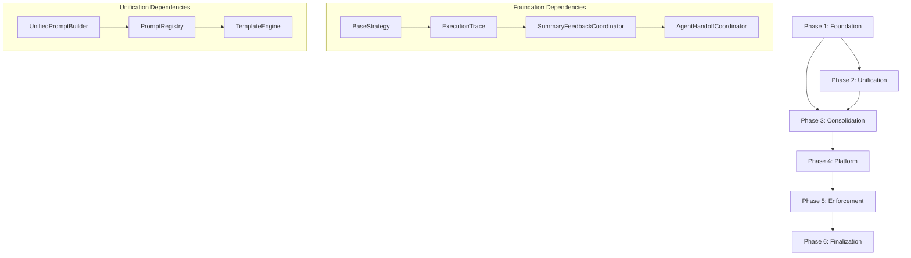

# Roadmap: MCP AI Agent Guidelines v0.14.x - Strategic Consolidation

## Executive Summary

This roadmap outlines the v0.14.x refactoring journey from February 2026 through Q1 2027, transforming the MCP AI Agent Guidelines from a fragmented toolset (30+ tools) into a unified, HITL-compliant framework with 11 consolidated frameworks.

---

## Timeline Overview

```mermaid
gantt
    title v0.14.x Strategic Consolidation Roadmap
    dateFormat YYYY-MM-DD
    excludes weekends

    section Phase 1: Foundation
    BaseStrategy Implementation     :p1a, 2026-02-03, 7d
    ExecutionTrace System          :p1b, after p1a, 5d
    Phase 1 Validation             :p1v, after p1b, 2d

    section Phase 2: Unification
    UnifiedPromptBuilder           :p2a, 2026-02-17, 10d
    Legacy Facades                 :p2b, after p2a, 5d
    Phase 2 Validation             :p2v, after p2b, 2d

    section Phase 3: Consolidation
    Framework Router               :p3a, 2026-03-03, 7d
    Tool Migration                 :p3b, after p3a, 8d
    Phase 3 Validation             :p3v, after p3b, 3d

    section Phase 4: Platform
    PAL Core Interface             :p4a, 2026-03-21, 5d
    NodePAL + MockPAL              :p4b, after p4a, 7d
    Codebase Migration             :p4c, after p4b, 5d
    Phase 4 Validation             :p4v, after p4c, 2d

    section Phase 5: Enforcement
    Enforcement Tools              :p5a, 2026-04-07, 7d
    CI Integration                 :p5b, after p5a, 5d
    Phase 5 Validation             :p5v, after p5b, 2d

    section Phase 6: Finalization
    Documentation Sprint           :p6a, 2026-04-21, 5d
    Release Prep                   :p6b, after p6a, 3d
    Final Validation               :p6v, after p6b, 3d

    section Milestones
    M1: Foundation Ready           :milestone, m1, after p1v, 0d
    M2: Unified Prompts            :milestone, m2, after p2v, 0d
    M3: Frameworks Consolidated    :milestone, m3, after p3v, 0d
    M4: Cross-Platform Ready       :milestone, m4, after p4v, 0d
    M5: Enforcement Active         :milestone, m5, after p5v, 0d
    M6: v0.14.0 Release            :milestone, m6, after p6v, 0d
```

---

## Quarterly View

### Q1 2026 (Feb - Mar)

| Month         | Focus         | Deliverables                       | Status        |
| ------------- | ------------- | ---------------------------------- | ------------- |
| **Feb W1-W2** | Foundation    | BaseStrategy, ExecutionTrace       | 🔴 Not Started |
| **Feb W3-W4** | Unification   | UnifiedPromptBuilder, 7 strategies | 🔴 Not Started |
| **Mar W1-W2** | Consolidation | 11 frameworks, router pattern      | 🔴 Not Started |
| **Mar W3-W4** | Platform      | PAL core, NodePAL, MockPAL         | 🔴 Not Started |

### Q2 2026 (Apr)

| Month         | Focus         | Deliverables                | Status        |
| ------------- | ------------- | --------------------------- | ------------- |
| **Apr W1-W2** | Enforcement   | 5 validation tools, CI jobs | 🔴 Not Started |
| **Apr W3**    | Documentation | Migration guide, API docs   | 🔴 Not Started |
| **Apr W4**    | Release       | v0.14.0 stable release      | 🔴 Not Started |

---

## Milestones

### M1: Foundation Ready (Week 2)

**Criteria:**
- [ ] BaseStrategy<T> abstract class implemented
- [ ] ExecutionTrace logging system operational
- [ ] 7 strategy implementations migrated
- [ ] 90% test coverage on foundation layer

**Deliverables:**
- `src/strategies/shared/base-strategy.ts`
- `src/strategies/shared/execution-trace.ts`
- 7 strategy files in `src/strategies/`

### M2: Unified Prompts (Week 4)

**Criteria:**
- [ ] UnifiedPromptBuilder operational
- [ ] PromptRegistry with all domains registered
- [ ] Legacy facades with deprecation warnings
- [ ] 90% test coverage on prompt layer

**Deliverables:**
- `src/domain/prompts/unified-prompt-builder.ts`
- `src/domain/prompts/prompt-registry.ts`
- 12 legacy facades updated

### M3: Frameworks Consolidated (Week 6)

**Criteria:**
- [ ] FrameworkRouter operational
- [ ] 30 tools consolidated into 11 frameworks
- [ ] All framework tests passing
- [ ] 90% coverage maintained

**Deliverables:**
- `src/frameworks/framework-router.ts`
- 11 framework modules in `src/frameworks/`
- Updated barrel files (`index.ts`)

### M4: Cross-Platform Ready (Week 7)

**Criteria:**
- [ ] PAL interface finalized
- [ ] NodePAL production implementation complete
- [ ] MockPAL testing implementation complete
- [ ] All fs/path calls migrated

**Deliverables:**
- `src/platform/pal-interface.ts`
- `src/platform/node-pal.ts`
- `src/platform/mock-pal.ts`
- Zero direct `fs` imports in `src/`

### M5: Enforcement Active (Week 8)

**Criteria:**
- [ ] 5 enforcement tools operational
- [ ] CI pipeline integrated
- [ ] 100% ToolAnnotations coverage
- [ ] All schema descriptions present

**Deliverables:**
- 5 tools in `src/tools/enforcement/`
- `.github/workflows/enforce-quality.yml`
- Updated `ci.yml` with enforcement jobs

### M6: v0.14.0 Release (Week 9)

**Criteria:**
- [ ] All 14 acceptance criteria met
- [ ] Documentation complete
- [ ] Migration guide published
- [ ] CHANGELOG updated
- [ ] GitHub release created

**Deliverables:**
- Updated `README.md`
- `docs/migration/v0.14.md`
- `CHANGELOG.md` entry
- GitHub release v0.14.0

---

## Risk Registry

| ID  | Risk                            | Probability | Impact | Mitigation                                 | Owner                  |
| --- | ------------------------------- | ----------- | ------ | ------------------------------------------ | ---------------------- |
| R1  | Strategy migration breaks tests | Medium      | High   | Comprehensive test suite before migration  | @mcp-tool-builder      |
| R2  | PAL performance overhead        | Low         | Medium | Benchmark before/after, optimize hot paths | @performance-optimizer |
| R3  | Legacy facade compatibility     | Medium      | Medium | Extensive integration testing              | @tdd-workflow          |
| R4  | CI enforcement blocks PRs       | High        | Low    | Gradual rollout, warning-only mode first   | @ci-fixer              |
| R5  | Scope creep from GAP items      | Medium      | Medium | Strict deferral to v0.15.x                 | @architecture-advisor  |

---

## Resource Allocation

### Team Capacity

| Agent                    | Primary Focus  | Allocation |
| ------------------------ | -------------- | ---------- |
| @mcp-tool-builder        | Implementation | 40%        |
| @tdd-workflow            | Testing        | 25%        |
| @code-reviewer           | Quality        | 15%        |
| @documentation-generator | Docs           | 10%        |
| @security-auditor        | Security       | 5%         |
| @architecture-advisor    | ADRs           | 5%         |

### Effort Distribution

| Phase                  | Hours    | % of Total |
| ---------------------- | -------- | ---------- |
| Phase 1: Foundation    | 50h      | 19%        |
| Phase 2: Unification   | 55h      | 21%        |
| Phase 3: Consolidation | 55h      | 21%        |
| Phase 4: Platform      | 40h      | 15%        |
| Phase 5: Enforcement   | 35h      | 13%        |
| Phase 6: Finalization  | 25h      | 10%        |
| **Total**              | **260h** | **100%**   |

---

## Dependencies

### External Dependencies

| Dependency | Version | Purpose           | Risk |
| ---------- | ------- | ----------------- | ---- |
| MCP SDK    | ^1.0.0  | Tool registration | Low  |
| Zod        | ^3.22.0 | Schema validation | Low  |
| Vitest     | ^2.0.0  | Testing framework | Low  |
| TypeScript | ^5.3.0  | Type system       | Low  |

### Internal Dependencies



---

## Success Metrics

### Quantitative Targets

| Metric          | Current | Target | Measurement                            |
| --------------- | ------- | ------ | -------------------------------------- |
| Tool count      | 30+     | 11     | `find src/tools -name "*.ts" \| wc -l` |
| Test coverage   | 75%     | 90%    | `npm run test:coverage`                |
| Build time      | 45s     | 30s    | CI metrics                             |
| Bundle size     | 2.1MB   | 1.5MB  | `npm run build:analyze`                |
| ToolAnnotations | 60%     | 100%   | `npm run validate:annotations`         |

### Qualitative Targets

| Goal            | Definition of Done                                      |
| --------------- | ------------------------------------------------------- |
| HITL Compliance | All strategies use BaseStrategy with mandatory feedback |
| Cross-Platform  | PAL abstraction with no direct fs/path calls            |
| Documentation   | Complete API docs, migration guide, ADRs                |
| CI Integration  | All enforcement tools in CI pipeline                    |

---

## Communication Plan

### Stakeholder Updates

| Audience     | Channel            | Frequency  | Content                     |
| ------------ | ------------------ | ---------- | --------------------------- |
| Contributors | GitHub Discussions | Weekly     | Progress summary, blockers  |
| Maintainers  | progress.md        | Per phase  | Detailed status             |
| Users        | CHANGELOG          | On release | Breaking changes, migration |

### Decision Points

| Decision            | When                  | Decision Maker        | Escalation        |
| ------------------- | --------------------- | --------------------- | ----------------- |
| Phase gate approval | End of each phase     | @architecture-advisor | @mcp-tool-builder |
| Scope change        | Any time              | @mcp-tool-builder     | Maintainers       |
| Breaking change     | Before implementation | Maintainers           | Community vote    |

---

## Future Roadmap (v0.15.x Preview)

### Deferred Items from GAP Analysis

| ID      | Item                      | Reason for Deferral   | Target  |
| ------- | ------------------------- | --------------------- | ------- |
| GAP-002 | Multi-Model Orchestration | Needs design research | v0.15.0 |
| GAP-008 | AI-Native IDE Integration | External dependency   | v0.15.x |

### v0.15.x Planning

| Feature             | Description                       | Effort |
| ------------------- | --------------------------------- | ------ |
| Multi-Model Support | Claude, GPT-4.5, Gemini routing   | 80h    |
| IDE Plugins         | VS Code, Cursor, Zed integrations | 120h   |
| Enterprise Features | RBAC, audit logging, SSO          | 100h   |

---

## Appendix

### Quick Reference

| Item                   | Link                         |
| ---------------------- | ---------------------------- |
| Specification          | [spec.md](./spec.md)         |
| Implementation Plan    | [plan.md](./plan.md)         |
| Task Breakdown         | [tasks.md](./tasks.md)       |
| Progress Tracking      | [progress.md](./progress.md) |
| Architecture Decisions | [adr.md](./adr.md)           |

### Contact

- **Primary**: @mcp-tool-builder
- **Testing**: @tdd-workflow
- **Architecture**: @architecture-advisor
- **Documentation**: @documentation-generator

---

*Last Updated: 2026-02-01*
*Version: 0.14.x-roadmap-v1*
