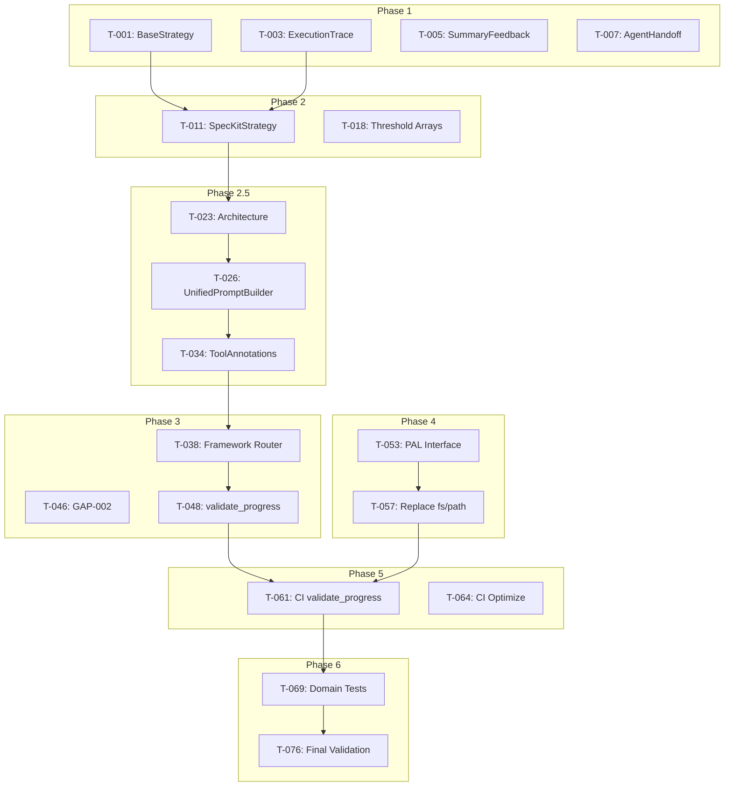

# Tasks: MCP AI Agent Guidelines v0.14.x - Strategic Consolidation

**Total Tasks**: 74 implementation + 14 validation = 88 tasks
**Estimated Effort**: 260 hours (~33 working days)
**Status**: ⬜ Not Started

---

## Task Summary by Phase

| Phase                            | Tasks  | Effort   | Status |
| -------------------------------- | ------ | -------- | ------ |
| Phase 1: Core Infrastructure     | 10     | 24h      | ⬜      |
| Phase 2: Strategy Migration      | 12     | 36h      | ⬜      |
| Phase 2.5: Unified Prompts       | 14     | 55h      | ⬜      |
| Phase 3: Framework Consolidation | 16     | 42h      | ⬜      |
| Phase 4: Platform Abstraction    | 10     | 29h      | ⬜      |
| Phase 5: CI/CD & Documentation   | 12     | 24h      | ⬜      |
| Phase 6: Testing & Validation    | 14     | 50h      | ⬜      |
| **Total**                        | **88** | **260h** |        |

---

## Phase 1: Core Infrastructure (Weeks 1-2)

### T-001: Create BaseStrategy<T> Abstract Class

- **ID**: T-001
- **Priority**: P0
- **Estimate**: 4h
- **Owner**: @mcp-tool-builder
- **Dependencies**: None
- **References**: REQ-001 (spec.md), ADR-001 (adr.md), AC-005 (spec.md)

**Description**: Create abstract base class for all strategy implementations enforcing consistent interface, validation, and ExecutionTrace logging. This implements the foundational pattern for mandatory HITL (Human-In-The-Loop) feedback across all 7 strategies (SpecKit, TOGAF, ADR, RFC, Enterprise, SDD, Chat), as specified in ADR-001. The template method pattern ensures ExecutionTrace logging cannot be bypassed.

**File**: `src/strategies/shared/base-strategy.ts`

**Implementation**:
```typescript
export abstract class BaseStrategy<TInput, TOutput> {
  protected trace: ExecutionTrace;

  abstract execute(input: TInput): Promise<TOutput>;
  abstract validate(input: TInput): ValidationResult;

  async run(input: TInput): Promise<StrategyResult<TOutput>> {
    // Template method pattern
  }
}
```

**Acceptance Criteria**:
- [ ] Abstract class with generic types
- [ ] Template method pattern for run()
- [ ] ExecutionTrace integration
- [ ] TypeScript strict mode compliant
- [ ] JSDoc documentation

---

### T-002: Test BaseStrategy<T>

- **ID**: T-002
- **Priority**: P0
- **Estimate**: 2h
- **Owner**: @tdd-workflow
- **Dependencies**: T-001

**File**: `tests/vitest/strategies/shared/base-strategy.spec.ts`

**Acceptance Criteria**:
- [ ] Tests for validate() flow
- [ ] Tests for execute() flow
- [ ] Tests for error handling
- [ ] 100% coverage of BaseStrategy

---

### T-003: Implement ExecutionTrace Class

- **ID**: T-003
- **Priority**: P0
- **Estimate**: 4h
- **Owner**: @mcp-tool-builder
- **Dependencies**: None
- **References**: REQ-002 (spec.md), ADR-001 (adr.md), AC-013 (spec.md)

**Description**: Implement decision logging class for transparency and debugging. ExecutionTrace records all strategy decisions (recordDecision), metrics (recordMetric), and errors (recordError) with timestamps, enabling full audit trails for AI agent workflows. Supports serialization to JSON and Markdown for integration with reporting tools. Critical for AC-013 validation.

**File**: `src/shared/execution-trace.ts`

**Methods**:
- `recordDecision(decision: string, rationale: string): void`
- `recordMetric(name: string, value: number): void`
- `recordError(error: Error): void`
- `toJSON(): TraceExport`
- `toMarkdown(): string`

**Acceptance Criteria**:
- [ ] All methods implemented
- [ ] Immutable event log
- [ ] Serialization support
- [ ] Markdown export support

---

### T-004: Test ExecutionTrace

- **ID**: T-004
- **Priority**: P0
- **Estimate**: 2h
- **Owner**: @tdd-workflow
- **Dependencies**: T-003

**File**: `tests/vitest/shared/execution-trace.spec.ts`

---

### T-005: Create SummaryFeedbackCoordinator

- **ID**: T-005
- **Priority**: P0
- **Estimate**: 4h
- **Owner**: @mcp-tool-builder
- **Dependencies**: None

**Description**: Implement mandatory HITL approval workflow.

**File**: `src/coordinators/summary-feedback.ts`

**Configuration**:
```typescript
interface FeedbackConfig {
  timeout: number;        // ms
  retries: number;
  requireExplicit: boolean;
  showConfidence: boolean;
}
```

---

### T-006: Test SummaryFeedbackCoordinator

- **ID**: T-006
- **Priority**: P0
- **Estimate**: 2h
- **Owner**: @tdd-workflow
- **Dependencies**: T-005

---

### T-007: Create AgentHandoffCoordinator

- **ID**: T-007
- **Priority**: P0
- **Estimate**: 4h
- **Owner**: @mcp-tool-builder
- **Dependencies**: None

**Description**: Implement agent handoff with anchor points.

**File**: `src/coordinators/agent-handoff.ts`

**Anchor Points**:
- PRD-REVIEW
- IMPLEMENTATION-GUIDANCE
- TASK-BREAKDOWN
- PR-REVIEW
- INTEGRATION-COMPLETE

---

### T-008: Test AgentHandoffCoordinator

- **ID**: T-008
- **Priority**: P0
- **Estimate**: 2h
- **Owner**: @tdd-workflow
- **Dependencies**: T-007

---

### T-009: Update OutputStrategy Interface

- **ID**: T-009
- **Priority**: P0
- **Estimate**: 2h
- **Owner**: @mcp-tool-builder
- **Dependencies**: T-001

**File**: `src/strategies/output-strategy.ts`

**Description**: Update to integrate with BaseStrategy pattern.

---

### T-010: Phase 1 Integration Test

- **ID**: T-010
- **Priority**: P0
- **Estimate**: 2h
- **Owner**: @tdd-workflow
- **Dependencies**: T-001 through T-009

**Description**: Verify all Phase 1 components work together.

---

## Phase 2: Strategy Migration (Weeks 2-3)

### T-011: Migrate SpecKitStrategy

- **ID**: T-011
- **Priority**: P0
- **Estimate**: 6h
- **Owner**: @mcp-tool-builder
- **Dependencies**: T-001, T-003

**File**: `src/strategies/speckit/speckit-strategy.ts`

**Acceptance Criteria**:
- [ ] Extends BaseStrategy<SessionState, SpecKitOutput>
- [ ] ExecutionTrace enabled
- [ ] Mandatory summary feedback
- [ ] All existing tests pass

---

### T-012: Migrate TOGAFStrategy

- **ID**: T-012
- **Priority**: P0
- **Estimate**: 4h
- **Owner**: @mcp-tool-builder
- **Dependencies**: T-001, T-003

---

### T-013: Migrate ADRStrategy

- **ID**: T-013
- **Priority**: P0
- **Estimate**: 3h
- **Owner**: @mcp-tool-builder
- **Dependencies**: T-001, T-003

---

### T-014: Migrate RFCStrategy

- **ID**: T-014
- **Priority**: P0
- **Estimate**: 3h
- **Owner**: @mcp-tool-builder
- **Dependencies**: T-001, T-003

---

### T-015: Migrate EnterpriseStrategy

- **ID**: T-015
- **Priority**: P0
- **Estimate**: 6h
- **Owner**: @mcp-tool-builder
- **Dependencies**: T-001, T-003

---

### T-016: Migrate SDDStrategy

- **ID**: T-016
- **Priority**: P0
- **Estimate**: 4h
- **Owner**: @mcp-tool-builder
- **Dependencies**: T-001, T-003

---

### T-017: Migrate ChatStrategy

- **ID**: T-017
- **Priority**: P0
- **Estimate**: 3h
- **Owner**: @mcp-tool-builder
- **Dependencies**: T-001, T-003

---

### T-018: Convert Score-Mapping to Threshold Arrays

- **ID**: T-018
- **Priority**: P0
- **Estimate**: 4h
- **Owner**: @mcp-tool-builder
- **Dependencies**: None

**Description**: Refactor if/elif chains to data-driven threshold arrays.

**Before**:
```typescript
if (score >= 90) return 'A';
else if (score >= 80) return 'B';
// ...
```

**After**:
```typescript
const THRESHOLDS = [
  { min: 90, grade: 'A' },
  { min: 80, grade: 'B' },
  // ...
];
```

---

### T-019: Test Score-Mapping Thresholds

- **ID**: T-019
- **Priority**: P0
- **Estimate**: 2h
- **Owner**: @tdd-workflow
- **Dependencies**: T-018

**Description**: 100% coverage of all threshold boundaries.

---

### T-020: Test All Migrated Strategies

- **ID**: T-020
- **Priority**: P0
- **Estimate**: 3h
- **Owner**: @tdd-workflow
- **Dependencies**: T-011 through T-017

---

### T-021: Verify BaseStrategy Compliance

- **ID**: T-021
- **Priority**: P0
- **Estimate**: 2h
- **Owner**: @code-reviewer
- **Dependencies**: T-011 through T-017

**Description**: Verify all 7 strategies extend BaseStrategy<T> correctly.

---

### T-022: Phase 2 Integration Test

- **ID**: T-022
- **Priority**: P0
- **Estimate**: 2h
- **Owner**: @tdd-workflow
- **Dependencies**: T-011 through T-021

---

## Phase 2.5: Unified Prompt Ecosystem (Weeks 3-4) ★

### T-023: Design UnifiedPromptBuilder Architecture

- **ID**: T-023
- **Priority**: P0
- **Estimate**: 4h
- **Owner**: @architecture-advisor
- **Dependencies**: T-022

**Deliverable**: ADR document for unified prompt architecture.

---

### T-024: Implement PromptRegistry

- **ID**: T-024
- **Priority**: P0
- **Estimate**: 4h
- **Owner**: @mcp-tool-builder
- **Dependencies**: T-023

**File**: `src/domain/prompts/registry.ts`

---

### T-025: Implement TemplateEngine

- **ID**: T-025
- **Priority**: P0
- **Estimate**: 6h
- **Owner**: @mcp-tool-builder
- **Dependencies**: T-023

**File**: `src/domain/prompts/template-engine.ts`

---

### T-026: Implement UnifiedPromptBuilder Core

- **ID**: T-026
- **Priority**: P0
- **Estimate**: 8h
- **Owner**: @mcp-tool-builder
- **Dependencies**: T-024, T-025
- **References**: REQ-007 (spec.md), ADR-003 (adr.md), AC-009 (spec.md)

**Description**: Implement UnifiedPromptBuilder as the single entry point for all prompt generation, replacing 12+ scattered prompt builders. Uses PromptRegistry for domain routing and TemplateEngine for consistent output formatting. This is a BREAKING CHANGE with strict "no backward compatibility" policy for internal APIs (Phase 2.5). Achieves 92% reduction in prompt builders per ADR-003, enabling AC-009 validation.

**File**: `src/domain/prompts/unified-prompt-builder.ts`

---

### T-027: Implement Domain Generator: Hierarchical

- **ID**: T-027
- **Priority**: P0
- **Estimate**: 3h
- **Owner**: @mcp-tool-builder
- **Dependencies**: T-026

**File**: `src/domain/prompts/domains/hierarchical.ts`

---

### T-028: Implement Domain Generator: Security

- **ID**: T-028
- **Priority**: P0
- **Estimate**: 3h
- **Owner**: @mcp-tool-builder
- **Dependencies**: T-026

---

### T-029: Implement Domain Generator: Architecture

- **ID**: T-029
- **Priority**: P0
- **Estimate**: 3h
- **Owner**: @mcp-tool-builder
- **Dependencies**: T-026

---

### T-030: Implement Domain Generator: Code Analysis

- **ID**: T-030
- **Priority**: P0
- **Estimate**: 3h
- **Owner**: @mcp-tool-builder
- **Dependencies**: T-026

---

### T-031: Implement Domain Generator: Domain Neutral

- **ID**: T-031
- **Priority**: P0
- **Estimate**: 3h
- **Owner**: @mcp-tool-builder
- **Dependencies**: T-026

---

### T-032: Create Legacy Facade: HierarchicalPromptBuilder

- **ID**: T-032
- **Priority**: P0
- **Estimate**: 4h
- **Owner**: @mcp-tool-builder
- **Dependencies**: T-026

**File**: `src/tools/prompts/legacy-facades/hierarchical-facade.ts`

**Requirements**:
- Deprecation warning on construction
- Maps to UnifiedPromptBuilder internally

---

### T-033: Create Legacy Facade: DomainNeutralPromptBuilder

- **ID**: T-033
- **Priority**: P0
- **Estimate**: 4h
- **Owner**: @mcp-tool-builder
- **Dependencies**: T-026

---

### T-034: Add ToolAnnotations to All Prompt Tools (GAP-001)

- **ID**: T-034
- **Priority**: P0
- **Estimate**: 6h
- **Owner**: @mcp-tool-builder
- **Dependencies**: T-026

**Files**: All prompt builder tools in `src/tools/prompts/`

---

### T-035: Test UnifiedPromptBuilder

- **ID**: T-035
- **Priority**: P0
- **Estimate**: 6h
- **Owner**: @tdd-workflow
- **Dependencies**: T-026

---

### T-036: Phase 2.5 Integration Test

- **ID**: T-036
- **Priority**: P0
- **Estimate**: 2h
- **Owner**: @tdd-workflow
- **Dependencies**: T-027 through T-034

---

## Phase 3: Framework Consolidation (Weeks 4-6)

### T-037: Design Framework Router Architecture

- **ID**: T-037
- **Priority**: P0
- **Estimate**: 4h
- **Owner**: @architecture-advisor
- **Dependencies**: T-036

---

### T-038: Implement Framework Router

- **ID**: T-038
- **Priority**: P0
- **Estimate**: 4h
- **Owner**: @mcp-tool-builder
- **Dependencies**: T-037

**File**: `src/frameworks/registry.ts`

---

### T-039: Consolidate Prompt Engineering Framework

- **ID**: T-039
- **Priority**: P0
- **Estimate**: 2h
- **Owner**: @mcp-tool-builder
- **Dependencies**: T-038

---

### T-040: Consolidate Code Quality Framework

- **ID**: T-040
- **Priority**: P0
- **Estimate**: 2h
- **Owner**: @mcp-tool-builder
- **Dependencies**: T-038

---

### T-041: Consolidate Design & Architecture Framework

- **ID**: T-041
- **Priority**: P0
- **Estimate**: 2h
- **Owner**: @mcp-tool-builder
- **Dependencies**: T-038

---

### T-042: Consolidate Security Framework

- **ID**: T-042
- **Priority**: P0
- **Estimate**: 2h
- **Owner**: @mcp-tool-builder
- **Dependencies**: T-038

---

### T-043: Consolidate Testing Framework

- **ID**: T-043
- **Priority**: P0
- **Estimate**: 2h
- **Owner**: @mcp-tool-builder
- **Dependencies**: T-038

---

### T-044: Consolidate Documentation Framework

- **ID**: T-044
- **Priority**: P0
- **Estimate**: 2h
- **Owner**: @mcp-tool-builder
- **Dependencies**: T-038

---

### T-045: Consolidate Remaining Frameworks (5)

- **ID**: T-045
- **Priority**: P0
- **Estimate**: 4h
- **Owner**: @mcp-tool-builder
- **Dependencies**: T-038

---

### T-046: Implement GAP-002: Schema Examples for Zod

- **ID**: T-046
- **Priority**: P0
- **Estimate**: 6h
- **Owner**: @mcp-tool-builder
- **Dependencies**: None
- **References**: REQ-011 (spec.md), NFR-001 (spec.md), AC-002 (spec.md)

**Description**: Add .describe() to all Zod schemas (≥80% coverage). This enhances schema introspection and provides better error messages for AI agents and developers. Schemas must use Pattern A (inline co-located) as default per NFR-001, with Pattern B (external) only for shared schemas. Validated by validate_schema_examples CI job for AC-002 compliance.

---

### T-047: Implement GAP-004: Deprecation Warning Helpers

- **ID**: T-047
- **Priority**: P0
- **Estimate**: 4h
- **Owner**: @mcp-tool-builder
- **Dependencies**: None

**File**: `src/tools/shared/deprecation.ts`

```typescript
export function warnDeprecated(options: {
  oldName: string;
  newName: string;
  removalVersion: string;
}): void;
```

---

### T-048: Implement GAP-008: validate_progress Tool

- **ID**: T-048
- **Priority**: P0
- **Estimate**: 6h
- **Owner**: @mcp-tool-builder
- **Dependencies**: None
- **References**: REQ-013 (spec.md), AC-007 (spec.md)

**Description**: Create validate_progress enforcement tool with dry-run mode, --apply patch generation, and progress-template.hbs support. Normalizes progress.md files across all Spec-Kits to ensure consistent format and completeness. Validates checklist structure, phase status tracking, and markdown formatting. Part of ADR-006 enforcement automation layer. Enables AC-007 validation of all progress.md files.

**File**: `src/tools/enforcement/validate-progress.ts`

**Features**:
- Dry-run mode
- --apply patch generation
- progress-template.hbs support

---

### T-049: Test Framework Consolidation

- **ID**: T-049
- **Priority**: P0
- **Estimate**: 4h
- **Owner**: @tdd-workflow
- **Dependencies**: T-039 through T-045

---

### T-050: Test GAP Implementations

- **ID**: T-050
- **Priority**: P0
- **Estimate**: 2h
- **Owner**: @tdd-workflow
- **Dependencies**: T-046, T-047, T-048

---

### T-051: Verify Framework Count = 11

- **ID**: T-051
- **Priority**: P0
- **Estimate**: 1h
- **Owner**: @code-reviewer
- **Dependencies**: T-039 through T-045

---

### T-052: Phase 3 Integration Test

- **ID**: T-052
- **Priority**: P0
- **Estimate**: 2h
- **Owner**: @tdd-workflow
- **Dependencies**: T-039 through T-051

---

## Phase 4: Platform Abstraction (Weeks 5-7)

### T-053: Design PAL Interface

- **ID**: T-053
- **Priority**: P1
- **Estimate**: 3h
- **Owner**: @architecture-advisor
- **Dependencies**: None

**File**: `src/platform/pal.interface.ts`

---

### T-054: Implement NodePAL

- **ID**: T-054
- **Priority**: P1
- **Estimate**: 6h
- **Owner**: @mcp-tool-builder
- **Dependencies**: T-053

**File**: `src/platform/node-pal.ts`

---

### T-055: Implement MockPAL

- **ID**: T-055
- **Priority**: P1
- **Estimate**: 4h
- **Owner**: @mcp-tool-builder
- **Dependencies**: T-053

**File**: `src/platform/mock-pal.ts`

---

### T-056: Identify All fs/path Calls

- **ID**: T-056
- **Priority**: P1
- **Estimate**: 2h
- **Owner**: @code-reviewer
- **Dependencies**: None

**Description**: Audit codebase for all direct filesystem access.

---

### T-057: Replace fs/path Calls with PAL

- **ID**: T-057
- **Priority**: P1
- **Estimate**: 10h
- **Owner**: @mcp-tool-builder
- **Dependencies**: T-054, T-056

---

### T-058: Test PAL Interface

- **ID**: T-058
- **Priority**: P1
- **Estimate**: 2h
- **Owner**: @tdd-workflow
- **Dependencies**: T-054, T-055

---

### T-059: Cross-Platform Verification

- **ID**: T-059
- **Priority**: P1
- **Estimate**: 2h
- **Owner**: @tdd-workflow
- **Dependencies**: T-057

**Description**: Verify path handling on Windows vs Unix.

---

### T-060: Phase 4 Integration Test

- **ID**: T-060
- **Priority**: P1
- **Estimate**: 2h
- **Owner**: @tdd-workflow
- **Dependencies**: T-053 through T-059

---

## Phase 5: CI/CD & Documentation (Weeks 6-8)

### T-061: Implement CI Job: validate_progress

- **ID**: T-061
- **Priority**: P1
- **Estimate**: 2h
- **Owner**: @ci-fixer
- **Dependencies**: T-048

**File**: `.github/workflows/validate-progress.yml`

---

### T-062: Implement CI Job: validate_annotations

- **ID**: T-062
- **Priority**: P1
- **Estimate**: 2h
- **Owner**: @ci-fixer
- **Dependencies**: T-034

---

### T-063: Implement CI Job: validate_schema_examples

- **ID**: T-063
- **Priority**: P1
- **Estimate**: 2h
- **Owner**: @ci-fixer
- **Dependencies**: T-046

---

### T-064: Optimize CI Pipeline

- **ID**: T-064
- **Priority**: P1
- **Estimate**: 4h
- **Owner**: @ci-fixer
- **Dependencies**: None

**Target**: ≤12 minutes runtime (from 18 minutes)

---

### T-065: Generate API Documentation

- **ID**: T-065
- **Priority**: P1
- **Estimate**: 6h
- **Owner**: @documentation-generator
- **Dependencies**: T-036, T-052

---

### T-066: Create Migration Guide

- **ID**: T-066
- **Priority**: P1
- **Estimate**: 4h
- **Owner**: @documentation-generator
- **Dependencies**: T-032, T-033, T-047

---

### T-067: Implement GAP-005: CSV Export

- **ID**: T-067
- **Priority**: P1
- **Estimate**: 4h
- **Owner**: @mcp-tool-builder
- **Dependencies**: None

**File**: `scripts/export-descriptions.ts`
**Output**: `artifacts/tool-descriptions.csv`

---

### T-068: Phase 5 Integration Test

- **ID**: T-068
- **Priority**: P1
- **Estimate**: 2h
- **Owner**: @tdd-workflow
- **Dependencies**: T-061 through T-067

---

## Phase 6: Testing & Validation (Weeks 7-9)

### T-069: Domain Layer Tests (100% Coverage)

- **ID**: T-069
- **Priority**: P0
- **Estimate**: 12h
- **Owner**: @tdd-workflow
- **Dependencies**: All domain implementations

---

### T-070: Tools Layer Tests (90% Coverage)

- **ID**: T-070
- **Priority**: P0
- **Estimate**: 15h
- **Owner**: @tdd-workflow
- **Dependencies**: All tool implementations

---

### T-071: Integration Tests

- **ID**: T-071
- **Priority**: P0
- **Estimate**: 8h
- **Owner**: @tdd-workflow
- **Dependencies**: All phases

---

### T-072: Setup CI Matrix Testing

- **ID**: T-072
- **Priority**: P0
- **Estimate**: 4h
- **Owner**: @ci-fixer
- **Dependencies**: T-060

**Platforms**: Windows, Linux, macOS

---

### T-073: Test validate_progress Tool

- **ID**: T-073
- **Priority**: P0
- **Estimate**: 2h
- **Owner**: @tdd-workflow
- **Dependencies**: T-048

---

### T-074: Test validate_annotations Tool

- **ID**: T-074
- **Priority**: P0
- **Estimate**: 2h
- **Owner**: @tdd-workflow
- **Dependencies**: T-062

---

### T-075: Test validate_schema_examples Tool

- **ID**: T-075
- **Priority**: P0
- **Estimate**: 2h
- **Owner**: @tdd-workflow
- **Dependencies**: T-063

---

### T-076: Final Acceptance Criteria Validation

- **ID**: T-076
- **Priority**: P0
- **Estimate**: 5h
- **Owner**: @code-reviewer
- **Dependencies**: All tasks

**Description**: Verify all 14 acceptance criteria pass.

---

## Validation Tasks

### V-001: Verify ToolAnnotations Coverage = 100%

- **Dependencies**: T-034, T-062
- **Method**: Run validate_annotations

---

### V-002: Verify Schema Description Coverage ≥80%

- **Dependencies**: T-046, T-063
- **Method**: Run validate_schema_examples

---

### V-003: Verify Framework Count = 11

- **Dependencies**: T-051
- **Method**: Code audit

---

### V-004: Verify Test Coverage ≥90%

- **Dependencies**: T-069, T-070
- **Method**: Vitest coverage report

---

### V-005: Verify All Strategies Extend BaseStrategy

- **Dependencies**: T-021
- **Method**: TypeScript type check

---

### V-006: Verify Zero Duplicate Descriptions

- **Dependencies**: T-067
- **Method**: CSV export validation

---

### V-007: Verify All progress.md Valid

- **Dependencies**: T-048, T-061
- **Method**: Run validate_progress

---

### V-008: Verify CI Matrix Passes

- **Dependencies**: T-072
- **Method**: GitHub Actions

---

### V-009: Verify Single Prompt Entry Point

- **Dependencies**: T-026
- **Method**: Code audit

---

### V-010: Verify CI Runtime ≤12min

- **Dependencies**: T-064
- **Method**: CI timing

---

### V-011: Verify Documentation Complete

- **Dependencies**: T-065, T-066
- **Method**: Manual review

---

### V-012: Verify enforce_planning Works

- **Dependencies**: T-053
- **Method**: Integration test

---

### V-013: Verify ExecutionTrace Active

- **Dependencies**: T-011 through T-017
- **Method**: Log analysis

---

### V-014: Verify PAL Abstracts All fs/path

- **Dependencies**: T-057
- **Method**: grep for direct fs/path

---

## Dependencies Graph



---

*Generated by SpecKitStrategy*
