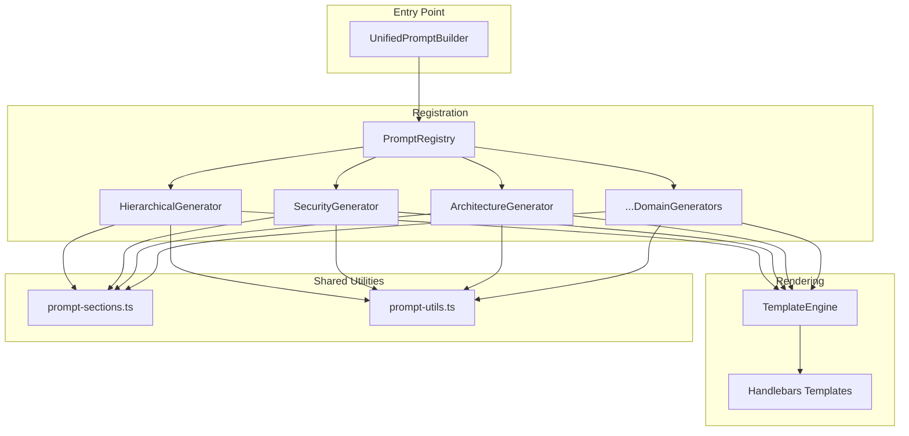

# T-023: Design UnifiedPromptBuilder Architecture

**Task ID**: T-023
**Phase**: 2.5 - Unified Prompt Ecosystem
**Priority**: P0 (Critical Path)
**Estimate**: 4h
**Owner**: @architecture-advisor
**Reviewer**: @code-reviewer
**Dependencies**: T-022 (Phase 2 Integration)
**Blocks**: T-024, T-025, T-026, T-027-T-031

---

## 1. Overview

### What

Design the architecture for `UnifiedPromptBuilder` - a single entry point replacing 12+ prompt builders with registry pattern and template engine (REQ-007).

### Why

- **Tool Fragmentation**: 12+ prompt builders with overlapping functionality
- **Inconsistent Patterns**: Different output formats, techniques, metadata handling
- **Maintenance Burden**: Changes require updates across multiple files
- **REQ-007 Compliance**: Spec mandates single entry point

### Deliverables

- `docs/adr/ADR-XXX-unified-prompt-builder.md` - Architecture Decision Record
- Component diagram (Mermaid) showing data flow
- Interface contracts for PromptRegistry, TemplateEngine, DomainGenerator
- Migration strategy document

## 2. Context and Scope

### Current State (12+ Prompt Builders)

```
src/tools/prompt/
├── hierarchical-prompt-builder.ts      (650 lines)
├── domain-neutral-prompt-builder.ts    (445 lines)
├── security-hardening-prompt-builder.ts (520 lines)
├── architecture-design-prompt-builder.ts (380 lines)
├── code-analysis-prompt-builder.ts     (290 lines)
├── debugging-assistant-prompt-builder.ts (310 lines)
├── spark-prompt-builder.ts             (280 lines)
├── prompt-flow-builder.ts              (420 lines)
├── prompt-chaining-builder.ts          (350 lines)
└── ... (3 more)
```

### Target State

```
src/tools/prompt/
├── unified/
│   ├── unified-prompt-builder.ts       (Entry point)
│   ├── prompt-registry.ts              (Domain registration)
│   ├── template-engine.ts              (Handlebars rendering)
│   └── generators/
│       ├── hierarchical-generator.ts   (Domain logic)
│       ├── security-generator.ts
│       ├── architecture-generator.ts
│       └── ... (per-domain generators)
├── facades/                            (Backward compat)
│   ├── hierarchical-facade.ts
│   └── domain-neutral-facade.ts
└── shared/                             (Existing utils)
```

### Out of Scope

- Implementing generators (T-027-T-031)
- Creating facades (T-032, T-033)
- Performance optimization

## 3. Prerequisites

### Dependencies

| Task  | Requirement                  |
| ----- | ---------------------------- |
| T-022 | Phase 2 Integration complete |

### Target Files

| File                                          | Action |
| --------------------------------------------- | ------ |
| `docs/adr/ADR-XXX-unified-prompt-builder.md`  | Create |
| `docs/architecture/unified-prompt-builder.md` | Create |

### Research Required

- Review existing prompt builder patterns in `src/tools/prompt/`
- Analyze shared utilities in `src/tools/shared/prompt-*.ts`
- Study registry patterns (e.g., `src/tools/design/constraint-manager.ts`)

## 4. Architecture Design

### 4.1: Component Diagram



### 4.2: Interface Contracts

```typescript
// Core interfaces for UnifiedPromptBuilder

export interface PromptDomain {
  name: string;  // 'hierarchical' | 'security' | 'architecture' | ...
  version: string;
  generator: DomainGenerator;
  schema: z.ZodSchema;
}

export interface DomainGenerator {
  generate(input: unknown, context: GeneratorContext): Promise<PromptOutput>;
  validate(input: unknown): ValidationResult;
}

export interface GeneratorContext {
  templateEngine: TemplateEngine;
  config: PromptConfig;
  metadata: PromptMetadata;
}

export interface PromptOutput {
  content: string;
  format: 'markdown' | 'xml' | 'json';
  metadata: Record<string, unknown>;
}

export interface UnifiedPromptInput {
  domain: string;           // Required: which generator to use
  title: string;            // Required: prompt title
  description?: string;     // Optional: brief description
  sections: Record<string, unknown>;  // Domain-specific data
  config?: PromptConfig;    // Optional: rendering config
}
```

### 4.3: Registry Pattern

```typescript
// PromptRegistry - singleton managing domain generators

export class PromptRegistry {
  private static instance: PromptRegistry;
  private domains = new Map<string, PromptDomain>();

  static getInstance(): PromptRegistry {
    if (!PromptRegistry.instance) {
      PromptRegistry.instance = new PromptRegistry();
    }
    return PromptRegistry.instance;
  }

  register(domain: PromptDomain): void {
    if (this.domains.has(domain.name)) {
      throw new Error(`Domain '${domain.name}' already registered`);
    }
    this.domains.set(domain.name, domain);
  }

  get(name: string): PromptDomain | undefined {
    return this.domains.get(name);
  }

  list(): string[] {
    return Array.from(this.domains.keys());
  }
}
```

### 4.4: Template Engine

```typescript
// TemplateEngine - Handlebars-based rendering

import Handlebars from 'handlebars';

export class TemplateEngine {
  private templates = new Map<string, HandlebarsTemplateDelegate>();

  registerTemplate(name: string, source: string): void {
    this.templates.set(name, Handlebars.compile(source));
  }

  render(templateName: string, data: Record<string, unknown>): string {
    const template = this.templates.get(templateName);
    if (!template) {
      throw new Error(`Template '${templateName}' not found`);
    }
    return template(data);
  }

  registerHelpers(): void {
    // Register common helpers
    Handlebars.registerHelper('slug', slugify);
    Handlebars.registerHelper('join', (arr, sep) => arr?.join(sep) ?? '');
  }
}
```

## 5. ADR Template

```markdown
# ADR-XXX: UnifiedPromptBuilder Architecture

## Status
Proposed

## Context
The codebase has 12+ prompt builders with overlapping functionality...

## Decision
Implement UnifiedPromptBuilder with:
1. PromptRegistry for domain registration
2. TemplateEngine for Handlebars rendering
3. DomainGenerators for per-domain logic
4. Legacy facades for backward compatibility

## Consequences
- Single entry point for all prompt generation
- Reduced code duplication
- Easier testing via generator isolation
- Migration period with deprecation warnings
```

## 6. Risks and Mitigations

| Risk                   | Likelihood | Impact | Mitigation                                 |
| ---------------------- | ---------- | ------ | ------------------------------------------ |
| Over-abstraction       | Medium     | High   | Start with 3 domains, expand iteratively   |
| Breaking changes       | High       | High   | Legacy facades (T-032, T-033)              |
| Performance regression | Low        | Medium | Benchmark critical paths                   |
| Template complexity    | Medium     | Medium | Keep templates simple, logic in generators |

## 7. Acceptance Criteria

| Criterion                     | Status | Verification                   |
| ----------------------------- | ------ | ------------------------------ |
| ADR document created          | ⬜      | `docs/adr/ADR-XXX-*.md` exists |
| Interface contracts defined   | ⬜      | TypeScript interfaces in ADR   |
| Component diagram included    | ⬜      | Mermaid diagram renders        |
| Migration strategy documented | ⬜      | Facade approach documented     |
| Stakeholder review completed  | ⬜      | PR approved by @code-reviewer  |

---

## 8. References

- [spec.md - REQ-007](/plan-v0.14.x/speckit-v0.14.x-strategic-consolidation/spec.md)
- [Existing prompt builders](../../../../src/tools/prompt/)
- [Shared utilities](../../../../src/tools/shared/prompt-utils.ts)
- [Handlebars documentation](https://handlebarsjs.com/)

---

*Task: T-023 | Phase: 2.5 | Priority: P0*
